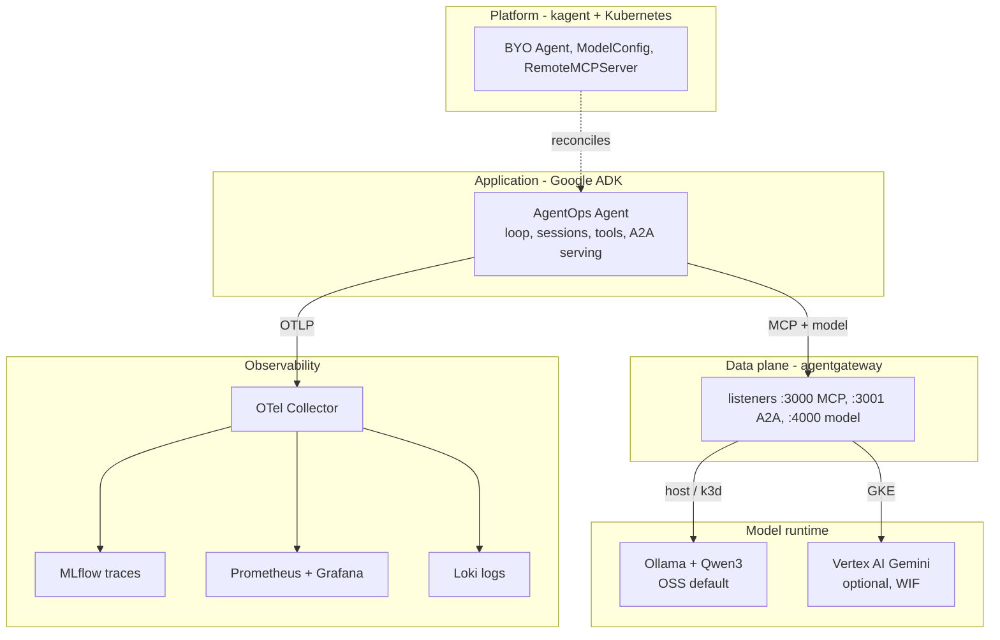
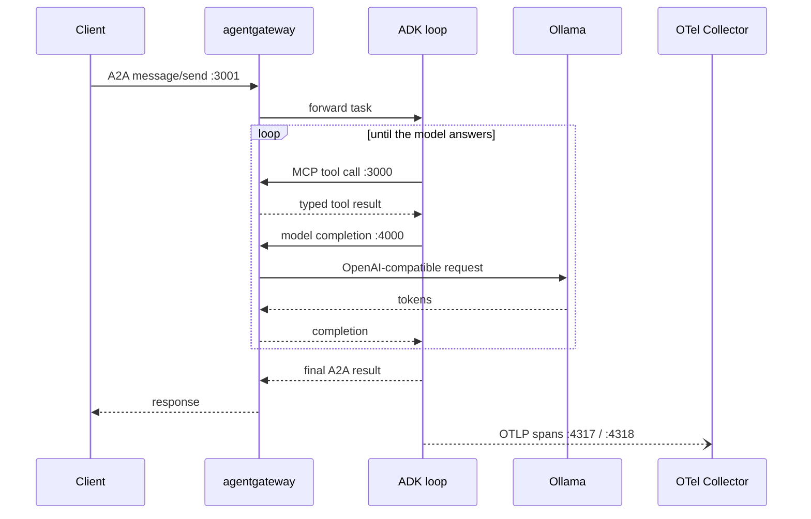

# 0.3. Ecosystem

!!! abstract "In one glance"

    - **You will:** Find which tool owns which boundary in the stack, and why the course keeps them separate instead of buying one all-in-one platform.
    - **You need:** 0.2. AgentOps read, so the lifecycle names already mean something.
    - **Time:** no reading time — this is a lookup page. Bookmark it now; about 18 minutes if you read it end to end later.

## Which components form the course stack?

Seven layers, one owner each. ADK runs the agent, agentgateway carries the traffic, kagent runs it on Kubernetes, Ollama serves the model, and MLflow, OpenTelemetry, Prometheus, and Grafana record what happened.

An AgentOps stack is not one framework; it is a set of **boundaries** — one job, one owner, and a stable contract across the edge. The chapters that follow build each boundary in depth. Treat this page as the index you return to when you lose the shape of the whole.

Each component owns one clear boundary:

| Layer                 | Component                                                                                                  | Responsibility                                                      |
| --------------------- | ---------------------------------------------------------------------------------------------------------- | ------------------------------------------------------------------- |
| Application           | [Google ADK](https://google.github.io/adk-docs/)                                                           | Agent loop, sessions, tools, callbacks, workflows, and A2A serving. |
| Connectivity          | [agentgateway](https://agentgateway.dev/)                                                                  | MCP, A2A, and model routing with policy and telemetry.              |
| Platform              | [kagent](https://kagent.dev/)                                                                              | Kubernetes custom resources and lifecycle for agent workloads.      |
| Experiment and traces | [MLflow](https://mlflow.org/docs/latest/genai/)                                                            | Prompt versions, evaluations, runs, and trace exploration.          |
| Telemetry             | [OpenTelemetry](https://opentelemetry.io/)                                                                 | Vendor-neutral collection and export of runtime signals.            |
| Metrics               | [Prometheus](https://prometheus.io/) and [Grafana](https://grafana.com/oss/grafana/)                       | Queryable time series, dashboards, and alerts.                      |
| Local model           | [Ollama](https://github.com/ollama/ollama) and [Qwen3](https://huggingface.co/Qwen/Qwen3-4B-Instruct-2507) | Apache-2.0 open-weight inference without a provider account or fee. |

The table reads top to bottom; the ownership actually nests as layered planes. In the diagram below the boxes show who owns what, and the arrows only show who calls whom.

The repository [`README.md`](https://github.com/MLOps-Courses/agentops-open-course/blob/main/README.md) carries a different diagram, one that traces a single request end to end. This one groups components by the boundary they own:


```mermaid
flowchart TD
    subgraph App["Application - Google ADK"]
        Agent["AgentOps Agent<br/>loop, sessions, tools, A2A serving"]
    end
    subgraph Data["Data plane - agentgateway"]
        GW["listeners :3000 MCP, :3001 A2A, :4000 model"]
    end
    subgraph Model["Model runtime"]
        Ollama["Ollama + Qwen3<br/>OSS default"]
        Vertex["Vertex AI Gemini<br/>optional, WIF"]
    end
    subgraph Platform["Platform - kagent + Kubernetes"]
        KA["BYO Agent, ModelConfig, RemoteMCPServer"]
    end
    subgraph Obs["Observability"]
        OTel["OTel Collector"]
        MLflow["MLflow traces"]
        PromGraf["Prometheus + Grafana"]
        Loki["Loki logs"]
    end
    Agent -->|MCP + model| GW
    GW -->|host / k3d| Ollama
    GW -->|GKE| Vertex
    KA -. reconciles .-> Agent
    Agent -->|OTLP| OTel
    OTel --> MLflow
    OTel --> PromGraf
    OTel --> Loki
```

The model plane is owned by [0.4. Providers](0.4.%20Providers.md); the rest of this page walks each remaining plane in turn.

## Why keep each responsibility in a separate tool?

An all-in-one agent framework bundles the loop, the model client, the router, the deployment target, and the telemetry backend into one dependency. That is fast to start and expensive to change. You inherit its opinion at every layer, and swapping one piece — a different model, a different runtime, a different trace store — drags the others with it.

This course takes the opposite bet. Each boundary is a contract, and the payoff is concrete rather than aesthetic:

1. **The application does not change when the platform does.** The same OCI image (`agentops-agent:dev`) runs as a plain host process and as a kagent workload. `infra/kagent/agent.yaml` declares `type: BYO`, so kagent wraps a Kubernetes lifecycle around the course's own container instead of generating a new one. Nothing in the Python code knows whether kagent is present.
1. **The application does not change when the model backend does.** The agent speaks one OpenAI-compatible contract to gateway `:4000`. Whether that resolves to Ollama/Qwen3 (host and k3d) or Vertex AI/Gemini (the GKE profile) is the gateway's decision. The Python agent never grows a provider-specific SDK or a cloud key; the GKE overlay obtains identity through Workload Identity Federation and mounts no secret.
1. **The application does not know its observability backend.** It emits OTLP and stops there. MLflow, Prometheus, and Loki are wiring in the collector, not imports in the agent.

The honest cost of this design is coordination: more moving parts means more versions that must agree, which is exactly what [What should you verify before upgrading the stack?](#what-should-you-verify-before-upgrading-the-stack) exists to manage. The trade is deliberate — a little version bookkeeping in exchange for boundaries you can test and replace one at a time.

## What does Google ADK own?

ADK is the Python framework running inside the application process. It defines agents and tools, drives the model-and-tool loop, persists sessions, runs callbacks, and serves the AgentOps Agent over A2A.

The repository owns ADK's compatible range in [`agents/python/pyproject.toml`](https://github.com/MLOps-Courses/agentops-open-course/blob/main/agents/python/pyproject.toml) and locks the exact resolution in `uv.lock`. It never runs against whatever version happens to be newest. The `[a2a]` extra pulls in the serving layer, and the comment in the manifest deliberately avoids the unused Spanner `db` extra to keep the dependency tree tight.

ADK is not the gateway, the model provider, the Kubernetes operator, or the observability backend. Keeping those out of the framework is what makes the separation above possible.

The concrete code is owned by [2.1. First Agent](../2.%20Agents/2.1.%20First%20Agent.md) and [2.2. Models](../2.%20Agents/2.2.%20Models.md): how the root agent is constructed, how the model is built, how tools and callbacks attach. This page only fixes ADK's boundary.

## What does agentgateway own?

[agentgateway](https://agentgateway.dev/docs/standalone/main/about/introduction/) is the course's **data plane** — the proxy every request passes through on its way somewhere else. It is open source, speaks HTTP and gRPC, and carries ordinary service traffic plus AI-native MCP, A2A, and LLM traffic.

It is the single place the course applies routing, rate limits, and content policy, so the application stays a plain client. It exposes three explicit listeners:

1. `:3000` for MCP tool traffic.
1. `:3001` for A2A traffic.
1. `:4000` for an OpenAI-compatible model endpoint.

Those three are the front door. The rest of the stable network contract is two more ports the gateway itself exposes, plus the raw upstream services it fronts:

1. `:15020` — the gateway's own metrics.
1. `:15021` — the host wrapper's readiness probe.
1. `:8000` — behind the gateway: the raw MCP server it fronts, which stays off the workstation's LAN interfaces.
1. `:8080` — behind the gateway: the raw A2A server it fronts, kept off the LAN interfaces the same way.

The same contract ships in three profiles under `infra/agentgateway/{host,k3d,gke}`: a loopback host data plane, an in-cluster k3d variant, and the GKE variant that swaps the model backend for Vertex. The host profile is grounded in [`infra/agentgateway/host/config.yaml`](https://github.com/MLOps-Courses/agentops-open-course/blob/main/infra/agentgateway/host/config.yaml). Its three `binds` carry per-minute rate limits (120 MCP, 60 A2A, 30 model), an `mcpAuthorization` allowlist of the six read-only tools, and a prompt/response guard on the model route.

The agent uses the OpenAI-compatible contract directly against Ollama in Chapters 2 to 4. Chapter 5 changes only `OPENAI_BASE_URL` to the gateway, which routes to Ollama/Qwen3 locally. Here the point is only that one component owns connectivity for every protocol.

The policy details behind each listener are owned by [5.0. Gateway](../5.%20Gateway/5.0.%20Gateway.md) and [5.5. Gateway Security](../5.%20Gateway/5.5.%20Gateway%20Security.md).

## What is the stable port contract?

Three ports are the ones to remember: MCP `:3000`, A2A `:3001`, and the model route `:4000` — the gateway's three listeners.

Every other port in the course is fixed too, so every task, probe, and troubleshooting step names the same numbers. You do not need to memorize them; come back when a port collides.

??? note "Deeper: every port the course binds"

    The gateway listeners are the front door; the raw upstreams stay off the workstation's routable interfaces; the observability ports surface on loopback under the host Compose profile. Only ports the repository verifiably binds are listed here:

    | Port              | Service                             | Scope / interface                                 | Chapter   |
    | ----------------- | ----------------------------------- | ------------------------------------------------- | --------- |
    | `:3000`           | agentgateway MCP listener           | Gateway front door for MCP tool traffic           | Ch. 5     |
    | `:3001`           | agentgateway A2A listener           | Gateway front door for A2A traffic                | Ch. 5     |
    | `:4000`           | agentgateway model listener         | OpenAI-compatible model route                     | Ch. 5     |
    | `:15020`          | agentgateway metrics                | Gateway's own Prometheus metrics                  | Ch. 5     |
    | `:15021`          | host wrapper readiness              | Gateway host-wrapper readiness probe              | Ch. 5     |
    | `:8000`           | MCP server (raw upstream)           | Behind the gateway; not on the LAN                | Ch. 3     |
    | `:8080`           | A2A server / ADK app (raw upstream) | Agent's A2A serving; kagent `type: BYO` probes it | Ch. 3 / 6 |
    | `:8001`           | Web client (`mise run client:web`)  | Fixed by the CORS allowlist, not reassignable     | Ch. 4 / 5 |
    | `:8002`           | ADK developer web UI (`mise run web`) | Local inspection UI; moved off ADK's `:8000` default | Ch. 2  |
    | `:8003`           | Documentation preview (`mise run serve`) | Zensical live reload; moved off its `:8000` default | Ch. 8  |
    | `:11434`          | Ollama                              | Local Qwen3 inference endpoint                    | Ch. 2     |
    | `:5000`           | MLflow                              | Traces, prompts, evaluations, runs                | Ch. 7     |
    | `:4317` / `:4318` | OTLP receiver                       | OpenTelemetry Collector gRPC / HTTP entry         | Ch. 7     |
    | `:8889`           | Collector Prometheus exporter       | Span-derived RED metrics scrape target            | Ch. 7     |
    | `:9090`           | Prometheus                          | Metric store and alert engine                     | Ch. 7     |
    | `:9093`           | Alertmanager (host profile)         | Alert routing; loopback-only under host Compose   | Ch. 7     |
    | `:3002`           | Grafana (host profile)              | Read-only dashboards                              | Ch. 7     |
    | `:3100`           | Loki                                | Log store keyed by trace id                       | Ch. 7     |
    | `:5050`           | registry.localhost                  | k3d local image registry                          | Ch. 6     |

When two of these collide with something already listening, [0.6. Troubleshooting](0.6.%20Troubleshooting.md) walks the `ss -ltnp` and gateway-status checks that free them.

## What does kagent own?

kagent is a CNCF Sandbox project that manages agents as Kubernetes **custom resources**. A custom resource is an object type a cluster gains from an add-on, then treats like any built-in one.

The course installs its stable Helm chart — a packaged, versioned bundle of Kubernetes manifests — pinned to `0.9.12` (`infra/helmfile.yaml`), and drives it entirely through the `kagent.dev/v1alpha2` API. Three manifests under `infra/kagent/` declare the whole platform contract:

1. [`agent.yaml`](https://github.com/MLOps-Courses/agentops-open-course/blob/main/infra/kagent/agent.yaml) — a `kind: Agent` with `type: BYO`, which tells kagent to run the course's own A2A image (`agentops-agent:dev`) under a hardened pod spec (non-root, read-only root filesystem, dropped capabilities) rather than synthesizing one.
1. [`modelconfig.yaml`](https://github.com/MLOps-Courses/agentops-open-course/blob/main/infra/kagent/modelconfig.yaml) — a `kind: ModelConfig` that points the platform's model access at the in-cluster agentgateway `:4000` endpoint, so even kagent's view of the model goes through the data plane.
1. [`toolserver.yaml`](https://github.com/MLOps-Courses/agentops-open-course/blob/main/infra/kagent/toolserver.yaml) — a `kind: RemoteMCPServer` describing the governed read-only tools reached over `STREAMABLE_HTTP` through the gateway `:3000/mcp` route.

The application stays responsible for its logic and sessions; kagent is responsible for translating those custom resources into a running Kubernetes workload. That clean split is exactly why the same container runs without kagent during host development. The full walkthrough is owned by [6.0. Platform](../6.%20Platform/6.0.%20Platform.md).

## Why use both MLflow and OpenTelemetry?

OpenTelemetry is the transport and semantic layer; MLflow is the agent-specific workspace on top of it. They are not redundant — one moves signals, the other curates them.

The collector is a single vendor-neutral OTLP entry point on `:4317`/`:4318`. [`infra/observability/otel-collector.yaml`](https://github.com/MLOps-Courses/agentops-open-course/blob/main/infra/observability/otel-collector.yaml) fans the incoming signals out three ways:

1. Traces to MLflow (`otlp_http/mlflow` at `mlflow:5000`).
1. Span-derived **RED metrics** — rate, errors, duration — to Prometheus (the `span_metrics` connector feeding a `prometheus` exporter on `:8889`).
1. Logs to Loki (`otlp_http/loki` at `loki:3100`).

MLflow then adds prompt versions, evaluations, runs, and trace exploration around those traces. Neither backend hides behind a hosted SaaS account; the MLflow server itself is a locked, non-root image ([`infra/mlflow/Dockerfile`](https://github.com/MLOps-Courses/agentops-open-course/blob/main/infra/mlflow/Dockerfile)).

The reproducibility side (prompts, runs, logged models) is owned by [7.0. Reproducibility](../7.%20Observability/7.0.%20Reproducibility.md) and tracing by [7.1. Tracing](../7.%20Observability/7.1.%20Tracing.md); this page only names the boundary and the fan-out.

## How do the components fit together at runtime?

A single agent turn crosses every boundary above exactly once. The application handles the request, the data plane brokers each external call, the model plane produces tokens, and the observability plane records what happened — no component reaches past its own edge:


```mermaid
sequenceDiagram
    participant Client
    participant GW as agentgateway
    participant ADK as ADK loop
    participant Ollama
    participant OTel as OTel Collector
    Client->>GW: A2A message/send :3001
    GW->>ADK: forward task
    loop until the model answers
        ADK->>GW: MCP tool call :3000
        GW-->>ADK: typed tool result
        ADK->>GW: model completion :4000
        GW->>Ollama: OpenAI-compatible request
        Ollama-->>GW: tokens
        GW-->>ADK: completion
    end
    ADK-->>GW: final A2A result
    GW-->>Client: response
    ADK--)OTel: OTLP spans :4317 / :4318
```

1. A client (an engineer, the offline web client, or another agent) sends an A2A `message/send` to gateway `:3001`; ADK runs the loop.
1. When the model needs a tool, ADK calls MCP through gateway `:3000`; when it needs a completion, it calls the OpenAI-compatible endpoint on `:4000`, which the gateway routes to Ollama or Vertex.
1. Throughout, ADK and the gateway emit OTLP to the collector, which splits the signals apart.

One OTLP export becomes three things: a trace you can open, metrics you can alert on, and logs you can correlate by trace id. [7.2. Monitoring](../7.%20Observability/7.2.%20Monitoring.md) walks that correlation end to end.

??? note "Deeper: how the collector splits one export into three signals"

    That last split is the piece a request diagram flattens, so it is worth its own picture. The pipelines below are exactly those declared in the collector config:

    ```mermaid
    flowchart TD
        In["Agent + gateway<br/>OTLP :4317 / :4318"] --> Recv["otlp receiver"]
        Recv --> Traces["traces pipeline"]
        Recv --> Logs["logs pipeline"]
        Recv -->|direct OTLP counters| Metrics["metrics pipeline"]
        Traces --> ML["otlp_http/mlflow to mlflow:5000"]
        Traces --> SM["span_metrics connector"]
        SM --> Metrics
        Metrics --> PromExp["prometheus exporter :8889"]
        Logs --> LokiExp["otlp_http/loki to loki:3100"]
    ```

    Because traces feed both MLflow and the span-metrics connector, one turn becomes a trace you can open, a set of RED metrics you can alert on, and a stream of logs you can correlate by trace id — from a single OTLP export. [7.2. Monitoring](../7.%20Observability/7.2.%20Monitoring.md) walks that three-pillar correlation end to end.

## What do Prometheus and Grafana own?

Prometheus owns the metric store and the alert engine; Grafana owns the read-only visualization.

Prometheus scrapes two targets: the collector's `:8889` endpoint (the span-derived series such as `agentops_calls_total` and `agentops_duration_seconds_bucket`) plus the gateway's own `:15020` metrics. It then evaluates the rules in [`infra/observability/prometheus-rules.yml`](https://github.com/MLOps-Courses/agentops-open-course/blob/main/infra/observability/prometheus-rules.yml): two recording rules and six alerts — `AgentErrorBudgetBurn`, `ObservabilityCollectorDown`, `AgentTurnLatencyP95High`, `AgentTokenTelemetryMissing`, `AgentInjectionNeutralizedSpike`, and `AgentTriageSchemaFailures`.

Grafana provisions the `AgentOps overview` dashboard from [`infra/observability/grafana/dashboards/agentops.json`](https://github.com/MLOps-Courses/agentops-open-course/blob/main/infra/observability/grafana/dashboards/agentops.json): six metric panels (agent and gateway request rate, p95 latency, error ratio, guardrail rejects) and one Loki logs panel filterable by trace id.

On the host Compose profile these surface on well-known loopback ports — Prometheus on `:9090`, Grafana on `:3002`, MLflow on `:5000` — while the Kubernetes overlays keep them as ClusterIPs behind port-forwards. Every alert is grounded in a metric the stack verifiably exports, and none routes to an external pager.

Read the names as a preview, not as homework. [7.2. Monitoring](../7.%20Observability/7.2.%20Monitoring.md) owns the alert semantics, the dashboard, and the alert-response runbooks.

## Which open standards connect the components?

Boundaries only hold if the contract across them is a standard, not a private API:

1. **[MCP](https://modelcontextprotocol.io/)** describes how an agent discovers and invokes tools and resources.
1. **[A2A](https://a2a-protocol.org/)** describes how independently deployed agents advertise capabilities and exchange tasks.
1. **[OpenTelemetry](https://opentelemetry.io/)** describes and transports traces, metrics, and logs.
1. **[OCI images](https://opencontainers.org/)** package the same application for local and cloud runtimes.
1. **[AGENTS.md](https://agents.md/)** gives coding agents repository-local instructions, a convention this repository dogfoods.

Standards reduce coupling; they do not guarantee interoperability by themselves. Two implementations can each claim MCP or A2A and still disagree on a version, an auth mode, or a streaming detail. The course pins concrete implementations and verifies the versions together rather than trusting the labels.

## How do these ideas transfer to other agent frameworks?

This conceptual crosswalk was reviewed on **31 July 2026** against the official [Google ADK](https://google.github.io/adk-docs/) and [LangGraph](https://docs.langchain.com/oss/python/langgraph/overview) documentation, plus the official [smolagents](https://huggingface.co/docs/smolagents/main/index) and [Microsoft Agent Framework](https://learn.microsoft.com/en-us/agent-framework/overview/) documentation.

It maps responsibilities, not APIs. ADK remains the only implemented and release-gated runtime in this repository; the other columns tell you which concept to look for when transferring the engineering method.

| Concern          | Google ADK in this course                                | LangGraph / LangChain                                            | Hugging Face smolagents                                   | Microsoft Agent Framework                                       |
| ---------------- | -------------------------------------------------------- | ---------------------------------------------------------------- | --------------------------------------------------------- | --------------------------------------------------------------- |
| Tools            | Typed function tools; MCP toolsets                       | LangChain tools and tool nodes                                   | `Tool`, `ToolCallingAgent`, or sandboxed `CodeAgent`      | Functions and MCP servers exposed to an agent                   |
| State and memory | Session state, services, and explicit long-term memory   | Checkpointed graph state plus cross-thread stores                | Inspectable per-run `AgentMemory` and step history        | Agent sessions and context providers                            |
| Workflows        | Sequential, parallel, loop, and custom workflow agents   | Nodes and edges over typed state with durable execution          | Multi-step loops and manager/managed-agent composition    | Typed graph workflows with checkpointing                        |
| Human approval   | Tool confirmation plus application policy callbacks      | Interrupts persisted by a checkpointer, then approve/edit/reject | Interactive planning, interruption, and step callbacks    | Tool approval and explicit human-in-the-loop workflow gates     |
| Interoperability | MCP for tools and A2A for deployed-agent exchange        | MCP adapters; deployment protocols remain a separate choice      | MCP client adapts remote tools into local tools           | MCP tool integration plus documented A2A integrations           |
| Evaluation       | Eval sets, trajectory checks, and repository regressions | Evaluators and tracing are separate from the graph runtime       | Final-answer checks plus a separately chosen eval harness | Built-in local/custom evaluators and optional hosted evaluators |
| Telemetry        | OpenTelemetry emitted to repository-owned backends       | Runtime tracing with an optional observability layer             | Instrumentation guide and OpenTelemetry integration       | Middleware and OpenTelemetry-based observability                |

The portable lesson is ownership: identify the trusted state boundary, the callable capability boundary, the resumable workflow boundary, and the evidence boundary before translating class names. Do not assume that two similarly named features preserve the same approval, persistence, or privacy guarantees.

## Where do the AAIF and CNCF fit?

The [Agentic AI Foundation](https://aaif.io/) is a Linux Foundation home for open agent infrastructure, including agentgateway, MCP, and A2A. The [Cloud Native Computing Foundation](https://www.cncf.io/) stewards Kubernetes, Prometheus, and kagent among many other projects.

Foundation status is useful governance context — a signal about open licensing and shared maintenance — not evidence that a pre-1.0 API is stable. kagent and agentgateway are young; treat their `v1alpha2` and pre-2.0 surfaces as movable and let the pins, not the foundation logo, decide what you run.

## What should you verify before upgrading the stack?

Six pinned versions have to agree: ADK, agentgateway, kagent, MLflow, the OpenTelemetry Collector, and Python.

Separate boundaries mean separate release cadences, so an upgrade is a coordination exercise, not a single bump. The repository holds the authoritative numbers, so read the pin files rather than a floating `latest` tag.

??? note "Deeper: which versions are pinned today"

    Deliberately, no version number appears on this page. `AGENTS.md` records where each pin lives rather than what it currently is, because a number copied into prose is a number that will be wrong within a release. Read the authority instead: `agents/python/pyproject.toml` and `uv.lock` for Python and ADK, `mise.toml` and `mise.lock` for CLI tools, `infra/helmfile.yaml` for kagent, and the digest-pinned manifests under `infra/` for the gateway and collector images — never a floating `latest` tag.

Upgrade one component at a time, read its release notes and schema changes, regenerate the lock, and run the local validation gate:

```bash
mise run install:maintainer
mise run format
mise run check
mise run test
```

These commands call no model, cluster, or cloud resource. Dependency and image audits may still refresh advisory data over the network.

For an infrastructure upgrade, also render and validate the manifests before `mise run platform:dev`; the task derives the required source revision before Skaffold builds. Never infer compatibility from a project name, a shared foundation, or a `latest` tag; the whole point of the boundaries is that each contract is verified where it is pinned.

## What proves this page worked?

Nothing here needs to run. The check is whether the map still holds once you close the page.

**You are done when:**

- You can name the owner of each layer in the table: the agent loop, the traffic, the Kubernetes lifecycle, the model, and the signals.
- You can say in one sentence why the agent code does not change when the model backend or the deployment target changes.
- You know which section to reopen when a port collides or a pinned version needs bumping.

Continue to [0.4. Providers](./0.4.%20Providers.md) when you can name the tool that owns each boundary without scrolling back up.
