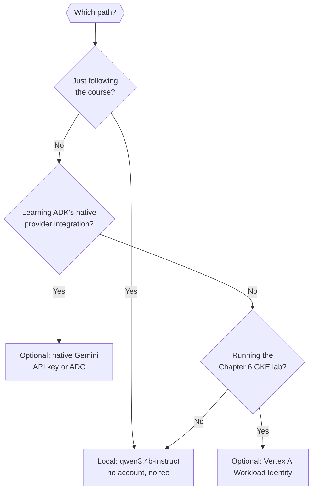

# 0.4. Providers

## Which model path should you choose?

Use the path that matches the lesson and your constraints:

| Path       | Model                           | Authentication                                | Where it appears                     |
| ---------- | ------------------------------- | --------------------------------------------- | ------------------------------------ |
| Local      | `qwen3:4b-instruct` in Ollama   | Non-secret client marker                      | Required path from Chapter 2 onward. |
| Native ADK | Explicit Gemini model           | Gemini key or Application Default Credentials | Optional provider comparison.        |
| GKE        | `gemini-3.5-flash` on Vertex AI | Workload Identity Federation                  | Optional Chapter 6 lab.              |

Qwen3 is the default: no account, no mandatory SaaS, and no usage fee. Chapters 2-4 use Ollama directly through its OpenAI-compatible endpoint. Chapter 5 changes only the endpoint to agentgateway. Native Gemini remains useful for learning ADK's direct provider integration, but it is not on the required path.



Every core outcome is reachable on the local path alone. The optional branches exist so you can _compare_ a hosted provider deliberately — not because the course needs one.

## Is Qwen3 really open source?

Strictly, no — and the precision matters, because this is exactly the claim vendors blur. The course pulls `qwen3:4b-instruct` with Ollama, and its published **weights** are Apache-2.0: you may run, modify, and redistribute them, commercially, with no account and no fee. That is materially different from calling a proprietary hosted model and describing only the client SDK as open source.

But **open weights is not open source** ([2.2](../2.%20Agents/2.2.%20Models.md)). Fully open source would also mean publishing the training data and the code to reproduce the weights from it. Almost no frontier-class model does, and this one does not. So the honest sentence is: _the weights are Apache-2.0 licensed and locally runnable_ — not "the model is open source". Say the first; the second overclaims, and someone will eventually check.

That distinction is a real property of the course's promise rather than pedantry. Apache-2.0 weights are what make the account-free path genuinely account-free: no click-through, no terms to accept, no gate, no telemetry back to a vendor.

Local inference still has constraints: the model download is several gigabytes, CPU inference can be slow, and output quality depends on available memory and hardware. The `qwen3:4b-instruct` Ollama tag can move, so record the installed model ID from `ollama list` with evaluation results. The deterministic test suite does not require it.

!!! tip "Other open-weight options"

    `gemma4:e4b` (Google's Gemma 4) is also Apache-2.0 and ungated, with native function calling — a strong alternative that is roughly four times the footprint at full precision (~9.6 GB vs ~2.5 GB; about 2.4× if you pull the quantized `e4b-it-qat` build), which is why it is not the default. [2.2](../2.%20Agents/2.2.%20Models.md) compares them and explains how to measure the swap rather than guess.

## What does the repository default to?

Nothing you have to configure. The typed settings already default to `openai-compatible` with `qwen3:4b-instruct` pointed at direct Ollama and the non-secret marker `local-ollama`, so a fresh clone runs the required path without a single provider variable set, and no network call happens during imports or offline tests. Chapter 5 keeps the provider and model and changes only the endpoint (`OPENAI_BASE_URL`) so agentgateway owns the upstream Ollama route without an application provider switch.

This page is the _decision_; [1.4. Providers](../1.%20Setup/1.4.%20Providers.md#which-environment-variables-select-a-provider) is the _configuration_ — it shows the exact variables parsed straight from `config.py` and the one-line Chapter 5 endpoint swap. Here you only need to know the default is account-free and asks nothing of you.

## How do you authenticate to native Gemini?

Native Gemini is an optional comparison that needs a Google account and one of two methods: an AI Studio (Gemini API) key, or Vertex AI through Application Default Credentials in enterprise mode with an explicit project and location. You never mix the two — `mise run config:check` rejects an ambiguous combination, a missing key, or enterprise mode without project and location before a turn runs, and `mise run doctor:gcp` verifies the ADC credential first. [1.4. Providers](../1.%20Setup/1.4.%20Providers.md#how-do-you-configure-native-gemini) carries the exact variables, the validator behind those messages, and the credential checks; for GKE, the infrastructure maps a Kubernetes service account to Google IAM with Workload Identity Federation rather than a long-lived key.

!!! warning "Never infer authentication from a key prefix"

    Key products and formats change. Follow the current provider documentation, configure the matching endpoint explicitly, and keep credentials out of Git, images, manifests, traces, and shell history.

## Does the course use LiteLLM?

No. The default agent uses ADK's `OpenAILlm` adapter for direct Ollama and agentgateway. The optional Gemini branch uses ADK's native `Gemini` model. Provider routing, identity, limits, and traffic policy belong at agentgateway. No runtime or evaluation path depends on LiteLLM.

## Are model-backed runs free or offline?

Local Ollama inference avoids a provider account and usage fee, but it is not "offline" until the model and dependencies have been downloaded. Gemini and Vertex can incur usage charges and send prompts to a third party. The course's unit tests, data checks, formatting, typing, vulnerability audit, and deterministic adversarial regressions run without a model.

## What is the provider checkpoint?

For the account-free path, install Ollama, then run:

```bash
ollama pull qwen3:4b-instruct
mise run doctor:model
```

Continue when the staged doctor confirms that Ollama is reachable and `qwen3:4b-instruct` is installed. You do not need to start the gateway until Chapter 5.
