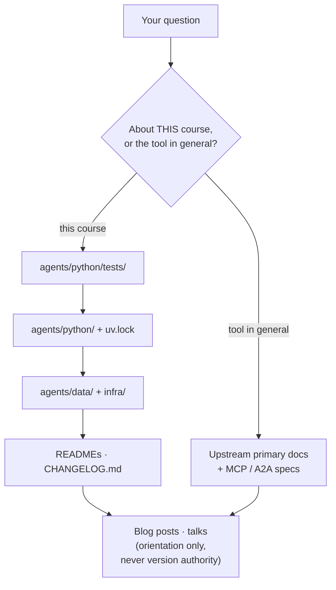

# 0.5. Resources

A resource is only useful if you know _when_ to open it. This page is a trust map, not a link dump: it ranks where to look, says what each source is authoritative _for_, and points you back to the one place that decides what this course actually supports — the repository itself.

## Which sources should you trust first?

There is a hierarchy. For "what does _this_ course do," the installed source, lockfile, and passing tests in this repository outrank any prose, including these docs. For "how does the underlying tool work in general, and what is its full API," the upstream primary documentation outranks a blog post or a model's recollection. Agent APIs move fast and most of these projects are pre-1.0, so a tutorial written six months ago can describe a schema that no longer exists.

Reach for the upstream docs when you are extending the reference beyond what the course shows — a tool option, a policy field, a CRD attribute the pages never needed:

| Primary source                                                      | Reach for it when you need                                                                            |
| ------------------------------------------------------------------- | ----------------------------------------------------------------------------------------------------- |
| [Google ADK documentation](https://google.github.io/adk-docs/)      | The agent, tool, session, callback, and A2A-serving API — anything about how the agent loop is built. |
| [agentgateway documentation](https://agentgateway.dev/docs/)        | Listener and policy configuration — routes, rate limits, guardrails, and backend selection.           |
| [kagent documentation](https://kagent.dev/docs)                     | Custom-resource fields for the `Agent`, gateway `ModelConfig`, and governed `RemoteMCPServer`.        |
| [MLflow GenAI documentation](https://mlflow.org/docs/latest/genai/) | The evaluation, trace, and scorer API used by the quality and observability chapters.                 |
| [OpenTelemetry documentation](https://opentelemetry.io/docs/)       | Collector receiver, processor, exporter, and connector configuration.                                 |
| [MCP specification](https://modelcontextprotocol.io/specification/) | The wire format for how a tool or resource is discovered and invoked.                                 |
| [A2A specification](https://a2a-protocol.org/latest/specification/) | The wire format for the agent card and task exchange between deployed agents.                         |

Blog posts and conference talks are useful for orientation and design intent. They are never the version authority: the installed release, the API schema, the lockfile, and the tests decide what runs. When the upstream docs and this repository disagree, that gap is itself the signal — read [How do you spot a stale resource?](#how-do-you-spot-a-stale-resource) below.

The map has two authority columns. For "what does _this_ course do," trust the repository top-down; for "how does the tool work in general," trust the upstream primary docs. Orientation material sits below both and never overrules either:

## Which resources ship inside this repository?

The highest-authority resource for this course is not external at all. The repository's stated contract is that _docs mirror source_ and _the source remains the verification surface_, so when a page and the code diverge, the code wins. Read these in-repo artifacts as first-class references, in rough order of authority:

- **`agents/python/tests/` — the real behavioral contract.** The offline test suite is what actually pins the agent's behavior; it runs with no model or network and enforces at least 95% branch coverage. If you want to know what an invariant _guarantees_ rather than what the prose _claims_, read the test that asserts it.
- **`agents/python/` — the canonical implementation.** The locked ADK agent, its tools, guardrails, and the A2A server. Every critical documentation excerpt is included from here through checked snippet regions, so the page you are reading cannot drift from the code without failing CI.
- **`agents/data/` — immutable seed input.** The SQLite database, service logs, runbooks, and Agent Skills the agent reads. Runtime writes go elsewhere, so this dataset is a stable fixture you can rely on across exercises.
- **`infra/` — the canonical deployment contract.** The three agentgateway profiles, the Kubernetes base and overlays, the kagent resources, the MLflow server, and the observability stack. Commands and manifests in the docs mirror these files.
- **Component READMEs.** `README.md` (humans) and `AGENTS.md` (coding agents) at the root, plus scoped READMEs under `agents/`, `agents/data/`, `agents/python/`, `agents/python/evals/`, and `clients/web/`. Start with the README nearest the code you are touching.
- **`CHANGELOG.md`.** Release-facing changes in Keep a Changelog form — the fastest way to see what moved between versions before you trust an older example.

Prefer any of these over a screenshot or a remembered command. The point of a source-synchronized course is that you can always check.

## Which coding assistants can help?

Use whatever editor and assistant you are already productive in. The course's open-source commitment applies to the stack you **ship** — the model, gateway, platform, and observability the agent depends on at runtime — not to the tools you happen to type in. Nothing in this repository requires a specific editor, and no gate inspects which one you used.

Popular choices include [Visual Studio Code](https://code.visualstudio.com/), [Antigravity](https://antigravity.google/), [Claude Code](https://www.claude.com/product/claude-code), [OpenAI Codex](https://developers.openai.com/codex/), [OpenCode](https://opencode.ai/), [goose](https://block.github.io/goose/), and [Cursor](https://cursor.com/). Some are proprietary, and that is fine here: your editor is not a production dependency, so it never lands in a lockfile, an image, or a deployment. If you do prefer a fully open toolchain, [VSCodium](https://vscodium.com/) is a community build of the VS Code sources, while goose and the Codex CLI are Apache-2.0. The same reasoning applied to editors lives in [1.5. Workspace](../1.%20Setup/1.5.%20Workspace.md).

An assistant is an untrusted collaborator, not an authority. Review its patches, keep credentials out of its context, and hold its changes to the same `mise run check` and `mise run test` gates as human ones. The repository's `AGENTS.md` gives every compatible tool one shared set of project rules, so the assistant follows the same conventions you do.

## What are Agent Skills?

An Agent Skill is a small, discoverable instruction package rooted at `SKILL.md`, loaded only for a relevant task rather than injected into every prompt. It is a build capability, not a resources concern, so it has a home of its own: [3.2. Skills](../3.%20Capabilities/3.2.%20Skills.md) walks through the two skills the course ships, the progressive-disclosure flow, and the least-privilege allowlist.

## Where can you ask questions or contribute?

The course repository is public at [MLOps-Courses/agentops-open-course](https://github.com/MLOps-Courses/agentops-open-course). Route your report to where the fix has to land — a defect in an upstream project cannot be fixed in a course issue:

- Open a **course issue** only for the course's own code, docs, data, or infra config — a reproducible defect or a scoped improvement in this repository.
- Send a **defect in an upstream project** (ADK, agentgateway, kagent, MLflow, OpenTelemetry, MCP, or A2A behavior itself) to that project's tracker, not the course.
- Follow `CONTRIBUTING.md`: a small fix can go straight to a pull request, but a new dependency, architectural change, or substantial chapter rewrite starts with an issue so the approach is reviewed first.
- Report a vulnerability, leaked credential, or real prompt-injection bypass through the private process in `SECURITY.md`, never a public issue.
- Join the upstream [AAIF](https://aaif.io/), [CNCF](https://www.cncf.io/), ADK, agentgateway, kagent, MLflow, MCP, and A2A communities when a question belongs to the project itself.

Maintainers should still apply the anonymous publication gate in [8.4. Documentation](../8.%20Community/8.4.%20Documentation.md) whenever repository, Pages, DNS, or source-link contracts change.

## How can you cite or reuse this course?

The repository is **dual licensed**, and which license applies depends on what you reuse:

- **Course prose** (everything under `docs/`) is CC BY 4.0, in [`docs/LICENSE.txt`](https://github.com/MLOps-Courses/agentops-open-course/blob/main/docs/LICENSE.txt). You may copy, adapt, and republish it — including in your own teaching — as long as you credit the author, keep a license notice and a link to the material, and indicate any changes you made.
- **Software and repository automation** (the reference agent, tests, and infrastructure) is MIT, in the root [`LICENSE`](https://github.com/MLOps-Courses/agentops-open-course/blob/main/LICENSE). You may reuse and modify it freely, including commercially, as long as you keep the copyright and permission notice.

For an academic or technical citation, use [`CITATION.cff`](https://github.com/MLOps-Courses/agentops-open-course/blob/main/CITATION.cff) at the repository root. It records version `0.1.0`, the author, the repository and site URLs, and both the `MIT` and `CC-BY-4.0` grants; on GitHub, the **Cite this repository** menu exports the current metadata directly. Cite the version you actually used — the reference is a moving target, and `0.1.0` is where the pinned contracts below were captured.

[8.1. License](../8.%20Community/8.1.%20License.md) is the full treatment: the exact attribution text for each grant, the machine-verifiable `mise run check:licenses` drift gate, and how to license your own agent once you fork the reference.

## What companion material is available?

The [MLOps Coding Course](https://mlops-coding-course.fmind.dev/) covers the broader software and model-lifecycle foundations this course assumes — packaging, testing, CI, and deployment for machine-learning systems — without the agent-specific stack. Reach for it when a gap is really about general MLOps engineering rather than agents. For anything agent-specific, the in-repo artifacts above are the companion material.

## Where do the key terms live?

The full, alphabetical [0.7. Glossary](./0.7.%20Glossary.md) defines every course term — agent, tool, MCP, A2A, RAG, HITL, guardrail, trace, WIF, and the rest — and links each one back to the section that introduces it. Start there when a term is unfamiliar.

## How do you spot a stale resource?

Check the publication date, then compare every example against the versions this repository actually pins. The pins are not scattered guesses; they live in a few known places:

- `mise.toml` pins the toolchain versions.
- `uv.lock` and `pyproject.toml` pin the exact Python dependency graph, including the ADK range.
- The **Pinned contracts** section of `AGENTS.md` records the coordinated cross-component versions — agentgateway, kagent charts and API version, MLflow, the OTel Collector, and the stable network ports — in one place.

If an external example uses a field, flag, or endpoint that none of those pins recognize, treat the example as ahead of or behind this repository, not as ground truth. When you do upgrade, follow the one-component-at-a-time procedure in [0.3. Ecosystem](./0.3.%20Ecosystem.md#what-should-you-verify-before-upgrading-the-stack) and re-run the gates. If a course link or command has genuinely drifted, open a documentation issue with the page, the observed output, and your platform.
