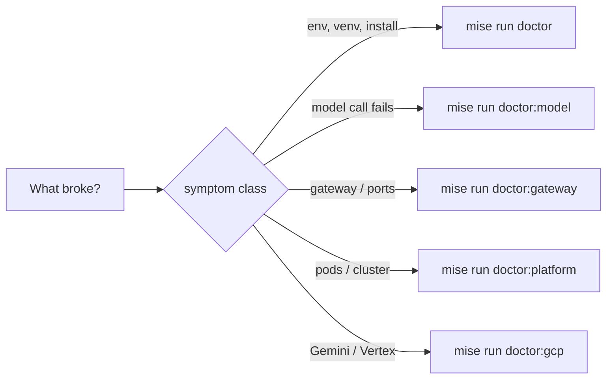

# 0.6. Troubleshooting

!!! abstract "In one glance"

    - **You will:** Find the fix for a failing checkpoint by matching your symptom, instead of reading the page top to bottom.
    - **You need:** Nothing beyond a terminal.
    - **Time:** no reading time — this is a lookup page. Find your symptom and leave.

!!! tip "Bookmark this page — do not read it now"

    Nothing here is worth reading straight through. Come back when a checkpoint fails, match your symptom in the table below, and ignore the rest.

Every entry is a question, symptom-first. Find the one that matches what you see, run the diagnostic, then apply the fix. If your problem is not listed, start with the doctor for your current tier: `mise run doctor`, `doctor:model`, `doctor:gateway`, `doctor:platform`, or `doctor:gcp`. Use `mise run config:check` for the agent's resolved configuration.

## What symptom do you have?

Jump straight to the matching section — the quickest command to run first, and where the full fix lives:

| Symptom                                         | First command                                                 | Where to look                                                                         |
| ----------------------------------------------- | ------------------------------------------------------------- | ------------------------------------------------------------------------------------- |
| A task exits with a "tool not found" error      | `mise run install`                                            | [tool not found](#why-does-mise-run-install-or-a-task-fail-with-tool-not-found)       |
| `ValidationError` before any work at startup    | `mise run config:check`                                       | [configuration error](#why-does-the-agent-fail-at-startup-with-a-configuration-error) |
| Model calls refuse to connect immediately       | `mise run doctor:model`                                       | [reach Ollama or the gateway](#why-cant-the-agent-reach-ollama-or-the-model-gateway)  |
| Every model turn dies at about 60 seconds       | `ollama ps`                                                   | [model deadline](#why-does-every-model-turn-fail-at-about-60-seconds-on-my-cpu)       |
| A service won't start or a port is taken        | <code>ss -ltnp &#124; grep ':3001'</code>                     | [port bind time out](#why-does-the-agent-card-request-or-a-port-bind-time-out)        |
| MCP tools return a 4xx only through the gateway | `mise run config:check`                                       | [MCP 4xx](#why-does-an-mcp-call-through-the-gateway-return-a-4xx)                     |
| Pods stay Pending or CrashLoop                  | `kubectl -n agentops get events --sort-by=.lastTimestamp`     | [pods not Ready](#why-do-kubernetes-pods-stay-pending-crashloop-or-fail-their-probes) |
| Coverage below 95% after an edit                | `cd agents/python && uv run pytest --cov-report=term-missing` | [coverage gate](#why-does-mise-run-test-fail-the-coverage-gate-after-my-edit)         |

## Which doctor should you run first?

Match the symptom class to the narrowest profile — each tier assumes the ones before it, so you do not need to run them all:



For the agent's resolved settings with secrets masked, add `mise run config:check`. Then find your exact symptom below.

## Why does `mise run install` or a task fail with "tool not found"?

Symptom: a task exits immediately complaining a binary (uv, kubectl, agentgateway, sops) is missing.

The repository pins every tool in `mise.toml` but does not auto-install on demand, so hooks and CI fail fast instead of silently drifting.

1. Run `mise run install` for the core learner toolchain.
1. Run `mise run install:platform` before the gateway/Kubernetes chapters, or `mise run install:maintainer` for the complete contributor gate.
1. Run the doctor for the failing layer. `mise run doctor` checks only the base docs/Python entry path; use `doctor:model`, `doctor:gateway`, `doctor:platform`, or `doctor:gcp` for their additional external prerequisites.

## Why does the agent fail at startup with a configuration error?

Symptom: `adk run`, the A2A server, or a task raises a `ValidationError` before doing any work.

The configuration is validated once at startup (parse, don't validate scattered), so a bad combination fails early with a message that names the fix. Run `mise run config:check` to see the resolved settings with secrets masked and the exact error.

Two rules the validator enforces:

1. Remove the retired `AGENT_GATEWAY_ENABLED` variable: deployment topology is selected by `OPENAI_BASE_URL`, not by changing providers.
1. `AGENT_MODEL_PROVIDER=openai-compatible` requires an OpenAI-compatible base URL and a non-empty **client marker** — the `OPENAI_API_KEY` value, which local Ollama accepts as any non-secret string. Use `http://127.0.0.1:11434/v1` with direct Ollama in Chapters 2-4 or `http://127.0.0.1:4000/v1` with agentgateway in Chapter 5.

## Why doesn't my `.env` change affect `mise run test` or `check`?

Symptom: a variable you set in the root `.env` is ignored by the non-model gates, so a config change seems to have no effect.

This is deliberate. The **dotenv** — the root `.env` file — is loaded only by configuration and model-backed tasks. The non-model tasks (`test`, `check`, `redteam`, `mcp`) load no dotenv, so a passing suite proves the committed defaults hold rather than whatever is in your local `.env`. `test`, `redteam`, and the model-free MCP startup are offline; `check` may contact package-index advisory services through `pip-audit`.

Confirm the agent's resolved configuration with `mise run config:check` (from `agents/python`), which is one of the tasks that does read `.env`. To exercise a variable inside the deterministic suite, set it in the test itself or pass it inline for that one command.

## Why can't the agent reach Ollama or the model gateway?

Symptom: model calls time out or return connection errors on the local path.

**Separate the two failures before you fix either.** They look alike in a terminal and have opposite remedies:

| What you see                                                      | What it is                                             | What to change                                 |
| ----------------------------------------------------------------- | ------------------------------------------------------ | ---------------------------------------------- |
| An immediate connection refusal, in under a second                | Nothing is listening — `ollama serve` down, wrong URL  | The connectivity list below                    |
| A turn that runs, prints nothing, then fails at roughly 60 s (×3) | The deadline expired while the model was still working | `AGENT_MODEL_TIMEOUT_S` — see the next section |

`ollama ps` decides it in one command. A loaded model with a live process is a slow turn, not a broken endpoint.

For a genuine connectivity failure, run `mise run doctor:model`: Ollama must be reachable and `ollama list` must contain your `AGENT_MODEL`, normally `qwen3:4b-instruct`. Then check that `OPENAI_BASE_URL` matches the path you are on:

1. Chapters 2-4: `OPENAI_BASE_URL` points directly to `http://127.0.0.1:11434/v1`.
1. Chapter 5: run `mise run doctor:gateway`, start the loopback wrapper with `mise run gateway:host`, and change the URL to `http://127.0.0.1:4000/v1`.
1. Inside Kubernetes: pods reach host Ollama through the gateway, not `localhost` — a pod's loopback is its own container.

A persistent failure after bounded retries is a connectivity problem **only if `ollama ps` shows nothing running**. If it shows your model loaded, the retries were killing a working turn, and the section below is your fix.

## Why does every model turn fail at about 60 seconds on my CPU?

Symptom: the turn never answers, produces no partial output, and gives up after roughly a minute — three times over, because the client retries. `ollama ps` shows the model loaded and the Ollama log shows work in progress.

This is the most likely failure on the required path, and it is not a bug in your setup. The shipped deadline is 60 seconds with two retries (`model_timeout_s` and `max_retries` in `agents/python/src/agent/config.py`), sized for a warm GPU. A local Qwen3-4B on CPU takes seconds to minutes per turn — a multi-tool investigation makes several such calls, and the first one also pays the model load.

Raise the deadline for your hardware. It is one variable in the gitignored root `.env`:

```bash
AGENT_MODEL_TIMEOUT_S=180   # CPU-only laptop; use 300 for a slow or memory-tight machine
```

Then re-run the failing task. Three notes on choosing the number:

1. `mise run config:check` prints the resolved value, so you can confirm the `.env` was read at all. Non-model gates (`test`, `check`) deliberately load no dotenv, so this variable never changes them.
1. Time one turn before you tune. `ollama ps` while it runs, plus a wall clock, tells you the real cost of a single call on your machine; set the deadline above your slowest observed turn, not at a round number you like.
1. Do not raise it past 600 — the typed setting rejects that — and do not raise it to hide a real hang. A turn that never completes with an unbounded deadline is a different problem.

A GPU or Apple Silicon machine rarely needs this. Reach for it when the first agent run in [2.1. First Agent](../2.%20Agents/2.1.%20First%20Agent.md) or a model-backed evaluation fails on time rather than on content.

## Why does the agent card request or a port bind time out?

Symptom: a service will not start, or a client cannot reach `:3000`/`:3001`/`:4000`/`:8000`/`:8080`.

Something already owns the port. The stable network contract is fixed (MCP `:3000`, A2A `:3001`, model `:4000`, gateway metrics/readiness `:15020/:15021`, raw MCP `:8000`, raw A2A `:8080`, ADK web UI `:8002`, documentation preview `:8003`, MLflow `:5000`, Prometheus `:9090`, host Grafana `:3002`).

The two most likely local squatters are tools whose upstream defaults are both `:8000`: the ADK developer web UI and the Zensical documentation preview. This repository moves them to `:8002` and `:8003` precisely so neither can shadow the raw MCP server — if you launch either with a bare `adk web` or `zensical serve` instead of its `mise run` task, you get the collision back, and a browser showing the wrong application rather than a clear error.

1. Inspect the wrapper with `mise run gateway:host:status` and `mise run gateway:host:logs`; stop a stale detached instance with `mise run gateway:host:stop`. On native Linux, that stop also removes the bridge-only loopback relay.
1. Otherwise find the conflicting process with `ss -ltnp | grep ':3001'`. On macOS use `lsof -nP -iTCP:3001 -sTCP:LISTEN`.
1. Do not run host Compose observability while the in-cluster stack is port-forwarded on the same ports.

## Why does an MCP call through the gateway return a 4xx?

Symptom: the agent's MCP tools fail only when routed through the gateway (`AGENT_MCP_URL` set).

The status code names the cause:

| Status  | Cause          |
| ------- | -------------- |
| 401/403 | auth           |
| 404     | route mismatch |
| 421     | rejected host  |

Then check the matching thing:

1. The MCP server's **DNS-rebinding allowlist** — the host names it accepts, set by `MCP_ALLOWED_HOSTS` — must include the gateway's hostname.
1. The gateway route must match the path you call.
1. If the gateway enforces authentication (Chapter 5.5), the caller must send a **bearer token** — a credential sent in the `Authorization` header. Set `AGENT_MCP_TOKEN` to a minted demo token.

## Why do Kubernetes pods stay Pending, CrashLoop, or fail their probes?

Symptom: `kubectl -n agentops get pods` shows pods not Ready.

Read the events first: `kubectl -n agentops get events --sort-by=.lastTimestamp`. Common causes:

1. An image that cannot be pulled from `registry.localhost:5050`. Build and push it with the local skaffold profile.
1. A **readiness probe** — the check Kubernetes runs before sending traffic to a pod — reporting the process cannot serve. The agent's `/healthz` checks the seed dataset, writable state, and the session store; the MCP `/healthz` checks the seed dataset. Both verify the process can actually serve rather than just holding an open port, so a failing readiness means a real dependency gap.
1. A pod blocked by a default-deny egress **NetworkPolicy** — a Kubernetes rule that denies outbound traffic unless allowed. Confirm with `kubectl -n agentops describe networkpolicy`.

## Why does `mise run test` fail the coverage gate after my edit?

Symptom: tests pass but the run fails with "coverage below 95%".

The offline suite enforces at least 95% **branch coverage** — the share of if/else branches your tests actually execute. New source lines need tests that exercise them, including error branches.

Run `cd agents/python && uv run pytest --cov-report=term-missing` to see exactly which lines are uncovered, then add a deterministic test for each. Never lower the threshold or add `# pragma: no cover` to force green.

## Which symptoms only appear when you run a lab or edit the docs?

Neither of these two entries comes from a chapter checkpoint. Open one only if you ran a gateway or SOPS lab, or if you edited a course page.

??? note "Deeper: why must I remove generated secrets even when the scan passes?"

    Symptom: a gateway or SOPS lab left private keys in an ignored directory, but `mise run secure` is green.

    Secret detection is heuristic, not proof that no private material exists. The filesystem scanner inspects the SOPS key under `infra/secrets/`, but a detector may not recognize every age-key encoding. The secured-gateway directory and local `.env` files are explicit scan exclusions because they are expected runtime secrets and would make every post-lab scan fail.

    Git ignores those paths, while staged/full-history gitleaks protects the repository boundary. Tear generated material down using each lab's command, and never force-add it. `git status --ignored --short` can confirm what remains; a green scanner never authorizes keeping a private key indefinitely.

??? note "Deeper: why does the docs check reject my new page?"

    Symptom: the docs check fails on a page you edited.

    Every course page is an FAQ with a fixed frame: it must start with `---` and a `description:` front-matter line, carry an "In one glance" block before the first `##`, contain at least one `##` heading with every `##` ending in `?`, and close on one of the three standard headings. The check also rejects machine-specific absolute paths and stale registry hostnames. Read the failing line it prints — it names the page and the rule — and fix that one thing.

## Why does the platform doctor require cgroup v2?

Kubernetes 1.35 and later refuse kubelet startup on a cgroup v1 host.

Confirm the host hierarchy before creating k3d:

```bash
stat -fc %T /sys/fs/cgroup/
```

Expected: `cgroup2fs`. A `tmpfs` result is cgroup v1, so `mise run doctor:platform` and `mise run cluster:start` stop before creating a partial cluster. Enable your distribution's unified cgroup-v2 hierarchy, reboot, and re-run the doctor.

Do not bypass this check with a kubelet compatibility flag. Kubernetes removed cgroup v1 from its supported v1.35 path; the host prerequisite is the durable fix. See [About cgroup v2](https://kubernetes.io/docs/concepts/architecture/cgroups/).

## How should you use this page later?

Come back when a checkpoint fails. Match your symptom in the table at the top, run the one command in that row, then read only that section.

If nothing matches, run the doctor for your current tier and `mise run config:check` before searching anywhere else.

**You are done when:**

- You can find any of the eight symptoms in the table above and land on the section that fixes it.
- You can say which one command separates a slow local turn from an unreachable model endpoint, and which variable you would raise for the first.
- You know which of the five doctors — `doctor`, `doctor:model`, `doctor:gateway`, `doctor:platform`, `doctor:gcp` — matches the tier you are working in.
- The checkpoint that sent you here passes when you re-run it.

Continue to [0.7. Glossary](./0.7.%20Glossary.md) when this page is bookmarked, because nothing on it needs reading before something breaks.
