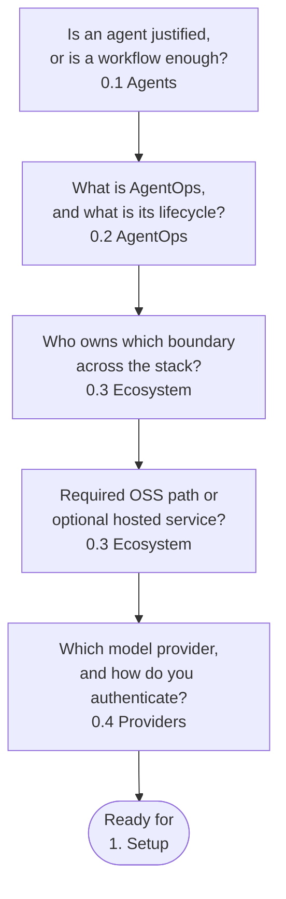

# 0. Overview

## What will you learn in this chapter?

This chapter is orientation, not installation. Before you touch the toolchain, it settles the decisions the rest of the course assumes you have already made: when an agent is the right tool at all, what the AgentOps lifecycle is and why the chapters follow it, who owns which boundary in the open-source stack, where the required OSS path ends and optional hosted services begin, and why local Qwen3 is the default model. Everything here is read-only — no account, no command, no cost.

This chapter covers:

- **[0.0. Course](./0.0. Course.md)**: outcome, audience, prerequisites, time, cost, learning paths, and the first checkpoint.
- **[0.1. Agents](./0.1. Agents.md)**: what an AI agent is, the agentic loop, common patterns, and when a workflow or plain code is the better choice.
- **[0.2. AgentOps](./0.2. AgentOps.md)**: the AgentOps lifecycle and how MLOps, LLMOps, and AgentOps relate.
- **[0.3. Ecosystem](./0.3. Ecosystem.md)**: ownership boundaries across ADK, agentgateway, kagent, MLflow, OTel, MCP, A2A, AAIF, and CNCF.
- **[0.4. Providers](./0.4. Providers.md)**: local Qwen3 by default, then optional Gemini or Vertex AI compared explicitly.
- **[0.5. Resources](./0.5. Resources.md)**: primary documentation, OSS development tools, and community routes.
- **[0.6. Troubleshooting](./0.6. Troubleshooting.md)**: symptom-first fixes for the most common setup and runtime failures.
- **[0.7. Glossary](./0.7. Glossary.md)**: one-line definitions for the course's terms, each linked to the page that owns it.

## What decisions does this chapter help you make?

The Overview exists to resolve a short chain of orienting questions — each answered by one sub-page — before you commit engineering time to building:

The lifecycle you meet in [0.2. AgentOps](./0.2. AgentOps.md) is not only a mental model — it is the order of the course. Build ([Chapter 2](../2. Agents/index.md)), Capabilities ([3](../3. Capabilities/index.md)), Quality ([4](../4. Quality/index.md)), Gateway ([5](../5. Gateway/index.md)), Platform ([6](../6. Platform/index.md)), and Observe ([7](../7. Observability/index.md)) each own one phase, which is why the chapters run from a first model call to a monitored workload rather than in any other sequence. The thread underneath every decision above is the open-source boundary: the required path — ADK, agentgateway, kagent, MLflow, OpenTelemetry, Ollama, and the Apache-2.0 open-weight Qwen3 model — needs no account and no fee, while Gemini, Vertex AI, and GKE are optional proprietary comparisons the course never relabels as OSS.

## What do you need to run this chapter?

Nothing, and that is deliberate. The Overview has no commands, no prerequisites, and no accounts. The course admits each heavy dependency only at the chapter that first needs it, so a running model server, container engine, cluster, or cloud project never blocks the reading you can do today — the same staged-prerequisite discipline that [1. Setup](../1. Setup/index.md) then enforces with a laddered `doctor`. Your first commands arrive there, where `mise install` materializes the pinned toolchain, and the first checkpoint in [0.0. Course](./0.0. Course.md) runs the model-free test gate. Read this chapter account-free, decide the questions above, then build the environment.
