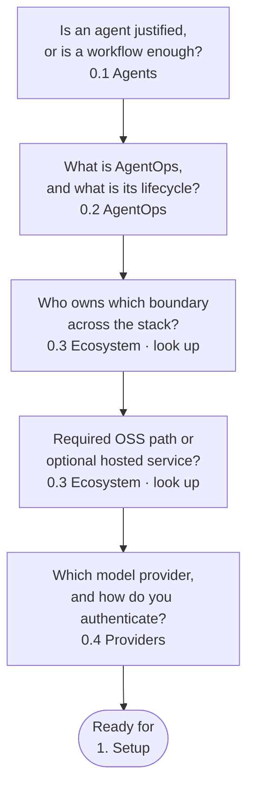

# 0. Overview

!!! abstract "In one glance"

    - **You will:** Answer the five questions the rest of the course assumes you have already settled.
    - **You need:** Nothing beyond this course page; Chapter 0 is read-only.
    - **Time:** about 4 minutes, orientation.

!!! tip "Keep the glossary open"

    Every term the course teaches as a concept has a one-line definition in [0.7. Glossary](./0.7. Glossary.md), with a link to the page that introduces it. Open it in a second tab now — nothing on this page expects you to already know the names below.

## What will you learn in this chapter?

This chapter is orientation, not installation. It settles the decisions the rest of the course assumes you have already made.

Read 0.0, 0.1, 0.2 and 0.4 in order. Bookmark 0.3, 0.5, 0.6 and 0.7, and come back to them when you need them.

Four pages, about 63 minutes. 0.3 is a reference map of ownership boundaries across nine technologies you have not seen run yet; it reads far better after Chapter 2 than before Chapter 1.

This chapter covers:

- **[0.0. Course](./0.0. Course.md)** _(orientation · ~20 min)_: outcome, audience, prerequisites, time, cost, and learning paths.
- **[0.1. Agents](./0.1. Agents.md)** _(concept · ~16 min)_: what an AI agent is, the agentic loop, common patterns, and when a workflow or plain code is the better choice.
- **[0.2. AgentOps](./0.2. AgentOps.md)** _(concept · ~12 min)_: the AgentOps lifecycle and how MLOps, LLMOps, and AgentOps relate.
- **[0.3. Ecosystem](./0.3. Ecosystem.md)** _(lookup · bookmark)_: ownership boundaries across ADK, agentgateway, kagent, MLflow, OTel, MCP, A2A, AAIF, and CNCF — the page you return to when you need to know who owns a boundary.
- **[0.4. Providers](./0.4. Providers.md)** _(concept · ~15 min)_: local Qwen3 by default, then optional Gemini or Vertex AI compared explicitly.
- **[0.5. Resources](./0.5. Resources.md)** _(lookup · bookmark)_: primary documentation, open-source development tools, and community routes.
- **[0.6. Troubleshooting](./0.6. Troubleshooting.md)** _(lookup · bookmark)_: symptom-first fixes for the most common setup and runtime failures.
- **[0.7. Glossary](./0.7. Glossary.md)** _(lookup · bookmark)_: one-line definitions for the course's terms, each linked to the page that owns it.

## What decisions does this chapter help you make?

Five questions, in order, answered across the sub-pages below. Settle them before you commit engineering time to building:

```mermaid
flowchart TD
    Q1["Is an agent justified,<br/>or is a workflow enough?<br/>0.1 Agents"] --> Q2["What is AgentOps,<br/>and what is its lifecycle?<br/>0.2 AgentOps"]
    Q2 --> Q3["Who owns which boundary<br/>across the stack?<br/>0.3 Ecosystem · look up"]
    Q3 --> Q4["Required OSS path or<br/>optional hosted service?<br/>0.3 Ecosystem · look up"]
    Q4 --> Q5["Which model provider,<br/>and how do you authenticate?<br/>0.4 Providers"]
    Q5 --> Ready(["Ready for<br/>1. Setup"])
```

The lifecycle you meet in [0.2. AgentOps](./0.2. AgentOps.md) is not only a mental model — it is the order of the course. Build ([2. Agents](../2. Agents/index.md)), Capabilities ([3. Capabilities](../3. Capabilities/index.md)), Quality ([4. Quality](../4. Quality/index.md)), Gateway ([5. Gateway](../5. Gateway/index.md)), Platform ([6. Platform](../6. Platform/index.md)), and Observe ([7. Observability](../7. Observability/index.md)) each own one phase. That is why the chapters run from a first model call to a monitored workload rather than in any other sequence. The full phase-to-chapter table is on that page, under "How does the lifecycle map to the course?".

One thread runs underneath every decision above: the open-source boundary. The application and platform software are open source. The default Gemini service is proprietary and requires an account and quota. Ollama/Qwen3 is an optional local alternative; offline checks need no model. Vertex AI and GKE are optional cloud extensions.

## What do you need to run this chapter?

Nothing. Chapter 0 asks you to read, compare, and decide; it does not ask you to install software, download a model, create an account, or spend money.

[1.0. System](../1. Setup/1.0. System.md) owns the repository clone and core installation. [1.4. Providers](../1. Setup/1.4. Providers.md) owns the local model download. Keeping those actions in Setup gives every command one canonical home and lets you finish orientation on any device.

The course admits each heavy dependency only at the chapter that first needs it. A running model server, container engine, cluster, or cloud project never blocks the decisions you can make today.

## What proves this chapter worked?

There is nothing to run here. The chapter has worked when you can answer its five questions in your own words.

**You are done when:**

- You can say why this course builds an agent for incident work, and when a workflow or plain code would have been the better answer.
- You can name the six lifecycle phases — Build, Capabilities, Quality, Gateway, Platform, Observe — and the chapter that owns each one.
- You can find, in [0.3. Ecosystem](./0.3. Ecosystem.md) and inside a minute, which tool owns the agent runtime, which owns the traffic in front of it, and which ones record what happened — by lookup, not from memory.
- You have picked a model path, and you know the default Gemini service uses an account and quota; offline exercises need neither.
- You know which four pages you will read now (0.0, 0.1, 0.2, 0.4) and which four lookup pages you have bookmarked (0.3, 0.5, 0.6, 0.7).

Continue to [0.0. Course](./0.0.%20Course.md) when you are ready to pick a learning path.
