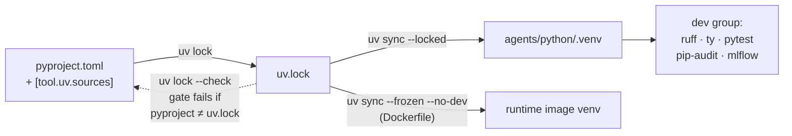
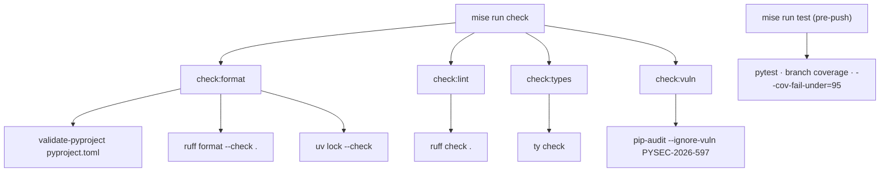

# 1.1. Python

## Why does the reference agent use Python?

Google ADK's Python package provides the agent, tool, callback, session, evaluation, and A2A APIs the course builds on. Python also gives the project mature local tooling for strict linting, typing, security auditing, and tests — the four gates every later chapter reuses. The choice is about this concrete teaching stack, not a claim that every agent should be written in Python; the runtime boundaries an agent needs (typed config, tool schemas, observable calls) exist in every ecosystem, and the discipline transfers.

## Which Python version is required?

The agent requires Python 3.13, declared as `requires-python = ">=3.13"` in `agents/python/pyproject.toml`. uv provisions a compatible interpreter and creates `agents/python/.venv`; do not depend on the operating system Python, whose version drifts per machine and per distro. The container path pins the interpreter even harder — the Dockerfile builds on `python:3.13.13-slim-trixie` and the Wolfi runtime installs `python-3.13` at an exact apk revision — so the version you develop against and the version you ship are the same major.minor line.

## What do mise and uv each own?

The two tools have a clean division of labor, and keeping it straight avoids most "works on my machine" surprises:

- **mise** pins the uv CLI itself (`uv = "0.11.28"` in the root `mise.toml`) and exposes the stable task vocabulary (`install`, `format`, `check`, `test`) that hooks and CI call identically.
- **uv** resolves `pyproject.toml`, locks every transitive dependency in `uv.lock`, installs the interpreter, and synchronizes `.venv` to match the lockfile exactly.

The lockfile — not a version range shown in prose — is the record of the environment that was actually tested. `mise run install` runs `uv sync --locked`, which fails rather than silently re-resolving if `uv.lock` and `pyproject.toml` have drifted apart.



## How do you install only the agent project?

```bash
cd agents/python
mise run install
```

From the repository root, `mise run install` already performs this step (its last action is `cd agents/python && mise run install`), alongside installing the docs, MLflow, and git-hook dependencies.

## Which runtime boundaries are installed?

The relevant dependency declarations are:

```toml
--8<-- "agents/python/pyproject.toml:runtime-dependencies"
```

The build-checked excerpt is the runtime dependency set. ADK provides the agent and A2A runtime. Explicit SQLite/SQLAlchemy dependencies provide persistent local sessions and tasks without installing ADK's unused cloud-database extra. MCP provides the tool-server/client protocol ([3.3](../3.%20Capabilities/3.3.%20MCP.md)). The `openai` package is the OSS client used by ADK's OpenAI-compatible adapter for direct Ollama and agentgateway. OpenTelemetry exports runtime signals. Pydantic validates configuration and tool boundaries. Presidio performs local PII analysis and anonymization ([4.5](../4.%20Quality/4.5.%20Guardrails.md)).

Two details in that excerpt are worth reading closely, because they are what make the install reproducible and offline-capable. The spaCy model `en-core-web-sm` is not fetched by a `spacy download` side effect; it is URL-pinned as a wheel in `[tool.uv.sources]`, so it resolves straight from `uv.lock` and works after a plain `sync` with no extra network step. And several lines carry a floor _and_ a cap with a reason attached — for example the OpenTelemetry exporter is capped to match ADK's own OTel pin, and `presidio-analyzer` is pinned to an exact paired release because the next patch caps `cryptography` below the security floor. Those are compatibility constraints resolved once and frozen in the lockfile, not decoration.

## What separates the runtime dependencies from the dev group?

Everything the agent imports at runtime lives in `[project].dependencies`; everything that only builds, checks, or evaluates the agent lives in `[dependency-groups].dev`. That split is not cosmetic — it is exactly what the container relies on. The Dockerfile installs with `uv sync --frozen --no-dev`, so the shipped image never carries `ruff`, `ty`, `pytest`, `pip-audit`, `mlflow`, `pandas`, or `hypothesis`. The runtime tree stays small, and the image's attack surface excludes tools that only ever run on your laptop or in CI.

The dev group is where the quality stack lives: `ruff` (format + lint, [4.1](../4.%20Quality/4.1.%20Linting.md)), `ty` (types, [4.0](../4.%20Quality/4.0.%20Typing.md)), `pytest` + `pytest-cov` + `hypothesis` (tests, [4.2](../4.%20Quality/4.2.%20Testing.md)), `pip-audit` (vulnerabilities), `validate-pyproject`, and `mlflow` + `rouge-score` for evaluation ([4.4](../4.%20Quality/4.4.%20Evaluations.md)). A few dev entries exist purely to raise a security floor in the MLflow dependency tree (`pyarrow`) rather than because the course imports them directly — a reminder that a lockfile pins your transitive supply chain, not just your direct picks.

## Which commands should you memorize?

```bash
mise run format       # Ruff import sorting and formatting
mise run check        # format, lint, type, lock, metadata, and vulnerability checks
mise run test         # deterministic pytest suite with branch coverage
mise run data:reset   # delete disposable runtime state, never the seed
mise run mcp          # stdio MCP server
mise run mcp:http     # streamable HTTP MCP server on 127.0.0.1:8000
mise run a2a          # persistent loopback A2A server on 127.0.0.1:8080
```

Model-backed `run`, `web`, `eval`, and `eval:mlflow` tasks require the relevant provider or gateway configuration ([1.4](./1.4.%20Providers.md)). `redteam` is a deterministic offline adversarial regression suite; it is intentionally not marketed as live-model penetration testing ([4.6](../4.%20Quality/4.6.%20Security.md)).

## What does `mise run check` actually run?

`check` is a fan-out: it declares no command of its own and instead `depends` on four sub-tasks that mise runs in parallel. Decomposing it shows exactly where each earlier claim on this page is enforced:



The `uv lock --check` step inside `check:format` is the actual teeth behind the "the lockfile records the tested environment" claim above: it fails the gate whenever `pyproject.toml` and `uv.lock` disagree. `test` is deliberately _not_ part of `check` — `lefthook.yml` runs `check` on `pre-commit` and reserves the slower `test` for `pre-push`, so a fast structural gate runs on every commit and the full suite runs before code leaves your machine.

## Why do the offline gates refuse to load `.env`?

An AgentOps-relevant design decision is encoded in how each task loads (or does not load) configuration. Only the tasks that genuinely talk to a model or gateway — `config:check`, `eval`, `eval:report`, `eval:mlflow`, `eval:retrieval`, `web`, `run`, and `a2a` — pull the root `.env`, each via an explicit `env = { _.file = { path = "../../.env", redact = true } }`. The offline gates (`install`, `check`, `test`, `mcp`, `redteam`, and the model-free `eval:validate`) load no dotenv at all — note that not every `eval:*` task talks to a model, so `eval:validate` deliberately stays offline.

The consequence is a property you want from a quality gate: an offline check can never pass or fail because of a local `.env`. Your lint, type, lock, vulnerability, and unit-test results depend only on the committed source and lockfile, so they reproduce identically on a teammate's machine and in CI, where no `.env` exists. Secrets are scoped to exactly the tasks that need them and masked (`redact = true`) when a task prints its resolved configuration.

## Why is exactly one vulnerability ignored by name?

`check:vuln` runs `pip-audit` with a single, named suppression rather than a blanket allow-list. The task carries its full justification inline:

```toml
[tasks."check:vuln"]
alias = "ca"
description = "Audit dependencies for known vulnerabilities"
# PYSEC-2026-597: path traversal in nltk.data.load(). nltk is a dev-only transitive of
# rouge-score (a minimal dependency for `adk eval`); it is never imported by the agent
# runtime and receives no attacker-controlled resource names. No fixed release exists yet —
# revisit when one ships. Documented, specific ignore (not a blanket suppression).
run = "uv run pip-audit --ignore-vuln PYSEC-2026-597"
```

This is the honest shape of a suppression: one advisory ID, a reason grounded in the actual dependency graph (a dev-only transitive that the runtime never imports, so it is absent from the `--no-dev` image entirely), a threat-model note (no attacker-controlled input), and a trigger to revisit (when a fixed release ships). A blanket `--ignore` or a broad severity floor would hide the next real vulnerability alongside this one; naming a single ID keeps every other advisory able to fail the gate.

## Why does an unexpected warning fail the suite?

A warning is a defect the code chose not to raise — a deprecation, a misuse, a compatibility drift. Silencing warnings globally means the day an upstream deprecation becomes a breaking change, your suite stays green until the agent breaks in production. So `pytest` is configured to treat every warning as an error, and then to un-error only exact, reviewed messages:

The `filterwarnings` list in `pyproject.toml` opens with `"error"` and then lists seven precise `ignore` filters, each pinned to a known message pattern and category. Most anchor the full message with `^...$`; one matches a family of ADK experimental-API messages by an anchored prefix. For example, the ADK experimental-feature notice is matched exactly:

```toml
'ignore:^\[EXPERIMENTAL\] feature FeatureName\.(JSON_SCHEMA_FOR_FUNC_DECL|PLUGGABLE_AUTH|TOOL_CONFIRMATION) is enabled\.$:UserWarning',
```

Because each filter is anchored to the known text and its category, a _new_ warning message or a new category is not matched by any filter and therefore fails the suite. That is the point: the filters excuse the specific noise emitted by the locked ADK experimental A2A/tool-confirmation APIs and their current Starlette/OpenTelemetry compatibility layers, and nothing else. Revisit and remove the filters as those upstream APIs stabilize.

The same "fail loud" posture appears in the rest of `[tool.pytest.ini_options]`: `--strict-config` and `--strict-markers` reject an unknown config key or an undeclared marker, and `xfail_strict = true` turns an "expected failure" that unexpectedly passes into a hard failure so a fixed bug cannot hide behind a stale `xfail`.

## What is the Python checkpoint?

```bash
cd agents/python
mise run check
mise run test
```

Continue when there are no warnings, `pytest` passes, and branch coverage meets the enforced threshold. Coverage is not aspirational prose — `addopts` sets `--cov-branch` and `--cov-fail-under=95`, so the suite exits non-zero if branch coverage drops below 95%. A passing `import agent` alone is not sufficient; this checkpoint gates every later chapter.

!!! warning "Common pitfalls"

    - **Depending on the system Python.** Run the tasks from `agents/python` so uv uses `.venv`, not whatever `python3` your shell resolves.
    - **Editing `.venv` by hand.** It is a derived artifact of `uv.lock`; change `pyproject.toml` and re-lock instead, or the next `uv sync --locked` will overwrite your edit.
    - **Forgetting `uv lock` after a `pyproject.toml` edit.** The agent's `check:format` runs `uv lock --check` (the root `check:format` runs only `dprint check`), so `mise run check` from `agents/python` fails the gate until the lockfile is regenerated.
    - **Confusing the two `mise run test` scopes.** The root task delegates into `agents/python`; running it from the wrong directory, or expecting the root `check` (which also validates docs, infra, and shell) when you only changed the agent, wastes time — invoke the agent's own `check`/`test` while iterating.
