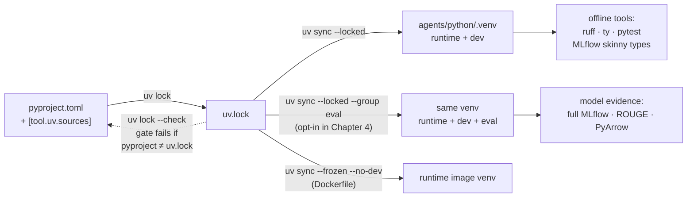
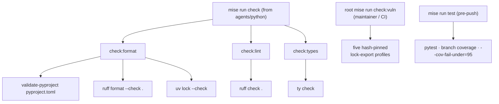

# 1.1. Python

!!! abstract "In one glance"

    - **You will:** Build the agent's locked Python environment and get its lint, type, and test gates passing without a model.
    - **You need:** `mise run install` finished and `mise run doctor` passing from 1.0. System.
    - **Time:** about 22 minutes, hands-on.

## Why does the reference agent use Python?

Google ADK's Python package provides the agent, tool, [callback](../0.%20Overview/0.7.%20Glossary.md#callback), session, evaluation, and A2A APIs the course builds on. Python also gives the project mature local tooling for strict linting, typing, security auditing, and tests — the four gates every later chapter reuses.

The choice is about this concrete teaching stack, not a claim that every agent should be written in Python. The runtime boundaries an agent needs (typed config, tool schemas, observable calls) exist in every ecosystem, and the discipline transfers.

## How do you install only the agent project?

One command builds the agent's virtual environment from the lockfile. Run it here, or reuse the root install you already ran in 1.0. System.

```bash
cd agents/python
mise run install
```

From the repository root, `mise run install` already performs this step (its last action is `cd agents/python && mise run install`), alongside installing the docs environment and git-hook dependencies.

The base agent sync installs the runtime plus the `dev` group used by formatting, typing, and offline tests. It deliberately leaves the heavier `eval` group out until Chapter 4; the serving image removes every development and evaluation package.

Now that the environment exists, here is what pinned it.

## Which Python version is required?

The agent admits CPython 3.13 only, declared as `requires-python = ">=3.13,<3.14"` in `agents/python/pyproject.toml`. uv provisions a compatible interpreter and creates `agents/python/.venv`. Python 3.14 is not implied by the lower bound: it remains unsupported until the locked ADK/GenAI chain and the complete agent boundary suite qualify it.

The container path pins the interpreter even harder. The Dockerfile builds on `python:3.13.14-slim-trixie`, and the Wolfi runtime installs `python-3.13` at an exact apk revision. The version you develop against and the version you ship are therefore the same major.minor line.

## What do mise and uv each own?

The two tools have a clean division of labor, and keeping it straight avoids most "works on my machine" surprises:

- **mise** pins the uv CLI itself (pinned in the root `mise.toml`, exact in `mise.lock`) and exposes the stable task vocabulary (`install`, `format`, `check`, `test`) that hooks and CI call identically.
- **uv** resolves `pyproject.toml`, locks every transitive dependency in `uv.lock`, installs the interpreter, and synchronizes `.venv` to match the lockfile exactly.

The lockfile — not a version range shown in prose — is the record of the environment that was actually tested. `mise run install` runs `uv sync --locked`, which fails rather than silently re-resolving if `uv.lock` and `pyproject.toml` have drifted apart.


```mermaid
flowchart LR
    PP["pyproject.toml<br/>+ [tool.uv.sources]"] -->|uv lock| LOCK[uv.lock]
    LOCK -->|"uv sync --locked"| VENV["agents/python/.venv<br/>runtime + dev"]
    LOCK -->|"uv sync --locked --group eval<br/>(opt-in in Chapter 4)"| EVAL["same venv<br/>runtime + dev + eval"]
    LOCK -->|"uv sync --frozen --no-dev<br/>(Dockerfile)"| IMG[runtime image venv]
    VENV --> DEV["offline tools:<br/>ruff · ty · pytest<br/>MLflow skinny types"]
    EVAL --> FULL["model evidence:<br/>full MLflow · ROUGE · PyArrow"]
    LOCK -. "uv lock --check<br/>gate fails if<br/>pyproject ≠ uv.lock" .-> PP
```

**Diagram in words:** One lock feeds three profiles: the base learner venv has runtime and development packages, Chapter 4 adds evaluation packages to that same venv, and the runtime image installs neither optional group.

## When do you add the optional evaluation profile?

Install it when you reach the full MLflow, retrieval, cost, groundedness, or prompt-comparison tasks in Chapter 4:

```bash
cd agents/python
mise run install:eval
```

This command expands the existing venv from the same lock; it does not create another project or call a model. The base install already supports the offline `eval:validate` gate and the lightweight ADK evaluation path. `install:maintainer` includes `install:eval`, so CI and a clean maintainer machine audit the complete locked dependency set.

## What does the agent depend on at runtime?

Four lines matter on a first read: `google-adk`, `mcp`, `openai`, and `pydantic-settings`. The rest support them.

```toml
--8<-- "agents/python/pyproject.toml:runtime-dependencies"
```

The build-checked excerpt is the runtime dependency set. ADK provides the agent and A2A runtime. MCP provides the tool-server/client protocol. The `openai` package is the OSS client used by ADK's OpenAI-compatible adapter for direct Ollama and agentgateway. Pydantic validates configuration and tool boundaries.

??? note "Deeper: the supporting lines, and why several carry a version cap"

    Explicit SQLite/SQLAlchemy dependencies provide persistent local sessions and tasks without installing ADK's unused cloud-database extra. OpenTelemetry exports runtime signals. Presidio performs local PII analysis and anonymization.

    Two details in that excerpt are worth reading closely, because they are what make the install reproducible and offline-capable. The spaCy model `en-core-web-sm` is not fetched by a `spacy download` side effect; it is URL-pinned as a wheel in `[tool.uv.sources]`, so it resolves straight from `uv.lock` and works after a plain `sync` with no extra network step. And several lines carry a floor _and_ a cap with a reason attached — for example the OpenTelemetry exporter is capped to match ADK's own OTel pin, and `presidio-analyzer` is pinned to an exact paired release because the next patch caps `cryptography` below the security floor. Those are compatibility constraints resolved once and frozen in the lockfile, not decoration.

Owned by [3.3. MCP](../3.%20Capabilities/3.3.%20MCP.md) for the protocol and [4.5. Guardrails](../4.%20Quality/4.5.%20Guardrails.md) for the PII tooling.

## What separates the runtime dependencies from the dev group?

The agent imports one set of packages; the **dev group** adds only what builds, checks, or tests it. A separate opt-in **eval group** adds the heavier model-evidence stack.

Keeping all three profiles distinct lets the container install with `uv sync --frozen --no-dev`, so `ruff`, `ty`, `pytest`, `pip-audit`, and MLflow never reach the shipped image.

??? note "Deeper: what is in the dev group, and why the image never sees it"

    Everything the agent imports at runtime lives in `[project].dependencies`; formatting, typing, and offline-test packages live in `[dependency-groups].dev`; full MLflow/ROUGE evidence packages live in `[dependency-groups].eval`. That split is not cosmetic. The Dockerfile installs with `uv sync --frozen --no-dev`, so the shipped image never carries `ruff`, `ty`, `pytest`, `pip-audit`, MLflow, pandas, PyArrow, or Hypothesis.

    The dev group contains `ruff`, `ty`, `pytest`, `pytest-cov`, Hypothesis, `pip-audit`, and `mlflow-skinny` for the tracing/entity/scorer types imported by offline tests. `google-cloud-aiplatform` is present because ADK imports its evaluation types even for the local evaluator; the course avoids ADK's broader eval extra and unused LiteLLM path. The eval group adds full `mlflow`, `rouge-score`, PyArrow, and `tabulate` only when their Chapter 4 tasks need them. A lock-derived audit still covers all three profiles on the maintainer path.

## Which commands should you memorize?

These seven tasks belong to the agent project, so run them from `agents/python`:

```bash
cd agents/python
mise run format       # Ruff import sorting and formatting
    mise run check        # format, lint, type, lock, and metadata checks
mise run test         # deterministic pytest suite with branch coverage
mise run data:reset   # delete disposable runtime state, never the seed
mise run mcp          # stdio MCP server
mise run mcp:http     # streamable HTTP MCP server on 127.0.0.1:8000
mise run a2a          # persistent loopback A2A server on 127.0.0.1:8080
```

`format`, `check`, and `test` also exist at the repository root. The root `format` and `check` reach the whole repository, not just the agent, while the root `test` simply delegates back to this project. The other four tasks in the block exist only here.

Interactive tasks and the live `eval*` family require a configured chat model, except `eval:validate`, which is offline, and `eval:retrieval`, which uses a local embedding model ([1.4. Providers](./1.4.%20Providers.md)). The full MLflow/retrieval/cost/grounding/A-B family also requires `mise run install:eval`. `redteam` is a deterministic offline adversarial regression suite; it is intentionally not marketed as live-model penetration testing ([4.6. Security](../4.%20Quality/4.6.%20Security.md)).

## What does `mise run check` actually run?

Run from `agents/python`, `check` is a **fan-out**: a task with no command of its own that runs three sub-tasks in parallel.

It names them with `depends`, and decomposing it shows exactly where each earlier claim on this page is enforced:


```mermaid
flowchart TD
    C["mise run check (from agents/python)"] --> CF["check:format"]
    C --> CL["check:lint"]
    C --> CT["check:types"]
    CF --> CF1["validate-pyproject pyproject.toml"]
    CF --> CF2["ruff format --check ."]
    CF --> CF3["uv lock --check"]
    CL --> CL1["ruff check ."]
    CT --> CT1["ty check"]
    V["root mise run check:vuln<br/>(maintainer / CI)"] --> V1["five hash-pinned<br/>lock-export profiles"]
    T["mise run test (pre-push)"] --> T1["pytest · branch coverage · --cov-fail-under=95"]
```

**Diagram in words:** The agent check fans out to format/metadata, lint, and type checks; tests stay on pre-push. The separate root maintainer vulnerability task audits five lock-export profiles.

The `uv lock --check` step inside `check:format` is the actual teeth behind the "the lockfile records the tested environment" claim above: it fails the gate whenever `pyproject.toml` and `uv.lock` disagree.

`test` is deliberately _not_ part of this subproject's `check`. [1.5. Workspace](./1.5.%20Workspace.md) owns the root task scopes and the hook sequence that runs structural checks before the slower test suite.

## Why do the model-free gates refuse to load `.env`?

A deterministic gate must not change because a machine-local provider file exists.

Agent tasks run from `agents/python`. Tasks that need provider configuration explicitly load the repository-root `../../.env` with `redact = true`: `config:check`, `run`, `workflow`, `coordinator`, `web`, `a2a`, and the model-backed `eval*` family.

`install`, `install:eval`, `format`, `check`, `test`, `mcp`, `mcp:http`, `redteam`, and `eval:validate` load no dotenv. Tests, red-team regressions, and eval-set validation are fully offline. The separate root `check:vuln` maintainer task may contact package-index advisory services.

This boundary covers dotenv files, not the process environment. Manually exported variables are inherited by child processes, so keep provider overrides in the root `.env` to preserve task scoping and mise's redaction.

## How strict is the offline suite?

Setup only needs you to know the posture; [Chapter 4](../4.%20Quality/index.md) explains the policy. The gates fail loud on two things a laxer project would let slide:

- **An unexpected warning fails the suite.** `pytest` treats every warning as an error and un-errors only exact, reviewed messages, so a new upstream deprecation surfaces here instead of in production ([4.2. Testing](../4.%20Quality/4.2.%20Testing.md)).
- **Known vulnerabilities fail the maintainer audit.** Root `mise run check:vuln` runs `pip-audit` over five hash-pinned lock exports with no finding-specific advisory ignore. The sole non-PyPI data-model carve-out is source-and-hash checked in the script. Any future advisory exception must name one advisory, justify reachability and risk, and carry a removal condition ([4.6. Security](../4.%20Quality/4.6.%20Security.md)).

!!! warning "Common mistakes"

    - **Depending on the system Python.** Run the tasks from `agents/python` so uv uses `.venv`, not whatever `python3` your shell resolves.
    - **Editing `.venv` by hand.** It is a derived artifact of `uv.lock`; change `pyproject.toml` and re-lock instead, or the next `uv sync --locked` will overwrite your edit.
    - **Forgetting `uv lock` after a `pyproject.toml` edit.** The agent's `check:format` runs `uv lock --check` (the root `check:format` runs only `dprint check`). `mise run check` from `agents/python` therefore fails the gate until the lockfile is regenerated.
    - **Confusing the two `mise run test` scopes.** The root task delegates into `agents/python`; the root `check` additionally validates docs, infra, and shell. When you only changed the agent, waiting on those wider scopes wastes time — invoke the agent's own `check`/`test` while iterating.

## What proves this page worked?

Both commands need no model, container, account, network, or `.env`. Run them from `agents/python` so uv uses `.venv` and `check` means the agent's three deterministic static sub-tasks.

```bash
cd agents/python
mise run check
mise run test
```

A successful run prints both of these lines:

```text
... passed
Required test coverage of 95% reached
```

Continue when there are no warnings, `pytest` passes, and branch coverage meets the enforced threshold. **Branch coverage** counts the if/else paths the tests actually take, not just the lines they touch. Coverage is not aspirational prose — `addopts` sets `--cov-branch` and `--cov-fail-under=95`, so the suite exits non-zero if branch coverage drops below 95%. A passing `import agent` alone is not sufficient; this checkpoint gates every later chapter.

**You are done when:**

- `mise run check` completes from `agents/python` with all three sub-tasks passing: `check:format`, `check:lint`, and `check:types`.
- `mise run test` prints a summary with no failures and the line `Required test coverage of 95% reached`.
- Both commands finished without a model server, container engine, network, or `.env` file; root `mise run check:vuln` is the separate maintainer dependency audit.
- You can name the task that fails when `pyproject.toml` and `uv.lock` drift apart: `check:format`, through its `uv lock --check` step.

Continue to [1.4. Providers](./1.4.%20Providers.md) when both commands pass from `agents/python` without a single warning. Return to [1.2. Containers](./1.2.%20Containers.md) when Chapter 5 introduces the gateway.
