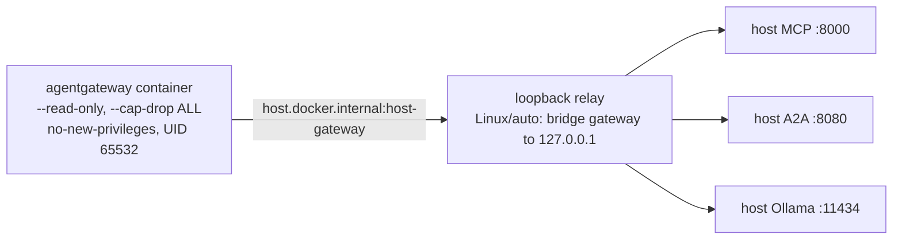
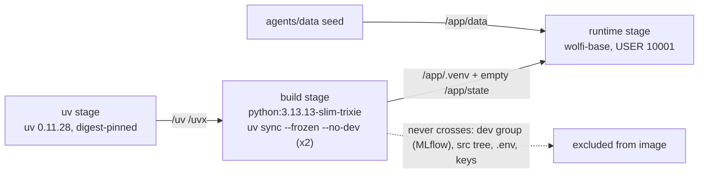
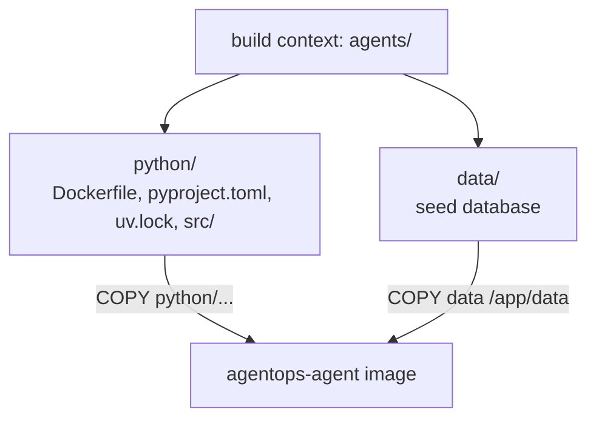

# 1.2. Containers

## Why package an agent as a container?

The AgentOps Agent bundles a Python interpreter, native libraries (`libstdc++`), an A2A server, and the seed dataset. An OCI image freezes those inputs into one immutable, content-addressable artifact that runs the same on local k3d and on GKE — dev/prod parity is the whole point. Everything that changes per environment stays _out_ of the image: provider keys, writable state, telemetry endpoints, and the model backend are all injected at runtime. Chapter 6 builds and deploys this image; here you only prepare the engine that later chapters drive.

## Which container engine should you use?

The validated course commands target the open-source Docker CLI, Docker Engine API, and Compose specification. Any engine that implements them works:

- [Docker Engine](https://docs.docker.com/engine/) on Linux.
- [Podman](https://podman.io/) and Podman machine on Linux/macOS.
- [Colima](https://github.com/abiosoft/colima) with a Docker-compatible CLI on macOS.

Docker Desktop runs the same commands but is a proprietary product with its own license terms; it is optional, not part of the OSS-stack claim. The Chapter 5 `gateway:host*` wrapper shells out to `docker` directly and hardens the container in engine-specific ways (see the next question), which is the concrete reason Podman is adaptable but not the validated learner path until the same smoke tests pass against it.

## How do you verify the engine?

```bash
docker version
docker info
docker run --rm hello-world
docker compose version
```

The client, daemon/VM, image pull, container run, and Compose plugin must all respond. Do not continue with a client-only install that cannot reach an engine. `docker compose version` is not incidental: Chapter 7's local observability stack (MLflow, the OpenTelemetry Collector, Prometheus, Grafana) is a Compose project you bring up with `mise run observability:up` against `infra/observability/compose.yaml`, so a missing Compose plugin surfaces there, not here.

## What does the Chapter 5 wrapper demand from your engine?

The `gateway:host*` tasks run one hardened agentgateway container that fronts your host-loopback services: the agent's A2A server (`:8080`), its MCP server (`:8000`), and the model backend (Ollama `:11434`). The wrapper [`gateway-host.sh`](https://github.com/MLOps-Courses/agentops-open-course/blob/main/infra/scripts/gateway-host.sh) assembles the run with a deliberately locked-down argument set:

```bash
docker_args=(
    run
    --pull missing
    --user 65532:65532
    --read-only
    --cap-drop ALL
    --security-opt no-new-privileges=true
    --tmpfs "/tmp:rw,noexec,nosuid,nodev,size=16m,mode=1777"
    --add-host host.docker.internal:host-gateway
)
```

Every published port binds to `127.0.0.1` only (`--publish 127.0.0.1:3000:3000` for MCP, and the same for A2A, model, metrics, and readiness), so the gateway never listens on a routable interface. Your engine therefore has to support a read-only root filesystem, dropping all Linux capabilities, `no-new-privileges`, a `noexec` tmpfs, and the `host.docker.internal:host-gateway` mapping.

That last mapping is the portability seam. A container cannot reach host loopback services the same way on every platform: Docker Desktop already routes `host.docker.internal` to the host, but native Linux Docker resolves it to the bridge gateway IP, where nothing is listening for services the host bound to `127.0.0.1`. The wrapper closes that gap with a small asyncio loopback relay ([`loopback-relay.py`](https://github.com/MLOps-Courses/agentops-open-course/blob/main/infra/scripts/loopback-relay.py), controlled by `AGENTOPS_GATEWAY_LOOPBACK_RELAY=auto`): on native Linux it binds the bridge gateway IP and forwards MCP, A2A, model, and metrics traffic to host loopback; on Docker Desktop it is skipped. Podman can be pointed at the same flags, but the relay logic and host reachability differ per engine — the caveat is mechanical, not a hand-wave.



## What is inside the agent image?

[`agents/python/Dockerfile`](https://github.com/MLOps-Courses/agentops-open-course/blob/main/agents/python/Dockerfile) is a three-stage build. A `uv` stage supplies the resolver; a `build` stage on `python:3.13.13-slim-trixie` runs `uv sync` twice to produce `/app/.venv`; and a `runtime` stage on `cgr.dev/chainguard/wolfi-base` carries only that venv, the `agents/data` seed, and an empty state directory. The final image runs as UID/GID `10001`, starts `python -m agent.server`, and exposes A2A on `:8080` — the contract kagent's `type: BYO` Agent probes.

Dependencies are layered for cache reuse:

```dockerfile
# Locked runtime dependencies only (cached until pyproject.toml / uv.lock change).
COPY python/pyproject.toml python/uv.lock ./
RUN uv sync --frozen --no-dev --no-install-project

# Install the project non-editably so runtime package metadata (including the
# A2A card version) is available without carrying a duplicate source tree.
COPY python/README.md ./README.md
COPY python/src ./src
RUN uv sync --frozen --no-dev --no-editable
```

The first sync resolves locked runtime dependencies only and is cached until `pyproject.toml`/`uv.lock` change; the second installs the project non-editably so runtime package metadata is present without shipping a duplicate source tree.

The image does **not** include provider keys, writable development state, MLflow, evaluation dependencies, or an Ollama model — and each omission has a mechanism, not just an intention. `--no-dev` drops the `dev` dependency group, where MLflow and the eval tooling live (`agents/python/pyproject.toml`); state is an empty directory created with `install -d -o 10001 -g 10001 /app/state`; keys and endpoints are supplied by Kubernetes at runtime.

## What crosses each build stage boundary?

Only three things cross into the final image, and one non-obvious detail makes that possible. From the `uv` stage, just the `/uv` and `/uvx` binaries. From the `build` stage, the resolved `/app/.venv` and the empty `/app/state`. From the build _context_ (not a stage), `agents/data` becomes `/app/data`. The dev group, the source tree, `.env`, and any credentials never cross.



The venv repoint is the part a learner would never guess. The build image installs Python under `/usr/local`, but Wolfi exposes it at `/usr/bin/python3`. If you copied the venv untouched, its interpreter symlinks would dangle. So after the last build-stage Python invocation the Dockerfile re-points them:

```dockerfile
RUN ln -sfn /usr/bin/python3 /app/.venv/bin/python \
 && ln -sfn /usr/bin/python3 /app/.venv/bin/python3 \
 && ln -sfn /usr/bin/python3 /app/.venv/bin/python3.13 \
 && install -d -o 10001 -g 10001 /app/state
```

`UV_LINK_MODE=copy`, set earlier in the stage, is the companion: the venv holds copied files, not hardlinks into a uv cache that would not exist in the runtime stage.

## Why is every base image pinned by digest?

All bases — the `syntax` directive, the `uv` image, `python`, and `wolfi-base` — are pinned by `@sha256:` digest, not just a tag:

```dockerfile
FROM ghcr.io/astral-sh/uv:0.11.28@sha256:0f36cb9361a3346885ca3677e3767016687b5a170c1a6b88465ec14aefec90aa AS uv
FROM python:3.13.13-slim-trixie@sha256:aa938a849bcb82dce8f49480f056ab82bf5c1c3ebc294f0430f37b6820e7f286 AS build
```

A tag like `python:3.13.13-slim-trixie` can be re-pushed to point at different bytes; a digest cannot. Pinning both keeps multi-arch builds reproducible even when upstream moves a tag. The companion setting is `UV_PYTHON_DOWNLOADS=never`: uv is forbidden from fetching a managed interpreter, so the build uses only the digest-pinned base image's Python. Together they mean the interpreter and its dependency closure are fixed by content, not by a mutable name — reproducibility survives a tag being re-pushed under you.

## Why do the Wolfi package pins eventually stop resolving?

The runtime stage installs exact apk pins:

```dockerfile
RUN apk add --no-cache \
    libstdc++=16.1.0-r4 \
    python-3.13=3.13.14-r2
```

Wolfi is a _rolling_ repository: it removes superseded package versions rather than keeping an archive. So these pins are correct today and will, at some point, fail the build with `no such package` once newer versions ship and the old ones are pruned. That is expected drift, not a broken course. The fix is to bump the pins to the current versions — Renovate opens that PR automatically — and rebuild; Chapter 6.1 covers it. Do not "fix" it by unpinning: an unpinned `apk add` reintroduces exactly the non-reproducibility the digests were protecting.

## Why does the image bind 0.0.0.0 when the host runtime does not?

The runtime stage sets environment variables that invert the host defaults on purpose:

```dockerfile
ENV PATH=/app/.venv/bin:$PATH \
    PYTHONUNBUFFERED=1 \
    AGENT_DATA_DIR=/app/data \
    AGENT_STATE_DIR=/app/state \
    AGENT_A2A_BIND_HOST=0.0.0.0 \
    ADK_CAPTURE_MESSAGE_CONTENT_IN_SPANS=false \
    OTEL_INSTRUMENTATION_GENAI_CAPTURE_MESSAGE_CONTENT=false
```

On the host, [`config.py`](https://github.com/MLOps-Courses/agentops-open-course/blob/main/agents/python/src/agent/config.py) defaults `a2a_bind_host` to `127.0.0.1` — loopback only. The image flips it to `0.0.0.0` because inside Kubernetes the pod must accept connections from kagent on the pod network. `config.py` states the rule exactly: the bind and _advertised_ addresses are deliberately separate, "the host runtime stays loopback-only; Kubernetes explicitly opts into 0.0.0.0," and you must "never advertise 0.0.0.0: it is a listener, not a callable endpoint." Binding wide is safe here only because the pod, not the image, controls who can reach the port.

The two telemetry variables harden the default the other way: both `ADK_CAPTURE_MESSAGE_CONTENT_IN_SPANS` and `OTEL_INSTRUMENTATION_GENAI_CAPTURE_MESSAGE_CONTENT` are `false`, so prompt and response _content_ never leaves the process inside OpenTelemetry spans by default. You can opt into content capture for debugging, but the shipped image errs toward not exporting message bodies.

## Why is the build context `agents/`?

The Dockerfile lives under `agents/python`, but it needs both `python/` (source, lockfile) and the sibling `data/` seed. The build context therefore has to be the parent `agents/` directory, not `agents/python`:

```bash
docker build -f agents/python/Dockerfile -t agentops-agent:dev agents
```



If the context were `agents/python`, the `COPY data /app/data` step would fail — the seed lives outside that narrower context. Chapter 6 uses Skaffold and a local registry so this same image reference is consumable by k3d.

## What is the container checkpoint?

```bash
mise run doctor:gateway
```

Continue when the gateway doctor can reach the Docker engine — it verifies `docker info` and `docker compose version`, and that the host gateway wrapper is executable. Do not build the agent image during initial setup; Chapter 6 validates the non-root image, local registry, and Kubernetes deployment together.
