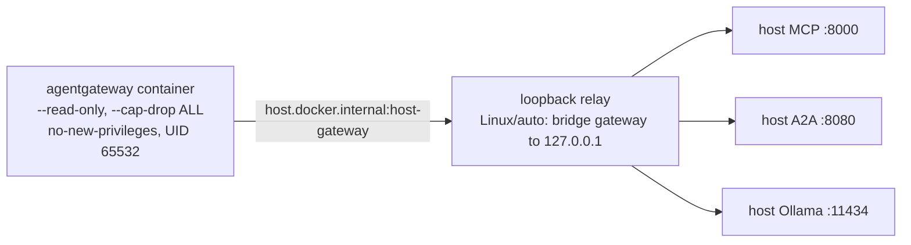

# 1.2. Containers

!!! abstract "In one glance"

    - **You will:** Get a Docker-compatible engine responding on your machine so the Chapter 5 gateway wrapper will run.
    - **You need:** Nothing from this chapter — skip the page entirely until Chapter 5 if you are on the local model path.
    - **Time:** about 12 minutes, hands-on.

!!! tip "On the local model path? You can skip this page for now."

    Nothing on this page is required to run the reference agent on local Qwen3. The Docker-compatible engine here only matters for the Chapter 5 gateway wrapper (and the Chapter 7 Compose observability stack).

    Skip ahead now. [5.1. Gateway Setup](../5.%20Gateway/5.1.%20Gateway%20Setup.md) brings you back here before it starts the gateway. Then run `docker info` and `mise run doctor:gateway`.

## Why package an agent as a container?

The exact same bytes run on your laptop and in the cloud: no re-install, no version drift. One image runs on the local k3d cluster of Chapter 6 and on GKE, Google's hosted Kubernetes. That parity between development and production is the whole point.

The AgentOps Agent bundles a Python interpreter, native libraries (`libstdc++`), an A2A server, and the seed dataset. An **OCI image** is the open container-image format that Docker and Podman both produce. It freezes those inputs into one immutable, content-addressable artifact: the image is named by a hash of its own bytes, so one name can never mean two different things.

Everything that changes per environment stays _out_ of the image: provider keys, writable state, telemetry endpoints, and the model backend are all injected at runtime. Chapter 6 builds and deploys this image; here you only prepare the engine that later chapters drive.

## Which container engine should you use?

The validated course commands target the open-source Docker CLI, Docker Engine API, and Compose specification. Any engine that implements them works:

- [Docker Engine](https://docs.docker.com/engine/) on Linux.
- [Podman](https://podman.io/) and Podman machine on Linux/macOS.
- [Colima](https://github.com/abiosoft/colima) with a Docker-compatible CLI on macOS.

Docker Desktop runs the same commands but is a proprietary product with its own license terms; it is optional, not part of the OSS-stack claim.

The Chapter 5 `gateway:host*` wrapper shells out to `docker` directly and hardens the container in engine-specific ways, listed two sections below. That is the concrete reason Podman is adaptable but not the validated learner path, until the same smoke tests pass against it.

Confirm the selected engine exposes the expected API before reading its full readiness checklist:

```bash
docker version
```

## How do you verify the engine?

Run all four commands. Each one checks a different layer, from the CLI down to the engine.

```bash
docker version
docker info
docker run --rm hello-world
docker compose version
```

The client, daemon/VM, image pull, container run, and Compose plugin must all respond. Do not continue with a client-only install that cannot reach an engine.

`docker compose version` is not incidental. Chapter 7's local observability stack (MLflow, the OpenTelemetry Collector, Prometheus, Grafana) is a Compose project you bring up with `mise run observability:up` against `infra/observability/compose.yaml`. A missing Compose plugin therefore surfaces there, not here.

!!! warning "What a client-only install looks like"

    On a fresh macOS setup where Podman machine or Colima has not been started, the `docker` CLI is installed but no engine is running behind it. `docker info` cannot reach the daemon, and `docker run --rm hello-world` never starts a container. That is the state you must not continue from.

    `mise run doctor:gateway` names the same condition in one line: it prints `docker     daemon is unavailable` and exits non-zero. A reachable engine prints `docker     ready` instead.

## What does the Chapter 5 wrapper demand from your engine?

Your engine has to support five things, all of them standard Docker options:

- A **read-only root filesystem** (`--read-only`): the container cannot write to its own image.
- **Dropping all Linux capabilities** (`--cap-drop ALL`): capabilities are the individual pieces of root privilege, and the container keeps none of them.
- **`no-new-privileges`**: nothing inside the container can gain more privilege than it started with.
- A **`noexec` tmpfs**: a small in-memory scratch directory at `/tmp`, mounted so nothing written there can be executed.
- The **`host.docker.internal:host-gateway` mapping**: a name the container uses to reach services running on your host.

**agentgateway** is the proxy Chapter 5 puts in front of the agent, its tools, and the model ([0.7. Glossary](../0.%20Overview/0.7.%20Glossary.md#agentgateway)). The `gateway:host*` tasks run one hardened agentgateway container that fronts your host-loopback services: the agent's A2A server (`:8080`), its MCP server (`:8000`), and the model backend (Ollama `:11434`).

The wrapper [`gateway-host.sh`](https://github.com/MLOps-Courses/agentops-open-course/blob/main/infra/scripts/gateway-host.sh) assembles the run with a deliberately locked-down argument set, and it runs as UID 65532. Every published port binds to `127.0.0.1` only (`--publish 127.0.0.1:3000:3000` for MCP, and the same for A2A, model, metrics, and readiness), so the gateway never listens on a routable interface. [5.1. Gateway Setup](../5.%20Gateway/5.1.%20Gateway%20Setup.md) prints the exact argument list and owns it; here you only need to know your engine must accept all five options above.

The last requirement in the list, the `host.docker.internal` mapping, is the portability seam. A container cannot reach host loopback services the same way on every platform:

- Docker Desktop already routes `host.docker.internal` to the host.
- Native Linux Docker resolves it to the **bridge gateway IP**, the host-side address of the container network. Nothing is listening there for services the host bound to `127.0.0.1`.

The wrapper closes that gap with a small asyncio loopback relay ([`loopback-relay.py`](https://github.com/MLOps-Courses/agentops-open-course/blob/main/infra/scripts/loopback-relay.py), controlled by `AGENTOPS_GATEWAY_LOOPBACK_RELAY=auto`). On native Linux it binds the bridge gateway IP and forwards MCP, A2A, model, and metrics traffic to host loopback. On Docker Desktop it is skipped.

Podman can be pointed at the same flags, but the relay logic and host reachability differ per engine. The caveat is mechanical, not a hand-wave.


```mermaid
flowchart LR
    GW["agentgateway container<br/>--read-only, --cap-drop ALL<br/>no-new-privileges, UID 65532"] -->|"host.docker.internal:host-gateway"| Relay["loopback relay<br/>Linux/auto: bridge gateway to 127.0.0.1"]
    Relay --> MCP["host MCP :8000"]
    Relay --> A2A["host A2A :8080"]
    Relay --> Model["host Ollama :11434"]
```

## What about the agent's own image?

Not here. The agent image — its three build stages, its digest-pinned bases, its Wolfi package pins, and the non-root UID it runs as — is [6.1. Containers](../6.%20Platform/6.1.%20Containers.md), and it is the only page that owns them. Reading it now would mean reading it twice, from a page whose checkpoint tells you not to build the image.

What you can carry forward is the shape of the boundary this page opened with: the image freezes the interpreter, the libraries, the code, and the seed dataset; provider keys, writable state, telemetry endpoints, and the model backend are injected at runtime. Chapter 6 builds it; Chapter 5 only needs the engine you just verified.

## What proves this page worked?

```bash
mise run doctor:gateway
```

This is a Chapter 5 gate, not a Setup blocker: on the local model path you can move on now and come back when the gateway wrapper is introduced. When you reach Chapter 5, continue once the gateway doctor can reach the Docker engine — it verifies `docker info` and `docker compose version`, and that the host gateway wrapper is executable.

Do not build the agent image during initial setup; Chapter 6 validates the non-root image, local registry, and Kubernetes deployment together.

**You are done when:**

- `docker version`, `docker info`, `docker run --rm hello-world`, and `docker compose version` all respond.
- `mise run doctor:gateway` prints `docker     ready` instead of `docker     daemon is unavailable`.
- You have not built the agent image, and you can say which chapter does.

Return to [5.1. Gateway Setup](../5.%20Gateway/5.1.%20Gateway%20Setup.md) when `mise run doctor:gateway` reaches your engine. [1.3. Kubernetes](./1.3.%20Kubernetes.md) waits until Chapter 6.
