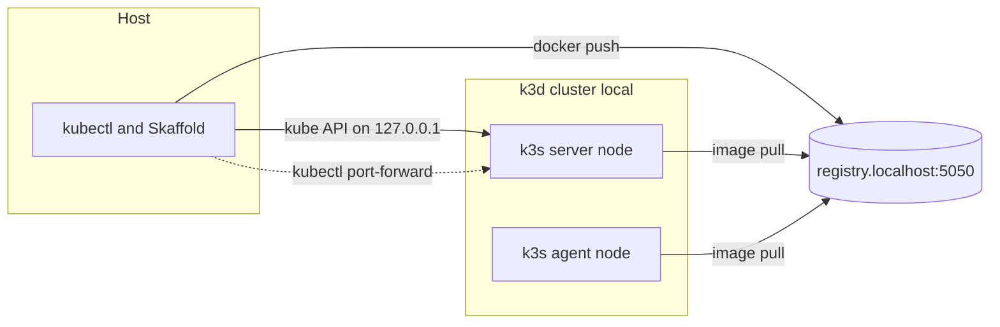
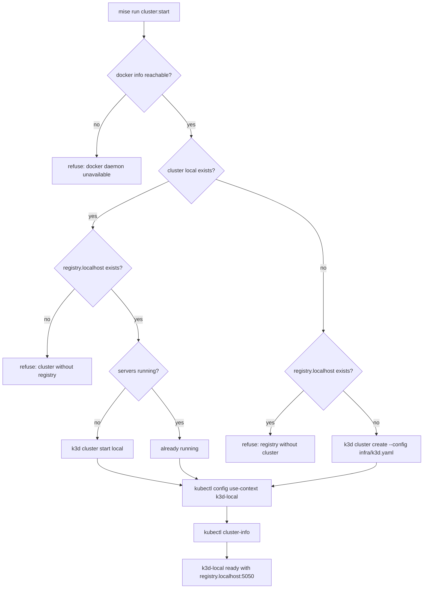

# 1.3. Kubernetes

## Why does an AgentOps course use Kubernetes?

Kubernetes makes workload identity, configuration, health, persistence, scheduling, and controlled rollout explicit and declarative. That is precisely the operational surface AgentOps has to observe and govern: an agent in production is a long-lived service that needs config injected, secrets kept out of the image, health probed, state persisted, and new versions rolled out without a hand edit on a box. Kubernetes gives each of those a first-class object instead of a shell script.

kagent adds an agent-specific custom resource (`Agent.kagent.dev`, referenced by name in `infra/skaffold.yaml`), while the underlying container stays runnable without the operator. The course uses Kubernetes only after the host-level agent, tests, and gateway concepts are clear. No cluster is created in Chapter 1; the runnable platform path begins in [Chapter 6](../6.%20Platform/6.2.%20Platform%20Install.md).

## Why use k3d locally?

[k3d](https://k3d.io/) runs lightweight k3s nodes inside containers. k3s is a certified, minimal Kubernetes distribution, so the same manifests, Helm charts, and Skaffold loop you would run on GKE run on a laptop with no cloud account. k3d is fast to create and delete and supports a local registry, which matches the image-push workflow used by Skaffold. The cluster is named `local`, producing the kubectl context `k3d-local`. The GKE overlay exists so the local and cloud paths differ only by a Kustomize overlay, not by tooling.

## What does `infra/k3d.yaml` actually declare?

The whole cluster shape lives in one tracked file. Every value teaches something, so read it before you run anything:

```yaml
apiVersion: k3d.io/v1alpha5
kind: Simple
metadata:
  name: local
servers: 1
agents: 1
image: docker.io/rancher/k3s:v1.35.5-k3s1
kubeAPI:
  hostIP: 127.0.0.1
registries:
  create:
    name: registry.localhost
    host: 127.0.0.1
    hostPort: "5050"
options:
  k3d:
    wait: true
    timeout: 120s
    disableLoadbalancer: true
  k3s:
    extraArgs:
      - arg: --disable=traefik,servicelb
        nodeFilters:
          - server:*
  kubeconfig:
    updateDefaultKubeconfig: true
    switchCurrentContext: true
```

See [`infra/k3d.yaml`](https://github.com/MLOps-Courses/agentops-open-course/blob/main/infra/k3d.yaml).

1. `metadata.name: local` names the cluster; k3d derives the `k3d-local` context from it.
1. `servers: 1` and `agents: 1` create two nodes — a control-plane server and a worker agent — not a single node. That is a real scheduling boundary: pods can land on either node and DaemonSets run on both, so you exercise multi-node behavior locally.
1. `image` pins the exact k3s version, so the Kubernetes API surface is reproducible across machines.
1. `kubeAPI.hostIP: 127.0.0.1` binds the API server to loopback only; the cluster is not reachable from off-box.
1. `registries.create` provisions a managed registry named `registry.localhost` on `127.0.0.1:5050`.
1. `wait: true` with `timeout: 120s` makes cluster creation block up to two minutes for readiness rather than returning early.
1. `disableLoadbalancer` plus `--disable=traefik,servicelb` strip the default ingress and load-balancer machinery — see the next question.
1. `updateDefaultKubeconfig` and `switchCurrentContext` write the new context into your default kubeconfig and switch to it — see the shared-cluster question for why that is a footgun.



There is deliberately no ingress node in that picture: the only path from the host to a Service is a temporary port-forward.

## Why are Traefik and the service load balancer disabled?

Three defaults are switched off at once: `disableLoadbalancer` drops k3d's proxy container, `--disable=servicelb` removes k3s's built-in ServiceLB controller, and `--disable=traefik` removes the ingress controller k3s installs by default. The consequence is that no `Service` is reachable from the host automatically — there is nothing publishing ports for you.

That is the point, not an oversight. agentgateway is this course's data plane; a default Traefik ingress would quietly become a second, unmanaged data plane sitting next to it, and a ServiceLB would hand out addresses you never asked for. Disabling all three forces every exposure in Chapter 6 to be explicit through `kubectl port-forward`, so you always know exactly what is published and through which layer.

## Why does the registry hostname matter?

The reference `registry.localhost:5050` is load-bearing because the same string must resolve from two different vantage points: the host side, where Skaffold and `docker push` upload images, and inside the cluster, where the kubelet on each node pulls them. k3d creates the registry container and wires its name into the nodes so `registry.localhost:5050` resolves identically on both sides; a plain `localhost:5050` would only work host-side, because inside a node `localhost` is the node itself. That single consistent reference is what lets Skaffold build, push, and deploy in one loop — `platform:dev` runs Skaffold with `SKAFFOLD_DEFAULT_REPO=registry.localhost:5050` for exactly this reason.

The hostname is stable enough that the docs linter (`scripts/check-docs.sh`) rejects any earlier spelling of it, so every page states it as `registry.localhost:5050` and never drifts.

## Which tools are required?

The root `mise.toml` pins the platform CLIs at exact versions: k3d 5.9.0, kubectl 1.36.2, Helm 4.2.3, Helmfile 1.7.0, Skaffold 2.23.0, Kustomize 5.8.1, kubeconform 0.8.0, kube-linter 0.8.3, and agentgateway 1.3.1. Two easy-to-miss requirements complete the set: `doctor:platform` also needs the Docker engine reachable and the Helm `helm-diff` plugin at 3.15.10 (installed by `mise run install`). Install the pinned binaries with `mise install`; use the container engine verified in [1.2](./1.2.%20Containers.md).

## How do you validate the platform prerequisites?

```bash
mise run doctor:platform
```

This checks the container engine, the pinned platform CLIs, the project virtualenvs, and the `helm-diff` plugin without applying a manifest or creating a cluster. The key detail is that it reports your current kubectl context but never fails on it:

```bash
context=$(kubectl config current-context 2>/dev/null || true)
if [[ ${context} == "k3d-local" ]]; then
	printf 'cluster    k3d-local selected\n'
elif [[ -n ${context} ]]; then
	printf 'cluster    %s selected; local tasks require k3d-local\n' "${context}"
else
	printf 'cluster    not created yet; run mise run cluster:start when needed\n'
fi
```

See [`scripts/doctor.sh`](https://github.com/MLOps-Courses/agentops-open-course/blob/main/scripts/doctor.sh). Because this block only prints, `doctor:platform` passes whether or not the `local` cluster exists — that is exactly how the "validate without creating a cluster" promise is implemented. It fails only on a missing tool, an unreachable Docker engine, a missing `helm-diff`, or a missing virtualenv.

## What does `mise run cluster:start` refuse to do?

`cluster:start` belongs to Chapter 6, but knowing its contract now tells you what the doctor was validating for. It is a reconciler, not a blind creator:

```bash
if jq -e 'any(.[]; .name == "local")' <<<"${clusters}" >/dev/null; then
	if ! jq -e 'any(.[]; .name == "registry.localhost")' <<<"${registries}" >/dev/null; then
		printf 'k3d: cluster local exists without registry.localhost; reconcile it before continuing\n' >&2
		exit 1
	fi
	if ! jq -e '.[] | select(.name == "local") | .serversRunning == .serversCount' <<<"${clusters}" >/dev/null; then
		k3d cluster start local
	fi
else
	if jq -e 'any(.[]; .name == "registry.localhost")' <<<"${registries}" >/dev/null; then
		printf 'k3d: registry.localhost exists without cluster local; reconcile it before continuing\n' >&2
		exit 1
	fi
	k3d cluster create --config infra/k3d.yaml
fi
```

See [`scripts/cluster-start.sh`](https://github.com/MLOps-Courses/agentops-open-course/blob/main/scripts/cluster-start.sh). It refuses rather than half-fixing a mismatched pair:

1. If `docker info` fails, it stops immediately with `docker: daemon is unavailable`.
1. If the `local` cluster exists but `registry.localhost` does not — or the registry exists without the cluster — it exits with `reconcile it before continuing`, leaving the decision to you.
1. If the cluster exists but its servers are stopped, it resumes with `k3d cluster start local`.
1. If neither exists, it creates the cluster from `infra/k3d.yaml`.

Only then does it run `kubectl config use-context k3d-local` and `kubectl cluster-info` and print `cluster: k3d-local is ready with registry.localhost:5050`.



## What can go wrong on a shared local cluster?

The repository treats `local` as a cluster that other local projects may also use, which has real consequences:

1. `cluster:start` is a reconciler: it never recreates or deletes an existing `local` cluster, and a drifted cluster/registry pair stops it with an explicit error so you resolve it deliberately.
1. `switchCurrentContext` in `infra/k3d.yaml`, plus the explicit `kubectl config use-context k3d-local` inside `cluster:start`, means creating or starting the cluster silently repoints your default kubectl context to `k3d-local`. If you had another cluster selected, check with `kubectl config current-context` before running anything destructive elsewhere.
1. Because the cluster is shared, course cleanup removes namespace workloads rather than deleting the cluster. The install and dev tasks hard-guard on the context first, so an accidental switch is annoying but never dangerous:

```bash
test "$(kubectl config current-context)" = k3d-local
```

Both `platform:install` and `platform:dev` in `mise.toml` begin with that line and refuse to run against any other context.

## What should you understand before Chapter 6?

1. The expected kubectl context will be `k3d-local`.
1. The registry will be `registry.localhost:5050`, resolvable both from the host push side and from inside the cluster's nodes.
1. There is no ingress controller or load balancer; learners expose Services only through temporary `kubectl port-forward`.
1. The `local` cluster is shared: `cluster:start` reconciles rather than recreates, and creating or starting it switches your current kubectl context.
1. Cluster creation, kagent installation, verification, and teardown all belong to [Chapter 6](../6.%20Platform/6.2.%20Platform%20Install.md).

## What is the Kubernetes setup checkpoint?

Continue when `mise run doctor:platform` passes and you can explain why no cluster has been created yet. Chapters 2-5 remain host-local; Chapter 6 is the first place where `mise run cluster:start` is part of the learner path.
