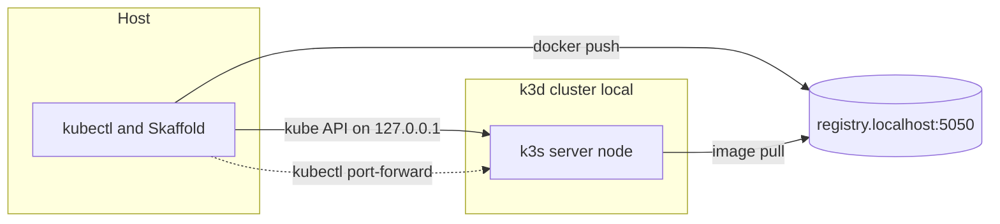

# 1.3. Kubernetes

!!! abstract "In one glance"

    - **You will:** Learn what the local k3d cluster will look like and prove the pinned Kubernetes tools are installed, without creating a cluster.
    - **You need:** [1.0. System](./1.0.%20System.md) finished; skip this page until Chapter 6 on the local model path.
    - **Time:** about 22 minutes, reference.

!!! tip "On the local model path? You can skip this page for now."

    Nothing on this page is required to run the reference agent on local Qwen3. The k3d cluster, registry, and pinned platform tools here only matter for the Chapter 6 Kubernetes deployment. Skip ahead now and return when you reach Chapter 6.

## How do you validate the platform prerequisites?

Install the optional platform tier, then validate it without creating a cluster:

```bash
mise run install:platform
mise run doctor:platform
```

A green run on a machine that has installed the tools but not yet created the cluster prints exactly six lines:

```text
platform   ready
env        .env available to explicit live/config tasks
docker     ready
cgroup     v2 ready
helm       helm-diff 3.15.10 ready
cluster    not created yet; run mise run cluster:start when needed
```

Two of those lines vary with your machine. If you have no `.env`, the second line instead reads `env        optional .env is absent`; once you reach Chapter 6 and start the cluster, the last line becomes `cluster    k3d-local selected`.

The check covers the container engine, cgroup v2, the pinned platform CLIs, the project virtualenvs, and the `helm-diff` plugin. It applies no **manifest** (a YAML file describing one Kubernetes object) and creates no cluster. It fails on exactly six things:

1. a missing pinned tool;
1. a missing project virtualenv;
1. a non-executable gateway wrapper (`infra/scripts/gateway-host.sh`);
1. an unreachable Docker engine (either `docker info` or `docker compose version`);
1. a cgroup v1 host, which Kubernetes 1.35 and later refuse;
1. a missing `helm-diff` plugin.

If it names a missing tool, re-run `mise run install:platform`.

The `cluster` line is the tell that the "validate without creating a cluster" promise held. It reports your **kubeconfig context** — the cluster-and-credentials pair `kubectl` currently talks to — and never fails on it, because the block producing that line only prints:

```bash
context=$(kubectl config current-context 2>/dev/null || true)
if [[ ${context} == "k3d-local" ]]; then
	printf 'cluster    k3d-local selected\n'
elif [[ -n ${context} ]]; then
	printf 'cluster    %s selected; local tasks require k3d-local\n' "${context}"
else
	printf 'cluster    not created yet; run mise run cluster:start when needed\n'
fi
```

See [`scripts/doctor.sh`](https://github.com/MLOps-Courses/agentops-open-course/blob/main/scripts/doctor.sh). `doctor:platform` therefore passes whether or not the `local` cluster exists — that is exactly how the "validate without creating a cluster" promise is implemented.

## Why does an AgentOps course use Kubernetes?

Today the agent runs in your terminal and stops when you close it. In Chapter 6 the same container runs as a **pod**: the smallest unit Kubernetes schedules.

Deleting that pod brings it straight back. Its configuration is injected from a manifest instead of being baked into the image, and its state lives on a volume that survives the replacement.

Kubernetes makes six things explicit and declarative: workload identity, configuration, health, persistence, scheduling, and controlled rollout. That is precisely the operational surface AgentOps has to observe and govern. An agent in production is a long-lived service that needs:

1. its config injected;
1. its secrets kept out of the image;
1. its health probed;
1. its state persisted;
1. new versions rolled out without a hand edit on a box.

Kubernetes gives each of those a first-class object instead of a shell script.

[kagent](../0.%20Overview/0.7.%20Glossary.md#kagent) adds an agent-specific **custom resource**, a new object type an add-on registers with the Kubernetes API. It is named `Agent.kagent.dev` and referenced by name in `infra/skaffold.yaml`, while the underlying container stays runnable without the operator.

The course uses Kubernetes only after the host-level agent, tests, and gateway concepts are clear. No cluster is created in Chapter 1; the runnable platform path begins in [Chapter 6](../6.%20Platform/index.md).

## Why use k3d locally?

[k3d](https://k3d.io/) runs lightweight k3s nodes inside containers. k3s is a certified, minimal Kubernetes distribution, so the same manifests, Helm charts, and Skaffold loop you would run on GKE run on a laptop with no cloud account. Helm, Skaffold, and the rest of the pinned tools are glossed in the table under **Which tools are required?** below.

k3d is fast to create and delete and supports a local **registry**: the server that stores container images and hands them out on pull. That matches the image-push workflow used by Skaffold.

The cluster is named `local`, producing the kubectl context `k3d-local`. The GKE overlay exists so the local and cloud paths differ only by a Kustomize **overlay** — a per-environment patch layered over one shared set of manifests — not by tooling.

## What does `infra/k3d.yaml` actually declare?

The whole cluster shape lives in one tracked file. Four of its values are the ones this page and Chapter 6 keep coming back to:

1. `metadata.name: local` names the cluster; k3d derives the `k3d-local` context from it.
1. `registries.create` provisions a managed registry named `registry.localhost` on `127.0.0.1:5050`.
1. `disableLoadbalancer` plus `--disable=traefik,servicelb` strip the default ingress and load-balancer machinery — see the next question.
1. `updateDefaultKubeconfig` and `switchCurrentContext` write the new context into your default kubeconfig and switch to it — see the shared-cluster question for why that is a footgun.


```mermaid
flowchart LR
    subgraph Host
        CLI["kubectl and Skaffold"]
    end
    subgraph Cluster["k3d cluster local"]
        SRV["k3s server node"]
    end
    REG[("registry.localhost:5050")]
    CLI -->|"kube API on 127.0.0.1"| SRV
    CLI -->|"docker push"| REG
    SRV -->|"image pull"| REG
    CLI -.->|"kubectl port-forward"| SRV
```

**Diagram in words:** The host CLI reaches one k3s server through a loopback API, pushes images to the local registry, and opens only temporary port-forwards. The server pulls those images; no worker, ingress, or load-balancer node exists.

A **Service** is the stable in-cluster address Kubernetes gives a set of pods. The only path from your host to one is a temporary `kubectl port-forward`, which tunnels a local port into the cluster.

[`infra/k3d.yaml`](https://github.com/MLOps-Courses/agentops-open-course/blob/main/infra/k3d.yaml) is the complete source. It also pins the k3s tag and manifest digest, creates one server with no worker, binds the API to loopback, and waits up to 120 seconds for readiness.

## Why are Traefik and the service load balancer disabled?

Nothing in the cluster is reachable from your laptop by default. That is deliberate: every exposure in Chapter 6 has to be an explicit `kubectl port-forward`, so you always know what is published and through which layer.

??? note "Deeper: which three defaults are switched off"

    Three defaults are switched off at once: `disableLoadbalancer` drops k3d's proxy container, `--disable=servicelb` removes k3s's built-in ServiceLB controller, and `--disable=traefik` removes the ingress controller k3s installs by default. The consequence is that no `Service` is reachable from the host automatically — there is nothing publishing ports for you.

    That is the point, not an oversight. agentgateway is this course's data plane; a default Traefik ingress would quietly become a second, unmanaged data plane sitting next to it, and a ServiceLB would hand out addresses you never asked for. Disabling all three forces every exposure in Chapter 6 to be explicit through `kubectl port-forward`, so you always know exactly what is published and through which layer.

## Why does the registry hostname matter?

`registry.localhost:5050` must mean the same registry from two places: your laptop and the cluster's nodes. k3d wires both sides so that one string works from either.

??? note "Deeper: why `localhost:5050` would not work"

    The reference `registry.localhost:5050` is load-bearing because the same string must resolve from two different vantage points: the host side, where Skaffold and `docker push` upload images, and inside the cluster, where the kubelet on each node pulls them. k3d creates the registry container and wires its name into the nodes so `registry.localhost:5050` resolves identically on both sides; a plain `localhost:5050` would only work host-side, because inside a node `localhost` is the node itself. That single consistent reference is what lets Skaffold build, push, and deploy in one loop — `platform:dev` runs Skaffold with `SKAFFOLD_DEFAULT_REPO=registry.localhost:5050` for exactly this reason.

    The hostname is stable enough that the docs linter (`scripts/check_conventions.py`) rejects any earlier spelling of it, so every page states it as `registry.localhost:5050` and never drifts.

## Which tools are required?

`mise run install:platform` provides every tool below at the exact version the root `mise.toml` pins.

| Tool         | Version | What it does here                                                      |
| ------------ | ------- | ---------------------------------------------------------------------- |
| k3d          | 5.9.0   | Runs the k3s cluster nodes as containers on your machine.              |
| kubectl      | 1.36.3  | Talks to Kubernetes and renders both overlays with built-in Kustomize. |
| Helm         | 4.2.3   | Installs packaged bundles of manifests, called charts.                 |
| Helmfile     | 1.7.1   | Declares the whole set of Helm releases in one file and applies it.    |
| Skaffold     | 2.24.0  | Builds, pushes, and redeploys the image in one loop while you edit.    |
| kubeconform  | 0.8.0   | Validates a rendered manifest against the Kubernetes schema.           |
| kube-linter  | 0.8.3   | Flags insecure or unreliable settings in a rendered manifest.          |
| agentgateway | 1.4.1   | The Chapter 5 gateway binary, also used to validate gateway configs.   |

Three easy-to-miss requirements complete the set: `doctor:platform` also needs the Docker engine reachable, a cgroup v2 host, and the Helm `helm-diff` plugin at 3.15.10 (installed by `mise run install:platform`). Use the container engine verified in [1.2. Containers](./1.2.%20Containers.md).

## What does `mise run cluster:start` refuse to do?

`cluster:start` belongs to Chapter 6, but knowing its contract now tells you what the doctor was validating for. It is a **reconciler**: it brings an existing cluster to the wanted state instead of recreating it. When the cluster and its registry are out of sync, it refuses to proceed rather than half-fixing the pair.

??? note "Deeper: the cluster:start reconciler, step by step"

    It is a reconciler, not a blind creator:

    ```bash
    if jq -e 'any(.[]; .name == "local")' <<<"${clusters}" >/dev/null; then
    	if ! jq -e 'any(.[]; .name == "registry.localhost")' <<<"${registries}" >/dev/null; then
    		printf 'k3d: cluster local exists without registry.localhost; reconcile it before continuing\n' >&2
    		exit 1
    	fi
    	if ! jq -e '.[] | select(.name == "local") | .serversRunning == .serversCount' <<<"${clusters}" >/dev/null; then
    		k3d cluster start local
    	fi
    else
    	if jq -e 'any(.[]; .name == "registry.localhost")' <<<"${registries}" >/dev/null; then
    		printf 'k3d: registry.localhost exists without cluster local; reconcile it before continuing\n' >&2
    		exit 1
    	fi
    	k3d cluster create --config infra/k3d.yaml
    fi
    ```

    See [`scripts/cluster-start.sh`](https://github.com/MLOps-Courses/agentops-open-course/blob/main/scripts/cluster-start.sh). It refuses rather than half-fixing a mismatched pair:

    1. If `docker info` fails, it stops immediately with `docker: daemon is unavailable`.
    1. If the `local` cluster exists but `registry.localhost` does not — or the registry exists without the cluster — it exits with `reconcile it before continuing`, leaving the decision to you.
    1. If the cluster exists but its servers are stopped, it resumes with `k3d cluster start local`.
    1. If neither exists, it creates the cluster from `infra/k3d.yaml`.

    Only then does it run `kubectl config use-context k3d-local` and `kubectl cluster-info` and print `cluster: k3d-local is ready with registry.localhost:5050`.

    ```mermaid
    flowchart TD
        A["mise run cluster:start"] --> B{"docker info reachable?"}
        B -- no --> B1["refuse: docker daemon unavailable"]
        B -- yes --> C{"cluster local exists?"}
        C -- yes --> D{"registry.localhost exists?"}
        D -- no --> D1["refuse: cluster without registry"]
        D -- yes --> E{"servers running?"}
        E -- no --> E1["k3d cluster start local"]
        E -- yes --> F["already running"]
        C -- no --> G{"registry.localhost exists?"}
        G -- yes --> G1["refuse: registry without cluster"]
        G -- no --> H["k3d cluster create --config infra/k3d.yaml"]
        E1 --> Z["kubectl config use-context k3d-local"]
        F --> Z
        H --> Z
        Z --> Y["kubectl cluster-info"]
        Y --> X["k3d-local ready with registry.localhost:5050"]
    ```

## What can go wrong on a shared local cluster?

The repository treats `local` as a cluster that other local projects may also use, which has real consequences:

1. `cluster:start` is a reconciler: it never recreates or deletes an existing `local` cluster, and a drifted cluster/registry pair stops it with an explicit error so you resolve it deliberately.
1. `switchCurrentContext` in `infra/k3d.yaml`, plus the explicit `kubectl config use-context k3d-local` inside `cluster:start`, means creating or starting the cluster silently repoints your default kubectl context to `k3d-local`. If you had another cluster selected, check with `kubectl config current-context` before running anything destructive elsewhere.
1. Because the cluster is shared, course cleanup removes namespace workloads rather than deleting the cluster. The install and dev tasks hard-guard on the context first, so an accidental switch is annoying but never dangerous:

```bash
test "$(kubectl config current-context)" = k3d-local
```

Both `platform:install` and `platform:dev` in `mise.toml` begin with that line and refuse to run against any other context.

## What should you understand before Chapter 6?

Five facts from this page carry into the platform chapter:

1. The expected kubectl context will be `k3d-local`.
1. The registry will be `registry.localhost:5050`, resolvable both from the host push side and from inside the cluster's nodes.
1. There is no ingress controller or load balancer; learners expose Services only through temporary `kubectl port-forward`.
1. The `local` cluster is shared: `cluster:start` reconciles rather than recreates, and creating or starting it switches your current kubectl context.
1. Cluster creation, kagent installation, verification, and teardown all belong to [6.2. Platform Install](../6.%20Platform/6.2.%20Platform%20Install.md).

## What proves this page worked?

This is a Chapter 6 gate, not a Setup blocker. On the local model path you can move on now and come back when the platform is introduced.

```bash
mise run doctor:platform
```

When you reach Chapter 6, continue once that command passes and you can explain why no cluster has been created yet. Chapters 2-5 remain host-local; Chapter 6 is the first place where `mise run cluster:start` is part of the learner path.

**You are done when:**

- `mise run doctor:platform` exits successfully and its first line reads `platform   ready`.
- Its last `cluster` line never fails the run: it reads `not created yet; run mise run cluster:start when needed` only when `kubectl` has no current context, and otherwise names the context you already had (`k3d-local selected`, or `<context> selected; local tasks require k3d-local`).
- `kubectl config current-context` still shows whatever it showed before you opened this page.
- You can say why the course pushes to `registry.localhost:5050` rather than `localhost:5050`.

Return to [6.1. Containers](../6.%20Platform/6.1.%20Containers.md) when `mise run doctor:platform` passes. The required local-model path reaches [1.4. Providers](./1.4.%20Providers.md) before this deferred page.
