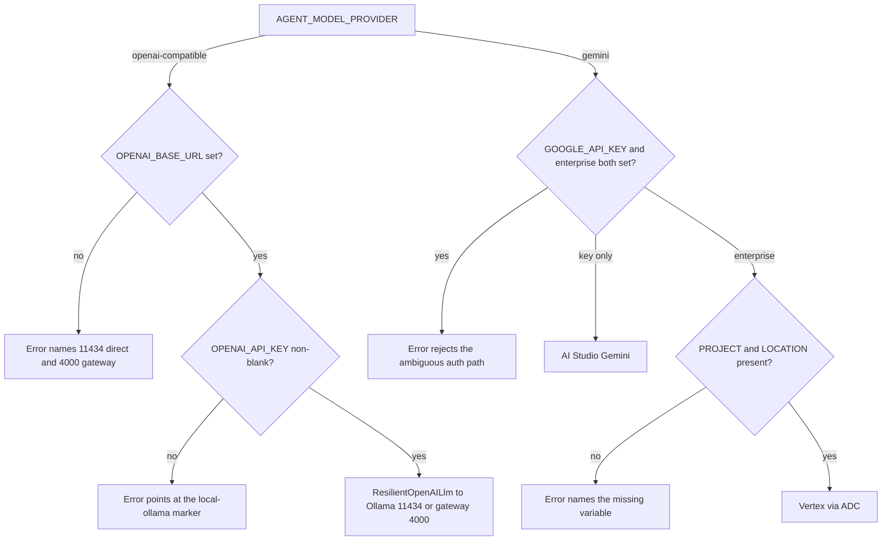
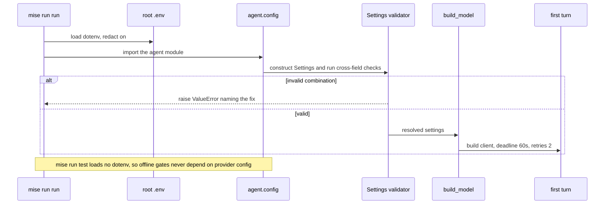

# 1.4. Providers

## Do you need provider credentials now?

No. Run `mise run check:core` and `mise run test` before configuring a model. These gates exercise tools, state, security callbacks, MCP, A2A construction, and adversarial cases without sending data to a provider or requiring the Chapter 5 container engine — and, deliberately, without loading any `.env`, so provider configuration can never make an offline gate pass or fail.

You need a model only for interactive `run`/`web`, the persistent A2A server, live ADK evaluation, and the later gateway lab. The required path — local Qwen3 on Ollama — needs no account, no mandatory SaaS, and no provider credential.

## Which environment variables select a provider?

One enum picks the branch; a handful of provider fields configure it. `agents/python/src/agent/config.py` parses them once into typed `Settings`, so the defaults below are the real defaults the runtime uses, not prose that can drift:

```python
--8<-- "agents/python/src/agent/config.py:settings-provider-fields"
```

Read off the contract:

- `AGENT_MODEL_PROVIDER` is a two-value enum — `openai-compatible` (the default) or `gemini`. It selects the ADK client; every other provider field is consulted only on its own branch.
- The `openai-compatible` branch reads `OPENAI_BASE_URL` (default `http://127.0.0.1:11434/v1`, direct Ollama) and `OPENAI_API_KEY` (default the non-secret marker `local-ollama`).
- The `gemini` branch reads either `GOOGLE_API_KEY` (AI Studio) or `GOOGLE_GENAI_USE_ENTERPRISE=true` with `GOOGLE_CLOUD_PROJECT` and `GOOGLE_CLOUD_LOCATION` (Vertex via Application Default Credentials).

The whole page is that one two-branch, four-leaf decision:



Each error box is a real message from the validator two sections below; each leaf is a real branch of `build_model` in `model.py`.

## How do you configure local Qwen3?

The fields above already default to this path, so configuration is one install and one pull, not four variables to type. Install Ollama from its supported distribution, then pull the Apache-2.0 open-weight model:

```bash
ollama pull qwen3:4b-instruct
ollama list
```

Then verify the path the way CI does:

```bash
mise run doctor:model
```

`doctor:model` is a stronger check than `ollama list`: `scripts/doctor.sh` requires the `ollama` binary and then probes `http://127.0.0.1:11434/api/tags` with `jq`, failing unless a served model name starts with `qwen3:4b-instruct`. It therefore catches a stopped daemon and a never-pulled model, not just a missing CLI. `local-ollama` is a non-secret marker that satisfies the OpenAI client contract; it is not an Ollama credential. Chapter 5 changes only `OPENAI_BASE_URL` to `http://127.0.0.1:4000/v1` once the gateway is running.

## How do you configure native Gemini?

This path is optional and needs a Google account. Create a gitignored root `.env` from the annotated template and add only the variables for your chosen authentication method:

```bash
cp .env.example .env
chmod 600 .env
```

For an AI Studio (Gemini API) key, override the two defaults and add the key:

```bash
AGENT_MODEL_PROVIDER=gemini
AGENT_MODEL=gemini-3.5-flash
GOOGLE_API_KEY=replace-me
```

For Vertex AI with Application Default Credentials on your workstation, use enterprise mode with an explicit project and location instead of a key:

```bash
gcloud auth application-default login
AGENT_MODEL_PROVIDER=gemini
AGENT_MODEL=gemini-3.5-flash
GOOGLE_GENAI_USE_ENTERPRISE=true
GOOGLE_CLOUD_PROJECT=agentops-open-course
GOOGLE_CLOUD_LOCATION=global
```

Verify the enterprise path with `mise run doctor:gcp` before using it. That profile checks far more than the CLI being installed: on top of the full platform toolchain, it requires an active project (`gcloud config get-value project` returns a value) and working ADC (`gcloud auth application-default print-access-token` succeeds). The GKE overlay uses Workload Identity Federation and stores no service-account key.

## Why is the provider called `openai-compatible` instead of `ollama`?

Because the name describes the ADK client contract, not the deployment topology — as `config.py` comments inline where the field is declared. The `openai-compatible` branch builds an OpenAI-protocol client, and whatever speaks that protocol at `OPENAI_BASE_URL` serves it. That is why the one Chapter 5 change is a URL, not a provider:

- `OPENAI_BASE_URL=http://127.0.0.1:11434/v1` points at Ollama directly.
- `OPENAI_BASE_URL=http://127.0.0.1:4000/v1` points at the agentgateway model route, which then owns policy and telemetry in front of the same Ollama.

The application-side `AGENT_MODEL_PROVIDER` never changes across that switch. `build_model` states the same intent: `OPENAI_BASE_URL` chooses direct Ollama or an agentgateway route "without changing application code". Naming the field `ollama` would have baked one topology into a contract that deliberately outlives it.

## What combinations does the validator reject, and why in one message?

Cross-field validation runs at construction, so a bad combination fails at startup with a message that names the fix instead of surfacing as a stack trace deep in a turn:

```python
--8<-- "agents/python/src/agent/config.py:settings-provider-validation"
```

What that rejects, and why each message earns its length:

- **`openai-compatible` with no `OPENAI_BASE_URL`** names both correct values in one line: `http://127.0.0.1:11434/v1` for direct Ollama or `http://127.0.0.1:4000/v1` for the gateway route. You never have to guess the port.
- **`openai-compatible` with a blank `OPENAI_API_KEY`** explains that Ollama and the open local gateway still need a non-empty marker such as `local-ollama` — the OpenAI SDK refuses an empty key even when nothing authenticates it.
- **`gemini` with both `GOOGLE_API_KEY` and `GOOGLE_GENAI_USE_ENTERPRISE=true`** is rejected rather than silently preferring one, so an ambiguous auth intent becomes a failure instead of a guess.
- **`gemini` enterprise mode missing project or location** names each absent variable individually (`GOOGLE_CLOUD_PROJECT` and/or `GOOGLE_CLOUD_LOCATION`), so you fix exactly what is missing.
- **A removed `AGENT_GATEWAY_ENABLED`** produces a migration error instead of being ignored, pointing you at the `OPENAI_BASE_URL` switch that replaced it.

The checks append to a list and raise together, so one run surfaces every problem at once instead of one failure per restart. `mise run config:check` runs exactly this path and prints the resolved settings with secrets masked.

## What deadline and retry policy does each provider get?

Neither branch accepts SDK defaults for timeouts and retries; both map the same three resilience settings (`AGENT_MODEL_TIMEOUT_S`, `AGENT_MAX_RETRIES`, `AGENT_RETRY_BACKOFF_S`) onto their client. For `openai-compatible`, `ResilientOpenAILlm` builds the client explicitly instead of mutating process-wide environment state:

```python
@cached_property
def _openai_client(self) -> AsyncOpenAI:
    return AsyncOpenAI(
        base_url=self.openai_base_url,
        api_key=self.openai_api_key.get_secret_value(),
        timeout=self.timeout_s,
        max_retries=self.retries,
    )
```

For `gemini`, the same settings become a google-genai retry policy plus a per-request HTTP deadline expressed in milliseconds:

```python
def _retry_options() -> types.HttpRetryOptions:
    """Map the course retry settings onto the google-genai retry policy."""
    return types.HttpRetryOptions(
        attempts=settings.max_retries + 1,
        initial_delay=settings.retry_backoff_s,
        max_delay=min(settings.retry_backoff_s * (2**settings.max_retries), 30.0),
    )
```

The Gemini `HttpOptions` deadline is `max(1, round(settings.model_timeout_s * 1000))` — seconds converted to the milliseconds that API expects. See [`model.py`](https://github.com/MLOps-Courses/agentops-open-course/blob/main/agents/python/src/agent/model.py). With the defaults (`AGENT_MODEL_TIMEOUT_S=60`, `AGENT_MAX_RETRIES=2`, `AGENT_RETRY_BACKOFF_S=0.5`):

| Aspect               | `openai-compatible`                       | `gemini`                                         |
| -------------------- | ----------------------------------------- | ------------------------------------------------ |
| Per-request deadline | `timeout=60.0` seconds on `AsyncOpenAI`   | `HttpOptions(timeout=60000)` milliseconds        |
| Attempts             | `max_retries=2` transient retries         | `attempts=3` (`max_retries + 1`)                 |
| Backoff              | OpenAI SDK's built-in exponential backoff | `initial_delay=0.5`, `max_delay=min(0.5·2², 30)` |

Guarded write actions are never retried; this policy covers idempotent model calls only ([4.5](../4.%20Quality/4.5.%20Guardrails.md)).

## How does configuration fail fast?

`config.py` ends with `settings = Settings()` at module scope. Importing anything from the config module therefore constructs the settings — and runs the cross-field validator — before the agent handles a single turn. A bad provider combination raises at import, so the process never starts serving with a configuration that would only explode mid-conversation:



`agents/python/src/agent/config_check.py` reuses this exact path: `mise run config:check` constructs `Settings()`, prints the resolved values with secrets masked, and exits non-zero with the validation errors — the same failure that `run`, `web`, and the A2A server would hit, but without starting a model.

## Where do these variables have to live to take effect?

In the repository-root `.env`. Agent tasks run from `agents/python`, and the model-backed ones load `../../.env` — that relative path is why the file lives at the repository root, not beside the Python code. `agents/python/mise.toml` loads it for exactly the tasks that need a model: `config:check`, `run`, `web`, `a2a`, and the `eval*` family, each with `redact = true`. The offline gates — `install`, `check`, `test`, `redteam`, `eval:validate`, and the stdio `mcp` server — load no dotenv at all. That split is deliberate: provider configuration can never change whether the deterministic suite passes.

Exporting the same variables in your shell also reaches `Settings()`, because pydantic reads the process environment. But you then lose the single documented source, the secret redaction, and the guarantee that only model-backed tasks see the values. Keep provider configuration in the root `.env` and validate it with `mise run config:check`.

## How do you protect model data and credentials?

The repository gives each of these a concrete mechanism, not just advice:

- Keep `.env` out of Git and restrict its permissions (`chmod 600`). The `secure` task's Trivy scan is told `--skip-files .env`, so a local secret file never trips the gate — and never becomes a reason to weaken the scan.
- `config:check` and the mise dotenv loader both redact secrets: `SecretStr` fields print as `**********`, and the loader runs with `redact = true`, so a resolved-config dump or task log never echoes a key.
- Never bake credentials into an image, ConfigMap, command example, trace, or screenshot.
- Leave ADK/GenAI message-content capture disabled (`ADK_CAPTURE_MESSAGE_CONTENT_IN_SPANS=false`, its default) unless you have reviewed the data policy.
- Route cloud workloads through identity federation instead of long-lived service-account keys; the GKE overlay uses Workload Identity and stores no key.
- Treat model prompts and tool output as potentially sensitive even in a fictional exercise.

## What is the provider checkpoint?

Choose one path, then stop after a single read-only prompt:

```bash
# Local path
mise run doctor:model
(cd agents/python && mise run run)

# Optional Gemini path, after configuring .env
(cd agents/python && mise run run)
```

For either provider, stop the CLI after a simple read-only prompt such as `List open incidents`. Do not test a write action until Chapter 4 explains approval and audit behavior.
