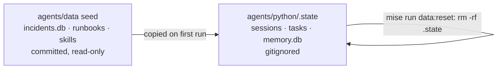
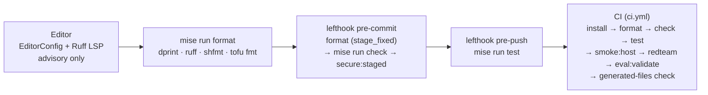

# 1.5. Workspace

## What defines the workspace contract?

A reproducible project is one where every actor — you, a coding agent, a git hook, and CI — runs the _same_ commands against the _same_ pinned inputs. This repository encodes that as a small set of files, not a wiki page:

- `README.md` gives people the project outcome and quickstart.
- `AGENTS.md` gives coding agents layout, conventions, and validation rules.
- `mise.toml` defines the task vocabulary (`install`, `format`, `check`, `test`, ...) used locally, by hooks, and in CI.
- `uv.lock` and `mise.lock` pin resolved Python packages and CLI tools to exact versions.
- `dprint.json`, Ruff, ty, pytest, kubeconform, and the security tools enforce the boundary.

There is deliberately no second CI script that re-implements the checks. `.github/workflows/ci.yml` runs `mise run install`, `format`, `check`, `test`, and `smoke:host` — the identical tasks a hook and a human invoke. When those commands live in one place, a green run on your laptop means the same thing as a green run on the merge gate; there is no drift surface between them.

The pins are not honor-system either. Root `mise run check:format` runs `dprint check`, which fails on any unformatted config or Markdown file; the lockfile drift check is separate — `uv lock --check` (which fails if `pyproject.toml` drifted from `uv.lock`) lives in the agent's own `check:format` and reaches CI through `check` → `check:core` → `check:python`, not through the root `check:format`. CI ends with `test -z "$(git status --porcelain)"`. That last line is why an empty `git status --short` is a real gate and not a ritual: a regenerated lockfile or a reformatted file you forgot to stage leaves the tree dirty and fails the build.

The repository is the source of truth. Do not copy course snippets into a separate directory and lose the lockfiles, seed data, or task configuration.

## How do you prepare a fresh clone?

```bash
git clone https://github.com/MLOps-Courses/agentops-open-course.git
cd agentops-open-course
mise install
mise run install
git status --short
```

`mise install` provisions the pinned `[tools]` from `mise.toml` (`run_auto_install = false` keeps a missing tool a hard failure instead of a silent background install). `mise run install` then runs a five-step sequence: `uv sync --locked` for the docs project, the same for the MLflow environment, the helm-diff plugin, `lefthook install`, and finally the agent's own `mise run install`. The fourth step is what wires the git hooks into `.git/hooks`; skip `mise run install` and no hook will ever fire, which is the single most common reason a contributor's checks pass locally but fail in CI.

The final `git status --short` should be empty. Generated `.venv`, `.state`, site output, coverage, and secret files are ignored rather than committed.

## What is generated and must never be committed?

The tree separates two kinds of state, and the whole course depends on the boundary. Committed inputs are immutable: `agents/data/incidents.db`, the runbooks, logs, and Agent Skills are read-only seed the agent consumes but never writes back. Runtime state is disposable: sessions, tasks, and the memory database the agent creates while running are copied under `agents/python/.state`, which `.gitignore` excludes. Approving a mock `restart_service` writes to `.state`, never to the seed, so a live experiment can never dirty the dataset the tests and evals assume.



`mise run data:reset` is literally `rm -rf .state`; the next run rebuilds the runtime store from the seed, giving you a clean slate without touching version control. The same reasoning covers the rest of `.gitignore`: the Zensical `site/` output, `.coverage`/`htmlcov`, ADK eval history under `.adk/`, the MLflow `mlflow.db`/`mlruns/`, the demo TLS/JWT material under `infra/agentgateway/host/auth/`, and any SOPS age keys. All of it is regenerable from committed sources, so it stays out of the tree and `git status --short` stays empty.

## Which editor should you use?

Whichever one you are fastest in. Any editor that respects EditorConfig and can run terminal commands works: [Visual Studio Code](https://code.visualstudio.com/), [Antigravity](https://antigravity.google/), [Zed](https://zed.dev/), Neovim, Helix, Emacs, and [VSCodium](https://vscodium.com/) — a community build of the VS Code sources — are all fine, proprietary or not.

Your editor is a personal tool, not a production dependency: it never appears in a lockfile, an image, or a deployment, so it cannot affect whether someone else can reproduce your results. That is why the course pins the runtime stack precisely and stays silent about your desktop. See [0.5. Resources](../0.%20Overview/0.5.%20Resources.md) for the same reasoning applied to coding assistants.

Useful integrations are Python language support, Ruff formatting/linting, TOML/YAML schemas, and an EditorConfig client. Treat them as conveniences: `mise run format` and `mise run check` are the authority, so a correctly configured editor only tells you sooner what the gates would tell you anyway.

## How should a coding agent use AGENTS.md?

The root `AGENTS.md` explains the repository shape, the docs/source synchronization rule, OSS constraints, commands, and definition of done. A tool should treat it as project guidance, not permission to expose secrets or bypass user approval.

Its most load-bearing section for an agent is "Pinned contracts": the machine-readable answer to "which version?" that an agent must respect instead of inventing one. It records that the Google ADK compatible range starts at `2.4.0` (with `uv.lock` exact), agentgateway is `1.3.1`, the kagent Helm charts are `0.9.11` with `v1alpha2` resources, MLflow is `3.14.0`, the OpenTelemetry Collector contrib image is `0.156.0` by digest, and Python is `3.13`. The same section fixes the network contract (MCP `:3000`, A2A `:3001`, model `:4000`, and so on). Point an agent at that list before it edits a manifest, and a hallucinated tag becomes a lookup instead of a guess.

When an agent proposes a change, review the diff and run the same checks you would require from a person. Generated code has no exemption from tests, licensing, or security review.

## How do you validate the agent configuration?

Copy the annotated `.env.example` to `.env` at the repository root — every variable documents its purpose, default, and which learning path needs it. Then resolve and validate the combination:

```bash
mise run config:check
```

Only configuration and model-backed tasks load that `.env`: `config:check`, `run`, `web`, `a2a`, and the model-backed eval tasks (`eval`, `eval:report`, `eval:mlflow`, `eval:retrieval`) declare `env = { _.file = { path = "../../.env" } }`, while `install`, `check`, `test`, `format`, and the offline `eval:validate` inherit nothing from it. That split is a frequent surprise — setting a variable in `.env` and expecting `mise run test` to observe it will not work, because the offline gate is deliberately dotenv-free so its result never depends on your local secrets.

The check reports invalid combinations with errors that name the fix. For example, an `openai-compatible` provider without `OPENAI_BASE_URL` tells you to choose direct Ollama in Chapters 2-4 or agentgateway in Chapter 5. Re-run it whenever the agent fails at startup after an environment change.

## What does `config:check` print, and what does it hide?

On success it prints `Agent configuration is valid. Resolved settings (secrets masked):` followed by every field, sorted, one per line. Any `SecretStr` — `OPENAI_API_KEY`, `GOOGLE_API_KEY`, `AGENT_MCP_TOKEN` — renders as `**********`, so you can paste the output into an issue without leaking a key:

```python
print("Agent configuration is valid. Resolved settings (secrets masked):")
for name, value in sorted(resolved.model_dump().items()):
    masked = "**********" if isinstance(value, SecretStr) else value
    print(f"- {name} = {masked}")
```

An illustrative head of that output for the account-free default (path fields resolve inside the repository and are omitted here):

```text
Agent configuration is valid. Resolved settings (secrets masked):
- max_retries = 2
- model = qwen3:4b-instruct
- model_provider = openai-compatible
- openai_api_key = **********
- openai_base_url = http://127.0.0.1:11434/v1
- sanitize_tool_output = True
```

On failure it prints `Agent configuration is invalid:` to stderr, one `- <message>` line per problem, and exits `1`, so a hook or CI step fails loudly. See [`config_check.py`](https://github.com/MLOps-Courses/agentops-open-course/blob/main/agents/python/src/agent/config_check.py).

What makes the output trustworthy is that the task does not re-describe the configuration — it constructs the real thing. Importing `agent.config` builds the module-level `Settings()`, the identical fail-fast construction `adk run`, the A2A server, and the MCP server all perform at startup. The check therefore cannot drift from what the runtime will actually load. The root `config:check` task simply delegates (`cd agents/python && mise run config:check`), which is why the command runs the same from either the repository root or `agents/python`.

## What do the Git hooks enforce?

Lefthook keeps the hooks thin: every command delegates to a `mise run` task, so there is one implementation instead of shell logic duplicated between hooks and CI. The whole configuration fits on a screen:

```yaml
pre-commit:
  parallel: false # formatters must restage before check reads the files
  commands:
    format-dprint:
      glob: "*.{json,md,toml,yaml,yml}"
      run: mise run format:dprint {staged_files}
      stage_fixed: true
    format-python:
      glob: "**/*.py"
      run: mise run format:python
      stage_fixed: true
    check:
      run: mise run check
    secure:
      run: mise run secure:staged
pre-push:
  commands:
    test:
      run: mise run test
```

Reading it top to bottom: on commit, `format-dprint` reformats staged config/Markdown files and `format-python` reformats Python, both with `stage_fixed: true` so the reformatted result is re-added to the index; then `check` runs the full static gate; then `secure` runs `gitleaks git --staged` plus a Trivy config scan on the staged changes. On push, `test` runs the offline suite before anything leaves your machine.

The `parallel: false` comment is the non-obvious "why" worth internalizing: the formatters must finish and restage before `check` reads the files, otherwise `check` could inspect the pre-format version and either pass stale content or fail on formatting the hook is about to fix. Serial execution makes the format→restage→check order deterministic. This is also why skipping `mise run install` (whose fourth step is `lefthook install`) silently disables all of it — an uninstalled hook enforces nothing.

## Why do the hooks run the maintainer gate?

The `check` command above is the full `mise run check`, which is `check:core` _plus_ `check:infra` — not the Docker-free `check:core` the learner path uses. `check:infra` renders both Kubernetes overlays through kustomize, validates them with kubeconform and kube-linter, lints the helmfile, checks the Compose file with `docker compose config`, and validates the OpenTofu module. That work needs the container and cluster tooling you install from Chapter 5 onward.

The consequence is worth stating plainly: the hooks are the _contributor_ gate, calibrated for someone with the whole toolchain installed. The taught learner path through Chapters 2-4 is read-and-run, not commit — you exercise the agent and run `mise run check:core` directly (see the checkpoint below), which stays offline and container-free. If you commit a docs typo before installing the Chapter 5 runtime, the pre-commit `check` will fail on the infra sub-gate, which is expected, not a bug. Install the toolchain first, or scope your early work to running rather than committing.

## Which gate runs at which moment?

The same checks fire at five widening scopes, each cheaper and faster than the next but each less authoritative:



Your editor previews problems but decides nothing: `mise run format` is the authority, and an editor that does not honor EditorConfig or dprint will fight it, producing formatting churn that only surfaces when the pre-commit `stage_fixed` step rewrites your file or when `dprint check` fails in CI. Configure the EditorConfig and Ruff integrations, or accept that `mise run format` will overwrite your local style.

Both the pre-commit `check` and the CI `check` run the full `mise run check`, whose `check:infra` sub-gate needs the container and cluster tooling; CI additionally runs `smoke:host`, the red-team suite, the evalset validation, and the generated-files check. Everything left of the hooks is optional convenience; the hooks and CI are where the contract is actually enforced.

## What is the chapter checkpoint?

From the repository root:

```bash
mise run format
mise run check:core
mise run test
git status --short
```

Review any formatting edits, confirm all gates pass without warnings, and ensure only intentional files appear in Git status. This core gate deliberately avoids Docker; the complete `mise run check` infrastructure gate becomes part of the checkpoint after you install the Chapter 5 container runtime. You are then ready to run and inspect the reference agent in [Chapter 2](../2.%20Agents/).
