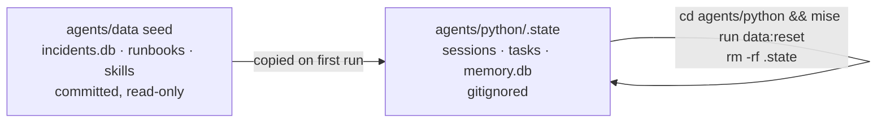
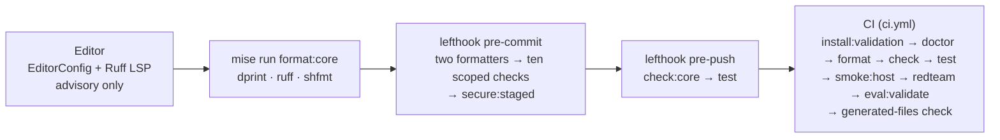

# 1.5. Workspace

!!! abstract "In one glance"

    - **You will:** Run the learner gate from the repository root — format, check, test — and leave `git status` clean.
    - **You need:** `mise run install` finished and the 1.4. Providers checkpoint passing.
    - **Time:** about 25 minutes, hands-on.

## What defines the workspace contract?

You, a coding agent, a git hook, and CI all run the same commands here, against the same pinned inputs. That is what makes the project reproducible, and the repository encodes it as files rather than a wiki page:

- `README.md` gives people the project outcome and quickstart.
- `AGENTS.md` gives coding agents layout, conventions, and validation rules.
- `mise.toml` defines the task vocabulary (`install`, `format`, `check`, `test`, ...) used locally, by hooks, and in CI.
- `uv.lock` and `mise.lock` pin resolved Python packages and CLI tools to exact versions.
- `dprint.json`, Ruff, ty, pytest, kubeconform, and the security tools enforce the boundary.

There is deliberately no second CI script that re-implements the checks. Every layer composes the same `mise` tasks; [Why do the hooks use the core gate?](#why-do-the-hooks-use-the-core-gate) owns how their scopes widen.

The pins are not honor-system either. Root `mise run check:format` runs `dprint check`, which fails on any unformatted config or Markdown file. Lockfile drift is a separate check: the agent's own `check:format` runs `uv lock --check`, which fails if `pyproject.toml` and `uv.lock` disagree, and CI reaches it via `check:python`. CI ends with `test -z "$(git status --porcelain)"`. That last line is why an empty `git status --short` is a real gate and not a ritual. A regenerated lockfile or a reformatted file you forgot to stage leaves the tree dirty and fails the build.

The repository is the source of truth. Do not copy course snippets into a separate directory and lose the lockfiles, seed data, or task configuration.

## How do you confirm your workspace is ready?

The canonical clone and install steps live in [1.0. System](./1.0.%20System.md). Here, confirm that installation wired the workspace correctly:

```bash
mise run install
test -x .git/hooks/pre-commit
test -x .git/hooks/pre-push
git status --short
```

As [1.0. System](./1.0.%20System.md) defines, `mise run install` builds both learner environments and wires **lefthook** into `.git/hooks`. The two `test` commands are silent passes; a missing hook exits non-zero.

The final `git status --short` should be empty. Generated `.venv`, `.state`, site output, coverage, and secret files are ignored rather than committed.

## What is generated and must never be committed?

The tree separates two kinds of state, and the whole course depends on the boundary:

- **Committed inputs are immutable.** `agents/data/incidents.db`, the runbooks, logs, and Agent Skills are read-only seed the agent consumes but never writes back.
- **Runtime state is disposable.** Sessions, tasks, and the memory database the agent creates while running are copied under `agents/python/.state`, which `.gitignore` excludes.

Approving a mock `restart_service` writes to `.state`, never to the seed, so a live experiment can never dirty the dataset the tests and evals assume.


```mermaid
flowchart LR
    seed["agents/data seed<br/>incidents.db · runbooks · skills<br/>committed, read-only"] -->|"copied on first run"| state["agents/python/.state<br/>sessions · tasks · memory.db<br/>gitignored"]
    state -->|"cd agents/python && mise run data:reset<br/>rm -rf .state"| state
```

From the repository root, `cd agents/python && mise run data:reset` runs `rm -rf .state`; the next run rebuilds the runtime store from the seed, giving you a clean slate without touching version control. Everything else `.gitignore` excludes follows the same rule: if a committed source can regenerate it, it stays out of the tree, and `git status --short` stays empty.

??? note "Deeper: what else is ignored, and why?"

    The same reasoning covers the rest of `.gitignore`: tool data under `.cache/`, the Zensical `site/` output, `.coverage`/`htmlcov`, ADK eval history under `.adk/`, the MLflow `mlflow.db`/`mlruns/`, the demo TLS/JWT material under `infra/agentgateway/host/auth/`, and any SOPS age keys. All of it is regenerable from committed sources, so it stays out of the tree and `git status --short` stays empty.

## Which editor should you use?

Whichever one you are fastest in. Any editor that respects EditorConfig and can run terminal commands works: [Visual Studio Code](https://code.visualstudio.com/), [Antigravity](https://antigravity.google/), [Zed](https://zed.dev/), Neovim, Helix, Emacs, and [VSCodium](https://vscodium.com/) — a community build of the VS Code sources — are all fine, proprietary or not.

Your editor is a personal tool, not a production dependency: it never appears in a lockfile, an image, or a deployment, so it cannot affect whether someone else can reproduce your results. That is why the course pins the runtime stack precisely and stays silent about your desktop. See [0.5. Resources](../0.%20Overview/0.5.%20Resources.md) for the same reasoning applied to coding assistants.

Useful integrations are Python language support, Ruff formatting/linting, TOML/YAML schemas, and an **EditorConfig** client — the cross-editor convention for indentation and line endings. Treat them as conveniences: `mise run format:core` and `mise run check:core` are the learner authority, so a correctly configured editor only tells you sooner what the gates would tell you anyway.

## How should a coding agent use AGENTS.md?

The root `AGENTS.md` explains the repository shape, the docs/source synchronization rule, OSS constraints, commands, and definition of done. A tool should treat it as project guidance, not permission to expose secrets or bypass user approval.

The section that matters most for an agent is "Pinned contracts": it records the exact version of every component in the course, plus the port each service listens on. Point an agent at that list before it edits a manifest, and a hallucinated tag becomes a lookup instead of a guess.

??? note "Deeper: which versions and ports does it pin?"

    It does not record version numbers — it records where each one lives, which is the only form that cannot go stale: `agents/python/pyproject.toml` plus `uv.lock` for Python and ADK, `mise.toml` plus `mise.lock` for CLI tools, `infra/helmfile.yaml` for the kagent charts, and the digest-pinned manifests under `infra/` for container images. The one thing it does state directly is the network contract (MCP `:3000`, A2A `:3001`, model `:4000`, and so on), because nothing else owns it.

When an agent proposes a change, review the diff and run the same checks you would require from a person. Generated code has no exemption from tests, licensing, or security review.

## How do you validate the agent configuration?

Gemini is the default model path. Configure the root `.env` using [1.4. Providers](./1.4.%20Providers.md). Offline exercise checks need no key; a model constructor and `config:check` require valid model credentials.

```bash
mise run config:check
```

On success it prints the resolved settings with every secret masked. On failure it prints one `- <message>` line per problem and exits `1`.

[1.1. Python](./1.1.%20Python.md) owns which tasks load the root `.env` and why deterministic gates do not. This page only verifies the resolved configuration.

The check reports invalid combinations with errors that name the fix. For example, an `openai-compatible` provider without `OPENAI_BASE_URL` tells you to choose direct Ollama in Chapters 2-4 or agentgateway in Chapter 5. Re-run it whenever the agent fails at startup after an environment change.

??? note "Deeper: what does `config:check` print, and what does it hide?"

    On success it prints `Agent configuration is valid. Resolved settings (secrets masked):` followed by every field, sorted, one per line. Any `SecretStr` — `OPENAI_API_KEY`, `GOOGLE_API_KEY`, `AGENT_MCP_TOKEN` — renders as `**********`, so you can paste the output into an issue without leaking a key:

    ```python
    print("Agent configuration is valid. Resolved settings (secrets masked):")
    for name, value in sorted(resolved.model_dump().items()):
        masked = "**********" if isinstance(value, SecretStr) else value
        print(f"- {name} = {masked}")
    ```

    An illustrative head of that output for the optional Ollama configuration (path fields resolve inside the repository and are omitted here):

    ```text
    Agent configuration is valid. Resolved settings (secrets masked):
    - max_retries = 2
    - model = qwen3:4b-instruct
    - model_provider = openai-compatible
    - openai_api_key = **********
    - openai_base_url = http://127.0.0.1:11434/v1
    - sanitize_tool_output = True
    ```

    On failure it prints `Agent configuration is invalid:` to stderr, one `- <message>` line per problem, and exits `1`, so a hook or CI step fails loudly. See [`config_check.py`](https://github.com/MLOps-Courses/agentops-open-course/blob/main/agents/python/src/agent/config_check.py).

    What makes the output trustworthy is that the task does not re-describe the configuration — it constructs the real thing. Importing `agent.config` builds the module-level `Settings()`, the identical fail-fast construction `adk run`, the A2A server, and the MCP server all perform at startup. The check therefore cannot drift from what the runtime will actually load. The root `config:check` task simply delegates (`cd agents/python && mise run config:check`), which is why the command runs the same from either the repository root or `agents/python`.

## What do the Git hooks enforce?

Lefthook keeps the hooks thin: every command delegates to a `mise run` task. The source file explains why pre-commit is path-scoped while pre-push is complete:

```yaml
pre-commit:
  parallel: false # formatters must restage before check reads the files
  commands:
    format-dprint:
      glob: "*.{json,md,toml,yaml,yml}"
      run: mise run format:dprint {staged_files}
      stage_fixed: true
    format-python:
      glob: "*.py"
      run: mise run format:python
      stage_fixed: true
    check-format:
      run: mise run check:format
    check-python:
      run: mise run check:python
    check-shell:
      run: mise run check:shell
    check-workflows:
      run: mise run check:workflows
    check-docs:
      run: mise run check:docs
    check-links:
      run: mise run check:links
    check-skills:
      run: mise run check:skills
    check-data:
      run: mise run check:data
    check-release-metadata:
      run: mise run check:release-metadata
    check-licenses:
      run: mise run check:licenses:core
    secure:
      run: mise run secure:staged
pre-push:
  parallel: false
  commands:
    check:
      run: mise run check:core
    test:
      run: mise run test
```

Reading it top to bottom:

<!-- lefthook-tasks: pre-commit=format:dprint,format:python,check:format,check:python,check:shell,check:workflows,check:docs,check:links,check:skills,check:data,check:release-metadata,check:licenses:core,secure:staged; pre-push=check:core,test -->

- On commit, `format-dprint` reformats staged config/Markdown files and `format-python` reformats Python. Both use `stage_fixed: true`, which re-adds the reformatted result to the index for you.
- Then ten path-scoped checks cover formatting, Python, shell, workflows, docs, links, skills, data, release metadata, and core licenses.
- `secure` runs last: `gitleaks git --staged` plus a Trivy config scan. **gitleaks** hunts for secrets; **Trivy** hunts for infrastructure misconfiguration.
- On push, the unscoped `check:core` gate runs before the offline test suite, so every source reaches the remote checked.

The `parallel: false` comment is the non-obvious "why" worth internalizing. The formatters must finish and restage before `check` reads the files. Otherwise `check` could inspect the pre-format version, and either pass stale content or fail on formatting the hook is about to fix. Serial execution makes the format→restage→check order deterministic.

This is also why skipping `mise run install` silently disables all of it: `lefthook install` is one of its core steps, and an uninstalled hook enforces nothing.

## Why do the hooks use the core gate?

The pre-push hook runs `mise run check:core`, the offline, model-, container-, cluster-, and cloud-free learner gate. It validates docs, data, Python, shell, workflows, links, skills, repository conventions, and the core license inventory.

The full maintainer gate remains `mise run check`. After `mise run install:maintainer`, it adds full infrastructure validation and the complete dependency-license inventory, including the separate MLflow environment. It renders and validates those sources without deploying them or calling a live model.

A local hook is an early signal, not proof that every optional surface is ready to release. The full maintainer and CI gate adds the networked `check:vuln` advisory query.

## Which gate runs at which moment?

The same checks fire at five widening scopes, each cheaper and faster than the next but each less authoritative:


```mermaid
flowchart LR
    E["Editor<br/>EditorConfig + Ruff LSP<br/>advisory only"] --> F["mise run format:core<br/>dprint · ruff · shfmt"]
    F --> PC["lefthook pre-commit<br/>two formatters → ten scoped checks<br/>→ secure:staged"]
    PC --> PP["lefthook pre-push<br/>check:core → test"]
    PP --> CI["CI (ci.yml)<br/>install:validation → doctor → format → check → test<br/>→ smoke:host → redteam → eval:validate<br/>→ generated-files check"]
```

**Diagram in words:** Editor feedback leads to explicit formatting, path-scoped pre-commit checks, complete pre-push checks, and finally the broader CI sequence.

Your editor previews problems but decides nothing; `mise run format:core` is the learner authority. An editor that does not honor EditorConfig or dprint will fight it, producing formatting churn. That churn surfaces when the pre-commit `stage_fixed` step rewrites your file or when `dprint check` fails. Configure the EditorConfig and Ruff integrations, or accept that the formatter will overwrite your local style.

CI installs the narrower validation tier because `gh` and `gcloud` are maintainer tools, not merge-gate dependencies. It then runs `doctor`, the full checks, `smoke:host`, red-team and eval-set validation, and the generated-files check.

## How would you add your own rule to the core gate?

Exercise: extend the shared conventions checker with a rule of your own, and watch the gate you just installed enforce it.

- **Mode**: `temporary experiment`.
- **Goal**: add one page rule to `scripts/check_conventions.py` — for example, that every page's front-matter `description` ends with a period — so a page that breaks it prints `path: what is wrong` and fails the gate. Every committed page already satisfies that example, so a correct rule leaves the repository green.
- **Files to touch**: `scripts/check_conventions.py` only: a new `check_<name>(page, text)` function returning `list[Problem]` next to `check_machine_paths`, plus one line adding it to the per-page loop in `check_docs()`.
- **Preflight**: choose one page for the deliberate failure, then refuse to begin unless both targets are clean: `git diff --quiet -- scripts/check_conventions.py docs/<chosen-page>.md`.
- **Gate that proves completion**: `mise run check:docs` passes with your rule wired in; it needs no model, container, or cluster. Delete the final period from the chosen page's `description`, re-run, and confirm the task exits `1` and names that page.
- **Final state**: restore only the two experiment targets with `git restore -- scripts/check_conventions.py docs/<chosen-page>.md`, rerun `mise run check:docs`, and confirm both `git diff --quiet --` checks pass. The rule was a drill, so this page's clean-tree checkpoint does not ask you to keep or commit it.

## What proves this page worked?

From the repository root:

```bash
mise run format:core
mise run check:core
mise run test
git status --short
```

On a clean clone, `mise run format:core` changes nothing and `git status --short` prints nothing. Empty output from both is the pass, not a sign that the commands did nothing.

Review any formatting edits, confirm all gates pass without warnings, and ensure only intentional files appear in Git status. The complete maintainer gate becomes relevant when you contribute across the optional platform surfaces.

**You are done when:**

- `mise run format:core` finishes and leaves nothing to review, or only edits you recognize and accept.
- `mise run check:core` and `mise run test` both exit without warnings.
- `git status --short` prints nothing.
- `.git/hooks/pre-commit` and `.git/hooks/pre-push` exist, so a future commit actually runs the gate.
- You can say which layer — editor, `mise run format:core`, pre-commit, pre-push, or CI — first catches an unformatted Markdown file.

Chapter 2 is where this environment starts paying off: it runs and inspects the reference agent on your local model. Continue to [Agents](../2.%20Agents/index.md) when `git status --short` prints nothing after `format:core`, `check:core`, and `test`.
