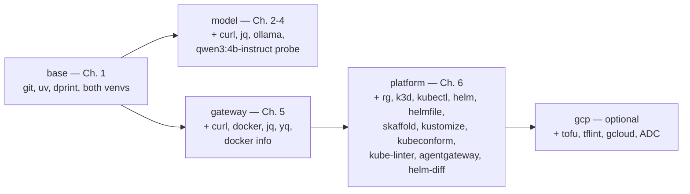

# 1. Setup

## What will you set up in this chapter?

Before you run the reference agent, build a reproducible local environment — without needing every model, container engine, cluster, or cloud account at once. `mise install` materializes the pinned CLI set from `mise.toml`; from there you admit each external dependency only at the chapter that first needs it, and a staged `doctor` proves the prerequisites for that stage before you depend on them.

- **[1.0. System](./1.0. System.md)**: supported systems, hardware, network needs, and the pinned mise toolchain.
- **[1.1. Python](./1.1. Python.md)**: the pinned Python and uv environment, runtime dependencies, and the offline quality checkpoint.
- **[1.2. Containers](./1.2. Containers.md)**: the Docker-compatible runtime the Chapter 5 gateway wrapper needs, and the later agent-image boundary.
- **[1.3. Kubernetes](./1.3. Kubernetes.md)**: the Chapter 6 platform tools, validated without creating a cluster yet.
- **[1.4. Providers](./1.4. Providers.md)**: local Qwen3 through Ollama by default, or optional native Gemini, configured without leaking credentials.
- **[1.5. Workspace](./1.5. Workspace.md)**: the repository, editor-neutral workflow, `AGENTS.md` guidance, git hooks, and your first full validation gate.

## Why are the prerequisites staged instead of installed up front?

An agent platform pulls in heavy, stateful dependencies — a running model server, a container engine, a Kubernetes cluster, a cloud project. Installing and starting all of them before the first lesson wastes time and money and makes failures hard to localize. `scripts/doctor.sh` instead defines a small ladder of profiles, each a superset of the last, so you pay for a dependency only at the boundary it validates. This keeps the base learning path account-free and offline: you can finish Chapter 1 and read or build the whole course without Docker, a GPU, a provider key, or a k3d cluster. `mise.toml` still pins every tool for reproducibility, and `run_auto_install = false` makes a missing tool fail fast in hooks rather than silently installing it.

## Which tier does each chapter actually require?

`scripts/doctor.sh` takes a profile argument and checks the exact tools that stage uses. Run the doctor for the chapter you are on:



- **`mise run doctor` (base):** `git`, `uv`, `dprint`, and both the `.venv` and `agents/python/.venv` Python environments; it also reports whether an optional `.env` is present.
- **`mise run doctor:model` (Chapters 2-4):** the base plus `curl`, `jq`, `ollama`, and a live probe that `qwen3:4b-instruct` is served on the local Ollama endpoint.
- **`mise run doctor:gateway` (Chapter 5):** the base plus `curl`, `docker`, `jq`, `yq`, a `docker info` daemon check, and `docker compose version`.
- **`mise run doctor:platform` (Chapter 6):** the gateway set plus `rg`, `k3d`, `kubectl`, `helm`, `helmfile`, `skaffold`, `kustomize`, `kubeconform`, `kube-linter`, `agentgateway`, the `helm-diff 3.15.10` plugin, and a `kubectl` context report.
- **`mise run doctor:gcp` (optional lab):** the platform set plus `tofu`, `tflint`, `gcloud`, an active project, and Application Default Credentials.

The base learning path's quality gate is `mise run check:core`, which fans out to nine offline sub-tasks (`check:data`, `check:docs`, `check:format`, `check:licenses`, `check:links`, `check:python`, `check:release-metadata`, `check:shell`, `check:workflows`) and needs no container engine. The full `mise run check` adds only `check:infra` (`scripts/check-infra.sh`), the one part that renders both Kubernetes overlays and touches Docker. That distinction has a consequence: lefthook's pre-commit hook runs the full `mise run check`, so contributing a commit exercises `check:infra`, while a learner who only reads and runs the agent stays on `check:core`.

## What is deliberately not part of this chapter?

Nothing model-, container-, cluster-, or cloud-backed is required to finish Setup. Each of those is admitted later: local Qwen3 through Ollama in Chapters 2-4, the Docker runtime in Chapter 5, k3d and kagent in Chapter 6, and the optional GKE lab only if you explicitly choose it. Even then, `mise run doctor:gcp` and every cloud task stop short of creating a billable resource; the GKE path halts at `tofu plan` unless you later approve it.

## How do you know the Setup chapter is finished?

You are ready for Chapter 2 when four base-tier commands pass, none of which calls a model, starts a container, or touches a cluster:

```bash
mise run doctor      # base prerequisites and both venvs present
mise run check:core  # offline course validation (nine sub-tasks)
mise run test        # the Python agent's offline suite
mise run build       # the static site renders from docs/
```

When they are green, continue to [Chapter 2](../2. Agents/) to run the AgentOps Agent on local Qwen3 — the point at which `mise run doctor:model` becomes your gate.
