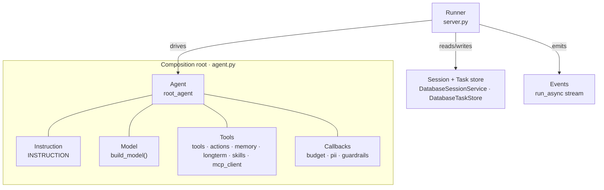
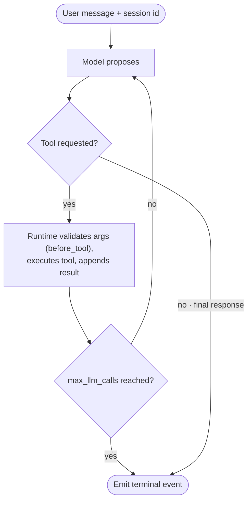

# 2.0. Concepts

## What does ADK provide?

Google ADK supplies the application runtime around a model: agent definitions, tool schemas and execution, callbacks, conversation sessions, workflow graphs, events, evaluation helpers, and A2A serving. The model proposes behavior; your code defines the capabilities and policy that are allowed to execute. That split is the whole mental model — every other concept on this page is either something the model _asks for_ or something _your_ runtime does about it.

An `Agent` declaration is configuration, not a network call:

```python
from google.adk import Agent

from agent.model import build_model

agent = Agent(
    name="example",
    model=build_model(),
    instruction="Answer only from registered tools.",
    tools=[],
)
```

Constructing that object opens no socket and spends no tokens. [`build_model()`](./2.2.%20Models.md#why-are-the-provider-and-model-explicit) resolves the provider client (local Ollama by default, optional native Gemini); inference only begins once a runner drives a message through it. This page is the map; the sibling pages own the territory — [2.1](./2.1.%20First%20Agent.md#how-is-the-root-agent-defined) inspects the real `root_agent`, [2.2](./2.2.%20Models.md#what-is-a-large-language-model-really) the model, [2.3](./2.3.%20Instructions.md#what-operating-contract-does-the-agentops-agent-use) the instruction, [2.4](./2.4.%20Sessions.md#what-is-a-session) sessions.

## Where does each ADK concept live in this repository?

Each ADK abstraction has exactly one owning file, so when a boundary misbehaves you know which module to open. Read this table as the index to the rest of the chapter — abstraction on the left, the concrete code that implements it on the right:

| ADK concept        | What it is                          | Where it lives in this repo                                                                                                                                   |
| ------------------ | ----------------------------------- | ------------------------------------------------------------------------------------------------------------------------------------------------------------- |
| Agent              | The unit of behavior                | `agent.py` `root_agent` ([2.1](./2.1.%20First%20Agent.md#how-is-the-root-agent-defined))                                                                      |
| Model              | The provider client                 | `model.py` `build_model()` ([2.2](./2.2.%20Models.md#why-are-the-provider-and-model-explicit))                                                                |
| Instruction        | The persona and operating rules     | `agent.py` `INSTRUCTION` ([2.3](./2.3.%20Instructions.md#what-operating-contract-does-the-agentops-agent-use))                                                |
| Tools              | Capabilities the model may request  | `tools.py`, `actions.py`, `memory.py`, `longterm.py`, `skills.py`, `mcp_client.py` (Ch. 3)                                                                    |
| Callbacks          | Policy at the model/tool boundaries | `budget.py`, `pii.py`, `guardrails.py` ([4.5](../4.%20Quality/4.5.%20Guardrails.md#what-is-a-guardrail))                                                      |
| Runner             | Drives one invocation               | `server.py` `Runner(agent=root_agent, app_name="agentops-agent", …)` ([2.4](./2.4.%20Sessions.md#why-does-persistence-matter))                                |
| Session/Task store | Conversation and task persistence   | `DatabaseSessionService`, `DatabaseTaskStore` over `.state/runtime.db` ([2.4](./2.4.%20Sessions.md#what-is-a-session))                                        |
| Events             | The `run_async` stream              | Consumed by the A2A executor (`server.py`) and the eval harness (`evals/mlflow_eval.py`)                                                                      |
| Workflow           | A fixed graph (demonstration)       | `workflow.py` `triage_workflow`, outside the served agent ([3.5](../3.%20Capabilities/3.5.%20Workflows.md#what-is-a-workflow-and-why-does-an-agent-need-one)) |

The same map as a picture: the composition root in `agent.py` binds instruction, model, tools, and callbacks into one `Agent`; the runner in `server.py` drives it, backed by the persistent stores, emitting events.



## What does the runner own?

A runner turns one message into one completed turn. It is the operational boundary where sessions, callbacks, tools, and the model meet — a far more important boundary than the prompt string alone. Every invocation runs the same loop:

1. Load or create the session and append the new user content.
1. Call the agent's model.
1. If the model requested a tool, run the tool callbacks and execute it, feed the result back, and loop.
1. If the model emitted a final response — or the call budget is exhausted — stop and emit the terminal event.

The course does not hand-roll this loop; ADK's `Runner` owns it. The persistent A2A server constructs exactly one per application, wiring the served agent to the persistent session service:

```python
runner = Runner(agent=agent, app_name=_APP_NAME, session_service=session_service)
```

Here `_APP_NAME = "agentops-agent"` and `agent` defaults to `root_agent`. See [`server.py`](https://github.com/MLOps-Courses/agentops-open-course/blob/main/agents/python/src/agent/server.py). The host `adk run`/`adk web` CLI builds its own runner with a development session service instead — same loop, ephemeral store.

The loop has two exits, and the second one is a control you configure:



On the A2A path that budget is explicit. `_bounded_request` in `server.py` rewrites each request's `RunConfig` so `max_llm_calls = AGENT_A2A_MAX_LLM_CALLS` (default 12, validated 1–100), replacing ADK's broad default so a model that keeps calling tools cannot spin unbounded. [3.6](../3.%20Capabilities/3.6.%20A2A.md#what-bounds-one-a2a-task) covers the bound in full; note it caps model calls, not wall-clock time or cost — those are separate controls (drain timeout, token budget).

## What is stored in a session?

A session is one conversation keyed by application, user, and session id: the event history and small state that later turns of the same chat need. It is short-term conversation memory — not the incident database, runbook library, audit log, or cross-session notes. [3.4](../3.%20Capabilities/3.4.%20Memory.md#what-does-memory-mean-in-this-course) tabulates those five distinct stores; conflating them is the classic memory bug.

Because the model is stateless ([2.2](./2.2.%20Models.md#what-is-a-large-language-model-really)), the session _is_ the memory: whoever owns it owns what the agent can recall. [2.4](./2.4.%20Sessions.md#why-does-persistence-matter) owns the persistence story — why the A2A server writes `DatabaseSessionService` and `DatabaseTaskStore` to `.state/runtime.db` so a process restart does not silently erase every conversation and task.

## What are events?

An ADK turn is not one reply; it is a stream of typed events — model content, function calls, function responses, state deltas, errors, and a final response. A correct client consumes the sequence and never assumes each event carries user-facing text. The predicates you actually reach for live on the event: `event.get_function_calls()`, `event.get_function_responses()`, `event.is_final_response()`, `event.content`, and `event.error_code`.

The evaluation harness reads exactly those to reconstruct both the answer and the tool trajectory from one stream:

```python
async for event in runner.run_async(user_id=user_id, session_id=session.id, new_message=message):
    for call in event.get_function_calls():
        if not call.name:
            continue
        recorded_call = {"name": call.name, "args": dict(call.args or {})}
        tool_calls.append(recorded_call)
        confirmation_pause = _confirmation_pause_response(recorded_call) or confirmation_pause
    if event.is_final_response() and event.content:
        answer_parts.extend(part.text for part in event.content.parts or [] if part.text)
```

Quoted verbatim from [`evals/mlflow_eval.py`](https://github.com/MLOps-Courses/agentops-open-course/blob/main/agents/python/evals/mlflow_eval.py). The other consumer is the A2A server: `_error_code_interceptor` in `server.py` reads `adk_event.error_code` off intermediate events and carries it onto the terminal A2A update as `adk_error_code` metadata, so a structured failure such as `MODEL_UNAVAILABLE` (set in `guardrails.py`) or `TOKEN_BUDGET_EXHAUSTED` (set in `budget.py`) survives the protocol boundary instead of collapsing into a generic error. Preserving intermediate events is what makes tracing (Ch. 7) and trajectory evaluation (Ch. 4) possible; keep only the final string and you have discarded the evidence of _how_ the answer was reached.

## What is the difference between tools and callbacks?

- A **tool** is a capability the model may request — `get_incident`, `search_service_logs`, `restart_service`.
- A **callback** is deterministic runtime policy wrapped around a model or tool boundary — a token check, PII redaction, argument validation, a stable error message.

The distinction decides _who_ enforces a rule. A tool trusts the model to ask correctly; a callback does not ask the model to police itself — it can block, transform, or replace work before or after the model or a tool runs. `root_agent` wires six callback slots holding eight functions: `before_model_callback=[enforce_token_budget, redact_request_pii]`, `after_model_callback=[record_token_usage, redact_response_pii]`, `before_tool_callback=validate_actions`, `after_tool_callback=secure_tool_output`, plus `on_model_error_callback=handle_model_error` and `on_tool_error_callback=handle_tool_error`. The list-valued slots chain **first-non-None-wins**: the budget check runs before redaction because a refused call needs no redaction, and `record_token_usage` returns `None` so the redaction pass still sees every response. Those eight functions live in `budget.py`, `pii.py`, and `guardrails.py`; [4.5. Guardrails](../4.%20Quality/4.5.%20Guardrails.md#what-is-a-guardrail) owns the full pipeline diagram and each function's behavior — this page only names the seam.

## Where do workflows fit?

An LLM agent chooses its own next step; that flexibility is a liability when the order is part of the requirement. An ADK `Workflow` replaces model choice with explicit graph edges. The course ships one as a demonstration:

```python
triage_workflow = Workflow(
    name="triage_workflow",
    description="Runs triage → diagnose → recommend over the current incidents.",
    edges=[("START", triage, diagnose, recommend)],
)
```

Quoted verbatim from [`workflow.py`](https://github.com/MLOps-Courses/agentops-open-course/blob/main/agents/python/src/agent/workflow.py). It always runs `triage`, then `diagnose`, then `recommend`, passing findings forward via session state. Critically, `triage_workflow` sits **outside** the served composition root: `mise run run`, `mise run web`, and `mise run a2a` all serve `root_agent`, so this graph has no CLI or serving entrypoint and is exercised only by its tests. [3.5. Workflows](../3.%20Capabilities/3.5.%20Workflows.md#what-is-a-workflow-and-why-does-an-agent-need-one) owns the pattern. The rule of thumb: deterministic control flow where order is a requirement, model choice only where contextual flexibility earns its cost.

## Where does A2A fit?

A2A exposes an agent as a discoverable network service. ADK's `to_a2a` turns the same `root_agent` into an ASGI application with an explicit agent card, runner, session service, and task store — the persistent server in `server.py`. [3.6. A2A](../3.%20Capabilities/3.6.%20A2A.md#what-is-a2a-and-why-is-it-not-just-mcp-again) introduces the protocol and [what the card declares](../3.%20Capabilities/3.6.%20A2A.md#what-does-the-agent-card-declare); Chapter 6 deploys this concrete server through kagent. The agent is the unit of behavior; A2A is one way to make that unit callable by other services.

## What does ADK not do for you?

ADK gives you seams, not a finished operations posture. Knowing where the framework stops is exactly what the rest of the course builds on:

1. **Sessions are ephemeral by default.** `adk run`, `adk web`, and the eval `InMemoryRunner` all use an in-memory session service — state dies with the process. Persistence is a choice _you_ make: only the A2A server opts into `DatabaseSessionService` over `.state/runtime.db` ([2.4](./2.4.%20Sessions.md#why-does-persistence-matter)).
1. **There is no built-in auth on the A2A path.** The default server registers only the A2A and health routes — no authentication. ADK synthesizes a per-context user id, so the audit trail records a synthetic subject, not a verified person. A production edge must authenticate the caller and propagate that identity ([4.5](../4.%20Quality/4.5.%20Guardrails.md#how-does-human-confirmation-work), and the gateway in Chapters 5–6).
1. **Policy is your code, not the framework's.** Token budgets, PII redaction, argument validation, and prompt-injection defense are functions in `budget.py`, `pii.py`, and `guardrails.py`, attached at callback seams — ADK runs them but does not supply them.
1. **The model can only propose.** ADK lets a model request any registered tool; it does not itself distinguish a read from a state change. That line is drawn by _your_ `require_confirmation=True` flags and human approval, not by the framework ([4.5](../4.%20Quality/4.5.%20Guardrails.md#how-does-human-confirmation-work)).
1. **The loop is unbounded unless you bound it.** ADK's default call budget is broad; the A2A server narrows it to `AGENT_A2A_MAX_LLM_CALLS` (12). It caps model calls, not cost or wall-clock time.

## What is the concept checkpoint?

Open `agents/python/src/agent/agent.py` and, using the orientation table above, identify the model, instruction, tools, and eight callback functions. Then open `server.py` and identify which resources are created once per application (`runner`, `session_service`, `task_engine`, `task_store`) and closed during lifespan shutdown. If you cannot explain who owns sessions and tools — and what ADK does _not_ enforce for you — pause before adding capabilities.
