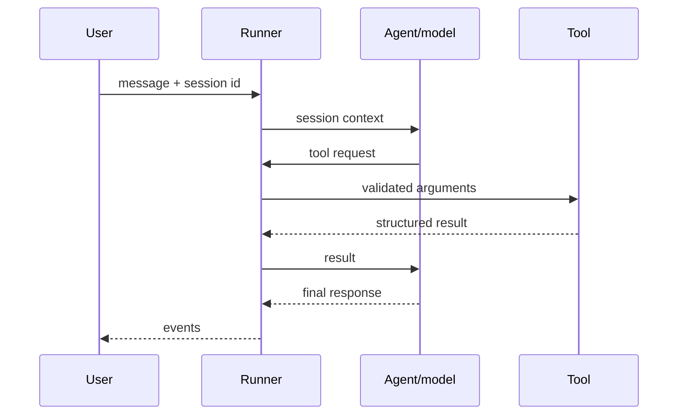

# 2.0. Concepts

## What does ADK provide?

Google ADK supplies the application runtime around a model: agent definitions, tool schemas and execution, callbacks, conversation sessions, workflow graphs, events, evaluation helpers, and A2A serving. The model still proposes behavior; your code defines the capabilities and policy that are allowed to execute.

```python
from google.adk import Agent

from agent.model import build_model

agent = Agent(
    name="example",
    model=build_model(),
    instruction="Answer only from registered tools.",
    tools=[],
)
```

An `Agent` declaration is configuration, not a network call. In the required path, `build_model()` creates the OpenAI-compatible client for local Ollama; the optional Gemini provider uses ADK's native Gemini client. A runner and a message are needed before inference begins.

## What does the runner own?

A runner coordinates one invocation:

1. Load or create a session.
1. Add the new user content.
1. Call the selected agent/model.
1. Validate and execute requested tools.
1. Feed tool results back into the loop.
1. Emit events until the turn ends or fails.



The runner is where session, callback, and tool lifecycles meet. It is therefore a more important operational boundary than a prompt string alone.

## What is stored in a session?

A session identifies one conversation for one application and user. It contains the event history and application state needed by later turns. It is short-term conversation state, not a substitute for the incident database or runbook knowledge base.

The host developer CLI can use its development session services. The course's A2A server explicitly creates `DatabaseSessionService` and `DatabaseTaskStore` against `.state/runtime.db`, so a process restart does not silently erase every conversation/task.

## What are events?

ADK emits events for model content, function calls, function responses, state changes, errors, and final responses. A streaming client must consume the sequence rather than assume every event contains final text.

```python
async for event in runner.run_async(
    user_id="learner",
    session_id=session.id,
    new_message=message,
):
    if event.is_final_response() and event.content:
        print("".join(part.text or "" for part in event.content.parts or []))
```

Production tracing and evaluation both depend on preserving those intermediate events, especially tool trajectories.

## What is the difference between tools and callbacks?

- A **tool** is a capability the model may request, such as `get_incident`.
- A **callback** is runtime policy around a model or tool boundary, such as PII redaction, input validation, or stable error handling.

The Ops Copilot registers eight callback functions: a token-budget check and request redaction before the model; usage recording and response redaction after it; action validation before tools; composed injection hardening and PII redaction after tools; and stable model/tool error handlers. A callback can block, transform, or replace work without asking the model to police itself.

## Where do workflows fit?

An LLM agent chooses its next step. An ADK `Workflow` uses explicit graph edges. The course's graph always runs triage, diagnosis, then recommendation:

```python
triage_workflow = Workflow(
    name="triage_workflow",
    description="Runs triage, diagnose, and recommend over current incidents.",
    edges=[("START", triage, diagnose, recommend)],
)
```

Use deterministic control flow where the order is part of the requirement; use model choice only where contextual flexibility is valuable.

## Where does A2A fit?

A2A exposes an agent as a discoverable network service. ADK converts the same root agent into an ASGI application with an explicit agent card, runner, session service, and task store. Chapter 3 introduces the protocol; Chapter 6 deploys this concrete server through kagent.

## What is the concept checkpoint?

Open `agents/python/src/agent/agent.py` and identify the model, instruction, tools, and eight callback functions. Then open `server.py` and identify which resources are created once per application and closed during lifespan shutdown. If you cannot explain who owns sessions and tools, pause before adding capabilities.
