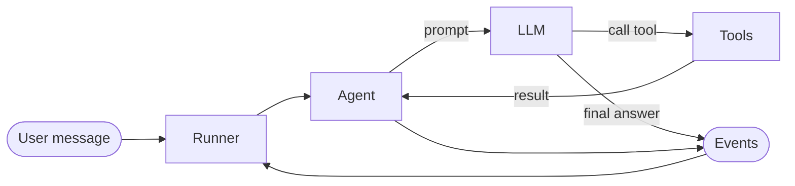

# 2.0. Concepts

Before you build the Ops Copilot, it helps to know the handful of pieces every Google ADK 2.0 agent is made of. This page is concept-only; later sections show the Python code.

## What does Google ADK give you?

Google ADK (Agent Development Kit) is the framework this course builds on. It owns the parts of an agent you do not want to hand-write:

- The **agentic loop** — call the model, run any tools it asks for, feed the results back, repeat until the model answers.
- **Session and state** management — the running conversation and any working data.
- A stream of **events** you can observe, log, and evaluate.
- Runners and launchers that expose the agent over a terminal REPL, a developer web UI, and an HTTP API.

You describe _what_ the agent is — its model, instructions, and tools — and ADK runs it. It ships as `google-adk` on PyPI (import `google.adk`).

## What is an agent in ADK?

The core type is the **LlmAgent**: a language model wrapped with an identity (name and description), a system **instruction** (its persona and rules), and a set of **tools** it may call. The public alias is simply `Agent`.

An agent is a _declaration_, not a running process. It says "here is a model, here is how it should behave, here are the tools it can use." Something else has to actually drive it turn by turn — that is the Runner.

## What does the Runner do?

The **Runner** is the engine that executes the agentic loop. Give it an agent, a user, a session, and a message, and it:

1. Sends the conversation so far plus your new message to the model.
1. Reads the model's reply — either a final answer or a request to call one or more tools.
1. Runs the requested tools and appends their results to the session.
1. Loops back to the model until it produces a final answer.

Every step is emitted as an **event**.

The Runner is also where the agent's services plug in: the session store, the artifact store, and long-term memory. For local development, ADK provides in-memory versions of all three, so a first agent needs no database — covered in [2.4. Sessions](./2.4. Sessions.md).

## What are sessions and state?

A **session** is one conversation: a stable id (per user) plus the ordered list of events that have happened in it. It is the agent's **short-term memory** — the context the model sees on the next turn.

Attached to the session is its **state**: a plain key/value bag the agent and its tools can read and write during a run (for example, a value carried from one workflow step to the next). State lives with the session; when the session ends, so does it. Persisting knowledge _across_ sessions is a different job — long-term memory and RAG — which the Ops Copilot gains in [3.4. Memory](../3. Capabilities/3.4. Memory.md).

## What are events?

An **event** is a single, timestamped thing that happened in a run: the user's message, a chunk of the model's response, a tool call, a tool result, a state change. The Runner yields events as a stream while the agent works.

Events are the observability seam of the whole course. They are what the developer web UI renders as a trace, what evaluations assert against, and what you export to OpenTelemetry in [7.1. Tracing](../7. Observability/7.1. Tracing.md). Because the whole run is a stream of typed events, nothing the agent does is hidden.

## What are tools?

A **tool** is a function the model can call to observe or change the world — query a database, read a runbook, restart a service. Tools are what turn a chatbot into an agent. ADK reads each tool's signature and description to build the schema the model sees, so the model knows what tools exist and how to call them.

The Ops Copilot's tools (`list_incidents`, `get_incident`, `get_service_status`, and more) are the subject of [3.1. Tools](../3. Capabilities/3.1. Tools.md). In this chapter the agent already carries them, so you can watch the loop call them for real.

## What is the graph Workflow runtime?

A single agent in a loop covers most needs, but real systems chain steps and coordinate several agents. ADK 2.0's headline feature is a **graph-based Workflow runtime**: agents, tools, and functions become nodes in a directed graph, giving you deterministic multi-step flows, automatic retries, and human-in-the-loop pauses.

Alongside it, the classic **workflow agents** — Sequential, Parallel, and Loop — still exist and are simpler to reach for first. The Ops Copilot uses both to run its `triage → diagnose → recommend` pipeline in [3.5. Workflows](../3. Capabilities/3.5. Workflows.md). For now, just know the graph runtime is there when one agent in a loop is not enough.

## How do these fit together?

Building the Ops Copilot, you assemble exactly these pieces:

1. An **Agent** — a Gemini model, the on-call persona as its instruction, and the ops tools.
1. A **Runner** — drives the loop and holds the in-memory session, artifact, and memory services.
1. A **Session** — one on-call conversation, with its state.
1. **Events** — the trace of everything the agent did, which you read in the web UI.

The rest of this chapter builds that stack end to end: the full agent in [2.1. First Agent](./2.1. First Agent.md), then the model, instructions, sessions, and dev loop one page at a time.
