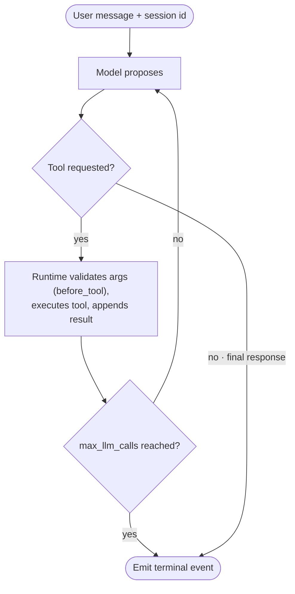
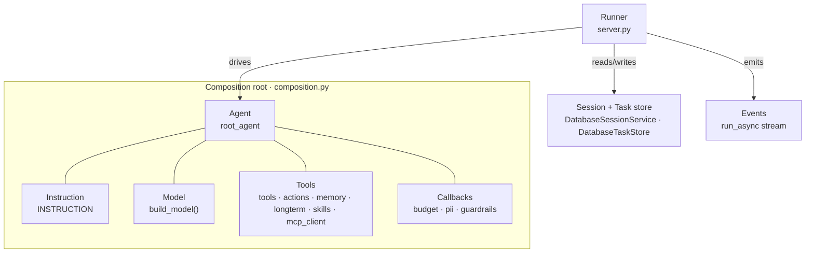

# 2.0. Concepts

!!! abstract "In one glance"

    - **You will:** Learn the five pieces every ADK agent has — agent, runner, session, events, tools — and what the framework deliberately leaves for you to write.
    - **You need:** Nothing beyond a terminal and the repository cloned.
    - **Time:** about 14 minutes, concept.

## What does ADK provide?

Google ADK is the application runtime around a model. The model proposes behavior; your code defines the capabilities and policy that are allowed to execute. That split is the whole mental model. Everything else on this page is either something the model _asks for_ or something _your_ runtime does about it.

Concretely, ADK supplies agent definitions, tool schemas and execution, callbacks, conversation sessions, workflow graphs, events, evaluation helpers, and **A2A** serving. A2A is a protocol for discovering agents and exchanging tasks across process boundaries ([0.7. Glossary](../0.%20Overview/0.7.%20Glossary.md#a2a)).

It also supplies the seam that decides _where_ policy attaches, and it is worth learning early because it is easy to get wrong. There are two levels:

| Level                        | What it is                                                  | Use it for                                                                 |
| ---------------------------- | ----------------------------------------------------------- | -------------------------------------------------------------------------- |
| `Agent(..., *_callback=...)` | Hooks on **one** agent                                      | Behavior genuinely specific to that agent                                  |
| `App(plugins=[...])`         | A `BasePlugin` whose hooks fire for **every** agent it runs | Cross-cutting policy: budgets, redaction, output hardening, error handling |

This course puts all of its policy on an `App` plugin ([4.5. Guardrails](../4.%20Quality/4.5.%20Guardrails.md#where-is-pii-redacted)). The rule generalizes: if a rule should hold for every agent you will ever add, attaching it per agent makes it a thing to remember, and something you must remember is not a guarantee.

An `Agent` declaration is configuration, not a network call:

```python
# simplified
from google.adk import Agent

from agent.model import build_model

agent = Agent(
    name="example",
    model=build_model(),
    instruction="Answer only from registered tools.",
    tools=[],
)
```

Constructing that object opens no socket and spends no tokens. [`build_model()`](./2.2.%20Models.md#why-are-the-provider-and-model-explicit) resolves the provider client (local Ollama by default, optional native Gemini). Inference only begins once a runner drives a message through it. This page is the map; the sibling pages own the territory.

## What does the runner own?

A runner turns one message into one completed turn. It is the operational boundary where sessions, callbacks, tools, and the model meet — a far more important boundary than the prompt string alone. Every invocation runs the same loop:

1. Load or create the session and append the new user content.
1. Call the agent's model.
1. If the model requested a tool, run the tool callbacks and execute it, feed the result back, and loop.
1. If the model emitted a final response — or the call budget is exhausted — stop and emit the terminal event.

The course does not hand-roll this loop; ADK's `Runner` owns it. The persistent A2A server constructs exactly one per application, wiring the served agent to the persistent session service:

```python
# simplified
runner = Runner(app=App(name=_APP_NAME, root_agent=agent, plugins=[AgentOpsPolicyPlugin()]), session_service=session_service)
```

Here `_APP_NAME = "agentops-agent"` and `agent` defaults to `root_agent`. See [`server.py`](https://github.com/MLOps-Courses/agentops-open-course/blob/main/agents/python/src/agent/server.py). Note the runner takes an `App`, not a bare agent: that is what carries the policy plugin, and it is why an agent injected here is governed exactly like the shipped one. The host `adk run`/`adk web` CLI builds its own runner with a development session service instead — same loop, ephemeral store.

The loop has two exits, and the second one is a control you configure:


```mermaid
flowchart TD
    U([User message + session id]) --> M[Model proposes]
    M --> Q{Tool requested?}
    Q -->|yes| V["Runtime validates args (before_tool),<br/>executes tool, appends result"]
    V --> B{max_llm_calls reached?}
    B -->|no| M
    B -->|yes| F
    Q -->|no · final response| F([Emit terminal event])
```

??? note "Deeper: how does the A2A server set that bound?"

    On the A2A path that budget is explicit. `_bounded_request` in `server.py` rewrites each request's `RunConfig` so `max_llm_calls = AGENT_A2A_MAX_LLM_CALLS` (default 12, validated 1–100), replacing ADK's broad default so a model that keeps calling tools cannot spin unbounded. [3.6. A2A](../3.%20Capabilities/3.6.%20A2A.md#what-bounds-one-a2a-task) covers the bound in full; note it caps model calls, not wall-clock time or cost — those are separate controls (drain timeout, token budget).

## What does ADK not do for you?

ADK gives you **seams** — places where your own code attaches — not a finished operations posture. Knowing where the framework stops is exactly what the rest of the course builds on:

1. **Sessions are ephemeral by default.** `adk run`, `adk web`, and the eval `InMemoryRunner` all use an in-memory session service, so state dies with the process. Persistence is a choice _you_ make: only the A2A server opts into `DatabaseSessionService` over `.state/runtime.db` ([2.4. Sessions](./2.4.%20Sessions.md#why-does-persistence-matter)).
1. **There is no built-in auth on the A2A path.** The default server registers only the A2A and health routes, with no authentication. ADK synthesizes a per-context user id, so the audit trail — the record of who asked for what — names a synthetic subject rather than a verified person. A production edge must authenticate the caller and propagate that identity ([3.1. Tools](../3.%20Capabilities/3.1.%20Tools.md#how-does-human-confirmation-work), and the gateway in Chapters 5–6).
1. **Policy is your code, not the framework's.** Token budgets, PII redaction, argument validation, and prompt-injection defense are functions in `budget.py`, `pii.py`, and `guardrails.py`, bound together by the plugin in `governance.py`. ADK supplies the seam and runs them; it does not supply the rules.
1. **The model can only propose.** ADK lets a model request any registered tool; it does not itself distinguish a read from a state change. That line is drawn by _your_ `require_confirmation=True` flags and human approval, not by the framework ([3.1. Tools](../3.%20Capabilities/3.1.%20Tools.md#how-does-human-confirmation-work)).
1. **The loop is unbounded unless you bound it.** ADK's default call budget is broad; the A2A server narrows it to `AGENT_A2A_MAX_LLM_CALLS` (12). It caps model calls, not cost or wall-clock time.

## What is stored in a session?

A session is one conversation, keyed by application, user, and session id. It holds the event history and the small state that later turns of the same chat need. It is short-term conversation memory — not the incident database, runbook library, audit log, or cross-session notes. [3.4. Memory](../3.%20Capabilities/3.4.%20Memory.md#what-does-memory-mean-in-this-course) tabulates those five distinct stores; conflating them is the classic memory bug.

Because the model is stateless ([2.2. Models](./2.2.%20Models.md#what-is-a-large-language-model-really)), the session _is_ the memory: whoever owns it owns what the agent can recall. [2.4. Sessions](./2.4.%20Sessions.md#why-does-persistence-matter) owns the persistence story — why the A2A server writes `DatabaseSessionService` and `DatabaseTaskStore` to `.state/runtime.db` so a process restart does not silently erase every conversation and task.

## What are events?

An ADK turn is not one reply. It is a stream of typed events: model content, function calls, function responses, state deltas (writes to session state), errors, and a final response.

A correct client consumes the sequence and never assumes each event carries user-facing text. The predicates you actually reach for live on the event: `event.get_function_calls()`, `event.get_function_responses()`, `event.is_final_response()`, `event.content`, and `event.error_code`.

The evaluation harness reads exactly those to reconstruct both the answer and the tool trajectory from one stream:

```python
# simplified
async for event in runner.run_async(user_id=user_id, session_id=session.id, new_message=message):
    for call in event.get_function_calls():
        if not call.name:
            continue
        recorded_call = {"name": call.name, "args": dict(call.args or {})}
        tool_calls.append(recorded_call)
        confirmation_pause = _confirmation_pause_response(recorded_call) or confirmation_pause
    if event.is_final_response() and event.content:
        answer_parts.extend(part.text for part in event.content.parts or [] if part.text)
```

Quoted verbatim from [`evals/mlflow_eval.py`](https://github.com/MLOps-Courses/agentops-open-course/blob/main/agents/python/evals/mlflow_eval.py).

??? note "Deeper: what else reads the event stream?"

    The other consumer is the A2A server: `_error_code_interceptor` in `server.py` reads `adk_event.error_code` off intermediate events and carries it onto the terminal A2A update as `adk_error_code` metadata, so a structured failure such as `MODEL_UNAVAILABLE` (set in `guardrails.py`) or `TOKEN_BUDGET_EXHAUSTED` (set in `budget.py`) survives the protocol boundary instead of collapsing into a generic error.

Preserving intermediate events is what makes tracing (Ch. 7) and trajectory evaluation (Ch. 4) possible. Keep only the final string and you have discarded the evidence of _how_ the answer was reached.

## What is the difference between tools and callbacks?

- A **tool** is a capability the model may request — `get_incident`, `search_service_logs`, `restart_service`.
- A **callback** is deterministic runtime policy wrapped around a model or tool boundary — a token check, PII redaction, argument validation, a stable error message.

The distinction decides _who_ enforces a rule. A tool trusts the model to ask correctly. A callback does not ask the model to police itself: it can block, transform, or replace work before or after the model or a tool runs.

`root_agent` wires six callback slots holding nine functions:

- `before_model_callback=[enforce_token_budget, compact_history, redact_request_pii]`
- `after_model_callback=[record_token_usage, redact_response_pii]`
- `before_tool_callback=validate_actions`
- `after_tool_callback=secure_tool_output`
- `on_model_error_callback=handle_model_error`
- `on_tool_error_callback=handle_tool_error`

??? note "Deeper: why is the callback order load-bearing?"

    The list-valued slots chain **first-non-None-wins**, and order is load-bearing: the budget check runs first because a refused turn should compact and redact nothing, `compact_history` then trims an over-long conversation window before the model sees it, and `redact_request_pii` masks only the surviving messages; on the way back, `record_token_usage` returns `None` so the redaction pass still sees every response.

Those nine functions live in `budget.py`, `compaction.py`, `pii.py`, and `guardrails.py`. This page only names the seam: [2.1. First Agent](./2.1.%20First%20Agent.md#which-module-owns-each-tool-and-callback-the-agent-registers) shows the wiring, and [4.5. Guardrails](../4.%20Quality/4.5.%20Guardrails.md#what-is-a-guardrail) owns the full pipeline diagram and each function's behavior.

## Where do workflows fit?

An LLM agent chooses its own next step. That flexibility is a liability when the order is part of the requirement, so an ADK `Workflow` replaces model choice with explicit graph edges. The course ships a runnable, read-only investigation workflow:

```python
# simplified
triage_workflow = Workflow(
    name="triage_workflow",
    description="Runs a bounded plan → investigate → evidence review → recommend loop.",
    edges=[("START", plan, investigate, evidence_review, recommend)],
)
```

Quoted verbatim from [`workflow.py`](https://github.com/MLOps-Courses/agentops-open-course/blob/main/agents/python/src/agent/workflow.py). It always plans, investigates, reviews the evidence, then recommends, passing each result to the next node.

The default CLI, web UI, and A2A server still serve the flexible conversational agent. `mise run workflow` selects the deterministic alternative through the same validated `src/agent` package boundary.

The rule of thumb: deterministic control flow where order is a requirement, model choice only where contextual flexibility earns its cost. [3.5. Workflows](../3.%20Capabilities/3.5.%20Workflows.md#what-is-a-workflow) owns the pattern.

## Where does A2A fit?

A2A exposes an agent as a discoverable network service. ADK's `to_a2a` turns the same `root_agent` into an **ASGI application** — the standard Python interface a web server can run. That application carries an explicit agent card, runner, session service, and task store: the persistent server in `server.py`.

The agent is the unit of behavior; A2A is one way to make that unit callable by other services. [3.6. A2A](../3.%20Capabilities/3.6.%20A2A.md#what-is-a2a-and-why-is-it-not-just-mcp-again) introduces the protocol and [what the card declares](../3.%20Capabilities/3.6.%20A2A.md#what-does-the-agent-card-declare); Chapter 6 deploys this concrete server through kagent.

## Where does each concept live in the repository?

Now that each concept has a name, here is the file that owns it. Each ADK abstraction has exactly one owning file, so when a boundary misbehaves you know which module to open. Read this table as the index to the rest of the chapter — abstraction on the left, the concrete code that implements it on the right:

| ADK concept        | What it is                          | Where it lives in this repo                                                                                                                               |
| ------------------ | ----------------------------------- | --------------------------------------------------------------------------------------------------------------------------------------------------------- |
| Agent              | The unit of behavior                | `composition.py` `root_agent` ([2.1. First Agent](./2.1.%20First%20Agent.md#how-is-the-root-agent-defined))                                               |
| Model              | The provider client                 | `model.py` `build_model()` ([2.2. Models](./2.2.%20Models.md#why-are-the-provider-and-model-explicit))                                                    |
| Instruction        | The persona and operating rules     | `composition.py` `INSTRUCTION` ([2.3. Instructions](./2.3.%20Instructions.md#what-operating-contract-does-the-agentops-agent-use))                        |
| Tools              | Capabilities the model may request  | `tools.py`, `actions.py`, `memory.py`, `longterm.py`, `skills.py`, `mcp_client.py` (Ch. 3)                                                                |
| Callbacks          | Policy at the model/tool boundaries | `budget.py`, `pii.py`, `guardrails.py` ([4.5. Guardrails](../4.%20Quality/4.5.%20Guardrails.md#what-is-a-guardrail))                                      |
| Runner             | Drives one invocation               | `server.py` `Runner(agent=root_agent, app_name="agentops-agent", …)` ([2.4. Sessions](./2.4.%20Sessions.md#why-does-persistence-matter))                  |
| Session/Task store | Conversation and task persistence   | `DatabaseSessionService`, `DatabaseTaskStore` over `.state/runtime.db` ([2.4. Sessions](./2.4.%20Sessions.md#what-is-a-session))                          |
| Events             | The `run_async` stream              | Consumed by the A2A executor (`server.py`) and the eval harness (`evals/mlflow_eval.py`)                                                                  |
| Workflow           | A fixed, separately runnable graph  | `workflow.py` `triage_workflow` via `mise run workflow` ([3.5. Workflows](../3.%20Capabilities/3.5.%20Workflows.md#how-do-you-run-the-planning-workflow)) |

The same map as a picture: the composition root in `composition.py` binds instruction, model, tools, and callbacks into one `Agent`; the runner in `server.py` drives it, backed by the persistent stores, emitting events.


```mermaid
flowchart TD
    subgraph CR["Composition root · composition.py"]
      A["Agent<br/>root_agent"]
      I["Instruction<br/>INSTRUCTION"]
      MD["Model<br/>build_model()"]
      T["Tools<br/>tools · actions · memory · longterm · skills · mcp_client"]
      C["Callbacks<br/>budget · pii · guardrails"]
    end
    R["Runner<br/>server.py"]
    S["Session + Task store<br/>DatabaseSessionService · DatabaseTaskStore"]
    E["Events<br/>run_async stream"]
    A --- I & MD & T & C
    R -->|drives| A
    R -->|reads/writes| S
    R -->|emits| E
```

## What proves this page worked?

Open `agents/python/src/agent/composition.py` and, using the orientation table above, identify the model, instruction, tools, and nine callback functions. Then open `server.py` and identify which resources are created once per application (`runner`, `session_service`, `task_engine`, `task_store`) and closed during lifespan shutdown.

**You are done when:**

- You can point at the model, the instruction, the tool list, and the nine callback functions inside `composition.py`.
- You can name the four resources `server.py` creates once per application and closes during lifespan shutdown.
- You can restate the split this page opens with: what the model proposes, and what your code decides may actually run.
- You can name at least two things ADK does not do for you.

If you cannot explain who owns sessions and tools — and what ADK does _not_ enforce for you — pause before adding capabilities.

Continue to [2.1. First Agent](./2.1.%20First%20Agent.md) when you can describe what the runner does with one message without scrolling back up this page.
