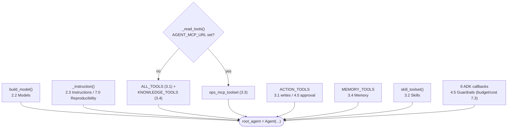

# 2.1. First Agent

## What are you inspecting first?

You are inspecting the composition root of the completed AgentOps Agent: the single module where every capability the rest of the course builds is wired into one runnable object. In application design a _composition root_ is the one place that assembles a system's dependencies, instead of scattering wiring decisions across the codebase. For a Google ADK agent that place is the module-level `root_agent = Agent(...)` in `agent.py`.

This page owns that object. Each thing it passes — the model, the instruction, four tool groups, six callbacks — is explained in depth by a sibling page. Here you see them meet, so the whole chapter map is legible at the point of assembly before the capstone asks you to replace the fictional incident domain with your own. The mental model behind the object (runner, session, events, the agentic loop) is [2.0. Concepts](./2.0.%20Concepts.md); this page is the concrete wiring.

## How is the root agent defined?

```python
--8<-- "agents/python/src/agent/agent.py:root-agent"
```

The composition is declarative and build-checked against [`agent.py`](https://github.com/MLOps-Courses/agentops-open-course/blob/main/agents/python/src/agent/agent.py): nothing about the agent's behavior is hidden in a base class or a decorator. Read top to bottom it names the model, a stable `name` the runner and telemetry key on, a one-line `description`, the instruction, the tool list, and the callback pipeline. Policy is attached here at the runtime boundary rather than smuggled into the prompt — the six callbacks are the guarded pipeline owned by [4.5. Guardrails](../4.%20Quality/4.5.%20Guardrails.md#where-is-pii-redacted), which quotes the nested callback region. The rest of this page walks each argument to the sibling page that owns it, so this one object doubles as a map of the whole agent.

## Which module owns each tool and callback the agent registers?

Because the constructor lists its dependencies explicitly, you can read ownership straight off it: every toolset and callback is a symbol imported at the top of `agent.py`, and each resolves to exactly one chapter that explains it.



The tool groups map cleanly:

- `model=build_model()` — provider resolution and the OpenAI-compatible-versus-Gemini branch live in [2.2. Models](./2.2.%20Models.md#why-are-the-provider-and-model-explicit); this page does not repeat them.
- `instruction=_instruction()` — returns the committed `INSTRUCTION` string, or a pinned prompt-registry version when `AGENT_PROMPT_URI` is set. The persona and operating contract are [2.3. Instructions](./2.3.%20Instructions.md#what-operating-contract-does-the-agentops-agent-use); the registry mechanism is [7.0. Reproducibility](../7.%20Observability/7.0.%20Reproducibility.md#how-do-i-know-which-prompt-produced-this-behavior).
- `*_read_tools()` — the one behavioral switch in this file (next section).
- `*ACTION_TOOLS` — the two guarded writes `restart_service` and `resolve_incident`. The tools are [3.1. Tools](../3.%20Capabilities/3.1.%20Tools.md#which-read-tools-does-the-agent-expose); their `require_confirmation=True` and approval flow are [4.5](../4.%20Quality/4.5.%20Guardrails.md#how-does-human-confirmation-work).
- `*MEMORY_TOOLS` — `recall_incident_context` and `save_incident_note`, cross-session notes owned by [3.4. Memory](../3.%20Capabilities/3.4.%20Memory.md#what-should-an-agent-remember-across-sessions).
- `skill_toolset()` — progressive-disclosure Agent Skills owned by [3.2. Skills](../3.%20Capabilities/3.2.%20Skills.md#what-is-an-agent-skill).

The six callbacks are the deterministic policy boundary. Order is load-bearing because the lists chain first-non-`None`-wins: the budget check runs before redaction (a refused call needs no redaction), and `record_token_usage` returns `None` so the PII pass still sees every response.

| Callback slot    | Functions, in order                           | Role                                               | Owner            |
| ---------------- | --------------------------------------------- | -------------------------------------------------- | ---------------- |
| `before_model`   | `enforce_token_budget` → `redact_request_pii` | refuse an over-budget turn, then mask outbound PII | 4.5 (budget 7.3) |
| `after_model`    | `record_token_usage` → `redact_response_pii`  | record cost, then mask inbound PII                 | 4.5 (cost 7.3)   |
| `before_tool`    | `validate_actions`                            | normalize or refuse write arguments                | 4.5              |
| `after_tool`     | `secure_tool_output`                          | neutralize injections, spotlight, redact           | 4.5 / 4.6        |
| `on_model_error` | `handle_model_error`                          | stable message to the client, real cause logged    | 4.5              |
| `on_tool_error`  | `handle_tool_error`                           | stable message to the client, real cause logged    | 4.5              |

[4.5. Guardrails](../4.%20Quality/4.5.%20Guardrails.md#where-is-pii-redacted) wires and explains every one; token budgeting and cost attribution are [7.3. Costs](../7.%20Observability/7.3.%20Costs.md). This page's job is only to show that they are attached at the boundary, together, in the same object as the tools.

## When does the agent use MCP instead of local tools?

Read tools can be in-process Python or a governed remote service, and the agent supports both without changing anything else in the object. `_read_tools()` is the single branch:

```python
def _read_tools() -> list[ToolUnion]:
    """Use local tools by default and the governed MCP route when configured."""
    if settings.mcp_url:
        return [ops_mcp_toolset(settings.mcp_url)]
    return [*ALL_TOOLS, *KNOWLEDGE_TOOLS]
```

Quoted verbatim from [`agent.py`](https://github.com/MLOps-Courses/agentops-open-course/blob/main/agents/python/src/agent/agent.py). With `AGENT_MCP_URL` unset — the default — the agent registers six in-process functions: the four incident reads (`ALL_TOOLS`) plus the two runbook lookups (`KNOWLEDGE_TOOLS`). Set `AGENT_MCP_URL=http://127.0.0.1:3000/mcp` and it registers one `ops_mcp_toolset(url)` instead, whose server re-exposes exactly those same six read and knowledge functions over MCP. Writes, memory, and skills are untouched — only the reads move behind the wire.

This is the only environment-dependent shape on the page, and it earns a place because it is where the local agent becomes a client of a governed data plane. What the flip trades and why you would put agentgateway in front of it are owned by [3.3. MCP](../3.%20Capabilities/3.3.%20MCP.md#when-does-the-root-agent-use-mcp) and its [`AGENT_MCP_URL`](../3.%20Capabilities/3.3.%20MCP.md#what-changes-when-you-flip-agent_mcp_url) section. A common pitfall is caught early: a non-`http(s)` URL is rejected at construction (`test_mcp_url_must_be_http`), not mid-turn.

## How does the agent fail fast on bad configuration?

_Parse, don't validate_: turn external environment variables into a trusted, fully-checked object once at the boundary, so a bad combination fails at startup with a message that names the fix rather than surfacing as a stack trace deep in a turn. The provider and model fields themselves are defined and explained in [2.2. Models](./2.2.%20Models.md#why-are-the-provider-and-model-explicit); what matters on this page is that `settings = Settings()` runs at import and a cross-field validator rejects invalid combinations _before_ `root_agent` is ever built.

One illustrative branch of that `_actionable_cross_field_checks` validator, dedented from [`config.py`](https://github.com/MLOps-Courses/agentops-open-course/blob/main/agents/python/src/agent/config.py):

```python
if self.model_provider is ModelProvider.OPENAI_COMPATIBLE and not self.openai_base_url:
    provider_problems.append(
        "AGENT_MODEL_PROVIDER=openai-compatible requires OPENAI_BASE_URL. Use "
        "http://127.0.0.1:11434/v1 for direct Ollama or http://127.0.0.1:4000/v1 "
        "for the host agentgateway model route."
    )
if self.model_provider is ModelProvider.OPENAI_COMPATIBLE and (
    not self.openai_api_key or not self.openai_api_key.get_secret_value().strip()
):
    provider_problems.append(
        "AGENT_MODEL_PROVIDER=openai-compatible requires OPENAI_API_KEY. Ollama and the open "
        "local gateway accept a non-secret marker such as local-ollama."
    )
```

The full validator covers every provider path — a missing Gemini auth path, an ambiguous API-key-plus-enterprise combination, a non-`prompts:/` prompt URI, a non-`http` MCP URL — each with a message that says what to set and why. `test_config.py` pins the behavior: `test_openai_compatible_provider_requires_base_url`, `test_gemini_provider_requires_an_explicit_auth_path`, and `test_removed_gateway_flag_fails_with_migration_guidance` among others, while `test_default_settings_are_valid` proves the account-free defaults resolve to local Ollama. That is what the checkpoint's "invalid provider combinations fail with an actionable message" means concretely.

## Why must importing the agent package stay side-effect-free?

Importing a Python module executes its top-level code. Discovery tools, the test suite, and the pure data and MCP modules all import parts of this package, so anything that runs at import time must be cheap, deterministic, and safe — a network call, a migration, or a destructive write at import would fire every time anyone so much as inspected the package. Two design choices follow.

1. Lazy discovery. The package `__init__.py` does not eagerly import ADK:

   ```python
   __all__ = ["agent"]


   def __getattr__(name: str) -> ModuleType:
       """Load the ADK agent only when a caller explicitly requests it."""
       if name != "agent":
           raise AttributeError(f"module {__name__!r} has no attribute {name!r}")
       module = import_module(f"{__name__}.agent")
       globals()[name] = module
       return module
   ```

   The `adk` CLI is given the package path and resolves the conventional `agent.agent.root_agent`; the lazy `__getattr__` imports the ADK-heavy `agent` submodule only when that attribute is first touched, so pure data and MCP modules import without initializing ADK at all. Why this matters and which entrypoints are stable is owned by [3.0. Packaging](../3.%20Capabilities/3.0.%20Packaging.md#why-does-importing-agent-not-import-adk); this page just relies on it.

1. Safe import-time setup. `agent.py` does call one function at import — but a safe one:

   ```python
   # ADK CLI entrypoints import this module directly, so exporter configuration
   # belongs here rather than only in the standalone A2A server.
   setup_telemetry()
   ```

   That is deliberate and safe because `setup_telemetry()` is a no-op until an exporter endpoint is configured: with no `OTEL_EXPORTER_OTLP_ENDPOINT`, `_otel_logging_configured()` returns `False` and `maybe_set_otel_providers()` installs nothing, so no socket is opened and no data leaves the process at import (see [`telemetry.py`](https://github.com/MLOps-Courses/agentops-open-course/blob/main/agents/python/src/agent/telemetry.py)). Configuring exporters is pure, reversible wiring that is fine to run at import; opening a connection, mutating the database, or approving an action is not. Keep that distinction when you extend the module. What telemetry actually exports is [7.1. Tracing](../7.%20Observability/7.1.%20Tracing.md).

## What is in the dataset the agent reads?

Every example in the course references specific ids from one immutable seed ([`agents/data`](https://github.com/MLOps-Courses/agentops-open-course/blob/main/agents/data/README.md)), so it helps to see the ground truth before your first run. The ten incidents and the runbook each one points at:

| Incident | Service     | Status        | Runbook slug      |
| -------- | ----------- | ------------- | ----------------- |
| INC-001  | checkout    | investigating | `high-latency`    |
| INC-002  | inventory   | open          | `service-down`    |
| INC-003  | payments    | resolved      | `elevated-errors` |
| INC-004  | auth        | resolved      | `elevated-errors` |
| INC-005  | search      | open          | `high-latency`    |
| INC-006  | checkout    | resolved      | `disk-full`       |
| INC-007  | cache       | resolved      | `memory-leak`     |
| INC-008  | database    | resolved      | `cascade-failure` |
| INC-009  | checkout    | investigating | `cascade-failure` |
| INC-010  | api-gateway | open          | `memory-leak`     |

Eight services back them: `api-gateway` and `checkout` are `degraded`, `inventory` is `down`, and `auth`, `cache`, `database`, `payments`, and `search` are `operational`. Seven runbooks form the knowledge base (`cascade-failure`, `deployment-rollback`, `disk-full`, `elevated-errors`, `high-latency`, `memory-leak`, `service-down`), four services carry sample logs read by `search_service_logs` (`checkout`, `inventory`, `cache`, `database`), and two Agent Skills (`incident-triage`, `remediation`) hold the progressively-disclosed procedures of [3.2. Skills](../3.%20Capabilities/3.2.%20Skills.md). INC-007 → INC-008 → INC-009 is a deliberate cascade chain, and INC-010 is a deliberately ambiguous open incident for retrieval evaluation. The negatives the eval set depends on — incident `INC-999` and service `warehouse` — are absent by design ([4.4. Evaluations](../4.%20Quality/4.4.%20Evaluations.md#why-do-negative-and-adversarial-cases-belong-in-the-eval-set)).

## How do you run it with local Qwen3?

Install Ollama, pull the Apache-2.0 open-weight model, validate it from the repository root, then run the agent:

```bash
ollama pull qwen3:4b-instruct
mise run doctor:model
cd agents/python
mise run run
# or: mise run web
```

The default settings use `AGENT_MODEL_PROVIDER=openai-compatible`, `AGENT_MODEL=qwen3:4b-instruct`, `OPENAI_BASE_URL=http://127.0.0.1:11434/v1`, and a non-secret local marker. Start with `List the open incidents`. The expected behavior is a `list_incidents` tool call followed by a grounded summary. Wording can differ; invented incidents or skipped tools are failures.

!!! note "The first turn on CPU is slow — that is normal"

    The first request loads the model into memory and runs inference on your own hardware, so the first token can take tens of seconds on a CPU (much faster on a GPU or Apple Silicon, and quicker on later turns while the model stays warm). If a run seems to hang, it is almost always working — confirm with `ollama ps` or the Ollama server log rather than assuming a failure. The serving window that also governs speed and truncation is covered in [3.4. Memory](../3.%20Capabilities/3.4.%20Memory.md#why-does-my-agent-silently-forget-the-start-of-a-long-conversation).

The optional Gemini path sets `AGENT_MODEL_PROVIDER=gemini`, an explicit Gemini model, and either `GOOGLE_API_KEY` or Application Default Credentials — see [2.2. Models](./2.2.%20Models.md#how-does-optional-native-gemini-work). It is not required to complete this page.

## Can you verify the agent without a model?

Yes. Construction, configuration errors, tools, callbacks, MCP/A2A application wiring, and state are covered offline:

```bash
mise run test
```

This is the default checkpoint. Interactive output is useful exploration, not proof that all boundaries work — the model is non-deterministic, so a passing chat is a demo, and the deterministic suite is the evidence.

## What is the page checkpoint?

Run the tests, then inspect `root_agent.tools` in a Python shell or test. Confirm that read, knowledge, action, memory, and skill toolsets are registered, that the default OpenAI-compatible path resolves to local Ollama, and that invalid provider combinations fail with an actionable message — the `test_config.py` cases above are the machine-checked form of that last claim. Continue when both provider branches are intentional rather than environment-dependent surprises, and when you can name, for every tool and callback on the object, the chapter that owns it.
