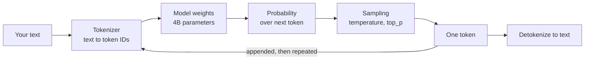
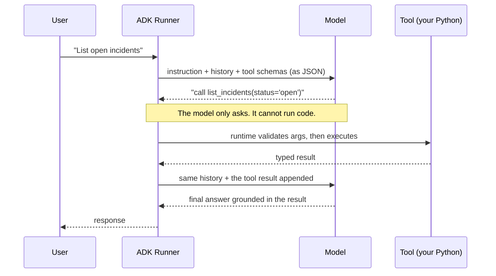
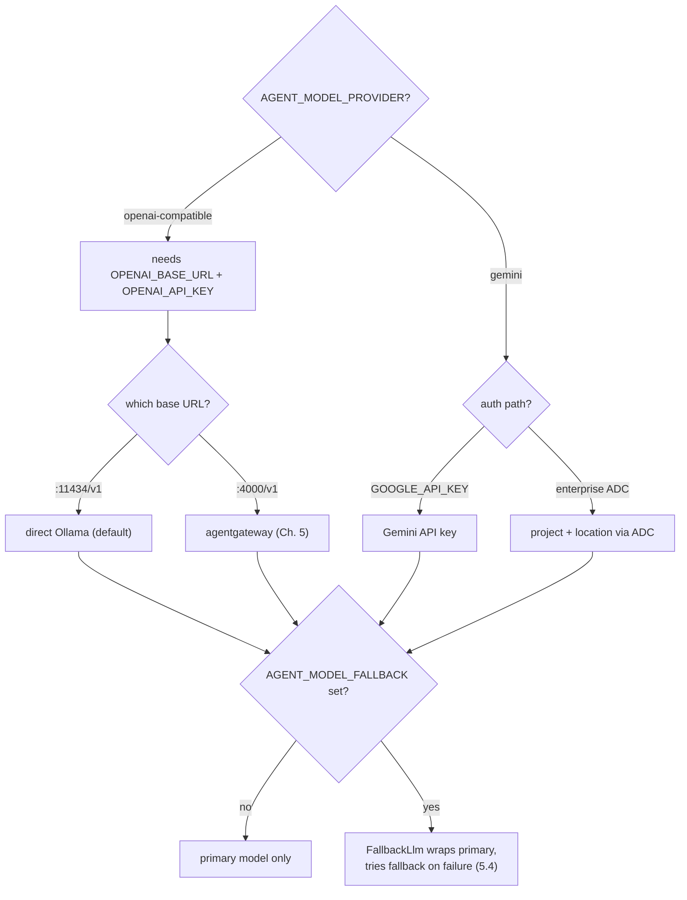

# 2.2. Models

## What is a large language model, really?

A large language model is a function that reads a sequence of tokens and predicts the next one. That is the whole primitive. Everything else — chat, reasoning, tool use — is built by wrapping that one operation in a loop and feeding its output back in as input.

Three consequences follow, and every surprise in this chapter traces back to one of them:

- **It predicts, it does not look up.** The model has no database of facts. It produces the statistically plausible continuation of your text, which is why a fluent, confident, entirely invented runbook is not a malfunction — it is the primitive working exactly as designed. Grounding ([2.3](./2.3.%20Instructions.md)) and retrieval ([3.4](../3.%20Capabilities/3.4.%20Memory.md)) exist to constrain that tendency, not to cure it.
- **It is stateless.** The model remembers nothing between calls. A "conversation" is an illusion the runtime maintains by resending the entire history on every turn. That is why sessions ([2.4](./2.4.%20Sessions.md)) are a runtime concern, and why a long chat gets slower and more expensive with each turn rather than settling down.
- **It is not deterministic by default.** The same prompt can yield a different answer, because the next token is _sampled_ from a probability distribution rather than chosen outright. This is the single fact that most complicates testing an agent, and it is why Chapter 4 separates model-free tests from model-backed evaluations.



The loop stops when the model emits a special end-of-turn token or hits a length cap. Nothing in this picture understands your incident — it continues your text, one token at a time.

## What do tokens, context, and parameters actually mean?

Four numbers describe a model, and confusing them is the usual cause of "why is this slow / broken / huge?":

| Term               | What it is                                                                                                         | Why it matters here                                                                                           |
| ------------------ | ------------------------------------------------------------------------------------------------------------------ | ------------------------------------------------------------------------------------------------------------- |
| **Token**          | A chunk of text (~3–4 characters of English) — the unit the model reads and writes                                 | You are billed, rate-limited, and truncated in tokens, never in words                                         |
| **Context window** | The maximum tokens the model can attend to at once — instruction + history + tool schemas + tool results, together | Exceed it and the oldest content is silently dropped ([3.4](../3.%20Capabilities/3.4.%20Memory.md))           |
| **Parameters**     | The learned weights — the "4B" in `qwen3:4b-instruct` means ~4 billion                                             | Sets the memory floor and roughly tracks capability                                                           |
| **Quantization**   | Storing each weight in fewer bits (16-bit → 4-bit)                                                                 | Turns a ~8 GB model into ~2.5 GB with a modest quality cost — it is why a 4B model runs on your laptop at all |

So `qwen3:4b-instruct` at 2.5 GB is ~4 billion parameters quantized to about 4 bits each. The arithmetic is worth doing once: 4 billion weights × 4 bits ÷ 8 bits-per-byte ≈ 2 GB, plus overhead. Parameter count and file size are related by quantization, and neither is the context window.

!!! warning "Open weights is not open source"

    An **open-weight** model publishes its trained parameters. **Open source**, strictly, would also mean publishing the training data and code to reproduce them. Almost no frontier-class model does the latter, including the one this course defaults to. `qwen3:4b-instruct` is Apache-2.0 licensed weights: you may run, modify, and redistribute them commercially with no account and no fee — which is what the course's "account-free" promise actually rests on. But you could not rebuild it from scratch. Be precise about this when you make claims about your own agent's supply chain ([7.0](../7.%20Observability/7.0.%20Reproducibility.md)).

## Why does an agent need an instruction-tuned model?

A **base** model only continues text. Ask it a question and it may well reply with more questions, because that is a plausible continuation of a page of questions. **Instruction tuning** is additional training that teaches the model to treat your text as a request to satisfy and to respect a system instruction. The `-instruct` suffix marks this, and without it an agent's system prompt is merely a suggestion.

Some models also expose a **thinking** (reasoning) mode, where the model first generates hidden intermediate tokens before its real answer. It helps on hard multi-step problems and costs latency and tokens on every call. The course defaults to the non-thinking `qwen3:4b-instruct` because agent work here is dominated by _choosing the right tool_, not by solving puzzles — and because a shorter, more predictable turn makes the recorded trajectories in [4.4](../4.%20Quality/4.4.%20Evaluations.md) far easier to compare. `qwen3:4b-thinking` is a drop-in swap if you want to measure the trade rather than take our word for it.

## How does a model actually call a tool?

This is the mechanism the whole course rests on, and it is less magical than it looks: **the model never executes anything.** It only emits text saying which function it would like called. Your runtime decides whether to obey.



Two things deserve emphasis, because they are where safety actually comes from:

1. **The tool schema is part of the prompt.** ADK serializes your Python signatures and docstrings into JSON and sends them on every call. That is why the type hints and docstrings in [3.1](../3.%20Capabilities/3.1.%20Tools.md) are not decoration — they are the API description the model reads, and they consume context on every turn.
1. **The gap between "asks" and "runs" is your entire control point.** A model can request `restart_service` for any reason, including because a malicious log line told it to. It cannot make that happen. Validation, approval, and least privilege all live in that gap ([4.5](../4.%20Quality/4.5.%20Guardrails.md)), which is why a compromised prompt is a containable problem rather than a breach.

A model's ability to emit well-formed, correctly-chosen tool calls is therefore _the_ capability that decides whether an agent works. It matters far more than prose quality, and it is why this course selects models on tool-calling benchmarks rather than chat leaderboards.

## Why are the provider and model explicit?

Agent behavior, latency, context limits, tool use, and cost can change between model versions and provider adapters. The repository declares both boundaries instead of relying on SDK defaults:

```python
--8<-- "agents/python/src/agent/config.py:settings-provider-fields"
```

The lockfile pins the client libraries, not a mutable Ollama tag or hosted provider weights. Record the provider, model, base URL, installed Ollama model ID where applicable, prompt version, and evaluation result together.

`build_model()` resolves those fields into a concrete client, and the cross-field validator ([2.1](./2.1.%20First%20Agent.md#how-does-the-agent-fail-fast-on-bad-configuration)) rejects an incomplete combination before the agent is built:



The fallback branch is opt-in and stays on the same account-free provider; how it fails over is [5.4. Model Gateway](../5.%20Gateway/5.4.%20Model%20Gateway.md#how-does-the-agent-fail-over-when-the-primary-model-is-down).

## How does the default local model work?

The required path uses ADK's OpenAI-compatible adapter directly against Ollama:

```bash
AGENT_MODEL_PROVIDER=openai-compatible
AGENT_MODEL=qwen3:4b-instruct
OPENAI_BASE_URL=http://127.0.0.1:11434/v1
OPENAI_API_KEY=local-ollama
```

`qwen3:4b-instruct` is an Apache-2.0 open-weight model. `local-ollama` is a non-secret marker required by the client, not an Ollama credential. This path has no account, mandatory SaaS, or usage fee.

Pull it once:

```bash
ollama pull qwen3:4b-instruct
```

## Why this model, and not a different one?

Because it is the best answer to a constraint, not the best model in the abstract. The constraint is strict: it must run on an ordinary laptop with no account, carry a license permitting commercial use and redistribution, and — above all — call tools reliably. That last requirement eliminates most of the field before capability is even discussed.

Against that, `qwen3:4b-instruct` (the Qwen3 4B Instruct 2507 release) is chosen for:

| Criterion             | Value               | Why it decides                                                                                       |
| --------------------- | ------------------- | ---------------------------------------------------------------------------------------------------- |
| Size                  | ~2.5 GB (4-bit)     | Fits comfortably beside your editor and a browser                                                    |
| License               | Apache-2.0, ungated | No account, no click-through, redistributable                                                        |
| Tool calling          | BFCL-v3 61.9        | The capability the agent lives or dies on                                                            |
| Instruction following | IFEval 83.4         | Whether the system instruction is obeyed                                                             |
| Context               | 262K native         | Far more than the Ollama serving window will give you ([3.4](../3.%20Capabilities/3.4.%20Memory.md)) |

!!! tip "Try a different model — but measure, do not assume"

    Nothing here is sacred, and the config is one environment variable. Two nearby options:

    - **`qwen3:4b-thinking`** — the same 2.5 GB and family, with reasoning mode on. Better on hard multi-step problems, slower on every turn.
    - **`gemma4:e4b`** — Google's Gemma 4, also Apache-2.0 and ungated, with native function calling plus vision and audio. It is a genuinely strong model. It is **not** a like-for-like swap: despite the "E4B" name meaning ~4.5B *effective* parameters, it carries 8B parameters with embeddings and lands around **9.6 GB** — roughly four times the footprint of the default at full precision, or about 2.4× if you pull the quantized `e4b-it-qat` build (~6.1 GB). That is the only reason it is not the default here, and if your machine has the memory it is well worth comparing.

    Whichever you try, hold everything else constant and use the method below rather than a vibe.

## How does Chapter 5 add the gateway?

Keep the provider/model contract and change the base URL:

```bash
AGENT_MODEL_PROVIDER=openai-compatible
AGENT_MODEL=qwen3:4b-instruct
OPENAI_BASE_URL=http://127.0.0.1:4000/v1
OPENAI_API_KEY=local-ollama
```

agentgateway then owns the upstream Ollama route, traffic policy, and telemetry without forcing an application provider switch. The optional GKE profile can route to Vertex/Gemini without adding a provider-specific SDK to the OpenAI-compatible application branch.

## Why require an API key for a local model?

The OpenAI client requires a non-empty key even when direct Ollama or the default local gateway route has no authentication. `local-ollama` is a marker, not a secret. In a real shared environment, replace that marker with actual client authentication and keep upstream cloud identity at the gateway.

## How does optional native Gemini work?

Set an explicit provider and model in the gitignored root `.env`:

```bash
AGENT_MODEL_PROVIDER=gemini
AGENT_MODEL=gemini-3.5-flash
GOOGLE_API_KEY=replace-me
```

For Application Default Credentials, use `GOOGLE_GENAI_USE_ENTERPRISE=true` with `GOOGLE_CLOUD_PROJECT` and `GOOGLE_CLOUD_LOCATION`, then run `mise run doctor:gcp`. Typed configuration rejects a missing or ambiguous auth path; model construction passes the chosen values explicitly to the native client and applies `AGENT_MODEL_TIMEOUT_S` as an HTTP request deadline. The application does not inspect key prefixes or silently switch products.

The model construction stays in one build-checked excerpt:

```python
--8<-- "agents/python/src/agent/model.py:build-model"
```

## Does the course use LiteLLM?

No. Direct Ollama and agentgateway use ADK's OpenAI-compatible adapter; optional Gemini uses ADK's native adapter. The application, evaluation, and deployment paths have no LiteLLM dependency.

## How should you compare models?

Hold the prompt, seed data, tool schemas, and evaluation cases constant. Compare at least:

- Exact tool trajectory success.
- Grounding and hallucination failures.
- End-to-end latency and model-call count.
- Input/output tokens and provider price where applicable.
- Policy refusal and adversarial regression behavior.

A model that writes nicer prose but chooses the wrong tool is not an upgrade for this agent.

## What is the model checkpoint?

Run the staged model doctor and configuration tests, then use one read-only prompt:

```bash
mise run doctor:model
cd agents/python
uv run pytest tests/test_model.py
mise run run
```

Record the selected provider, model, and endpoint path. Do not compare two models from different runtime state; reset with `mise run data:reset` first.
