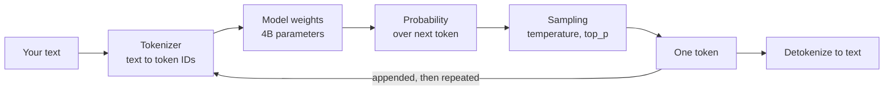
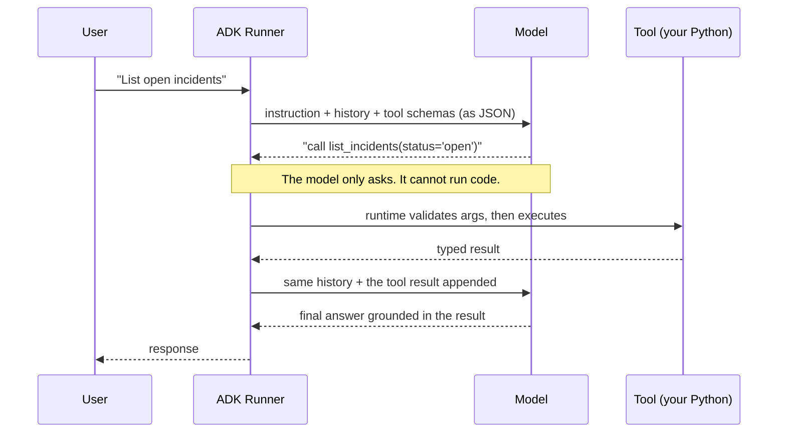
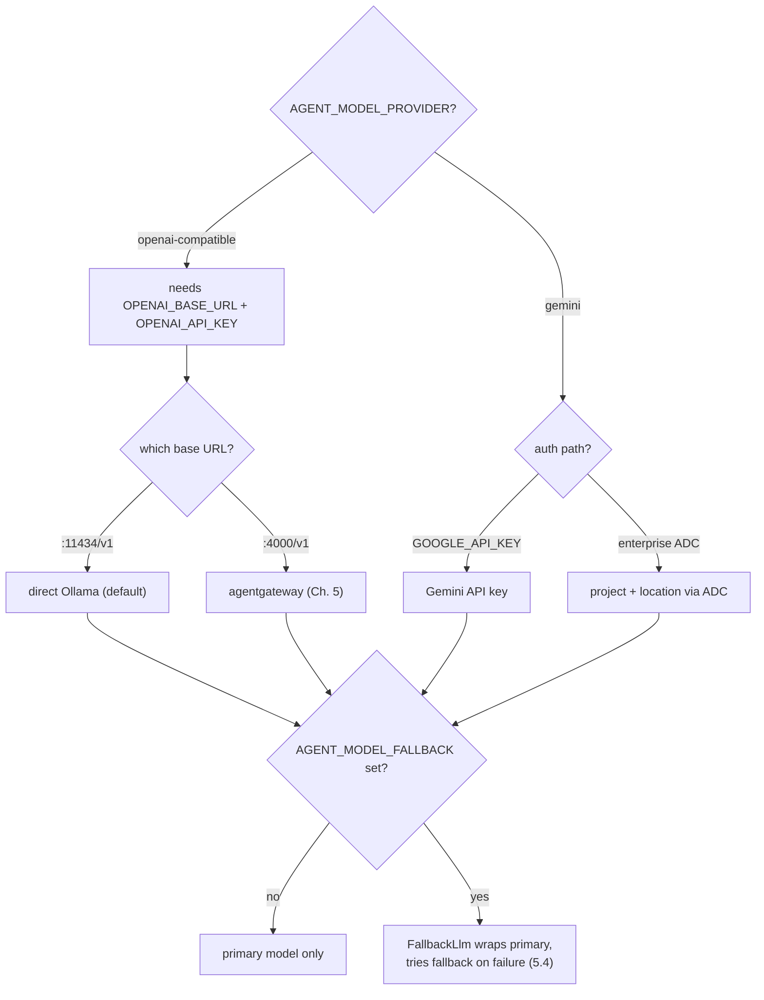

# 2.2. Models

!!! abstract "In one glance"

    - **You will:** Learn what the local model can and cannot do, send one real tool-calling request with `curl`, and see the four settings that decide which model your agent talks to.
    - **You need:** [2.1. First Agent](./2.1.%20First%20Agent.md) finished — the agent answered at least one prompt on qwen3:4b-instruct.
    - **Time:** about 16 minutes, reference.

## What is a large language model, really?

A large language model is a function that reads a sequence of tokens and predicts the next one. That is the whole primitive. Everything else — chat, reasoning, tool use — is built by wrapping that one operation in a loop and feeding its output back in as input.

Three consequences follow, and every surprise in this chapter traces back to one of them:

- **It predicts, it does not look up.** The model has no database of facts. It produces the statistically plausible continuation of your text, which is why a fluent, confident, entirely invented runbook is not a malfunction — it is the primitive working exactly as designed. Grounding ([2.3. Instructions](./2.3.%20Instructions.md)) and retrieval ([3.4. Memory](../3.%20Capabilities/3.4.%20Memory.md)) exist to constrain that tendency, not to cure it.
- **It is stateless.** The model remembers nothing between calls. A "conversation" is an illusion the runtime maintains by resending the entire history on every turn. That is why sessions ([2.4. Sessions](./2.4.%20Sessions.md)) are a runtime concern, and why a long chat gets slower and more expensive with each turn rather than settling down.
- **It is not deterministic by default.** The same prompt can yield a different answer, because the next token is _sampled_ from a probability distribution rather than chosen outright. This is the single fact that most complicates testing an agent, and it is why Chapter 4 separates model-free tests from model-backed evaluations.


```mermaid
flowchart LR
    Text[Your text] --> Tok[Tokenizer<br/>text to token IDs]
    Tok --> Model[Model weights<br/>4B parameters]
    Model --> Dist[Probability<br/>over next token]
    Dist --> Sample[Sampling<br/>temperature, top_p]
    Sample --> Next[One token]
    Next -->|appended, then repeated| Tok
    Next --> Out[Detokenize to text]
```

The loop stops when the model emits a special end-of-turn token or hits a length cap. Nothing in this picture understands your incident — it continues your text, one token at a time.

**Sampling** is the step where the randomness enters: `temperature` and `top_p` decide how freely the model picks among the likely next tokens.

## What do tokens, context, and parameters actually mean?

Four numbers describe a model, and confusing them is the usual cause of "why is this slow / broken / huge?":

| Term               | What it is                                                                                                         | Why it matters here                                                                                                                             |
| ------------------ | ------------------------------------------------------------------------------------------------------------------ | ----------------------------------------------------------------------------------------------------------------------------------------------- |
| **Token**          | A chunk of text (~3–4 characters of English) — the unit the model reads and writes                                 | You are billed, rate-limited, and truncated in tokens, never in words                                                                           |
| **Context window** | The maximum tokens the model can attend to at once — instruction + history + tool schemas + tool results, together | Exceed it and the request fails or old content is dropped, depending on the serving path ([3.4. Memory](../3.%20Capabilities/3.4.%20Memory.md)) |
| **Parameters**     | The learned weights — the "4B" in `qwen3:4b-instruct` means ~4 billion                                             | Sets the memory floor and roughly tracks capability                                                                                             |
| **Quantization**   | Storing each weight in fewer bits (16-bit → 4-bit)                                                                 | Turns a ~8 GB model into ~2.5 GB with a modest quality cost — it is why a 4B model runs on your laptop at all                                   |

So `qwen3:4b-instruct` at 2.5 GB is ~4 billion parameters quantized to about 4 bits each. The arithmetic is worth doing once: 4 billion weights × 4 bits ÷ 8 bits-per-byte ≈ 2 GB, plus overhead. Parameter count and file size are related by quantization, and neither is the context window.

!!! warning "Open weights is not open source"

    An **open-weight** model publishes its trained parameters. **Open source**, strictly, would also mean publishing the training data and code to reproduce them. Almost no frontier-class model does the latter, including the one this course defaults to. `qwen3:4b-instruct` is Apache-2.0 licensed weights: you may run, modify, and redistribute them commercially with no account and no fee — which is what the course's "account-free" promise actually rests on. But you could not rebuild it from scratch. Be precise about this when you make claims about your own agent's supply chain ([7.0. Reproducibility](../7.%20Observability/7.0.%20Reproducibility.md)).

## Why does an agent need an instruction-tuned model?

A **base** model only continues text. Ask it a question and it may well reply with more questions, because that is a plausible continuation of a page of questions. **Instruction tuning** is additional training that teaches the model to treat your text as a request to satisfy and to respect a system instruction. The `-instruct` suffix marks this, and without it an agent's system prompt is merely a suggestion.

Some models also expose a **thinking** (reasoning) mode, where the model first generates hidden intermediate tokens before its real answer. It helps on hard multi-step problems and costs latency and tokens on every call.

The course defaults to the non-thinking `qwen3:4b-instruct` for two reasons. Agent work here is dominated by _choosing the right tool_, not by solving puzzles. And a shorter, more predictable turn makes the recorded trajectories in [4.4. Evaluations](../4.%20Quality/4.4.%20Evaluations.md) far easier to compare. `qwen3:4b-thinking` is a drop-in swap if you want to measure the trade rather than take our word for it.

## How does a model actually call a tool?

This is the mechanism the whole course rests on, and it is less magical than it looks: **the model never executes anything.** It only emits text saying which function it would like called. Your runtime decides whether to obey.


```mermaid
sequenceDiagram
    participant U as User
    participant R as ADK Runner
    participant M as Model
    participant T as Tool (your Python)

    U->>R: "List open incidents"
    R->>M: instruction + history + tool schemas (as JSON)
    M-->>R: "call list_incidents(status='open')"
    Note over R,M: The model only asks. It cannot run code.
    R->>T: runtime validates args, then executes
    T-->>R: typed result
    R->>M: same history + the tool result appended
    M-->>R: final answer grounded in the result
    R-->>U: response
```

**Diagram in words:** A user sends a request to ADK, which sends the instruction, history, and tool schemas to the model. The model requests a tool; ADK validates and executes it, appends the typed result to history, and asks the model again. The model then returns a grounded answer through ADK to the user.

Two things deserve emphasis, because they are where safety actually comes from:

1. **The tool schema is part of the prompt.** ADK serializes your Python signatures and docstrings into JSON and sends them on every call. That is why the type hints and docstrings in [3.1. Tools](../3.%20Capabilities/3.1.%20Tools.md) are not decoration — they are the API description the model reads, and they consume context on every turn.
1. **The gap between "asks" and "runs" is your entire control point.** A model can request `restart_service` for any reason, including because a malicious log line told it to. It cannot make that happen. Validation, approval, and least privilege all live in that gap ([4.5. Guardrails](../4.%20Quality/4.5.%20Guardrails.md)), which is why a compromised prompt is a containable problem rather than a breach.

A model's ability to emit well-formed, correctly-chosen tool calls is therefore _the_ capability that decides whether an agent works. It matters far more than prose quality, and it is why this course selects models on tool-calling benchmarks rather than chat leaderboards.

## What does a tool call actually look like on the wire?

The diagram above is a drawing of one HTTP request and one HTTP response. Send them yourself, against the Ollama you already have running — no agent, no ADK, no framework in the way:

```bash
curl -s http://127.0.0.1:11434/v1/chat/completions \
  -H 'Content-Type: application/json' \
  -d '{
    "model": "qwen3:4b-instruct",
    "messages": [{"role": "user", "content": "Give me the details of incident INC-001."}],
    "tools": [
      {"type": "function", "function": {
        "name": "get_incident",
        "description": "Get the full details of one incident by its id.",
        "parameters": {
          "type": "object",
          "properties": {"incident_id": {"type": "string", "description": "The incident identifier, e.g. INC-001."}},
          "required": ["incident_id"]}}},
      {"type": "function", "function": {
        "name": "search_service_logs",
        "description": "Search deterministic sample logs for one service, newest matching lines first.",
        "parameters": {
          "type": "object",
          "properties": {
            "service": {"type": "string", "description": "Service slug, e.g. checkout or inventory."},
            "query": {"type": "string", "description": "Optional case-insensitive text each returned line must contain."}},
          "required": ["service"]}}}
    ]
  }' | jq .
```

Those two `tools` entries are the wire form of `get_incident` and `search_service_logs` in [`tools.py`](https://github.com/MLOps-Courses/agentops-open-course/blob/main/agents/python/src/agent/tools.py). ADK builds them for you from the Python signature and docstring; nothing else is added.

The reply carries no prose at all:

```json
{
  "id": "chatcmpl-284",
  "object": "chat.completion",
  "created": 1785312000,
  "model": "qwen3:4b-instruct",
  "choices": [
    {
      "index": 0,
      "message": {
        "role": "assistant",
        "content": "",
        "tool_calls": [
          {
            "id": "call_h3k9d2",
            "type": "function",
            "function": {
              "name": "get_incident",
              "arguments": "{\"incident_id\":\"INC-001\"}"
            }
          }
        ]
      },
      "finish_reason": "tool_calls"
    }
  ],
  "usage": { "prompt_tokens": 273, "completion_tokens": 24, "total_tokens": 297 }
}
```

Your ids, timestamps, and token counts will differ; the shape will not. Four details in that response are the whole contract every later chapter builds on:

1. **`finish_reason` is `tool_calls`, not `stop`.** The model is not done. It has stopped mid-answer to ask for something, and the runtime — not the model — decides what happens next.
1. **`arguments` is a JSON _string_, not an object.** It is generated text. It can be malformed, carry an unknown field, or name an id that does not exist. Parsing and validating it at the boundary ([3.1. Tools](../3.%20Capabilities/3.1.%20Tools.md)) is not defensive style; it is the only thing standing between generated text and your database.
1. **`tool_calls` is a list.** A model may request several calls in one reply, which is why the instruction in [2.3. Instructions](./2.3.%20Instructions.md) has to say explicitly when reads are sequential.
1. **`prompt_tokens` already counts the schemas.** Every description and every parameter name you write is resent on every turn. That is the concrete cost behind [3.4. Memory](../3.%20Capabilities/3.4.%20Memory.md)'s context arithmetic — and the reason those descriptions are also an injection surface ([3.3. MCP](../3.%20Capabilities/3.3.%20MCP.md)): they reach the model as instruction text, from whoever supplied the tool.

To finish the turn you would append the assistant message and a `{"role": "tool", "tool_call_id": "call_h3k9d2", "content": "…"}` message with your tool's real result, then POST the whole list again. That second request is the agentic loop, and it is all ADK's `Runner` does on your behalf.

## Why are the provider and model explicit?

Agent behavior, latency, context limits, tool use, and cost can change between model versions and provider adapters. The repository declares both boundaries instead of relying on SDK defaults:

```python
--8<-- "agents/python/src/agent/config.py:settings-provider-fields"
```

The lockfile pins the client libraries, not a mutable Ollama tag or hosted provider weights. Record the provider, model, base URL, installed Ollama model ID where applicable, prompt version, and evaluation result together.

The first field, `entrypoint`, is orthogonal to model selection. `mise run run`, `mise run workflow`, and `mise run coordinator` set its validated value while reusing the provider fields below it.

`build_model()` resolves those fields into a concrete client, and the cross-field validator ([2.1. First Agent](./2.1.%20First%20Agent.md#how-does-the-agent-fail-fast-on-bad-configuration)) rejects an incomplete combination before the agent is built:


```mermaid
flowchart TD
    P{"AGENT_MODEL_PROVIDER?"}
    P -->|openai-compatible| O["needs OPENAI_BASE_URL + OPENAI_API_KEY"]
    O --> OU{"which base URL?"}
    OU -->|":11434/v1"| Oll["direct Ollama (default)"]
    OU -->|":4000/v1"| GwB["agentgateway (Ch. 5)"]
    P -->|gemini| G{"auth path?"}
    G -->|GOOGLE_API_KEY| Key["Gemini API key"]
    G -->|enterprise ADC| ADC["project + location via ADC"]
    Oll --> F{"AGENT_MODEL_FALLBACK set?"}
    GwB --> F
    Key --> F
    ADC --> F
    F -->|no| Prim["primary model only"]
    F -->|yes| Fb["FallbackLlm wraps primary,<br/>tries fallback on failure (5.4)"]
```

The fallback branch is opt-in and stays on the same account-free provider. `FallbackLlm` is the wrapper in that diagram: it tries the primary model, then a secondary one when the primary fails outright. How it fails over is [5.4. Model Gateway](../5.%20Gateway/5.4.%20Model%20Gateway.md#how-does-the-agent-fail-over-when-the-primary-model-is-down).

## How does the default local model work?

The required path uses ADK's OpenAI-compatible adapter directly against Ollama. You do not need to set any of the four settings below: they are the shipped defaults, printed here so you can see the contract.

```bash
AGENT_MODEL_PROVIDER=openai-compatible
AGENT_MODEL=qwen3:4b-instruct
OPENAI_BASE_URL=http://127.0.0.1:11434/v1
OPENAI_API_KEY=local-ollama
```

To override one, put it in the gitignored `.env` at the repository root.

`qwen3:4b-instruct` is an Apache-2.0 open-weight model. `local-ollama` is a non-secret marker required by the client, not an Ollama credential. This path has no account, mandatory SaaS, or usage fee.

!!! warning "The account-free path runs on an experimental ADK namespace"

    Be aware of what you are standing on. `model.py` imports `OpenAILlm` from `google.adk.models`, but that name is re-exported: ADK resolves it from `google.adk.labs.openai`, whose implementation lives in the underscore-private module `_openai_llm.py`. **ADK Labs is not the stable API surface.** Native `Gemini` lives in `google.adk.models` proper; the OpenAI-compatible adapter — the one the required, account-free path uses from Chapter 2 to Chapter 7 — does not.

    The blast radius is bounded but real. A relocation or rename inside `labs` breaks model construction for every learner on the default path, at import time rather than mid-turn, on an ADK minor bump. It cannot corrupt state or leak data; it can stop the agent from starting.

    Two things contain it. The lockfile pins the exact ADK version, so an upgrade is a deliberate commit and never a surprise. And `ResilientOpenAILlm` subclasses `OpenAILlm` in one place, so the whole exposure is a single class in `model.py`. The exit, if the namespace moves and does not come back, is that same one file: point it at whatever ADK exposes then, or at the OpenAI SDK directly — the wire contract you just curled is stable even when the wrapper around it is not.

Pull it once:

```bash
ollama pull qwen3:4b-instruct
```

??? note "Deeper: why require an API key for a local model?"

    The OpenAI client requires a non-empty key even when direct Ollama or the default local gateway route has no authentication. `local-ollama` is a marker, not a secret. In a real shared environment, replace that marker with actual client authentication and keep upstream cloud identity at the gateway.

## Why this model, and not a different one?

Because it is the best answer to a constraint, not the best model in the abstract. The constraint is strict: it must run on an ordinary laptop with no account, carry a license permitting commercial use and redistribution, and — above all — call tools reliably. That last requirement eliminates most of the field before capability is even discussed.

Against that, `qwen3:4b-instruct` (the Qwen3 4B Instruct 2507 release) is chosen for:

| Criterion             | Value                                                       | Why it decides                                                                                                                                                                                                        |
| --------------------- | ----------------------------------------------------------- | --------------------------------------------------------------------------------------------------------------------------------------------------------------------------------------------------------------------- |
| Size                  | ~2.5 GB (4-bit)                                             | Fits comfortably beside your editor and a browser                                                                                                                                                                     |
| License               | Apache-2.0, ungated                                         | No account, no click-through, redistributable                                                                                                                                                                         |
| Tool calling          | BFCL-v3 61.9 (Berkeley Function-Calling Leaderboard, 0-100) | The capability the agent lives or dies on                                                                                                                                                                             |
| Instruction following | IFEval 83.4 (instruction-following benchmark, 0-100)        | Whether the system instruction is obeyed                                                                                                                                                                              |
| Context               | 262K native                                                 | Far more than the **serving window** Ollama actually applies by default; [3.4. Memory](../3.%20Capabilities/3.4.%20Memory.md#why-can-a-long-conversation-fail-or-forget-its-start) shows how to check the one you get |

Both benchmark scores are published numbers on a 0-100 scale where higher is better. They are a starting point, not evidence about this agent.

!!! tip "Try a different model — but measure, do not assume"

    Nothing here is sacred, and the config is one environment variable. Two nearby options:

    - **`qwen3:4b-thinking`** — the same 2.5 GB and family, with reasoning mode on. Better on hard multi-step problems, slower on every turn.
    - **`gemma4:e4b`** — Google's Gemma 4, also Apache-2.0 and ungated, and a genuinely strong model. It is not a like-for-like swap: it needs roughly four times the memory of the default, which is the only reason it is not the default here.

    Whichever you try, hold everything else constant and use the method below rather than a vibe.

??? note "Deeper: how much bigger is `gemma4:e4b` really?"

    Despite the "E4B" name meaning ~4.5B *effective* parameters, it carries 8B parameters with embeddings and lands around **9.6 GB** at full precision — roughly four times the 2.5 GB default — or about 2.4× if you pull the quantized `e4b-it-qat` build (~6.1 GB). It also adds native function calling plus vision and audio. If your machine has that memory, it is well worth comparing.

## How should you compare models?

Hold the prompt, seed data, tool schemas, and evaluation cases constant. Compare at least:

- Exact tool trajectory success.
- Grounding and hallucination failures.
- End-to-end latency and model-call count.
- Input/output tokens and provider price where applicable.
- Policy refusal and adversarial regression behavior.

A model that writes nicer prose but chooses the wrong tool is not an upgrade for this agent.

Three tasks fill most of the scorecard below, all run from `agents/python`:

- `mise run eval` scores the tool trajectory over the committed eval set.
- `mise run eval:ground` checks recognized incident/severity and known service/runbook claims against that turn's question and retrieved evidence.
- `mise run eval:cost` records the tokens and model calls each case costs.

Latency you time yourself on the same fixed prompts. All three tasks are walked in [4.4. Evaluations](../4.%20Quality/4.4.%20Evaluations.md#which-evaluation-task-should-you-run-and-when).

Fill this scorecard from your own runs on the same fixed inputs. The baseline column carries the only two numbers this page can cite up front: the published benchmark proxies. Every operational row is yours to measure locally, so the comparison is about _this_ agent rather than a leaderboard.

| Measure                        | `qwen3:4b-instruct` (baseline) | Candidate |
| ------------------------------ | ------------------------------ | --------- |
| Tool-trajectory success        | BFCL-v3 61.9 (published proxy) |           |
| Hallucination / grounding rate |                                |           |
| p50 latency                    |                                |           |
| Model-call count               |                                |           |
| Input / output tokens          |                                |           |
| Refusal regressions            | IFEval 83.4 (published proxy)  |           |

Published BFCL/IFEval scores predict tool-calling and instruction-following in the abstract; they do not substitute for the measured rows, which is why the baseline cells say "proxy" and the rest start empty.

## Which other provider paths exist?

Two, and you need neither to finish the course: the Chapter 5 gateway, and native Gemini. Both keep the same explicit provider-and-model contract you just read.

The gateway path keeps the provider/model contract and changes the base URL:

```bash
AGENT_MODEL_PROVIDER=openai-compatible
AGENT_MODEL=qwen3:4b-instruct
OPENAI_BASE_URL=http://127.0.0.1:4000/v1
OPENAI_API_KEY=local-ollama
```

agentgateway then owns the upstream Ollama route, traffic policy, and telemetry without forcing an application provider switch. The optional GKE profile can route to Vertex/Gemini without adding a provider-specific SDK to the OpenAI-compatible application branch.

??? note "Deeper: does the course use LiteLLM?"

    No. Direct Ollama and agentgateway use ADK's OpenAI-compatible adapter; optional Gemini uses ADK's native adapter. The application, evaluation, and deployment paths have no LiteLLM dependency.

    **LiteLLM** is a library that routes model calls to many providers behind one API. Nothing here depends on it.

## How does optional native Gemini work?

Set an explicit provider and model in the gitignored root `.env`:

```bash
AGENT_MODEL_PROVIDER=gemini
AGENT_MODEL=gemini-3.6-flash
GOOGLE_API_KEY=replace-me
```

The alternative to a key is **Application Default Credentials**, the credentials Google's SDKs find on the machine. For those, use `GOOGLE_GENAI_USE_ENTERPRISE=true` with `GOOGLE_CLOUD_PROJECT` and `GOOGLE_CLOUD_LOCATION`, then run `mise run doctor:gcp`.

Typed configuration rejects a missing or ambiguous auth path. Model construction passes the chosen values explicitly to the native client and applies `AGENT_MODEL_TIMEOUT_S` as an HTTP request deadline. The application does not inspect key prefixes or silently switch products.

The model construction stays in one build-checked excerpt:

```python
--8<-- "agents/python/src/agent/model.py:build-model"
```

!!! success "Key takeaways"

    - The model is a stateless next-token function: it predicts, it does not look up, and it remembers nothing between calls.
    - A tool call is one JSON field: the model returns `tool_calls` with a string of generated `arguments` and stops. Every control you add later lives between that request and your code running it.
    - The repository declares provider _and_ model explicitly rather than relying on SDK defaults, so behavior, cost, and limits are pinned and reproducible.
    - Choose a model by measuring tool-calling and grounding on this agent's fixed inputs, not by trusting a chat leaderboard — measure, do not assume.
    - Local `qwen3:4b-instruct` through Ollama is the default account-free path; Gemini is optional and never required to complete the course.

## What proves this page worked?

Run the staged model doctor and configuration tests, then use one read-only prompt:

```bash
mise run doctor:model
cd agents/python
uv run pytest tests/test_model.py
mise run run
```

That focused `pytest` run exits cleanly and gives fast feedback. `mise run test` adds branch coverage around the complete suite and is the gate that must clear 95%.

Record the selected provider, model, and endpoint path. Do not compare two models from different runtime state; reset with `mise run data:reset` first.

**You are done when:**

- `mise run doctor:model` ends with `ollama     qwen3:4b-instruct ready on 127.0.0.1:11434`.
- `uv run pytest tests/test_model.py` reports every test passed from `agents/python`.
- `mise run run` answers one read-only prompt with no `.env` file and no account.
- Your own `curl` with a `tools` array came back with `finish_reason: "tool_calls"`, and you can say why `arguments` has to be parsed and validated before anything acts on it.
- You can name the four settings that select the model, and say which single one you would change to move behind the Chapter 5 gateway.
- You can name the ADK namespace the default OpenAI-compatible adapter is resolved from, and the single file you would change if it moved.

Continue to [2.3. Instructions](./2.3.%20Instructions.md) when you can name the provider, model, and base URL your agent is actually using.
