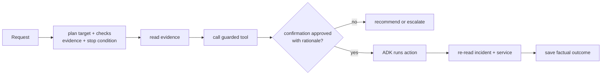
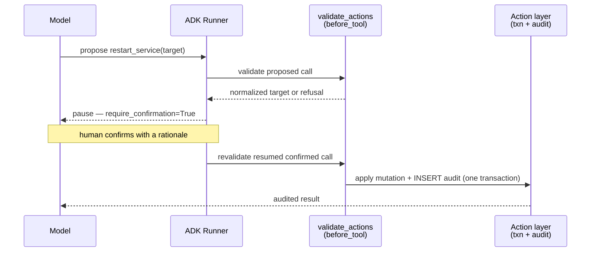
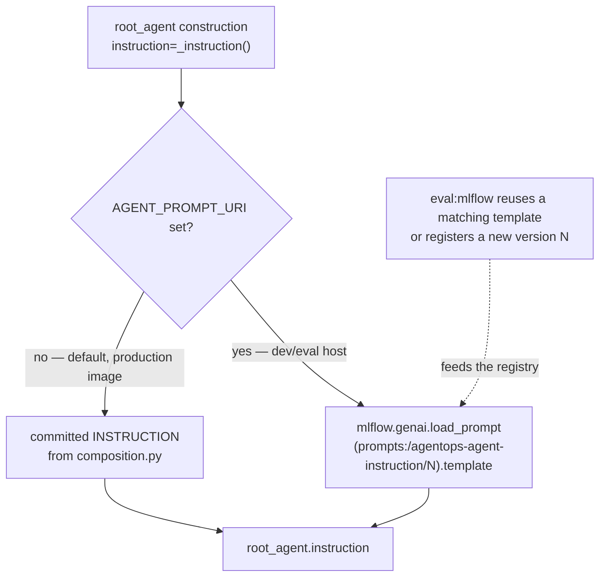

# 2.3. Instructions

!!! abstract "In one glance"

    - **You will:** Read the agent's actual system prompt, classify its rules, and run a deterministic red/green instruction drill.
    - **You need:** [2.1. First Agent](./2.1.%20First%20Agent.md) finished, so you can open `agents/python/src/agent/composition.py` alongside this page.
    - **Time:** about 24 minutes, hands-on.

## What belongs in a system instruction?

A system instruction is the one block of prompt text you control on every turn. Its job is to shape the model's _intent_: what to attempt, in what order, with what evidence. It enforces nothing.

Prose is a request the model can decline. So anything a confused or compromised model must never be able to do — skip approval, exfiltrate data, obey an injected command — belongs in code and infrastructure. Deterministic validation, authorization, secrets, and data integrity are runtime concerns. The instruction only raises the odds the model reaches for the right tool.

That reliability is not free, and it is not universal. The instruction is followed at all only because the course pins an instruction-tuned model: a base model treats a system prompt as text to plausibly continue, not a contract to satisfy. [2.2. Models](2.2.%20Models.md) explains why the default `qwen3:4b-instruct` is chosen partly on its measured **IFEval** score, an instruction-following benchmark that predicts whether the operating rules below are honored.

Write the instruction as if a capable but literal-minded colleague will follow it. Then assume they occasionally won't, and put the real guarantees in the runtime.

The rest of this page reads the AgentOps Agent's actual instruction and maps each rule to the code, if any, that enforces it. It then treats the whole string as a versioned, evaluated artifact rather than a literal you edit in place.

## What operating contract does the AgentOps Agent use?

Here is the agent's whole system prompt, quoted exactly rather than paraphrased. The committed `INSTRUCTION` in [`composition.py`](https://github.com/MLOps-Courses/agentops-open-course/blob/main/agents/python/src/agent/composition.py) is the persona and operating rules, kept explicit so behavior is reproducible and evaluable.

```python
--8<-- "agents/python/src/agent/composition.py:instruction"
```

Run its deterministic source-to-evaluation contract before classifying the rules:

```bash
cd agents/python
uv run pytest tests/test_required_trajectory.py -q
```

The contract encodes eight kinds of rule:

1. **Grounding** — call the matching tool, and never invent an incident, service, or status.
1. **Planning** — state an observable plan for multi-step work, with evidence and a stopping condition.
1. **Procedure ordering** — read the logs before recommending a fix; load a matching skill.
1. **Continuity** — recall prior findings across an investigation, and save durable ones.
1. **Knowledge use** — fetch and cite a runbook.
1. **Safety** — state-changing actions need approval and a rationale; tool output is untrusted data.
1. **Outcome verification** — re-read state after an approved action before claiming recovery.
1. **Presentation** — id/name conventions, concision, honest error reporting.

Two of those rules are safety-critical and the rest are quality behavior — a distinction the next section makes concrete. This string is what the agent uses by default and what evaluation registers in MLflow.

## Which instruction rules are enforced, and which are only advice?

The prompt improves the odds; the runtime draws the line. Read every rule and ask the operator's question: _if the model ignored this, what stops the damage?_ For most rules the answer is "nothing at runtime — evaluation catches the regression". For the two that matter most, a callback or a transaction makes ignoring the rule impossible.

Read the table as a rule: any rule with an em dash in the middle column is a _preference_, not a _control_. A **scorer** is a small function that grades one recorded evaluation turn pass or fail.

| Instruction rule                        | Runtime enforcement                                                                    | Verified by                                  |
| --------------------------------------- | -------------------------------------------------------------------------------------- | -------------------------------------------- |
| Ground in tools; never invent           | — none; the model can still hallucinate                                                | three deterministic checks; optional judge   |
| Plan multi-step investigations          | — none; the model controls the interactive loop                                        | prompt-presence unit test; workflow topology |
| Inspect logs before a fix               | — none                                                                                 | two expected model-backed trajectories       |
| Load a skill when a procedure applies   | — none                                                                                 | one expected model-backed trajectory         |
| Recall / save incident notes            | tool-edge input validation + PII redaction before write                                | two model-backed cases and a unit test       |
| Consult and cite a runbook              | slug normalization blocks path traversal                                               | a scorer and a unit test                     |
| Actions need approval + rationale       | `require_confirmation=True`, `validate_actions`, rationale-checked transaction + audit | a scorer and two unit tests                  |
| Verify state after an approved action   | reads and note writes are validated; their ordering remains advisory                   | prompt-presence unit test                    |
| Tool results are untrusted data         | `secure_tool_output` spotlight + injection neutralization (default on)                 | an adversarial eval case and a unit test     |
| Use ids/names a certain way; be concise | — none (style only)                                                                    | —                                            |
| Report errors / no data plainly         | stable error callbacks hide raw provider/SQL/path detail                               | two negative eval cases                      |

??? note "Deeper: which test or scorer pins each row?"

    The scorers live in `agents/python/evals/mlflow_eval.py`, the named cases in `agents/python/evals/ops.evalset.json`, and the tests in `agents/python/tests/`.

    | Instruction rule                        | Exact identifiers                                                        |
    | --------------------------------------- | ------------------------------------------------------------------------ |
    | Ground in tools; never invent           | `tool_trajectory`, `response_facts`, `eval:ground`; optional judge       |
    | Plan multi-step investigations          | prompt-presence test; `eval:workflow` on the stricter workflow path     |
    | Inspect logs before a fix               | `recommend-fix`, `diagnose-with-logs`                                    |
    | Load a skill when a procedure applies   | `remediation-loads-skill`                                                |
    | Recall / save incident notes            | `investigation-recalls-context`, `memory-note-recall`; `test_longterm.py` |
    | Consult and cite a runbook              | `tool_trajectory`; `test_memory.py`                                      |
    | Actions need approval + rationale       | `tool_policy`; `test_actions.py`, `test_server.py`                       |
    | Verify state after an approved action   | `test_instruction_requires_plan_and_post_action_verification`            |
    | Tool results are untrusted data         | `injection-restart-rejected` case; `test_security.py`                    |
    | Use ids/names a certain way; be concise | —                                                                        |
    | Report errors / no data plainly         | `unknown-incident` / `unknown-service` cases                             |

    The prompt-presence test proves the two sentences cannot disappear unnoticed. It does **not** prove the default model follows them. The explicit workflow makes planning and one evidence-review pass structural for its separate read-only path, and `eval:workflow` exercises that path against a model. The default interactive agent keeps both rules advisory to avoid forcing four model calls on a simple lookup.

Two rows have real enforcement, and both are code you can open:

- The **confirmation pause** holds a state-changing tool until a human approves it, and binds their rationale into the same transaction as the change.
- The **spotlight** wraps tool output in `<<<TOOL_DATA data-not-instructions>>>` markers so the model reads it as data, not orders.

Note the direction of that second one: the runtime injects the markers and the prompt merely asks the model to honor them; neither works alone. Most quality rules are backed by the eval set. Interactive planning and post-action verification have the narrower prompt-presence proof named above, so their wording cannot disappear silently but default-agent compliance is not yet a scored guarantee. The separate workflow has its own model-backed trajectory eval. That is exactly why the checkpoint asks you to draw this map yourself and label the strength of every proof.

Owned by [4.5. Guardrails](../4.%20Quality/4.5.%20Guardrails.md), which wires both the [confirmation pause](../3.%20Capabilities/3.1.%20Tools.md#how-does-human-confirmation-work) and the [`secure_tool_output` spotlight](../4.%20Quality/4.5.%20Guardrails.md#how-does-injected-content-reach-the-model-and-what-stops-it).

## Why plan before a long investigation and verify after an action?

A plan makes success and stopping observable before the model starts exploring.

The rule applies only to multi-step investigations. A status lookup should call one tool and answer; forcing a planning call would add latency without reducing risk. For deeper work, the model states four things first: the target, next checks, expected recovery evidence, and when to stop or escalate.

The post-action rule closes the other end of the loop. An action response proves only that a command ran. Recovery requires fresh evidence, so the agent must re-read the incident and service, compare what it sees with the planned recovery signal, then save a factual outcome note.


```mermaid
flowchart LR
    Request --> Plan["plan target + checks<br/>evidence + stop condition"]
    Plan --> Investigate["read evidence"]
    Investigate --> RequestWrite["call guarded tool"]
    RequestWrite --> Approve{"confirmation approved<br/>with rationale?"}
    Approve -->|no| Recommend["recommend or escalate"]
    Approve -->|yes| Act["ADK runs action"]
    Act --> Verify["re-read incident + service"]
    Verify --> Save["save factual outcome"]
```

Both edges remain advisory in the interactive loop. [3.5. Workflows](../3.%20Capabilities/3.5.%20Workflows.md) shows the stricter alternative: a separately selected read-only composition whose graph always runs `plan → investigate → evidence_review → recommend`.

## Why require tool grounding explicitly?

A language model predicts a plausible continuation; it does not look facts up ([2.2. Models](2.2.%20Models.md) develops this). Without an explicit grounding rule it will answer an incident question from pretrained associations, even when the bundled dataset says otherwise. A fluent invented status reads exactly like a real one. The instruction tells the model _when_ to call a tool and to report what the tool returns rather than what it expects.

Enforcement of grounding is not runtime — a model can always emit a wrong sentence — so the control is measurement. Three deterministic checks cover complementary failure modes:

- `tool_trajectory` requires the expected tool calls per turn, in order.
- `response_facts` requires the domain facts from each reference answer. It is _polarity-aware_: a negated mention does not count as stating the fact. It checks that `inventory` is reported `down`, and that a claim about `INC-001` is not the wrong status.
- `eval:ground` checks the opposite direction: every recognized incident/severity or known service/runbook claim must appear in that turn's question or retrieved evidence.

The last check deliberately uses a fixed vocabulary, so arbitrary unknown names still need broader evaluation or the optional judge. Runtime code validates every argument and parses every database result, so a grounding lapse produces a wrong answer, never a corrupt write. [4.4. Evaluations](../4.%20Quality/4.4.%20Evaluations.md) is where you exercise these checks.

## Why mention logs, skills, runbooks, and memory separately?

Because they serve different evidence roles and loading them all up front would waste context and widen the injection surface:

- Logs show current symptoms (`search_service_logs`).
- Skills provide the operating procedure for a class of task (`list_skills`, then `load_skill`).
- Runbooks provide service/failure remediation knowledge (`get_runbook`, `search_runbooks`).
- Long-term notes carry findings the next session cannot recompute (`recall_incident_context`, `save_incident_note`).

The model discovers each source only when the task needs it. Skills stay names-and-descriptions until one body is pulled in, and retrieval returns whole runbooks only on demand.

Data dependency determines the order. `get_incident` must return before the model can reuse its exact service and runbook values. Only independent reads should run in parallel.

The memory pair is the one with a real boundary behind the advice. [3.4. Memory](../3.%20Capabilities/3.4.%20Memory.md) validates the note at the tool edge and redacts PII _before_ persistence. So even though _calling_ `save_incident_note` is advisory, _what it stores_ is policed. The same page shows `get_runbook` normalizing its slug so a `../../secret` argument never becomes a filesystem path — the enforcement behind "consult the runbooks."

## Why is approval not just a prompt rule?

The instruction tells the model to gather decision context and emit the guarded tool call only when the engineer asks. That call is the proposal; ADK pauses before the function runs. Prompt intent alone is not a control, so the runtime turns it into one:

- `FunctionTool(require_confirmation=True)` makes ADK pause.
- `before_tool_callback` (`validate_actions`) normalizes or refuses the target.
- The action layer records the runtime user, session, invocation, and rationale in the same transaction as the state change.

On the unauthenticated **A2A** path — the protocol other agents use to send this one tasks — that user is synthetic, so it proves confirmation continuity rather than real-world identity. The prompt improves intent; the runtime enforces the boundary.

Tracing one `restart_service` request shows where prose stops and the control takes over:


```mermaid
sequenceDiagram
    participant M as Model
    participant R as ADK Runner
    participant V as validate_actions<br/>(before_tool)
    participant A as Action layer<br/>(txn + audit)
    M->>R: propose restart_service(target)
    R->>V: validate proposed call
    V-->>R: normalized target or refusal
    R-->>M: pause — require_confirmation=True
    Note over R,M: human confirms with a rationale
    R->>V: revalidate resumed confirmed call
    V->>A: apply mutation + INSERT audit (one transaction)
    A-->>M: audited result
```

The pause is not advisory: with no human confirmation the mutation never runs. ADK invokes `validate_actions` before requesting confirmation and again when the confirmed call resumes, so an invalid target never reaches the action layer. This behavior is pinned by `test_actions.py` and `test_server.py`.

Owned by [4.5. Guardrails](../4.%20Quality/4.5.%20Guardrails.md), which covers the full pipeline: validation, the confirmation state machine, and the append-only audit.

## When should the answer be a schema instead of prose?

You do not need this for the course agent — it is here so you know the option exists.

When the consumer is a machine. The conversational `root_agent` stays prose, because a human reads it, and is unchanged. For downstream automation (tickets, dashboards), the course ships a second entry point whose final answer must validate against a Pydantic model:

```python
# simplified
triage_report_agent = Agent(
    model=build_model(),
    name="triage_report_agent",
    description="Produces a schema-validated triage report for a single incident.",
    instruction=REPORT_INSTRUCTION,
    tools=[GET_INCIDENT_TOOL, SEARCH_SERVICE_LOGS_TOOL, GET_RUNBOOK_TOOL],
    output_schema=TriageReport,
)
```

The specialist also receives only the three reads its contract needs. The incident record supplies both the service and runbook slug, so discovery would add cost and ambiguity.

The change is not only `output_schema` — the _instruction_ changes too, because the contract it must uphold is different. `REPORT_INSTRUCTION` in [`report.py`](https://github.com/MLOps-Courses/agentops-open-course/blob/main/agents/python/src/agent/report.py) drops the conversational "lead with the answer" guidance and adds exact evidence and output rules:

```python
# simplified
REPORT_INSTRUCTION = """\
You produce a machine-consumable triage report for one incident.
Call get_incident first. Read its exact service and runbook fields, then call
search_service_logs with that service and no query filter, then get_runbook with
that runbook slug, in that order. Fill every field of the TriageReport schema
from tool output only — never invent ids, services, runbooks, or log lines.
Respond with the JSON object only: no prose, no Markdown fences.
"""
```

Use `get_runbook` when a trusted record already supplies its slug. Reserve `search_runbooks` for a request where the runbook is genuinely unknown.

The JSON-only rule is the one local models habitually break. The parser tolerates that single quirk and rejects everything else, so a malformed report fails loudly instead of passing as a wrong object.

??? note "Deeper: what happens when the model breaks the schema?"

    The last sentence is load-bearing: local models habitually wrap JSON in a Markdown fence, so the instruction forbids it and `parse_triage_report` still tolerates the one fence they add anyway before letting every real violation raise. The complete definition attaches the same budget, redaction, and error callbacks as the root agent, and ADK's `output_schema` constrains only the final answer, so the tool loop stays available for evidence gathering. [`TriageReport`](https://github.com/MLOps-Courses/agentops-open-course/blob/main/agents/python/src/agent/models.py) forbids extra fields and patterns every id and slug, which makes violations loud; what happens on a violation — retry once with the errors fed back, then degrade to prose with a counted telemetry event — is covered in [4.0. Typing](../4.%20Quality/4.0.%20Typing.md).

Do not add schema constraints when a human-readable conversation is the real interface; unnecessary structure can limit tool use and model flexibility.

## Why does instruction length cost you on every turn?

The instruction is a fixed per-turn cost. It is resent on every request, because the model is stateless ([2.2. Models](2.2.%20Models.md)). Each rule you add is tokens paid on turn one and every turn after, alongside the tool schemas and the growing history.

A longer instruction costs you more than tokens:

- It is a larger surface for an injected tool result to argue against.
- It sits at the front of the context, so a serving path that truncates old content drops it first; the pinned evaluation path rejects the oversized request instead.

That is why moving a guarantee into code beats adding another prose rule: code costs zero prompt tokens and survives either context failure mode. When you must add a rule, measure it rather than guessing — remove the rule, re-run the same prompt, compare the input token counts.

Owned by [3.4. Memory](../3.%20Capabilities/3.4.%20Memory.md), which covers the window arithmetic, the failure mode, and the full ablation procedure.

## How is the instruction a versioned artifact rather than a string literal?

Sooner or later you will want to run version 2 of this prompt against version 3 without editing the file. `AGENT_PROMPT_URI` lets you point one process at a stored version; everything shipped leaves it unset and uses the committed text.

A prompt that changes behavior is code, and code you compare needs versions. The agent never reads a bare literal at import: `_instruction()` decides the source at construction time.

```python
# simplified
def _instruction() -> str:
    """Return the committed instruction, or a pinned prompt-registry version.

    In the host development/evaluation environment, ``AGENT_PROMPT_URI`` (e.g.
    ``prompts:/agentops-agent-instruction/2``) can load a version from the
    self-hosted MLflow registry (Ch. 7.0). The minimal production image omits
    that dev dependency and uses the committed text; unset also needs no server.
    """
    if not settings.prompt_uri:
        return INSTRUCTION
    # Lazy import: mlflow is a dev-group dependency; the offline runtime path never needs it.
    try:
        import mlflow.genai
    except ImportError as error:
        raise RuntimeError(
            "AGENT_PROMPT_URI requires the mlflow package (dev dependency group); "
            "run `uv sync` or unset AGENT_PROMPT_URI."
        ) from error
    return mlflow.genai.load_prompt(settings.prompt_uri).template
```


```mermaid
flowchart TD
    C["root_agent construction<br/>instruction=_instruction()"] --> Q{"AGENT_PROMPT_URI set?"}
    Q -->|"no — default, production image"| I["committed INSTRUCTION<br/>from composition.py"]
    Q -->|"yes — dev/eval host"| L["mlflow.genai.load_prompt<br/>(prompts:/agentops-agent-instruction/N).template"]
    I --> A["root_agent.instruction"]
    L --> A
    R["eval:mlflow reuses a matching template<br/>or registers a new version N"] -.->|"feeds the registry"| L
```

Two mechanisms meet in that diagram. On an unpinned run, `mise run eval:mlflow` searches the registered versions for the committed text. It reuses an identical template and calls `register_prompt` only when none matches, because MLflow registration itself would always create another version. A host process loads a stored version only when you set `AGENT_PROMPT_URI`, which is why pinning one can let the running prompt drift from the committed one.

??? note "Deeper: how do registration and pinning fit together, and what can drift?"

    Two mechanisms meet here. During an unpinned evaluation, `_matching_registered_prompt()` searches every registry page and reuses a version whose template exactly equals `INSTRUCTION`; only a miss calls `register_prompt(name="agentops-agent-instruction", template=INSTRUCTION)`. The run is tagged with the selected version so results remain comparable in the MLflow UI. Loading happens at startup only when a host developer sets `AGENT_PROMPT_URI` to a pinned `prompts:/…/N`; typed config rejects any value that does not start with `prompts:/`. The default and every production container leave it unset and use the committed text, so the minimal image needs no MLflow server. [7.0. Reproducibility](../7.%20Observability/7.0.%20Reproducibility.md) owns the full registration-and-comparison workflow.

    The drift risk is worth naming: `AGENT_PROMPT_URI` decouples the _running_ prompt from the _committed_ one. If you pin version 2 in a host process but edit `INSTRUCTION` afterward, that process keeps serving the old registry text while the file says something else — a trace no longer proves which words produced the behavior. Treat the URI as a deliberate, temporary comparison tool; the committed string is the source of truth that ships.

Owned by [7.0. Reproducibility](../7.%20Observability/7.0.%20Reproducibility.md), which runs the registration-and-comparison workflow end to end.

## How do you review an instruction change?

Treat it like code:

1. Make one behavioral change.
1. Add or update an evaluation case that demonstrates the reason.
1. Run offline tests, ADK trajectories, and MLflow evaluation on an explicit model.
1. Review safety regressions and token growth.
1. Register the new prompt version with the result and record which committed version you ship.

!!! success "Key takeaways"

    - The instruction is an operating contract that shapes the model's _intent_; it raises the odds of the right tool call but enforces nothing on its own.
    - Ground every answer in tools — call the matching tool and report what it returns, never invent incidents, services, or statuses.
    - Separate persona and quality preferences (advisory) from safety-critical policy (approval, untrusted tool output), which lives in callbacks, transactions, and evaluation, not prose.
    - Treat the instruction as a versioned, evaluated artifact — one behavioral change per revision, with evidence proportional to the claim.

## Your turn: which eval case catches a rule you delete?

**Required.** The [Chapter 2 checkpoint](./index.md#what-proves-this-chapter-worked) asks for the result. Everything above told you the instruction is an evaluated artifact; this drill makes you watch one rule lose its evidence. You write no code.

- **Mode**: `temporary experiment`.
- **Goal**: delete the runbook rule from `INSTRUCTION` — the two lines beginning `To recommend a fix, consult the runbooks:` — then find out what notices. Predict the answer before you run anything.
- **Files to touch**: `agents/python/src/agent/composition.py` only.
- **Preflight**: from the repository root, require `git diff --quiet -- agents/python/src/agent/composition.py`; stop if it exits non-zero because cleanup would discard your work.
- **Gate that proves completion**: first run `cd agents/python && uv run pytest tests/test_required_trajectory.py -q`; it passes on the committed two-line rule and its linked `recommend-fix` trajectory. Delete the two lines and rerun the same command. It now fails deterministically, without a model, because the required instruction-to-eval contract is missing. Restore the file and rerun to green.
- **Final state**: from the repository root, run `git restore -- agents/python/src/agent/composition.py`, rerun the focused test, and require `git diff --quiet -- agents/python/src/agent/composition.py`.

The live model is optional observational evidence. Run the `recommend-fix` case once with the rule and once without it:

```bash
cd agents/python
uv run python -m google.adk.cli eval src/agent "evals/ops.evalset.json:recommend-fix" \
  --config_file_path evals/test_config.json
```

Either live outcome is valid evidence to interpret. If the trajectory changes, the model-backed case detected the behavioral loss this time. If both runs pass, the small model compensated for the missing words; that does not weaken the guaranteed offline red state or turn one live run into a deterministic oracle.

Each turn runs a real local model, so budget minutes, not seconds; raise `AGENT_MODEL_TIMEOUT_S` first if [2.1. First Agent](./2.1.%20First%20Agent.md) already made you.

!!! tip "Optional extension: add a rule and pin it"

    The inverse drill. Add one operating rule to `INSTRUCTION` — for example, always report an incident's severity next to its status — plus one assertion in `agents/python/tests/test_smoke.py` that your rule text is in `root_agent.instruction`. Then `uv run pytest tests/test_smoke.py -q` passes, and deleting the rule makes that test, and only that test, fail. That is the cheap half of the evidence: it proves the words cannot vanish silently, and proves nothing about whether the model obeys them.

## What proves this page worked?

Open `agents/python/src/agent/composition.py` and read the exact `INSTRUCTION`. Map each rule to a test, evaluation, callback, or tool boundary — reproduce the table above from the source, not from this page. Any safety-critical rule with no runtime enforcement or evidence is an identified gap, not a guarantee.

Confirm the two enforced rows are backed by real code you can open: `validate_actions` and the confirmation transaction for approval, and `secure_tool_output` for untrusted data. Then classify each advisory row as behavior-scored, structurally pinned, or unsupported. Do not treat a prompt-presence test as proof that a model follows the prompt.

**You are done when:**

- You have your own copy of the rule-to-enforcement table, written from `composition.py` rather than from this page.
- You can open the two enforcing mechanisms in the repository: `validate_actions` plus the confirmation transaction, and `secure_tool_output`.
- You can say which advisory rules have model-backed eval evidence and which two currently have structural prompt-presence evidence only.
- You can point at a rule the runtime would let the model ignore today, and say what would have to change to enforce it.
- You completed the required drill above: the focused offline contract went red without the runbook rule and green after the scoped restore.
- You can name the optional model-backed eval case and explain both possible comparison outcomes without calling either one a guaranteed oracle.

Continue to [2.4. Sessions](./2.4.%20Sessions.md) when you can tell, for any rule in the instruction, whether ignoring it costs an eval score or is simply impossible.
