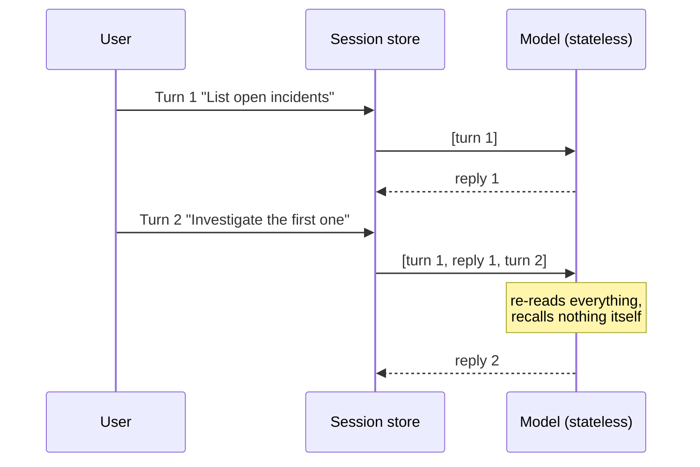
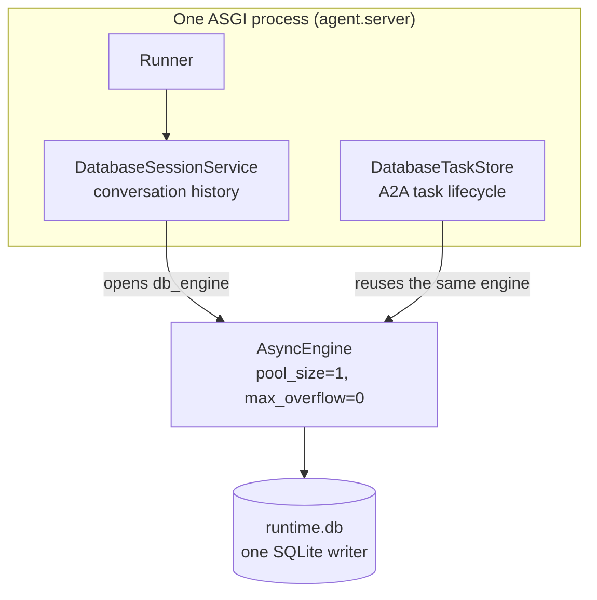

# 2.4. Sessions

## What is a session?

A session is one conversation keyed by application, user, and session id. It holds the events and state a later turn needs — nothing more. It is only one of several distinct stores this agent keeps; [3.4. Memory](../3.%20Capabilities/3.4.%20Memory.md) lays them all out in one table (conversation, A2A task, operational state, long-term notes, knowledge), and conflating them is a common source of bugs. This page owns the two _runtime_ stores in that table — the conversation session and the A2A task — plus the server lifecycle that persists both.

Sessions exist because of the fact established in [2.2](./2.2.%20Models.md): **the model is stateless.** It remembers nothing between calls. What feels like a conversation is the runtime re-sending the accumulated history on every single turn, and the model re-reading all of it from scratch each time:



Two practical consequences fall out of that picture, and both shape the rest of this chapter:

- **Cost and latency grow with conversation length**, because every turn resends everything before it. A long session is not merely untidy; it is quadratically expensive — [3.4](../3.%20Capabilities/3.4.%20Memory.md) covers the context-window pressure that follows.
- **Whoever owns the session owns the memory.** If the store is in-process, the "memory" dies with the process. That is why the A2A server below chooses ADK's `DatabaseSessionService`, not the `InMemorySessionService` that `adk web` uses by default — the one whose state a stray reload wipes mid-debug ([2.5](./2.5.%20Dev%20Loop.md)).

## What is an A2A task, and how does it differ from a session?

A session is replayed conversation history. An **A2A task** is one network unit of work with its own lifecycle — `submitted → working → input-required → working → completed` or `failed` — and its own id, so a client can poll, resume, or stream it rather than hold one blocking call open. [3.6. A2A](../3.%20Capabilities/3.6.%20A2A.md) owns the protocol and the full lifecycle diagram; what matters _here_ is that a task is durable state, not a wire format. The two stores answer different questions and are kept apart on purpose:

| Store    | Holds                                 | Keyed by             | Backed by                |
| -------- | ------------------------------------- | -------------------- | ------------------------ |
| Session  | conversation events and state         | app / user / session | `DatabaseSessionService` |
| A2A task | one work item's lifecycle + artifacts | task id              | `DatabaseTaskStore`      |

The `input-required` state is the load-bearing one. It is exactly the human-approval pause the guarded writes in [4.5](../4.%20Quality/4.5.%20Guardrails.md) depend on: the task suspends mid-flight, waits for a confirmed decision carrying a rationale, then resumes under the same task id. Because that pause lives in `DatabaseTaskStore` and not in process memory, a server restart _between_ the proposal and the approval does not discard the task — the approval can still land against the persisted work item. That is the concrete reason task persistence is a correctness property, not a nicety, and why the store is `DatabaseTaskStore` rather than an in-memory one for the same reason the session store is.

This network-task lifecycle is distinct from 4.5's write-transaction state machine: this one asks _is the delegated goal still in flight?_, while 4.5's asks _did the UPDATE and audit INSERT commit together?_. Per-task bounds — a model-call ceiling and a drain deadline — also act on this lifecycle; [3.6](../3.%20Capabilities/3.6.%20A2A.md#what-bounds-one-a2a-task) covers them, including that per-token model streaming stays off by default (`AGENT_A2A_STREAMING=false`) because chunked output weakens PII redaction across chunk boundaries.

## Why does persistence matter?

An in-memory session is fine for a short unit test, and it is what `adk web` uses by default — which is why a stray reload wipes your dev conversation ([2.5](./2.5.%20Dev%20Loop.md)). An A2A server is different: it receives long-running tasks and restarts independently of its clients, so dropping all session and task state on every process restart would be a correctness bug, not a tidy-up.

The server therefore backs both stores with SQLite, and — the subtle part — with one deliberately single-connection engine shared between them:



The session service opens the engine; the task store reuses `session_service.db_engine` instead of opening its own, so both stores literally share one connection. SQLite permits only one writer at a time, so `pool_size=1` with `max_overflow=0` hands out exactly one connection, ever, and the short session and task transactions queue behind it inside this single process rather than letting two independent engines race into intermittent `database is locked`. [3.6](../3.%20Capabilities/3.6.%20A2A.md#how-does-the-server-preserve-tasks) shows the exact construction and the 30-second connect timeout that lets a queued writer wait instead of failing. The cost of one writer is head-of-line blocking: a slow task write makes a concurrent one wait, up to that connect timeout, rather than fail — acceptable at course concurrency, but a scaling ceiling to watch. SQLite suits a single-replica course lab; multiple replicas or stronger durability would need a shared database with a migration and backup plan.

## Who closes runtime resources?

The app owns its runner, session service, SQLAlchemy engine, and task store as one `Runtime` dataclass, constructed in `create_app()`. A lifespan hook publishes the writable dataset on startup and closes every resource on shutdown:

```python
@asynccontextmanager
async def lifespan(_: Starlette):
    try:
        # The writable A2A process owns first-boot publication. Readiness
        # remains a strictly read-only observation after startup.
        db_path()
        yield
    finally:
        await runtime.close()
```

Startup calls `db_path()` once so the writable process owns first-boot publication of the runtime dataset; after that, readiness stays a strictly read-only observation. On the way down, `runtime.close()` closes the runner and then the session service that owns the shared engine — even when the first step raises — so a restart or a test never leaks a connection. See [`server.py`](https://github.com/MLOps-Courses/agentops-open-course/blob/main/agents/python/src/agent/server.py). Explicit ownership is what makes the store safe to reset and safe to probe.

## How does the server drain in-flight work on shutdown?

Persisting state is only half of a clean restart; the other half is not cutting a turn mid-flight when you can avoid it. On Kubernetes a rollout sends `SIGTERM`, and Uvicorn owns that signal: it stops accepting new connections, lets in-flight requests finish for up to a bounded window, then forces shutdown and runs the lifespan `finally` above. `main()` sets that window from configuration:

```python
uvicorn.run(
    create_app,
    factory=True,
    host=settings.a2a_bind_host,
    port=settings.a2a_port,
    timeout_graceful_shutdown=int(settings.drain_timeout_s),
)
```

`AGENT_DRAIN_TIMEOUT_S` defaults to 10 seconds and is validated `> 0` and `<= 300` in [`config.py`](https://github.com/MLOps-Courses/agentops-open-course/blob/main/agents/python/src/agent/config.py); `tests/test_server.py` asserts `timeout_graceful_shutdown` is wired to exactly that value. The config comment ties the bound to the deployment: a pod's `terminationGracePeriodSeconds` must exceed it, or the platform kills the process before the drain completes. The bound reduces avoidable interruption; it is not a correctness crutch. A turn that overruns the window is still cut, which is precisely why every guarded write is a single transaction ([4.5](../4.%20Quality/4.5.%20Guardrails.md#why-are-mutation-and-audit-one-transaction)) and why the task lifecycle above is resumable — correctness rests on transactions and persistence, never on finishing before the timer.

## Why separate bind and advertised addresses?

The server keeps the address it listens on separate from the address it advertises. Host development binds `AGENT_A2A_BIND_HOST=127.0.0.1` (loopback only); the container image explicitly overrides it to `0.0.0.0` to accept traffic from other pods. The agent card, though, always advertises the callable `AGENT_A2A_PROTOCOL/HOST/PORT` — never `0.0.0.0`, which is a listener wildcard meaning "every interface," not a place a client can dial back. [3.6](../3.%20Capabilities/3.6.%20A2A.md#what-does-the-agent-card-declare) shows how the card is built from those three settings and the test that pins the container's bind; the point here is that the runtime listener and the advertised identity are two different values on purpose.

## How do you inspect the session server without calling a model?

```bash
cd agents/python
mise run a2a
```

In another terminal:

```bash
curl -fsS http://localhost:8080/.well-known/agent-card.json
curl -fsS http://localhost:8080/healthz
ls -l .state/runtime.db
```

Fetching the card builds the application and its persistent stores but submits no model task. The `/healthz` call goes further than "is the port open": readiness runs `SELECT 1` on the shared session/task engine, a read-only integrity and schema probe of the runtime dataset, and a writability check on the state directory, returning `{"status": "ready"}` only when all three pass and `503` with a `problems` list otherwise (`test_health_endpoints_report_ready`, `test_readiness_fails_when_the_session_store_is_unreachable`). So a green `/healthz` confirms the session store is actually live, not merely that a socket accepted a connection. [6.3. Platform Agents](../6.%20Platform/6.3.%20Platform%20Agents.md) owns the probe contract and its Kubernetes wiring; `/livez` stays trivial by design, because a restart only helps a wedged process.

## How do you reset course state?

```bash
mise run data:reset
```

This removes `.state/`, including runtime sessions/tasks and the writable incident copy. The next run recreates it from the committed seed. Never use that reset pattern for a production database.

## What is the session checkpoint?

Start and stop `mise run a2a`, confirm shutdown exits cleanly, restart it, and confirm both `/.well-known/agent-card.json` and `/healthz` still respond. Then run `mise run data:reset` and verify the committed `../data/incidents.db` remains unchanged in Git.
