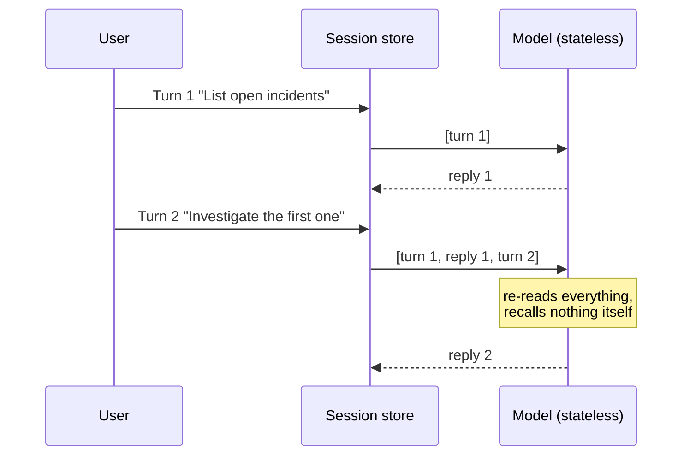
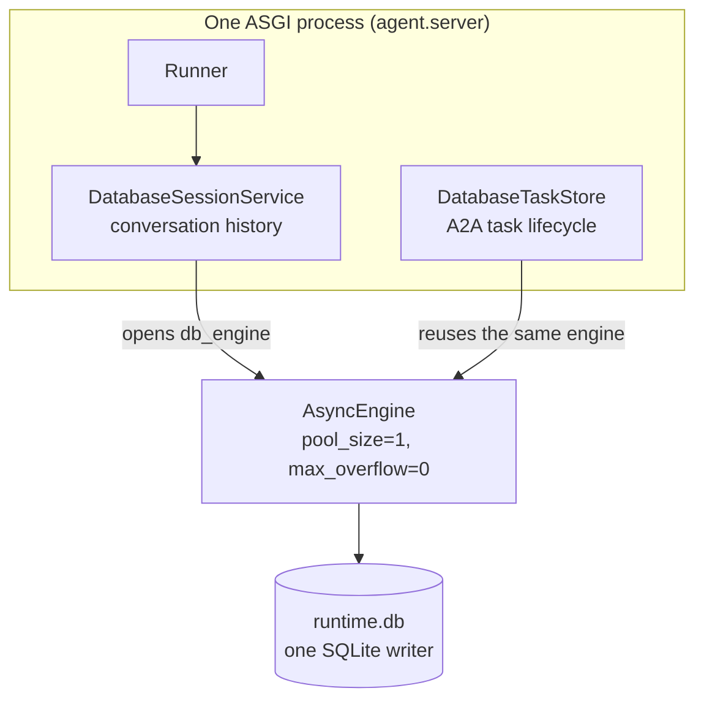

# 2.4. Sessions

!!! abstract "In one glance"

    - **You will:** Start the persistent agent server, see the database file a conversation lives in, and watch it survive a restart.
    - **You need:** [2.1. First Agent](./2.1.%20First%20Agent.md) finished; no model needs to be running for this page.
    - **Time:** about 15 minutes, reference.

## What is a session?

A session is one conversation keyed by application, user, and session id. It holds the events and state a later turn needs — nothing more.

The agent keeps several distinct stores, and conflating them is a common source of bugs. [3.4. Memory](../3.%20Capabilities/3.4.%20Memory.md) lays them all out in one table: conversation, A2A task, operational state, long-term notes, and knowledge. This page owns the two _runtime_ stores in that table — the conversation session and the A2A task — plus the server lifecycle that persists both.

Sessions exist because of the fact established in [2.2. Models](./2.2.%20Models.md): **the model is stateless.** It remembers nothing between calls. What feels like a conversation is the runtime re-sending the accumulated history on every single turn, and the model re-reading all of it from scratch each time:


```mermaid
sequenceDiagram
    participant U as User
    participant S as Session store
    participant M as Model (stateless)

    U->>S: Turn 1 "List open incidents"
    S->>M: [turn 1]
    M-->>S: reply 1
    U->>S: Turn 2 "Investigate the first one"
    S->>M: [turn 1, reply 1, turn 2]
    Note over M: re-reads everything,<br/>recalls nothing itself
    M-->>S: reply 2
```

Two practical consequences fall out of that picture, and both shape the rest of this chapter:

- **Cost and latency grow with conversation length**, because every turn resends everything before it. A long session is not merely untidy; it is quadratically expensive. [3.4. Memory](../3.%20Capabilities/3.4.%20Memory.md) covers the context-window pressure that follows.
- **Whoever owns the session owns the memory.** If the store is in-process, the "memory" dies with the process. That is why the A2A server below chooses ADK's `DatabaseSessionService`, not the `InMemorySessionService` that `adk web` uses by default — the one whose state a stray reload wipes mid-debug ([2.5. Dev Loop](./2.5.%20Dev%20Loop.md)).

## What is an A2A task, and how does it differ from a session?

A session is replayed conversation history. An **A2A task** is one unit of work that arrived over the network. **A2A** is the protocol one agent uses to hand work to another ([0.7. Glossary](../0.%20Overview/0.7.%20Glossary.md#a2a)).

A task carries its own lifecycle — `submitted → working → input-required → working → completed` or `failed` — and its own id, so a client can poll, resume, or stream it rather than hold one blocking call open. [3.6. A2A](../3.%20Capabilities/3.6.%20A2A.md) owns the protocol and the full lifecycle diagram; what matters _here_ is that a task is durable state, not a wire format.

The two stores answer different questions and are kept apart on purpose:

| Store    | Holds                                 | Keyed by             | Backed by                |
| -------- | ------------------------------------- | -------------------- | ------------------------ |
| Session  | conversation events and state         | app / user / session | `DatabaseSessionService` |
| A2A task | one work item's lifecycle + artifacts | task id              | `DatabaseTaskStore`      |

The `input-required` state is the one that matters most. It is exactly the human-approval pause the guarded writes in [4.5. Guardrails](../4.%20Quality/4.5.%20Guardrails.md) depend on: the task suspends mid-flight, waits for a confirmed decision carrying a rationale, then resumes under the same task id.

Because that pause lives in `DatabaseTaskStore` and not in process memory, a server restart _between_ the proposal and the approval does not discard the task. The approval can still land against the persisted work item. That is the concrete reason task persistence is a correctness property, not a nicety — the same reason the session store is a database one.

This network-task lifecycle is not the write-transaction state machine of 4.5. This one asks _is the delegated goal still in flight?_, while 4.5's asks _did the UPDATE and audit INSERT commit together?_

Per-task bounds — a model-call ceiling and a drain deadline — also act on this lifecycle. [3.6. A2A](../3.%20Capabilities/3.6.%20A2A.md#what-bounds-one-a2a-task) covers them, including that per-token model streaming stays off by default (`AGENT_A2A_STREAMING=false`) because chunked output weakens PII redaction across chunk boundaries.

## How do you inspect the session server without calling a model?

Start the server now and look at the database file a conversation lives in. Nothing here calls a model.

```bash
cd agents/python
mise run a2a
```

In another terminal, from that same `agents/python` directory:

```bash
curl -fsS http://localhost:8080/.well-known/agent-card.json
curl -fsS http://localhost:8080/healthz
ls -l .state/runtime.db
```

Fetching the card builds the application and its persistent stores but submits no model task. The `ls` shows `runtime.db`, the one file both stores live in.

The `/healthz` call goes further than "is the port open". Readiness — the check that answers "can this process actually serve?" — runs three probes:

- `SELECT 1` on the shared session/task engine;
- a read-only integrity and schema probe of the runtime dataset;
- a writability check on the state directory.

It returns `{"status": "ready"}` only when all three pass, and `503` with a `problems` list otherwise (`test_health_endpoints_report_ready`, `test_readiness_fails_when_the_session_store_is_unreachable`). So a green `/healthz` confirms the session store is actually live, not merely that a socket accepted a connection.

[6.3. Platform Agents](../6.%20Platform/6.3.%20Platform%20Agents.md) owns the probe contract and its Kubernetes wiring. `/livez` stays trivial by design, because a restart only helps a wedged process.

## Why does persistence matter?

The server you just started writes its conversations to a file rather than holding them in memory. That is deliberate.

An in-memory session is fine for a short unit test. It is what `adk web` uses by default, which is why a stray reload wipes your dev conversation ([2.5. Dev Loop](./2.5.%20Dev%20Loop.md)).

An A2A server is different: it receives long-running tasks and restarts independently of its clients. Dropping all session and task state on every process restart would be a correctness bug, not a tidy-up.

The server therefore backs both stores with SQLite, and — the subtle part — with one deliberately single-connection engine shared between them:


```mermaid
flowchart TB
    subgraph P["One ASGI process (agent.server)"]
        R["Runner"]
        SS["DatabaseSessionService<br/>conversation history"]
        TS["DatabaseTaskStore<br/>A2A task lifecycle"]
        R --> SS
    end
    SS -->|"opens db_engine"| E["AsyncEngine<br/>pool_size=1, max_overflow=0"]
    TS -->|"reuses the same engine"| E
    E --> DB[("runtime.db<br/>one SQLite writer")]
```

SQLite permits only one writer at a time. Both stores therefore share a single connection and queue behind it, instead of racing into intermittent `database is locked`.

The cost of one writer is head-of-line blocking: a slow task write makes a concurrent one wait, up to a 30-second connect timeout, rather than fail. That is acceptable at course concurrency, but it is a scaling ceiling to watch.

??? note "Deeper: why one shared connection, and what breaks with a second replica?"

    The session service opens the engine; the task store reuses `session_service.db_engine` instead of opening its own, so both stores literally share one connection. `pool_size=1` with `max_overflow=0` hands out exactly one connection, ever, and the short session and task transactions queue behind it inside this single process rather than letting two independent engines race into intermittent `database is locked`. [3.6. A2A](../3.%20Capabilities/3.6.%20A2A.md#how-does-the-server-preserve-tasks) shows the exact construction and the 30-second connect timeout that lets a queued writer wait instead of failing.

    SQLite suits a single-replica course lab; multiple replicas or stronger durability would need a shared database with a migration and backup plan.

## Who closes runtime resources?

The server closes every connection it opened when it exits, even if shutdown fails partway, so a restart never leaks one.

The app owns its runner, session service, SQLAlchemy engine, and task store as one `Runtime` dataclass, constructed in `create_app()`. A **lifespan hook** — code the web framework runs once at startup and once at shutdown — publishes the writable dataset on startup and closes every resource on shutdown. Explicit ownership is what makes the store safe to reset and safe to probe.

??? note "Deeper: how is that wired?"

    ```python
    --8<-- "agents/python/src/agent/server.py:a2a-lifespan"
    ```

    Startup calls `prepare_runtime_database()` once so the writable process owns publication and schema migration of the runtime dataset; after that, readiness stays a strictly read-only observation. On the way down, `runtime.close()` closes the runner and then the session service that owns the shared engine — even when the first step raises — so a restart or a test never leaks a connection. See [`server.py`](https://github.com/MLOps-Courses/agentops-open-course/blob/main/agents/python/src/agent/server.py).

## What changes when you deploy this server?

Two of its behaviours matter only once the server runs in a container. Neither changes anything you run on this page.

- **It drains on shutdown.** In-flight turns get up to `AGENT_DRAIN_TIMEOUT_S` seconds, 10 by default, to finish before the process exits.
- **It listens on one address and advertises another.** The listener and the address a client dials back are separate settings on purpose.

??? note "Deeper: why does this matter once you deploy it? (Chapter 6)"

    **How does the server drain in-flight work on shutdown?**

    Persisting state is only half of a clean restart; the other half is not cutting a turn mid-flight when you can avoid it. On Kubernetes a rollout sends `SIGTERM`, and Uvicorn owns that signal: it stops accepting new connections, lets in-flight requests finish for up to a bounded window, then forces shutdown and runs the lifespan `finally` above. `main()` sets that window from configuration:

    ```python
    # simplified
    uvicorn.run(
        create_app,
        factory=True,
        host=settings.a2a_bind_host,
        port=settings.a2a_port,
        timeout_graceful_shutdown=int(settings.drain_timeout_s),
    )
    ```

    `AGENT_DRAIN_TIMEOUT_S` defaults to 10 seconds and is validated `> 0` and `<= 300` in [`config.py`](https://github.com/MLOps-Courses/agentops-open-course/blob/main/agents/python/src/agent/config.py); `tests/test_server.py` asserts `timeout_graceful_shutdown` is wired to exactly that value. The config comment ties the bound to the deployment: a pod's `terminationGracePeriodSeconds` must exceed it, or the platform kills the process before the drain completes. The bound reduces avoidable interruption; it is not a correctness crutch. A turn that overruns the window is still cut, which is precisely why every guarded write is a single transaction ([3.1. Tools](../3.%20Capabilities/3.1.%20Tools.md#why-are-mutation-and-audit-one-transaction)) and why the task lifecycle above is resumable — correctness rests on transactions and persistence, never on finishing before the timer.

    **Why separate bind and advertised addresses?**

    The server keeps the address it listens on separate from the address it advertises. Host development binds `AGENT_A2A_BIND_HOST=127.0.0.1` (loopback only); the container image explicitly overrides it to `0.0.0.0` to accept traffic from other pods. The agent card, though, always advertises the callable `AGENT_A2A_PROTOCOL/HOST/PORT` — never `0.0.0.0`, which is a listener wildcard meaning "every interface," not a place a client can dial back. [3.6. A2A](../3.%20Capabilities/3.6.%20A2A.md#what-does-the-agent-card-declare) shows how the card is built from those three settings and the test that pins the container's bind; the point here is that the runtime listener and the advertised identity are two different values on purpose.

## How do you reset course state?

`mise run data:reset` removes `.state/`, including runtime sessions/tasks and the writable incident copy.

```bash
cd agents/python
mise run data:reset
```

The next run recreates it from the committed seed. Existing retained state instead receives additive writer-owned migrations at A2A startup; a duplicate audit idempotency key stops startup with the exact conflicting key rather than deleting evidence.

Never use the reset pattern for a retained or production database. Inspect and reconcile its reported duplicate rows before retrying migration.

!!! success "Key takeaways"

    - The model is stateless, so the session _is_ the memory: a conversation is the runtime re-sending accumulated history every turn.
    - A conversation session and an A2A task are distinct runtime stores — one replays events keyed by app/user/session, the other tracks one network work item's lifecycle by task id.
    - The persistent A2A server backs both with `DatabaseSessionService` and `DatabaseTaskStore` on `.state/runtime.db`, sharing one single-writer SQLite connection so a restart never drops in-flight state.
    - Reset all runtime state with `mise run data:reset`, which clears `.state/` and recreates it from the committed seed.

## What proves this page worked?

Start and stop `mise run a2a`, confirm shutdown exits cleanly, restart it, and confirm both `/.well-known/agent-card.json` and `/healthz` still respond. Then run `mise run data:reset` and verify the committed `../data/incidents.db` remains unchanged in Git.

**You are done when:**

- `mise run a2a` is running and `curl -fsS http://localhost:8080/healthz` returns `{"status": "ready"}`.
- `ls -l .state/runtime.db` lists a real file inside `agents/python`.
- Stopping the server and starting it again leaves both `/.well-known/agent-card.json` and `/healthz` responding.
- `mise run data:reset` leaves the committed `../data/incidents.db` unchanged in Git.
- You can say why an in-memory session store would be a correctness bug for this server, and not merely untidy.

Continue to [2.5. Dev Loop](./2.5.%20Dev%20Loop.md) when stopping and restarting `mise run a2a` no longer costs you anything you care about.
