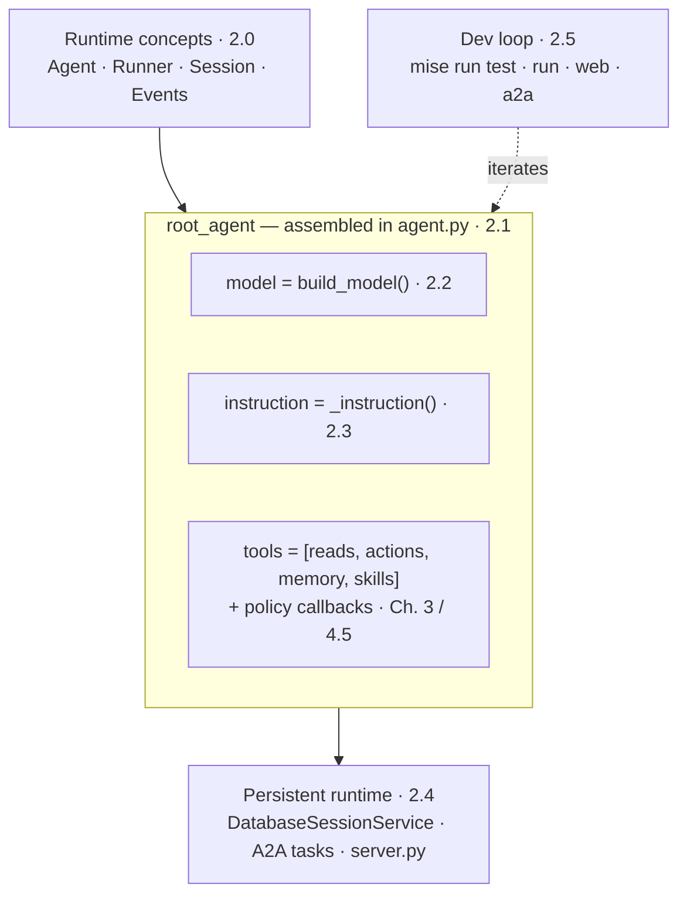

# 2. Agents

## What will you understand in this chapter?

This chapter builds and explains the **AgentOps Agent** — the single reference agent carried through the entire course. Every later chapter instruments _this same object_: Chapter 3 hangs capabilities off it, Chapter 4 wraps it in quality gates, Chapters 5 and 6 put it behind a gateway and onto Kubernetes, and Chapter 7 observes it in production. So the one artifact to fix in your mind is `root_agent`, assembled once in `agent.py`. It is a plain ADK `Agent` value — a model, an instruction string, a flat tool list, and a set of policy callbacks — and nothing downstream replaces it; everything only adds around it.

Read the sections by their kind, not just their order. **2.0 is conceptual** — the mental model you need before code makes sense. **2.1 and 2.5 are hands-on** — you run commands and see output. **2.2, 2.3, and 2.4 are reference** — the model, instruction, and runtime pieces you consult as you build:

- **[2.0. Concepts](./2.0. Concepts.md)** _(concept)_: The ADK 2.0 building blocks — Agent, Runner, Session, Events, Tools, and the graph Workflow.
- **[2.1. First Agent](./2.1. First Agent.md)** _(hands-on)_: Inspect and run the AgentOps Agent end to end on local Qwen3.
- **[2.2. Models](./2.2. Models.md)** _(reference)_: The default Ollama contract and the optional native Gemini branch.
- **[2.3. Instructions](./2.3. Instructions.md)** _(reference)_: The system instruction — persona, operating rules, grounding, and structured output.
- **[2.4. Sessions](./2.4. Sessions.md)** _(reference)_: Persistent ADK sessions, A2A tasks, lifecycle ownership, and resettable runtime state.
- **[2.5. Dev Loop](./2.5. Dev Loop.md)** _(hands-on)_: Offline gates, interactive modes, model-backed evaluations, and failure diagnosis.

By the end you can explain a typed agent with an explicit provider path, policy callbacks, a persistent A2A runtime, and a model-free verification gate. [Chapter 3](../3. Capabilities/) deepens its tools, knowledge, workflows, and delegation; [Chapter 8.7](../8.%20Community/8.7.%20Capstone.md) asks you to adapt these boundaries to your own domain.

## Which page owns which part of the agent?

The `Agent(...)` call in `agent.py` names each part of the reference agent, and each part is taught by exactly one sub-page — so when a behavior surprises you, there is one page and one module to open. This diagram maps the anatomy to its owners:



Concretely, each field of `root_agent` traces to one owner:

| Sub-page                                    | What it teaches                                | Owning module / symbol                                        |
| ------------------------------------------- | ---------------------------------------------- | ------------------------------------------------------------- |
| [2.0. Concepts](./2.0. Concepts.md)         | The ADK runtime loop and its object vocabulary | `google.adk` (framework)                                      |
| [2.1. First Agent](./2.1. First Agent.md)   | Composing and running `root_agent`             | `agent.py` (composition root)                                 |
| [2.2. Models](./2.2. Models.md)             | Provider selection behind `model=`             | `model.py` `build_model`, `config.py` `ModelProvider`         |
| [2.3. Instructions](./2.3. Instructions.md) | The persona and rules behind `instruction=`    | `agent.py` `INSTRUCTION` / `_instruction`                     |
| [2.4. Sessions](./2.4. Sessions.md)         | Persistent sessions and A2A task state         | `server.py` `DatabaseSessionService`, `config.py` `state_dir` |
| [2.5. Dev Loop](./2.5. Dev Loop.md)         | The offline gates and interactive run modes    | `mise.toml` tasks                                             |

The `tools=` list and the `before_*`/`after_*` callbacks belong to later chapters: 2.1 shows you the wiring, but [Chapter 3](../3. Capabilities/) owns each tool and [4.5. Guardrails](../4.%20Quality/4.5.%20Guardrails.md) owns the callback policy. This page only names the seams.

## How do you verify this chapter offline?

The chapter checkpoint is the offline test suite, which constructs the agent, resolves its configuration, and exercises model and session wiring without a running model or network:

```bash
cd agents/python
mise run test
```

That is the umbrella gate (`uv run pytest` over the full suite). To verify just this chapter's seams in isolation, run the model and config tests directly:

```bash
uv run pytest tests/test_model.py tests/test_config.py
```

Those cover provider resolution and the fail-fast cross-field checks in `config.py` — a bad `AGENT_MODEL_PROVIDER` combination fails at construction with a message that names the fix, not deep inside a turn. Model-backed behavior stays a separate gate ([2.5. Dev Loop](./2.5. Dev Loop.md)'s `mise run eval`), because a green offline suite proves the agent is assembled correctly, not that it reasons well.
