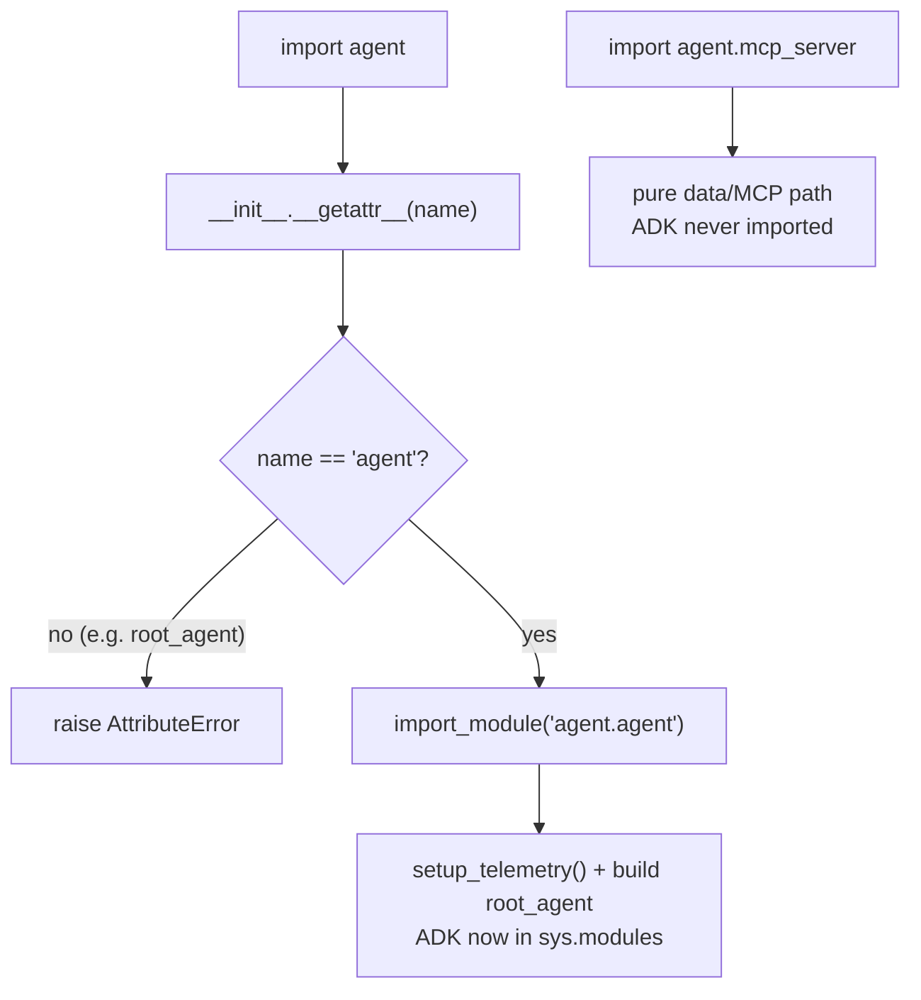
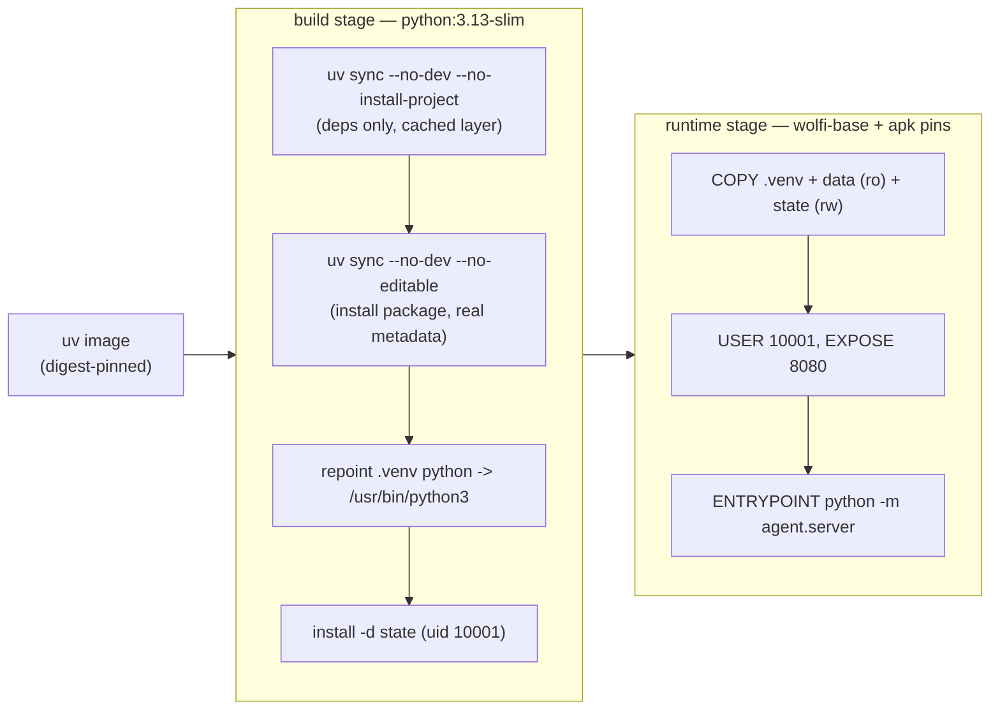

# 3.0. Packaging

## Why package the agent before adding features?

Everything downstream in this course — the ADK CLI, the offline test gate, the MCP server, the A2A server, the container, and the eval sets — executes the _same_ installed package. That is the point of packaging: one import contract instead of a pile of scripts that each hard-code their own `sys.path`, dependency versions, and startup side effects. Once the boundary exists, a capability you add in `tools.py` is automatically visible to `adk run`, to `pytest`, and to the deployed image without any per-surface glue. The rest of Chapter 3 assumes this foundation, so it is worth understanding precisely what the package guarantees and what it deliberately does not.

## How is the project organized?

```text
agents/python/
  pyproject.toml       Runtime/dev dependencies and tool configuration
  uv.lock              Exact dependency resolution
  mise.toml            Stable development commands
  Dockerfile           Non-root A2A runtime image
  src/agent/
    __init__.py        Lazy ADK root_agent discovery (no ADK on plain import)
    agent.py           Composition root
    budget.py          Token accounting and per-session budget
    config.py          Typed environment boundary
    config_check.py    Masked effective-configuration diagnostic
    model.py           OpenAI-compatible or optional Gemini selection
    models.py          Trusted domain types
    data.py            Seed-to-runtime data access
    tools.py           Read-only incident/log tools
    skills.py          Least-privilege Agent Skills
    mcp_server.py      stdio/HTTP MCP server
    mcp_client.py      ADK MCP client adapter
    longterm.py        Explicit cross-session incident notes
    memory.py          Runbook retrieval
    retrieval.py       Optional local semantic retrieval
    report.py          Schema-validated triage report
    resilience.py      Read/model deadlines and retry policy
    structured_report/ Second root_agent entrypoint for the report eval
    workflow.py        Explicit workflow graph
    delegation.py      In-process specialist delegation
    guardrails.py      Tool/model policy and safe errors
    actions.py         Approved writes and audit
    pii.py             Boundary redaction callbacks
    telemetry.py       OpenTelemetry setup
    server.py          Persistent A2A application
  tests/               Offline tests
  evals/               Model-backed ADK/MLflow evaluation
```

The sibling `agents/data/` directory is immutable seed input. `.state/` is generated writable state and is ignored by Git. Two of these entries hide a packaging decision rather than a feature: `__init__.py` never imports ADK on a plain `import agent`, and `structured_report/` is a package whose only job is to expose a second discoverable `root_agent`. Both are explained below.

## Why use a src layout?

With `module-root = "src"`, imports resolve to the installed package rather than accidentally resolving a same-named directory from the working tree:

```toml
[tool.uv.build-backend]
module-root = "src"
module-name = "agent"
```

That catches missing packaging metadata early and makes the container use the same import contract as tests. The layout also underpins the test gate: `pytest` injects the source directory and coverage is measured against the installed package name, so a module that is not importable simply fails to be covered.

```toml
addopts = [
  "-ra",
  "--strict-config",
  "--strict-markers",
  "--cov=agent",
  "--cov-branch",
  "--cov-report=term-missing:skip-covered",
  "--cov-fail-under=95",
]
pythonpath = ["src"]
```

`--cov-branch` and `--cov-fail-under=95` mean an unreachable or untested code path fails the gate — the src layout is what makes `--cov=agent` point at exactly the code the container will ship.

## Why does importing `agent` not import ADK?

Importing a package should be cheap and free of surprises. ADK is not: building `root_agent` pulls the full runtime and, in this repository, runs `setup_telemetry()` as an import side effect (`agent/agent.py`). If `import agent` triggered that, the pure data and MCP paths — which many tools and the whole MCP server depend on — would drag ADK and OpenTelemetry into every process that only wanted a helper. So `__init__.py` defers the ADK import behind a module-level `__getattr__`:

```python
def __getattr__(name: str) -> ModuleType:
    """Load the ADK agent only when a caller explicitly requests it."""
    if name != "agent":
        raise AttributeError(f"module {__name__!r} has no attribute {name!r}")
    module = import_module(f"{__name__}.agent")
    globals()[name] = module
    return module
```

Only accessing `agent.agent` triggers the real import; anything else raises. This is why the intuitive `import agent; agent.root_agent` does **not** work — `root_agent` is not a package attribute, so `__getattr__` rejects it. The supported spelling is `from agent.agent import root_agent`.



`tests/test_import_boundaries.py` pins both halves in a fresh interpreter under `-W error`: after `import agent` and `import agent.mcp_server`, it asserts `'agent.agent' not in sys.modules` and that no warning was emitted; and it asserts that both ADK CLI discovery paths still resolve the lazy agent — `AgentLoader('src').load_agent('agent')` and `get_root_agent('src/agent')` each return an agent named `agentops_agent`. The lazy attribute is invisible to callers but load-bearing for the CLI.

The same `root_agent` discovery contract is why `structured_report/` exists. It is a package with essentially no logic — it re-exports an agent already defined in `report.py` under the name ADK looks for:

```python
"""Expose the structured report agent through ADK's ``root_agent`` contract."""

from agent.report import triage_report_agent as root_agent

__all__ = ["root_agent"]
```

That gives the schema-validated report agent its own discoverable entrypoint so `evals/report_eval.py` can evaluate it with `agent_module="agent.structured_report.agent"` without disturbing the primary `agent.agent.root_agent`. Two entrypoints, one implementation — a packaging pattern, not a duplicated agent.

## Which entrypoints are stable?

Four commands are the public surface; each targets the installed package by name:

```text
adk run src/agent             Interactive terminal agent
adk web src                   ADK developer UI
python -m agent.mcp_server    MCP over configured transport
python -m agent.server        Persistent A2A ASGI server
```

`mise.toml` wraps every one of them so learners and CI reuse the same invocation:

| Task                  | Wraps                                                |
| --------------------- | ---------------------------------------------------- |
| `mise run run`        | `adk run src/agent`                                  |
| `mise run web`        | `adk web src`                                        |
| `mise run mcp`        | `python -m agent.mcp_server` (stdio)                 |
| `mise run mcp:http`   | same server, streamable HTTP on `:8000`              |
| `mise run a2a`        | `python -m agent.server` on `:8080`                  |
| `mise run data:reset` | `rm -rf .state` (rebuild disposable state from seed) |

The dotenv boundary is deliberate and worth internalizing: every model-backed task (`run`, `web`, `a2a`, the `eval*` family) loads the repository-root `.env` with `redact = true` so secrets never print in task logs, while the offline gates (`check`, `test`) load no dotenv at all. That keeps the test gate hermetic — it cannot accidentally reach a model because a stray key is present in the environment.

## Why separate runtime and development dependencies?

The final image needs ADK, MCP, state, security, and telemetry libraries. Ruff, ty, pytest, pip-audit, MLflow evaluation, and ADK eval extras are development gates and should not expand the runtime attack surface. `uv sync --frozen --no-dev` in the container enforces that separation. The runtime list itself carries three decisions that are easy to get wrong and that the comments in `pyproject.toml` call out:

1. `google-adk[a2a]` takes only the A2A extra and deliberately avoids the broad `db` extra, which would pull the unused Spanner adapter into a local, SQLite-only agent.
1. `en-core-web-sm` — Presidio's spaCy model — is URL-pinned in `[tool.uv.sources]` to an exact wheel so it stays in `uv.lock` and installs offline after the first sync, instead of being fetched at runtime.
1. The `presidio-analyzer`/`presidio-anonymizer` pair is pinned to the _same_ release (`2.2.362`) because a mismatched pair would cap `cryptography` below the security floor.

Development dependencies carry their own scoped exception rather than a blanket one: `mise run check:vuln` runs `pip-audit --ignore-vuln PYSEC-2026-597`, a single documented ignore for a path-traversal advisory in `nltk` (a dev-only transitive of `rouge-score`, never imported by the runtime), not a suppression of the whole audit.

## How do data paths stay portable?

`config.py` derives its repository defaults by walking up from the installed source file, so an editable checkout resolves the seed and state directories automatically:

```python
_DEFAULT_DATA_DIR = Path(__file__).resolve().parents[3] / "data"
_DEFAULT_STATE_DIR = Path(__file__).resolve().parents[2] / ".state"
```

Those `parents[...]` offsets assume the source lives at `.../agents/python/src/agent/config.py`. That assumption is exactly why a container that installs the package non-editably (its source no longer sits next to `agents/data/`) must override both with environment variables instead of inheriting a path that now points nowhere:

```bash
AGENT_DATA_DIR=/app/data
AGENT_STATE_DIR=/app/state
```

The image bundles `/app/data` read-only and gives `/app/state` a writable volume. No machine-specific absolute path is committed; the defaults are computed, and deployments parse their own via the typed `Settings` boundary.

## What does the container actually build?

The Dockerfile is a two-stage, non-root build whose choices exist to keep the image small, reproducible, and correct about its own metadata. The build context is `agents/`, not `agents/python/`, so both `python/` and `data/` are visible to `COPY`.



The dependency install is split into two `uv sync` phases on purpose:

```dockerfile
COPY python/pyproject.toml python/uv.lock ./
RUN uv sync --frozen --no-dev --no-install-project

# Install the project non-editably so runtime package metadata (including the
# A2A card version) is available without carrying a duplicate source tree.
COPY python/README.md ./README.md
COPY python/src ./src
RUN uv sync --frozen --no-dev --no-editable
```

The first phase depends only on `pyproject.toml`/`uv.lock`, so the heavy dependency layer stays cached until those files change. The second installs the package `--no-editable` so real distribution metadata ships — `server.py` reads the A2A card `version` from `version("agentops-agent")`, which only works against an installed (not editable-linked) package. Two more decisions are load-bearing: the build stage installs Python under `/usr/local` while Wolfi exposes it under `/usr/bin`, so the venv's `python` symlinks are repointed to `/usr/bin/python3` after the last build-stage Python call; and the runtime runs as uid `10001` with `/app/data` copied read-only and `/app/state` pre-created writable. Bases are digest-pinned and the runtime apk versions are exact:

```dockerfile
RUN apk add --no-cache \
    libstdc++=16.1.0-r4 \
    python-3.13=3.13.14-r2
```

Wolfi is a _rolling_ repository that removes superseded versions, so these pins periodically stop resolving until a Renovate bump refreshes them — expected drift, documented in the Dockerfile itself, not a broken course. Chapter 6.1 covers the full build.

## Which packaging mistakes break the ADK CLI?

The ADK CLI does not import your package the way you might expect — it discovers a `root_agent` by loading a module path. Several packaging changes silently break that contract even while `pytest` stays green:

1. **Renaming or hiding `root_agent`.** `adk run src/agent`, `adk web src`, and `adk eval` all look up a `root_agent` symbol via `AgentLoader`/`get_root_agent`. If the lazy `__getattr__` in `__init__.py` stops returning the `agent` submodule, or `structured_report/agent.py` stops re-exporting `root_agent`, discovery raises even though nothing imports it in tests. `tests/test_import_boundaries.py` is the guard — treat a failure there as a broken CLI, not a flaky test.
1. **Installing editable in the image.** Switching the second `uv sync` back to editable would make `version("agentops-agent")` unresolved, and the A2A card in `server.py` would fail to report a version. The `--no-editable` install is what gives the running package real metadata.
1. **Breaking the src layout.** Removing `module-root = "src"` or the `pythonpath = ["src"]` test setting lets a stray working-tree directory shadow the real package, so `--cov=agent` measures the wrong code and the container import contract diverges from the tests.
1. **Adding ADK import side effects to a pure module.** Importing `agent.agent` (or anything that pulls ADK) from `mcp_server.py`, `tools.py`, or `config.py` defeats the lazy boundary; the fresh-interpreter assertion `'agent.agent' not in sys.modules` catches it under `-W error`.

## What is the packaging checkpoint?

```bash
cd agents/python
uv run python -c 'from agent.agent import root_agent; print(root_agent.name)'
mise run check
```

Expected name: `agentops_agent`. Use `from agent.agent import root_agent` — the shorter `import agent; agent.root_agent` raises `AttributeError` by design, because the lazy `__getattr__` above only ever binds the `agent` submodule. Then run the same import from a directory outside `src/` to prove the installed package, rather than the current working directory, supplies it.
