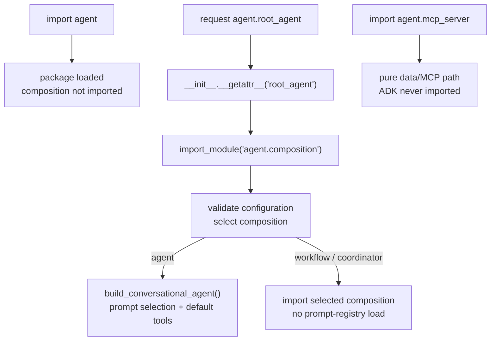

# 3.0. Packaging

!!! abstract "In one glance"

    - **You will:** Learn why the agent ships as one installed package, then prove the CLI, the tests, and the container all import the same code.
    - **You need:** Chapter 2 finished and `mise run install` completed at the repo root.
    - **Time:** about 20 minutes, reference.

## Why package the agent before adding features?

Without this, `adk run`, `pytest`, and the container can each import a different copy of your code.

These surfaces downstream in this course execute the _same_ installed package:

- the default ADK CLI agent
- the optional workflow and coordinator entrypoints
- the offline test gate
- the MCP server
- the A2A server
- the container
- the eval sets

That is the point of packaging: one import contract instead of a pile of scripts that each hard-code their own `sys.path`, dependency versions, and startup side effects. Once the boundary exists, a capability you add in `tools.py` is automatically visible to `adk run`, to `pytest`, and to the deployed image without any per-surface glue.

The rest of Chapter 3 assumes this foundation, so it is worth understanding precisely what the package guarantees and what it deliberately does not.

## How is the project organized?

Here is the whole Python track: one project directory and one public ADK package boundary under `src/agent/`.

```text
agents/python/
  pyproject.toml       Runtime/dev dependencies and tool configuration
  uv.lock              Exact dependency resolution
  mise.toml            Stable development commands
  Dockerfile           Non-root A2A runtime image
  src/
    agent/
      __init__.py        Lazy ADK root_agent discovery (no ADK on plain import)
      composition.py     Validated entrypoint selection and default composition
      budget.py          Token accounting and per-session budget
      config.py          Typed environment boundary
      config_check.py    Masked effective-configuration diagnostic
      model.py           OpenAI-compatible or optional Gemini selection
      models.py          Trusted domain types
      data.py            Seed-to-runtime data access
      tools.py           Read-only incident/log tools
      skills.py          Least-privilege Agent Skills
      mcp_server.py      stdio/HTTP MCP server
      mcp_client.py      ADK MCP client adapter
      longterm.py        Explicit cross-session incident notes
      compaction.py      Bounded conversation-history compaction
      memory.py          Runbook retrieval
      retrieval.py       Optional local semantic retrieval
      report.py          Schema-validated triage report
      resilience.py      Read/model deadlines and retry policy
      circuit.py         Circuit breaker for a failing dependency
      structured_report/ Discovery entrypoint for the report eval
      workflow.py        Bounded planning and evidence-review graph
      delegation.py      In-process specialist delegation
      guardrails.py      Tool/model policy and safe errors
      actions.py         Approved writes and audit
      pii.py             Boundary redaction callbacks
      telemetry.py       OpenTelemetry setup
      server.py          Persistent A2A application
  tests/               Offline tests
  evals/               Model-backed ADK/MLflow evaluation
```

The sibling `agents/data/` directory is immutable seed input. `.state/` is generated writable state and is ignored by Git.

Two entries hide packaging decisions rather than features. `__init__.py` exposes `root_agent` lazily, so a plain `import agent` does not initialize ADK. `structured_report/` remains a narrow evaluation entrypoint; the interactive agent, workflow, and coordinator all share the main package boundary.

## Why use a src layout?

A **src layout** keeps the package under `src/`, so an import resolves to the installed copy. With `module-root = "src"`, it cannot accidentally resolve a same-named directory from the working tree:

```toml
[tool.uv.build-backend]
module-root = "src"
module-name = "agent"
```

That catches missing packaging metadata early and makes the container use the same import contract as tests. The layout also underpins the test gate: `pytest` injects the source directory and coverage is measured against the installed package name, so a module that is not importable simply fails to be covered.

```toml
addopts = [
  "-ra",
  "--strict-config",
  "--strict-markers",
]
pythonpath = ["src"]
```

Focused `uv run pytest` commands inherit those strict settings and exit cleanly without measuring unrelated modules. The `mise run test` task adds `--cov=agent --cov-branch --cov-fail-under=95` around the complete suite. Branch coverage requires each `if`/`else` direction, and the src layout makes `--cov=agent` point at exactly the code the container will ship.

## Why does importing `agent` not import ADK?

`import agent` stays cheap, while `from agent import root_agent` deliberately initializes the selected ADK composition.

Importing a package should be cheap and free of surprises. Requesting `root_agent` pulls the ADK runtime, validates the selector, and runs the shared telemetry setup before constructing the selected composition.

If a plain import triggered that, pure data and MCP processes would initialize ADK and OpenTelemetry unnecessarily. `__init__.py` therefore defers composition behind a module-level `__getattr__`:

```python
# simplified
def __getattr__(name: str) -> Any:
    """Load the selected ADK composition only when discovery requests it."""
    if name not in __all__:
        raise AttributeError(f"module {__name__!r} has no attribute {name!r}")
    module = import_module(f"{__name__}.composition")
    globals()["agent"] = module
    globals()["root_agent"] = module.root_agent
    return globals()[name]
```

Accessing either public attribute loads `composition.py` once and caches both values. ADK can request `root_agent` directly from the package, while pure imports never cross that boundary.

Construction is selected as well as lazy. `build_conversational_agent()` runs only for `AGENT_ENTRYPOINT=agent`. The `workflow` and `coordinator` branches import their own composition and never call `_instruction()`, so they do not load a configured MLflow prompt-registry version.


```mermaid
flowchart TD
    A["import agent"] --> P["package loaded<br/>composition not imported"]
    R["request agent.root_agent"] --> G["__init__.__getattr__('root_agent')"]
    G --> D["import_module('agent.composition')"]
    D --> S["validate configuration<br/>select composition"]
    S -->|"agent"| C["build_conversational_agent()<br/>prompt selection + default tools"]
    S -->|"workflow / coordinator"| O["import selected composition<br/>no prompt-registry load"]
    M["import agent.mcp_server"] --> Q["pure data/MCP path<br/>ADK never imported"]
```

`tests/test_import_boundaries.py` pins both halves in a fresh interpreter under `-W error`:

- After `import agent` and `import agent.mcp_server`, it asserts `'agent.composition' not in sys.modules` and that no warning was emitted.
- It asserts that both ADK discovery paths resolve `src/agent` to the default `agentops_agent`.
- It selects `workflow` and `coordinator` through `AGENT_ENTRYPOINT`, then proves the same package resolves `triage_workflow` and `coordinator_agent`.
- It launches the real terminal CLI for all three selections and exits before any model call.
- It checks that telemetry content-capture defaults are installed before a selected composition can call a model.

The lazy loading is transparent to callers, and the CLI depends on it.

The same `root_agent` discovery contract is why `structured_report/` exists. It is a package with essentially no logic — it re-exports an agent already defined in `report.py` under the name ADK looks for:

```python
# simplified
"""Expose the structured report agent through ADK's ``root_agent`` contract."""

from agent.report import triage_report_agent as root_agent

__all__ = ["root_agent"]
```

That gives the schema-validated report agent its own discoverable entrypoint so `evals/report_eval.py` can evaluate it with `agent_module="agent.structured_report.agent"` without disturbing the primary package selection. Two evaluation surfaces, one report implementation.

## Which entrypoints are stable?

Eight stable tasks form the public runtime surface. Runtime tasks target the installed package; `data:reset` owns its disposable state:

```text
mise run run          Interactive terminal agent
mise run workflow     Read-only plan and evidence-review workflow
mise run coordinator  Least-privilege specialist coordinator
mise run web          ADK developer UI
mise run mcp          MCP over stdio
mise run mcp:http     MCP over streamable HTTP
mise run a2a          Persistent A2A ASGI server
mise run data:reset   Rebuild disposable state from the seed
```

`mise run a2a` runs an **ASGI** application: Python's asynchronous web-server interface.

`mise.toml` keeps model configuration and the repository `.env` boundary consistent:

| Task                   | Exact command                                                                                      |
| ---------------------- | -------------------------------------------------------------------------------------------------- |
| `mise run run`         | `AGENT_ENTRYPOINT=agent uv run adk run src/agent`                                                  |
| `mise run workflow`    | `AGENT_ENTRYPOINT=workflow uv run adk run src/agent`                                               |
| `mise run coordinator` | `AGENT_ENTRYPOINT=coordinator uv run adk run src/agent`                                            |
| `mise run web`         | `AGENT_ENTRYPOINT=agent uv run adk web src --port 8002`                                            |
| `mise run mcp`         | `uv run python -m agent.mcp_server`                                                                |
| `mise run mcp:http`    | `MCP_HOST=127.0.0.1 MCP_PORT=8000 MCP_TRANSPORT=streamable-http uv run python -m agent.mcp_server` |
| `mise run a2a`         | `AGENT_ENTRYPOINT=agent uv run python -m agent.server`                                             |
| `mise run data:reset`  | `rm -rf .state`                                                                                    |

All three terminal tasks call the same real `uv run adk run src/agent` command. `AgentEntrypoint` parses `agent`, `workflow`, or `coordinator` at startup and rejects every other value before a turn begins. Default runtime and evaluation tasks explicitly pin `agent`, so an accidental selector in `.env` cannot change what they serve.

The dotenv boundary — which tasks read a `.env` file — is deliberate and worth internalizing:

- Every model-backed task (`run`, `workflow`, `coordinator`, `web`, `a2a`, and the `eval*` family) loads the repository-root `.env` with `redact = true`, so secrets never print in task logs.
- The non-model gates (`check`, `test`) load no dotenv at all. `test` is fully offline; `check` may contact package-index advisory services through `pip-audit`.

That keeps the test gate _hermetic_, meaning sealed from outside inputs: it cannot accidentally reach a model because a stray key is present in the environment.

## Why separate runtime and development dependencies?

One rule: the container installs runtime dependencies only, and `uv sync --frozen --no-dev` enforces it.

The final image needs ADK, MCP, state, security, and telemetry libraries. Ruff, ty, pytest, pip-audit, MLflow evaluation, and ADK eval extras are development gates and should not expand the runtime attack surface.

??? note "Deeper: the pinning decisions behind the two lists"

    The runtime list itself carries three decisions that are easy to get wrong and that the comments in `pyproject.toml` call out:

    1. `google-adk[a2a]` takes only the A2A extra and deliberately avoids the broad `db` extra, which would pull the unused Spanner adapter into a local, SQLite-only agent.
    1. `en-core-web-sm` — Presidio's spaCy model — is URL-pinned in `[tool.uv.sources]` to an exact wheel so it stays in `uv.lock` and installs offline after the first sync, instead of being fetched at runtime.
    1. The `presidio-analyzer`/`presidio-anonymizer` pair is pinned to the same reviewed release. The inline manifest comment owns the compatibility reason and current value, so this page cannot preserve a stale dependency story after the constraint moves.

    Development dependencies are audited too: `mise run check:vuln` runs `pip-audit` over hash-pinned lock exports with no finding-specific ignore. The script separately locks the sole non-PyPI spaCy data-model URL and SHA-256 before omitting it from the PyPI advisory query. A dev-only package is not exempt merely because the production image omits it.

## How do data paths stay portable?

`config.py` derives its repository defaults by walking up from the installed source file, so an editable checkout resolves the seed and state directories automatically:

```python
# simplified
_DEFAULT_DATA_DIR = Path(__file__).resolve().parents[3] / "data"
_DEFAULT_STATE_DIR = Path(__file__).resolve().parents[2] / ".state"
```

Those `parents[...]` offsets assume the source lives at `.../agents/python/src/agent/config.py`. A container breaks that assumption: it installs the package _non-editably_, meaning a copy inside the image rather than a link to your checkout. Its source no longer sits next to `agents/data/`, so it must override both paths with environment variables instead of inheriting one that now points nowhere:

```bash
AGENT_DATA_DIR=/app/data
AGENT_STATE_DIR=/app/state
```

The image copies `/app/data` in owned by the non-root uid, while `/app/state` stays a writable volume. Making that copy read-only at runtime is the deployment's job: `readOnlyRootFilesystem` (Chapter 6.1) is the Kubernetes setting that mounts the whole root filesystem, `/app/data` included, read-only.

No machine-specific absolute path is committed; the defaults are computed, and deployments parse their own via the typed `Settings` boundary.

## What does the container actually build?

The Dockerfile is a three-stage, non-root build: a digest-pinned `uv` image, a build stage, and the runtime stage. _Digest-pinned_ means fixed to an exact image hash instead of a moving tag.

The runtime runs as uid `10001`, with `/app/data` copied read-only and `/app/state` pre-created writable.

Chapter 6.1 covers the full build. The stage-by-stage detail is below if you want it now.

??? note "Deeper: the full container build, stage by stage"

    Those choices exist to keep the image small, reproducible, and correct about its own metadata. The build context is `agents/`, not `agents/python/`, so both `python/` and `data/` are visible to `COPY`.

    ```mermaid
    flowchart LR
        U["uv image<br/>(digest-pinned)"] --> B
        subgraph B["build stage — python:3.13.14-slim-trixie"]
            B1["uv sync --no-dev --no-install-project<br/>(deps only, cached layer)"]
            B2["uv sync --no-dev --no-editable<br/>(install package, real metadata)"]
            B3["repoint .venv python -> /usr/bin/python3"]
            B4["install -d state (uid 10001)"]
            B1 --> B2 --> B3 --> B4
        end
        B --> R
        subgraph R["runtime stage — wolfi-base + apk pins"]
            R1["COPY .venv + data (ro) + state (rw)"]
            R2["USER 10001, EXPOSE 8080"]
            R3["ENTRYPOINT python -m agent.server"]
            R1 --> R2 --> R3
        end
    ```

    The dependency install is split into two `uv sync` phases on purpose:

    ```dockerfile
    COPY python/pyproject.toml python/uv.lock ./
    RUN uv sync --frozen --no-dev --no-install-project

    # Install the project non-editably so runtime package metadata (including the
    # A2A card version) is available without carrying a duplicate source tree.
    COPY python/README.md ./README.md
    COPY python/src ./src
    RUN uv sync --frozen --no-dev --no-editable
    ```

    The first phase depends only on `pyproject.toml`/`uv.lock`, so the heavy dependency layer stays cached until those files change. The second installs the package `--no-editable` so real distribution metadata ships — `server.py` reads the A2A card `version` from `version("agentops-agent")`, which only works against an installed (not editable-linked) package.

    One more decision matters: the build stage installs Python under `/usr/local` while Wolfi exposes it under `/usr/bin`, so the venv's `python` symlinks are repointed to `/usr/bin/python3` after the last build-stage Python call.

    Bases are digest-pinned and the runtime apk (Wolfi's package manager) versions are exact:

    ```dockerfile
    RUN apk add --no-cache \
        libstdc++=16.1.0-r4 \
        python-3.13=3.13.14-r3
    ```

    Wolfi — the minimal Linux base of the runtime stage — is a _rolling_ repository that removes superseded versions, so these pins periodically stop resolving until someone refreshes them by hand: expected drift, documented in the Dockerfile itself, not a broken course.

## Which packaging mistakes break the ADK CLI?

The ADK CLI does not import your package the way you might expect — it discovers a `root_agent` by loading a module path. Several packaging changes silently break that contract even while `pytest` stays green:

1. **Renaming or eagerly importing `root_agent`.** `adk run`, `adk web`, and `adk eval` look up `root_agent` through `AgentLoader` or `get_root_agent`. The package must expose that name without initializing ADK during a plain import. `tests/test_import_boundaries.py` guards both halves.
1. **Installing editable in the image.** Switching the second `uv sync` back to editable would make `version("agentops-agent")` unresolved, and the A2A card in `server.py` would fail to report a version. The `--no-editable` install is what gives the running package real metadata.
1. **Breaking the src layout.** Removing `module-root = "src"` or the `pythonpath = ["src"]` test setting lets a stray working-tree directory shadow the real package, so `--cov=agent` measures the wrong code and the container import contract diverges from the tests.
1. **Adding ADK import side effects to a pure module.** Importing `agent.composition` from `mcp_server.py`, `tools.py`, or `config.py` defeats the lazy boundary; the fresh-interpreter assertion catches it under `-W error`.

## How does one package expose three compositions?

`composition.py` validates the selector first and builds only the selected composition at the package boundary:

```python
# simplified
def _select_root_agent():
    if settings.entrypoint is AgentEntrypoint.WORKFLOW:
        from .workflow import triage_workflow

        return triage_workflow
    if settings.entrypoint is AgentEntrypoint.COORDINATOR:
        from .delegation import coordinator_agent

        return coordinator_agent
    return build_conversational_agent()
```

`workflow.py` and `delegation.py` still own their orchestration logic. The selector imports only the requested branch, and only the default branch builds the conversational agent or resolves `_instruction()`. One discovery package means fewer paths to document, test, and keep compatible.

## What proves this page worked?

Two things prove this page: the agent imports by its installed name, and the gate is green.

```bash
cd agents/python
uv run python -c 'from agent import root_agent; print(root_agent.name)'
mise run check
```

The import prints `agentops_agent`. The fresh-interpreter tests inside the gate resolve all three choices through that same package and launch each real terminal path without a model call.

From `agents/python`, `mise run check` is the agent's own gate: formatting and lockfile validation, the Ruff linter, the `ty` type checker, and a `pip-audit` dependency audit, run in parallel. It usually finishes in seconds, not minutes. A pass prints `All checks passed!` for lint and types, and `No known vulnerabilities found` for the audit. The two dependencies the audit reports as skipped (`agentops-agent` and `en-core-web-sm`, neither published on PyPI) are expected, not failures.

Then run the same import from a directory outside `src/`, to prove the installed package rather than the current working directory supplies it. From the repository root:

```bash
uv run --project agents/python python -c 'from agent import root_agent; print(root_agent.name)'
```

**You are done when:**

- Both import commands print `agentops_agent`, the second one from a directory that holds no `agent/` folder.
- `mise run check` finishes with no failing task.
- You can explain why plain `import agent` stays light while requesting `root_agent` initializes the selected composition.
- You can name the three validated `AGENT_ENTRYPOINT` choices without inventing sibling discovery packages.

Continue to [3.1. Tools](./3.1.%20Tools.md) when the same import works from outside `src/` and `mise run check` is green.
