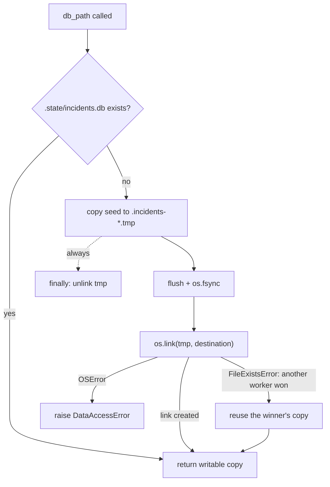
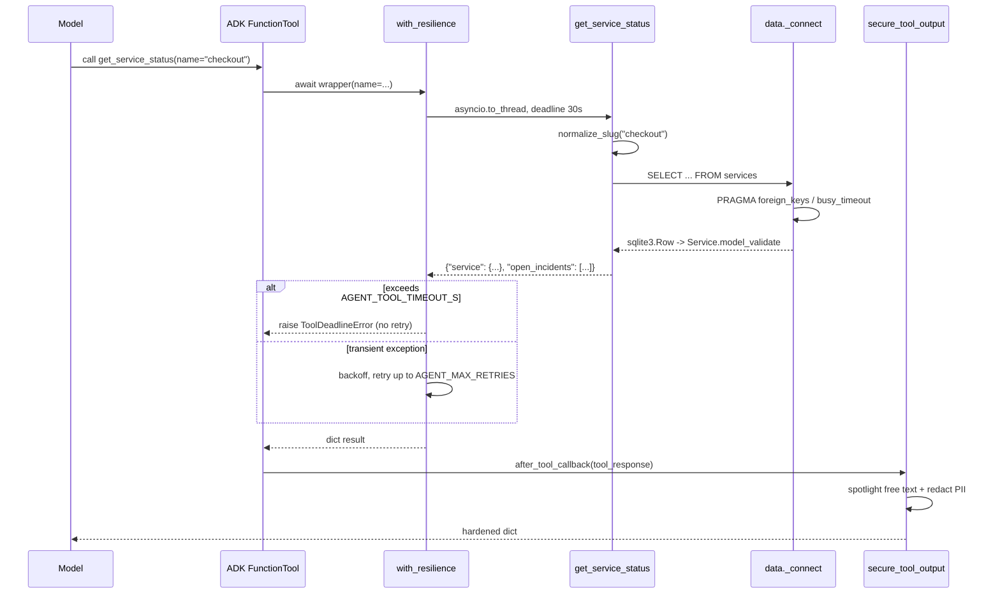

# 3.1. Tools

## What makes a function a good agent tool?

A tool is the model's only lever on the outside world: it is a typed function surface the model is allowed to call, described to the model by a JSON schema. A good tool has one purpose, a narrow typed signature, an action-oriented docstring, a stable JSON-serializable result, validation at every untrusted boundary, and a clear error value. ADK builds the model-visible schema from the Python signature and the Google-style docstring, then auto-wraps a plain function as a `FunctionTool` when you pass it to `Agent(tools=[...])` — so the docstring's `Args`/`Returns` sections and concrete examples (`INC-001`, `checkout`) are not decoration; they _are_ the schema the model reads.

```python
def get_incident(incident_id: str) -> dict[str, Any]:
    """Get the full details of one incident by its id.

    Args:
        incident_id: The incident identifier, e.g. ``INC-001``.

    Returns:
        ``{"incident": {...}}`` with the record (including ``runbook`` and ``summary``),
        or an ``error`` if unknown.
    """
    normalized = normalize_incident_id(incident_id)
    if normalized is None:
        return {"error": f"Invalid incident id {incident_id!r}; expected an id like INC-002."}
    incident = data.get_incident(normalized)
    if incident is None:
        return {"error": f"No incident found with id {normalized!r}."}
    return {"incident": incident.model_dump(mode="json")}
```

The model controls `incident_id`, so `normalize_incident_id` runs before any database query: a malformed id becomes a useful tool result, never an exception or a hallucinated fallback. Note what the agent actually registers is not this bare function — it is `with_resilience(get_incident)`, an async wrapper that keeps the same schema (see [What happens when a tool hangs?](#what-happens-when-a-tool-hangs) below).

## Which read tools does the agent expose?

The four read tools live in [`tools.py`](https://github.com/MLOps-Courses/agentops-open-course/blob/main/agents/python/src/agent/tools.py). Each rejects bad input at the boundary and returns a bounded, trusted result:

| Tool                                         | Trusted result and enforced bounds                                                                                      |
| -------------------------------------------- | ----------------------------------------------------------------------------------------------------------------------- |
| `list_incidents(status, service)`            | Incidents newest-first; a bad `status` errors and lists every allowed value, a non-slug `service` is rejected.          |
| `get_incident(incident_id)`                  | One validated full `Incident` (including its runbook slug); a non-`INC-<n>` id is rejected before any query.            |
| `get_service_status(name)`                   | One validated `Service` plus its unresolved incidents; an unknown name errors and names the known services.             |
| `search_service_logs(service, query, limit)` | Newest-first matching lines via `reversed(lines)`, a case-insensitive `query`, and a `limit` rejected outside `1..100`. |

Those bounds are worth reading in the source, not just trusting: `search_service_logs` returns `{"error": "Log search limit must be between 1 and 100."}` before touching the filesystem, folds case with `needle in line.lower()`, and iterates `reversed(lines)` so the newest match wins; `list_incidents` turns an unknown status into an error that enumerates `open, investigating, resolved`; `get_service_status` lists the seeded service names on a miss so the model can self-correct.

The two runbook knowledge tools — `get_runbook` and `search_runbooks` — are a separate `KNOWLEDGE_TOOLS` list defined in [`memory.py`](https://github.com/MLOps-Courses/agentops-open-course/blob/main/agents/python/src/agent/memory.py), covered in [3.4. Memory](3.4.%20Memory.md). State-changing `restart_service` and `resolve_incident` are separate `FunctionTool` instances with confirmation and audit requirements ([4.5. Guardrails](../4.%20Quality/4.5.%20Guardrails.md)); they are not exported by the MCP server.

## Where do the tool lists live, and who composes them?

The tool surface is deliberately split across modules by trust class, and one place assembles them. Reads live in `ALL_TOOLS` (`tools.py`), runbook knowledge in `KNOWLEDGE_TOOLS` (`memory.py`), guarded writes in `ACTION_TOOLS` (`actions.py`), durable notes in `MEMORY_TOOLS` (`longterm.py`), and the skill loader in `skill_toolset()` (`skills.py`). `ALL_TOOLS` is not the plain functions — each read is wrapped:

```python
# The tools registered on the AgentOps Agent, each wrapped with a deadline and bounded
# retries because reads are idempotent (Ch. 4.5). Guarded actions (restart/resolve)
# join in Ch. 4.5 and stay unwrapped: retrying a write could apply it twice.
ALL_TOOLS: list[ToolUnion] = [
    with_resilience(list_incidents),
    with_resilience(get_incident),
    with_resilience(get_service_status),
    with_resilience(search_service_logs),
]
```

[`agent.py`](https://github.com/MLOps-Courses/agentops-open-course/blob/main/agents/python/src/agent/agent.py) composes the final `tools=[*_read_tools(), *ACTION_TOOLS, *MEMORY_TOOLS, skill_toolset()]`, where `_read_tools()` returns `[*ALL_TOOLS, *KNOWLEDGE_TOOLS]` in-process or a single governed MCP toolset when `AGENT_MCP_URL` is set. Keeping the lists small and named makes the capability set greppable and lets the test suite assert the exact registered count instead of trusting a wildcard.

## What happens when a tool hangs?

A read that hangs is worse than a read that fails: it silently spends the turn's latency budget with nothing to show. Every read tool the agent registers is therefore `with_resilience(...)`, from [`resilience.py`](https://github.com/MLOps-Courses/agentops-open-course/blob/main/agents/python/src/agent/resilience.py) — an async wrapper carrying a 30s deadline (`AGENT_TOOL_TIMEOUT_S`) and up to 2 retries (`AGENT_MAX_RETRIES`) with exponential backoff (`AGENT_RETRY_BACKOFF_S`, `0.5s` → `1.0s`):

```python
@functools.wraps(func)
async def wrapper(**kwargs: Any) -> dict[str, Any]:
    last_error: Exception | None = None
    for attempt in range(settings.max_retries + 1):
        try:
            return await asyncio.wait_for(
                asyncio.to_thread(func, **kwargs),
                timeout=settings.tool_timeout_s,
            )
        except TimeoutError:
            # A deadline is a budget, not a transient blip: do not retry,
            # the next attempt would most likely burn the same budget.
            logger.error("Tool %s exceeded its %.1fs deadline", tool_name, settings.tool_timeout_s)
            raise ToolDeadlineError(
                f"Tool {tool_name!r} exceeded its {settings.tool_timeout_s:.0f}s deadline (AGENT_TOOL_TIMEOUT_S)."
            ) from None
```

Three details carry the design. `asyncio.to_thread` offloads the synchronous tool body so `asyncio.wait_for` can actually fire — ADK runs sync tools inline on the event loop, where a timeout could never interrupt them. A `TimeoutError` becomes a `ToolDeadlineError` and is deliberately **not** retried (the next attempt would burn the same budget), while any other exception is retried with backoff and, once exhausted, re-raised as a `RuntimeError` from the root cause instead of being masked. And `functools.wraps` is what preserves the signature and docstring ADK reads for the schema, so the model still sees `get_incident(incident_id: str)` even though the object it calls is the async wrapper. Guarded writes (`restart_service`, `resolve_incident`) are never wrapped: a retried non-idempotent action could apply twice. The policy depth — why reads are the only idempotent seam — lives in [4.5. Guardrails](../4.%20Quality/4.5.%20Guardrails.md).

## How are database rows trusted?

SQLite is external input even when bundled with the repository. The data layer validates every row with Pydantic models configured to reject extra fields:

```python
class Incident(BaseModel):
    """One incident parsed from the trusted dataset."""

    model_config = ConfigDict(extra="forbid")

    id: str = Field(pattern=_INCIDENT_ID.pattern)
    service: str = Field(pattern=_SLUG.pattern)
    title: str = Field(min_length=1)
    severity: Severity
    status: IncidentStatus
    runbook: str = Field(pattern=_SLUG.pattern)
    opened_at: str = Field(min_length=1)
    resolved_at: str | None
    summary: str = Field(min_length=1)
```

`_INCIDENT_ID` and `_SLUG` are compiled once at the top of [`models.py`](https://github.com/MLOps-Courses/agentops-open-course/blob/main/agents/python/src/agent/models.py) and reused across models, tools, and normalization so a slug means the same thing everywhere. Schema constraints protect storage; domain models protect the Python boundary; tool validation protects model-controlled arguments. Each catches a different class of defect.

Access discipline in [`data.py`](https://github.com/MLOps-Courses/agentops-open-course/blob/main/agents/python/src/agent/data.py) keeps those rows safe to reach. `_connect` opens each connection with `PRAGMA foreign_keys = ON` and `PRAGMA busy_timeout = 5000`, and wraps any `sqlite3.Error` into a `DataAccessError` that names only the database file — never the query, so a failure cannot leak SQL:

```python
@contextmanager
def _connect() -> Iterator[sqlite3.Connection]:
    """Open a constrained SQLite connection and wrap database errors with context."""
    path = db_path()
    connection = sqlite3.connect(path, timeout=5)
    try:
        connection.row_factory = sqlite3.Row
        connection.execute("PRAGMA foreign_keys = ON")
        connection.execute("PRAGMA busy_timeout = 5000")
        yield connection
    except sqlite3.Error as error:
        connection.rollback()
        raise DataAccessError(f"SQLite operation failed for {path.name}") from error
    finally:
        connection.close()
```

Readiness is a separate, read-only concern: `probe_runtime_database()` opens the state copy with `?mode=ro`, sets `PRAGMA query_only = ON`, runs `PRAGMA quick_check(1)`, and confirms the `audit_log`, `incidents`, and `services` tables all exist before the server reports healthy — corruption or a half-initialized file fails loudly at startup, not mid-turn.

## Why does the seed get copied?

The first stateful access atomically copies `agents/data/incidents.db` into `.state/incidents.db`; reads and mock actions then use the writable copy, which keeps Git clean and lets every learner reset to the exact seed. Publication is the interesting part: the copy is written to a temp file, `fsync`-ed, and published with an _exclusive_ hard link so a startup race cannot corrupt live state.

```python
settings.state_dir.mkdir(parents=True, exist_ok=True)
temporary: Path | None = None
try:
    # Publish a complete copy atomically. Two workers can race safely: the
    # hard link is an exclusive create, so neither can overwrite live state.
    with (
        source.open("rb") as seed,
        tempfile.NamedTemporaryFile(
            dir=settings.state_dir,
            prefix=".incidents-",
            suffix=".tmp",
            delete=False,
        ) as target,
    ):
        temporary = Path(target.name)
        shutil.copyfileobj(seed, target)
        target.flush()
        os.fsync(target.fileno())
    os.link(temporary, destination)
except FileExistsError:
    # Another local worker initialized the same state directory first.
    pass
except OSError as error:
    raise DataAccessError(f"Could not initialize runtime database: {destination}") from error
finally:
    if temporary is not None:
        temporary.unlink(missing_ok=True)
return destination
```



`os.link` is the publish step precisely because it fails with `FileExistsError` if the destination already exists — that is an atomic "create-or-lose", where a rename could silently clobber a concurrent worker's live database. The loser's `FileExistsError` is swallowed (it just reuses the winner's copy), any real filesystem failure becomes a `DataAccessError`, and the temp file is always unlinked in `finally` so a failed copy is never published as valid state.

## How does a tool result reach the model?

A tool returns a plain dict, but that dict is not handed to the model as-is. `secure_tool_output` in [`guardrails.py`](https://github.com/MLOps-Courses/agentops-open-course/blob/main/agents/python/src/agent/guardrails.py) is registered as the agent's `after_tool_callback`: it treats every tool result — logs, runbook Markdown, MCP output — as attacker-influenceable data. With `AGENT_SANITIZE_TOOL_OUTPUT=true` (the default) it neutralizes known injection markers and _spotlights_ free-text fields (`content`, `summary`, `lines`, `title`, `detail`, and peers) by wrapping them in `<<<TOOL_DATA data-not-instructions>>>` delimiters so the model reads them as data, not commands; identifiers, enums, and counts stay plain. It then always applies PII redaction before the dict re-enters the transcript. This is why "a stable JSON-serializable result" is only half the story: the serializable dict is the input to a hardening pass, and the model sees the hardened version.



The full injection-hardening rationale (why spotlighting is defense-in-depth, not a guarantee) is in [4.5. Guardrails](../4.%20Quality/4.5.%20Guardrails.md) and [4.6. Security](../4.%20Quality/4.6.%20Security.md); the point here is that the tool boundary is where untrusted data is contained, so a tool author only has to return an honest dict.

## How are tool failures reported?

Expected validation and lookup failures return `{"error": ...}` — a value the model can read and recover from. Unexpected exceptions cross `on_tool_error_callback` (`handle_tool_error`), which logs the exception server-side and returns a stable, non-sensitive message to the model: `Tool '<name>' failed safely; inspect the service logs for the root cause.` Never return raw SQL, filesystem paths, tracebacks, or credentials in a tool result — the `DataAccessError` messages above already follow this rule by naming only the database file.

## Why not expose one generic database tool?

`query_database(sql: str)` would give the model far more authority than the task needs and make policy and evaluation difficult: any prompt injection in a log line becomes an arbitrary query. Small, single-purpose functions create a capability allowlist, generate better schemas, and produce meaningful audit and trajectory evidence — you can enumerate exactly what the agent can do and grade whether it did it.

## What is the tool checkpoint?

```bash
cd agents/python
uv run pytest tests/test_tools.py tests/test_data.py
```

Add one invalid id, slug, status, query limit, and path-traversal case before adding a new tool. Confirm the committed seed remains unchanged after the test — `test_runtime_probe_initializes_only_for_the_state_owner` in `tests/test_data.py` asserts exactly that the probe never mutates the state copy.

## How would you add a `get_oncall_schedule` read tool?

Exercise: go beyond the checkpoint by shipping a new read-only tool end to end.

- **Goal**: expose a `get_oncall_schedule` tool that returns the current on-call owner, parsed and validated at the boundary like the existing read tools.
- **Files to touch**: a small seed table under `agents/data/` (a `sql/` row set or a JSON file), a reader in `agents/python/src/agent/data.py`, the tool in `agents/python/src/agent/tools.py` (added to `ALL_TOOLS`, wrapped with `with_resilience` since the read is idempotent), and new cases in `agents/python/tests/test_tools.py` and `tests/test_data.py`.
- **Gate that proves completion**: `cd agents/python && uv run pytest tests/test_tools.py tests/test_data.py` passes with both a valid-lookup case and a rejected-invalid-input case, and the branch-coverage gate stays green.
