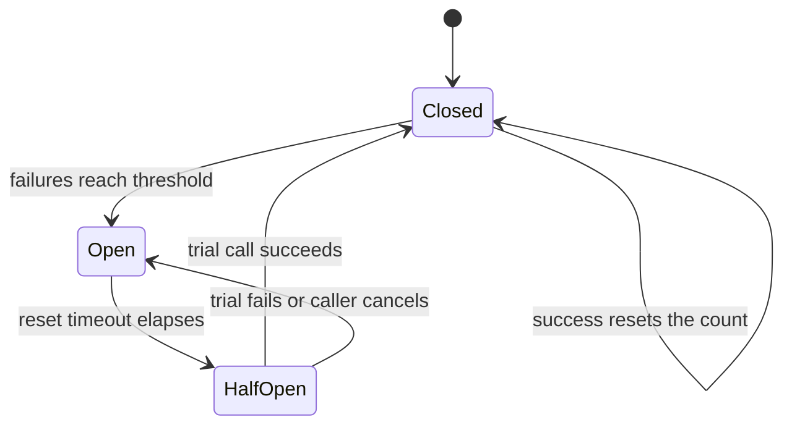
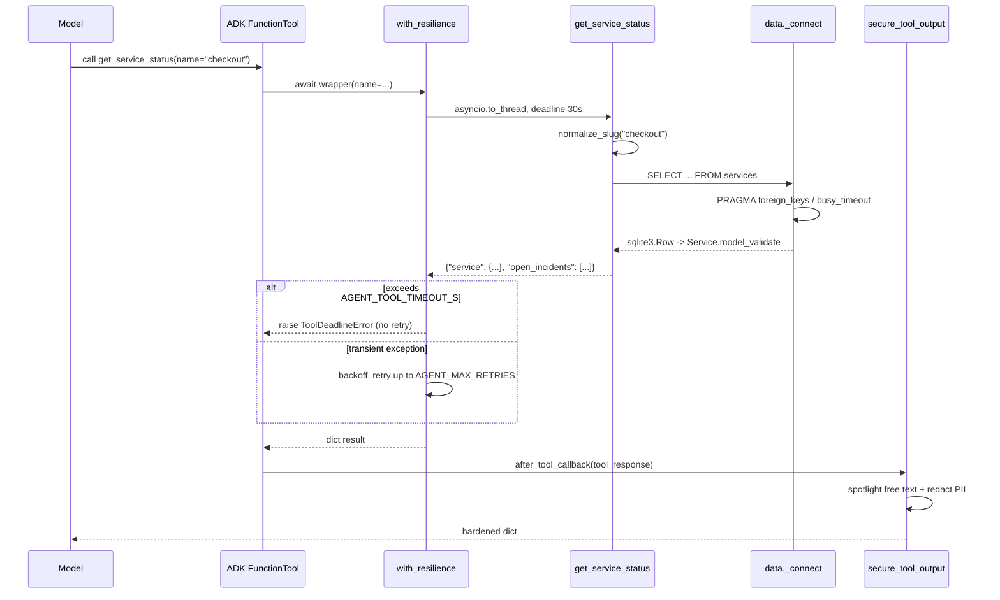
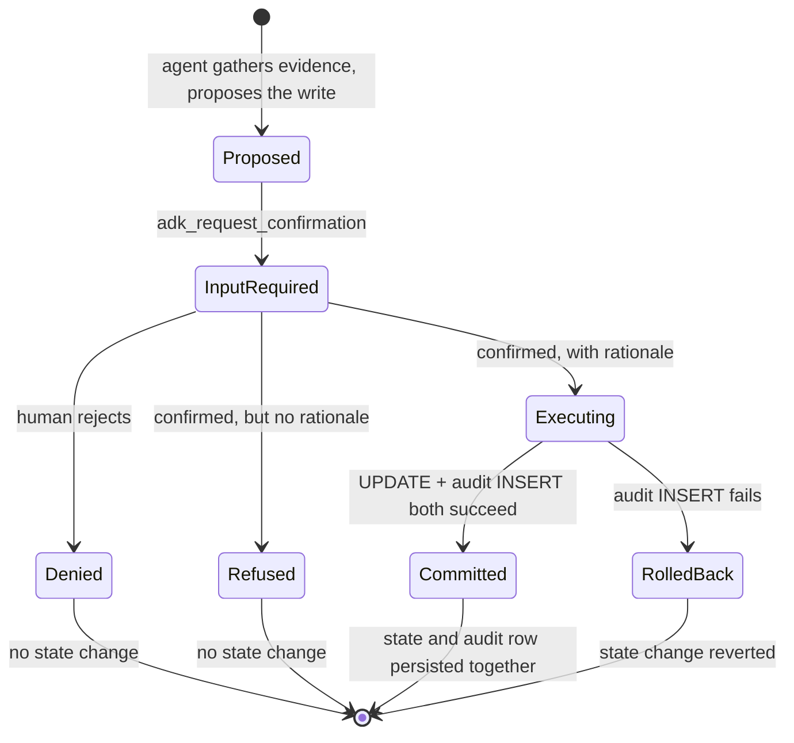

# 3.1. Tools

!!! abstract "In one glance"

    - **You will:** Read the four domain read tools, follow a guarded write to its audit row, run the focused tests, and prototype one unregistered capability.
    - **You need:** [3.0. Packaging](./3.0.%20Packaging.md) finished, `uv run pytest` working inside `agents/python`, and `mise run doctor:model` passing for the tool-call checkpoint.
    - **Time:** about 38 minutes, hands-on.

## What makes a function a good agent tool?

A **tool** is a typed function surface the model is allowed to call, described to the model by a JSON schema. It is the model's only lever on the outside world. Here is one of the four this page owns:

```python
--8<-- "agents/python/src/agent/tools.py:get-incident"
```

Six properties make that a good tool, and every one of them is visible above:

- **One purpose**: get the full details of one incident, nothing else.
- **A narrow typed signature**: `incident_id: str` in, `dict[str, Any]` out.
- **An action-oriented docstring**: "Get the full details of one incident by its id."
- **Validation at every untrusted boundary**: the model controls `incident_id`, so `normalize_incident_id` runs before any database query.
- **A clear error value**: a malformed id becomes a useful tool result, never an exception or a hallucinated fallback.
- **A stable JSON-serializable result**: `model_dump(mode="json")` hands back plain types, not Python objects.

ADK builds the model-visible schema from the Python signature and the Google-style docstring, then auto-wraps a plain function as a `FunctionTool` when you pass it to `Agent(tools=[...])`. So the docstring's `Args`/`Returns` sections and concrete examples (`INC-001`, `checkout`) are not decoration; they _are_ the schema the model reads. That block is pulled from the source at build time, which is why you can see the last `Returns` line telling the model to wait for this result and reuse its `service` and `runbook` values verbatim — sequencing guidance is schema too, and it belongs in the docstring rather than in the system instruction.

What the agent actually registers is not this bare function. It is `with_resilience(get_incident)`, an async wrapper that keeps the same schema (see [What happens when a tool hangs?](#what-happens-when-a-tool-hangs) below).

Run the focused baseline before you inspect or extend the surface:

```bash
cd agents/python
uv run pytest tests/test_tools.py tests/test_data.py -q
```

## Which read tools does the agent expose?

The four read tools live in [`tools.py`](https://github.com/MLOps-Courses/agentops-open-course/blob/main/agents/python/src/agent/tools.py). Each rejects bad input at the boundary and returns a bounded, trusted result:

| Tool                                         | Trusted result and enforced bounds                                                                                      |
| -------------------------------------------- | ----------------------------------------------------------------------------------------------------------------------- |
| `list_incidents(status, service)`            | Incidents newest-first; a bad `status` errors and lists every allowed value, a non-slug `service` is rejected.          |
| `get_incident(incident_id)`                  | One validated full `Incident` (including its runbook slug); a non-`INC-<n>` id is rejected before any query.            |
| `get_service_status(name)`                   | One validated `Service` plus its unresolved incidents; an unknown name errors and names the known services.             |
| `search_service_logs(service, query, limit)` | Newest-first matching lines via `reversed(lines)`, a case-insensitive `query`, and a `limit` rejected outside `1..100`. |

Those bounds are worth reading in the source, not just trusting:

- `search_service_logs` returns `{"error": "Log search limit must be between 1 and 100."}` before touching the filesystem, folds case with `needle in line.lower()`, and iterates `reversed(lines)` so the newest match wins.
- `list_incidents` turns an unknown status into an error that enumerates `open, investigating, resolved`.
- `get_service_status` lists the seeded service names on a miss so the model can self-correct.

This page owns those four reads. The two runbook knowledge tools (`get_runbook`, `search_runbooks`) belong to [3.4. Memory](./3.4.%20Memory.md). The two state-changing writes (`restart_service`, `resolve_incident`) are owned here too, [further down](#which-tools-change-state-and-why-are-they-never-retried): a write's confirmation pause and audit row are part of the tool's design, not policy bolted on afterwards. They are separate `FunctionTool` instances, and the MCP server does not export them.

## Where do the tool lists live, and who composes them?

The tool surface is deliberately split across modules by trust class, and one place assembles them. Reads live in `ALL_TOOLS` (`tools.py`), runbook knowledge in `KNOWLEDGE_TOOLS` (`memory.py`), and guarded writes in `ACTION_TOOLS` (`actions.py`). Durable notes live in `MEMORY_TOOLS` (`longterm.py`), and the skill loader in `skill_toolset()` (`skills.py`).

`ALL_TOOLS` is not the plain functions — each read is wrapped:

```python
# simplified
LIST_INCIDENTS_TOOL: ToolUnion = with_resilience(list_incidents)
GET_INCIDENT_TOOL: ToolUnion = with_resilience(get_incident)
GET_SERVICE_STATUS_TOOL: ToolUnion = with_resilience(get_service_status)
SEARCH_SERVICE_LOGS_TOOL: ToolUnion = with_resilience(search_service_logs)

ALL_TOOLS: list[ToolUnion] = [
    LIST_INCIDENTS_TOOL,
    GET_INCIDENT_TOOL,
    GET_SERVICE_STATUS_TOOL,
    SEARCH_SERVICE_LOGS_TOOL,
]
```

[`composition.py`](https://github.com/MLOps-Courses/agentops-open-course/blob/main/agents/python/src/agent/composition.py) composes the final `tools=[*_read_tools(), *ACTION_TOOLS, *MEMORY_TOOLS, skill_toolset()]`. `_read_tools()` returns `[*ALL_TOOLS, *KNOWLEDGE_TOOLS]` in-process, or a single governed MCP toolset when `AGENT_MCP_URL` is set.

The named wrapped values let a specialist receive one exact capability without wrapping the same function twice. Keeping the lists small makes the capability set greppable and lets tests assert the registered surface.

## What happens when a tool hangs?

A read that hangs is worse than a read that fails: it silently spends the turn's latency budget with nothing to show. Every read tool the agent registers is therefore `with_resilience(...)`, from [`resilience.py`](https://github.com/MLOps-Courses/agentops-open-course/blob/main/agents/python/src/agent/resilience.py). That async wrapper carries a 30s deadline (`AGENT_TOOL_TIMEOUT_S`) and up to 2 retries (`AGENT_MAX_RETRIES`) with exponential backoff (`AGENT_RETRY_BACKOFF_S`, `0.5s` → `1.0s`):

```python
# simplified: the opt-in circuit-breaker permit that wraps this loop is elided here;
# it is the next section, and resilience.py has the whole wrapper.
@functools.wraps(func)
async def wrapper(**kwargs: Any) -> dict[str, Any]:
    last_error: Exception | None = None
    for attempt in range(settings.max_retries + 1):
        try:
            return await asyncio.wait_for(
                asyncio.to_thread(func, **kwargs),
                timeout=settings.tool_timeout_s,
            )
        except TimeoutError:
            # A deadline is a budget, not a transient blip: do not retry,
            # the next attempt would most likely burn the same budget.
            logger.error("Tool %s exceeded its %.1fs deadline", tool_name, settings.tool_timeout_s)
            raise ToolDeadlineError(
                f"Tool {tool_name!r} exceeded its {settings.tool_timeout_s:.0f}s deadline (AGENT_TOOL_TIMEOUT_S)."
            ) from None
```

Only reads get this treatment, because reads are **idempotent**: safe to run twice, since the second call changes nothing. Guarded writes (`restart_service`, `resolve_incident`) are never wrapped: a retried non-idempotent action could apply twice.

Three seams bound a slow dependency, and they deliberately do not offer identical behavior:

1. **Read tools** — `with_resilience` wraps each idempotent read in the deadline and bounded retries above, sleeping `AGENT_RETRY_BACKOFF_S × 2^attempt` between attempts.
1. **Model calls** — native Gemini gets a `types.HttpRetryOptions` policy plus an HTTP deadline; direct Ollama and agentgateway route through `ResilientOpenAILlm`, which passes `timeout`/`max_retries` to the OpenAI-compatible SDK (`model.py`, tuned by `AGENT_MODEL_TIMEOUT_S`).
1. **MCP connections** — the connection parameters carry explicit connect/read timeouts (`mcp_client.py`), but the discovered MCP tools are not wrapped by the direct-tool retry or circuit-breaker policy.

Two boundaries are pinned by name. `test_deadline_raises_without_retry` asserts a blown deadline ran the wrapped call exactly once (`calls["count"] == 1`) — a deadline is a budget, not a blip. `test_permanent_failure_surfaces_with_context` asserts the exhausted-retry `RuntimeError` preserves the original exception as `__cause__` rather than masking it, and `test_backoff_grows_exponentially` measures the `[0.5, 1.0]` second schedule.

??? note "Deeper: why a thread, and why a deadline is never retried"

    Three details carry the design. `asyncio.to_thread` offloads the synchronous tool body so `asyncio.wait_for` can actually fire — ADK runs sync tools inline on the event loop, where a timeout could never interrupt them. A `TimeoutError` becomes a `ToolDeadlineError` and is deliberately **not** retried (the next attempt would burn the same budget), while any other exception is retried with backoff and, once exhausted, re-raised as a `RuntimeError` from the root cause instead of being masked. And `functools.wraps` is what preserves the signature and docstring ADK reads for the schema, so the model still sees `get_incident(incident_id: str)` even though the object it calls is the async wrapper.

    Python cannot cancel a thread mid-call, so after the deadline the caller stops waiting while that idempotent read may still finish in the background — one more reason the wrapper is forbidden on writes.

## How does the agent shed load when a dependency stays down?

Retries fix a _flaky_ read; they are exactly wrong for a _dead_ one. Without a breaker, every wrapped read still pays its full `AGENT_MAX_RETRIES` budget before failing, so a persistently unavailable dependency turns each turn into repeated, doomed calls.

The complementary lever is a **circuit breaker**: after a run of failures it _opens_ and fails fast, then after a cooldown enters a **half-open** state that lets a single trial call test recovery.


```mermaid
stateDiagram-v2
    [*] --> Closed
    Closed --> Open: failures reach threshold
    Open --> HalfOpen: reset timeout elapses
    HalfOpen --> Closed: trial call succeeds
    HalfOpen --> Open: trial fails or caller cancels
    Closed --> Closed: success resets the count
```

It is **opt-in** and applies only to the direct read wrappers: `AGENT_CIRCUIT_BREAKER_ENABLED` defaults to `false`, so the shipped behavior stays retry-only until a builder measures a persistently failing dependency and turns it on. The MCP route has transport deadlines only; a client- or gateway-side breaker there is a separate measured design.

[`circuit.py`](https://github.com/MLOps-Courses/agentops-open-course/blob/main/agents/python/src/agent/circuit.py) implements a deterministic per-tool breaker with an injectable clock, wired into the same `with_resilience` seam. When enabled, a read that fails `AGENT_CIRCUIT_FAILURE_THRESHOLD` times in a row opens the breaker; further calls raise `CircuitOpenError` immediately instead of paying the retry budget, until `AGENT_CIRCUIT_RESET_TIMEOUT_S` elapses and one trial call is admitted. Each admitted call carries the breaker _generation_ it started in, so a slow result from before a newer opening cannot close or re-open the current breaker, and a cancelled half-open trial reopens with a fresh cooldown instead of stranding every later caller behind an abandoned permit. Each opening increments `agentops.circuit.opened_total`, so a breaker that flaps is visible in [7.2. Monitoring](../7.%20Observability/7.2.%20Monitoring.md). Like every resilience seam, it only ever wraps idempotent reads — never a write.

Keep the two disciplines apart when you design your own. A deadline, a retry, and a breaker decide **how long you wait** on a dependency. A guardrail decides **what is allowed to happen** at a trust boundary ([4.5. Guardrails](../4.%20Quality/4.5.%20Guardrails.md)). Reliability failures cost you a turn; boundary failures cost you a state change.

## How are database rows trusted?

SQLite is external input even when bundled with the repository. The data layer validates every row with Pydantic models configured to reject extra fields:

```python
# simplified
class Incident(BaseModel):
    """One incident parsed from the trusted dataset."""

    model_config = ConfigDict(extra="forbid")

    id: str = Field(pattern=_INCIDENT_ID.pattern)
    service: str = Field(pattern=_SLUG.pattern)
    title: str = Field(min_length=1)
    severity: Severity
    status: IncidentStatus
    runbook: str = Field(pattern=_SLUG.pattern)
    opened_at: str = Field(min_length=1)
    resolved_at: str | None
    summary: str = Field(min_length=1)
```

`_INCIDENT_ID` and `_SLUG` are compiled once at the top of [`models.py`](https://github.com/MLOps-Courses/agentops-open-course/blob/main/agents/python/src/agent/models.py) and reused across models, tools, and normalization so a slug means the same thing everywhere. Schema constraints protect storage; domain models protect the Python boundary; tool validation protects model-controlled arguments. Each catches a different class of defect.

Access discipline in [`data.py`](https://github.com/MLOps-Courses/agentops-open-course/blob/main/agents/python/src/agent/data.py) keeps those rows safe to reach. `_connect` opens writer-owned runtime connections with `PRAGMA foreign_keys = ON` and `PRAGMA busy_timeout = 5000` (a `PRAGMA` is a SQLite setting that applies to one connection). It then wraps any `sqlite3.Error` into a `DataAccessError` that names only the database file — never the query, so a failure cannot leak SQL:

```python
# simplified
@contextmanager
def _connect() -> Iterator[sqlite3.Connection]:
    """Open a constrained SQLite connection and wrap database errors with context."""
    path = db_path()
    connection = sqlite3.connect(path, timeout=5)
    try:
        connection.row_factory = sqlite3.Row
        connection.execute("PRAGMA foreign_keys = ON")
        connection.execute("PRAGMA busy_timeout = 5000")
        yield connection
    except sqlite3.Error as error:
        connection.rollback()
        raise DataAccessError(f"SQLite operation failed for {path.name}") from error
    finally:
        connection.close()
```

??? note "Deeper: the read-only probe that runs before the server reports healthy"

    Readiness is a separate, read-only concern: `probe_runtime_database()` opens the state copy with `?mode=ro`, sets `PRAGMA query_only = ON`, runs `PRAGMA quick_check(1)`, and confirms the required tables, current `schema_version` definition, and exact ascending `BINARY` idempotency key. Corrupt, legacy, or failed-migration state stays unready without the probe changing it.

## Why does the seed get copied?

Before runtime state exists, reads open `agents/data/incidents.db` with SQLite `mode=ro` and `query_only`; they never publish or migrate state. A2A startup or the first direct writer atomically copies the seed into `.state/incidents.db`. Later reads observe that runtime copy, still through a read-only connection.

This split keeps Git clean and lets every learner reset to the exact seed. `mise run data:reset` deletes `.state`, and the next writer copies the seed again.

Publication is the interesting part: the copy is written to a temp file, `fsync`-ed to disk, and published with an _exclusive_ hard link so a startup race cannot corrupt live state.

Schema preparation has a narrower owner. A2A startup and each direct writer call `prepare_runtime_database()`, which locks only the runtime copy with `BEGIN IMMEDIATE`, adds safe audit columns, and creates the named idempotency index. It refuses duplicate keys with their exact invocation, action, and target before creating the index.

Read tools and readiness probes never call that migration seam. A read-only MCP process observes the state that the writable A2A owner prepared; it does not change the database or the immutable seed.

??? note "Deeper: why the copy is published with os.link"

    ```python
    # simplified
    settings.state_dir.mkdir(parents=True, exist_ok=True)
    temporary: Path | None = None
    try:
        # Publish a complete copy atomically. Two workers can race safely: the
        # hard link is an exclusive create, so neither can overwrite live state.
        with (
            source.open("rb") as seed,
            tempfile.NamedTemporaryFile(
                dir=settings.state_dir,
                prefix=".incidents-",
                suffix=".tmp",
                delete=False,
            ) as target,
        ):
            temporary = Path(target.name)
            shutil.copyfileobj(seed, target)
            target.flush()
            os.fsync(target.fileno())
        os.link(temporary, destination)
    except FileExistsError:
        # Another local worker initialized the same state directory first.
        pass
    except OSError as error:
        raise DataAccessError(f"Could not initialize runtime database: {destination}") from error
    finally:
        if temporary is not None:
            temporary.unlink(missing_ok=True)
    return destination
    ```

    ```mermaid
    flowchart TB
        A[db_path called] --> B{.state/incidents.db exists?}
        B -->|yes| R[return writable copy]
        B -->|no| C[copy seed to .incidents-*.tmp]
        C --> D[flush + os.fsync]
        D --> E["os.link(tmp, destination)"]
        E -->|link created| R
        E -->|"FileExistsError: another worker won"| F[reuse the winner's copy]
        F --> R
        E -->|OSError| X[raise DataAccessError]
        C -.->|always| U["finally: unlink tmp"]
    ```

    `os.link` is the publish step precisely because it fails with `FileExistsError` if the destination already exists — that is an atomic "create-or-lose", where a rename could silently clobber a concurrent worker's live database. The loser's `FileExistsError` is swallowed (it just reuses the winner's copy), any real filesystem failure becomes a `DataAccessError`, and the temp file is always unlinked in `finally` so a failed copy is never published as valid state.

## How does a tool result reach the model?

A tool returns a plain dict, but that dict is not handed to the model as-is. `secure_tool_output` in [`guardrails.py`](https://github.com/MLOps-Courses/agentops-open-course/blob/main/agents/python/src/agent/guardrails.py) is registered as the agent's `after_tool_callback`, the hook ADK runs on every tool result. It treats each result — logs, runbook Markdown, MCP output — as attacker-influenceable data.

With `AGENT_SANITIZE_TOOL_OUTPUT=true` (the default) it neutralizes known injection markers and [_spotlights_](../0.%20Overview/0.7.%20Glossary.md#spotlighting) free-text fields (`content`, `summary`, `lines`, `title`, `detail`, and peers). Spotlighting wraps them in `<<<TOOL_DATA data-not-instructions>>>` delimiters so the model reads them as data, not commands; identifiers, enums, and counts stay plain. It then always applies PII redaction before the dict re-enters the transcript.

This is why "a stable JSON-serializable result" is only half the story: the serializable dict is the input to a hardening pass, and the model sees the hardened version.


```mermaid
sequenceDiagram
    participant M as Model
    participant ADK as ADK FunctionTool
    participant W as with_resilience
    participant T as get_service_status
    participant D as data._connect
    participant G as secure_tool_output
    M->>ADK: call get_service_status(name="checkout")
    ADK->>W: await wrapper(name=...)
    W->>T: asyncio.to_thread, deadline 30s
    T->>T: normalize_slug("checkout")
    T->>D: SELECT ... FROM services
    D->>D: PRAGMA foreign_keys / busy_timeout
    D-->>T: sqlite3.Row -> Service.model_validate
    T-->>W: {"service": {...}, "open_incidents": [...]}
    alt exceeds AGENT_TOOL_TIMEOUT_S
        W-->>ADK: raise ToolDeadlineError (no retry)
    else transient exception
        W->>W: backoff, retry up to AGENT_MAX_RETRIES
    end
    W-->>ADK: dict result
    ADK->>G: after_tool_callback(tool_response)
    G->>G: spotlight free text + redact PII
    G-->>M: hardened dict
```

The point here is that the tool boundary is where untrusted data is contained, so a tool author only has to return an honest dict. The full injection-hardening rationale, including why spotlighting is defense-in-depth rather than a guarantee, is owned by [4.5. Guardrails](../4.%20Quality/4.5.%20Guardrails.md) and [4.6. Security](../4.%20Quality/4.6.%20Security.md).

## How are tool failures reported?

Expected validation and lookup failures return `{"error": ...}` — a value the model can read and recover from.

Unexpected exceptions cross `on_tool_error_callback` (`handle_tool_error`), the hook ADK runs when a tool raises. It logs the exception server-side, then classifies rather than silences it:

- **Errors this repository authored** — `ToolDeadlineError`, `CircuitOpenError`, `DataAccessError` — pass their message through unchanged. Those messages are first-party, carry no untrusted content, and name the setting to change (`… exceeded its 30s deadline (AGENT_TOOL_TIMEOUT_S)`). Collapsing them told an on-call engineer nothing the process already knew.
- **Every other exception** stays opaque: `Tool '<name>' failed safely; inspect the service logs for the root cause.` An arbitrary message may embed a query, a path, or a driver detail that should not reach the model.

That two-class split is the rule to carry: you can only pass a message through if you wrote it. Never return raw SQL, filesystem paths, tracebacks, or credentials in a tool result — the `DataAccessError` messages above earn their pass-through precisely by naming only the database file.

## Which tools change state, and why are they never retried?

Two tools change state, and they are the reason the rest of this page is so careful. They live in [`actions.py`](https://github.com/MLOps-Courses/agentops-open-course/blob/main/agents/python/src/agent/actions.py), not in `ALL_TOOLS`, and nothing wraps them:

```python
# simplified
ACTION_TOOLS = [
    FunctionTool(func=restart_service, require_confirmation=True),
    FunctionTool(func=resolve_incident, require_confirmation=True),
]
```

Two properties separate them from every read above.

They are **not idempotent**: applying a restart twice is two restarts. So automatic retry is forbidden, not merely discouraged — a wrapper cannot tell a lost request from a lost response, and guessing wrong applies the action a second time. That is why `with_resilience` stops at the read boundary.

And they carry `require_confirmation=True`, so ADK stops the turn before either runs. Duplicate delivery is still possible when a client loses the response after the write committed; the idempotency key that closes _that_ gap is a policy question owned by [4.5. Guardrails](../4.%20Quality/4.5.%20Guardrails.md#why-are-write-actions-never-retried).

## How does human confirmation work?

ADK pauses before execution and hands the decision to a human. To a client, that pause arrives as an `adk_request_confirmation` function call on a task in the `input-required` state. On approval, `ToolContext` supplies the confirmation state, `user_id`, session id, and invocation id for the audit record.

The public functions also validate that context themselves. A direct Python call, an unconfirmed context, or a confirmation without attributable identity and rationale is refused without mutating state.

The default A2A server is unauthenticated, so ADK derives a synthetic `A2A_USER_<context-id>` user. The integration test proves identity/session/invocation continuity through the pause and resume; it does not prove the approver's real-world identity. A production edge must authenticate the person and propagate that verified subject into the application audit boundary ([5.5. Gateway Security](../5.%20Gateway/5.5.%20Gateway%20Security.md)).

## What should a human see before approving?

Approval is not a yes/no click. It is **attributable change management**: a named person says yes, gives a reason, and both are recorded.

Before it calls a guarded action, the agent must gather the relevant incident/service/runbook evidence. The tool call is the proposal: it creates ADK's confirmation request but cannot execute the function until the human approves with a rationale. A prose promise creates nothing. The course eval cases require those evidence reads before the guarded call.

The browser client keeps the resulting tool evidence visible and repeats the exact action arguments in the approval form. It also requires a **rationale**; an approval with none is refused:

```python
--8<-- "agents/python/src/agent/actions.py:validated-approval"
```

The same transaction records who approved (`approved_by`), why (`rationale`), and the current decision context reconstructed at execution (`context_summary`) — see the [audit schema](https://github.com/MLOps-Courses/agentops-open-course/blob/main/agents/data/sql/schema.sql).

The audit row proves what the action revalidated and recorded, not a frozen copy of what a particular UI rendered. The supplied client explicitly tells the approver to compare its arguments with the evidence immediately above.

## Why are mutation and audit one transaction?

`restart_service_with_audit` and `resolve_incident_with_audit` update state and insert the audit row on the same SQLite connection before committing. If audit insertion fails, the state change rolls back. A successful action without evidence is treated as failure.

This is the tail of a single write's lifecycle — the confirmation, rationale, and transaction guards viewed as one state machine, where every terminal branch except one leaves state untouched:


```mermaid
stateDiagram-v2
    [*] --> Proposed: agent gathers evidence, proposes the write
    Proposed --> InputRequired: adk_request_confirmation
    InputRequired --> Denied: human rejects
    InputRequired --> Refused: confirmed, but no rationale
    InputRequired --> Executing: confirmed, with rationale
    Executing --> Committed: UPDATE + audit INSERT both succeed
    Executing --> RolledBack: audit INSERT fails
    Denied --> [*]: no state change
    Refused --> [*]: no state change
    Committed --> [*]: state and audit row persisted together
    RolledBack --> [*]: state change reverted
```

`test_action_and_audit_roll_back_together` proves the `Executing → RolledBack` edge: a trigger that aborts the audit insert leaves the service still `down`. `test_action_rejects_a_missing_rationale` proves the `Refused` edge changes nothing.

The schema adds triggers that reject updates/deletes to existing audit rows. This makes the application log append-only, but SQLite on a writable volume is not a tamper-proof external audit system.

## Why not expose one generic database tool?

`query_database(sql: str)` would give the model far more authority than the task needs. It would also make policy and evaluation difficult: any prompt injection in a log line becomes an arbitrary query.

Small, single-purpose functions create a **capability allowlist** — a fixed list of everything the agent may do. They also generate better schemas and produce meaningful audit and trajectory evidence: you can enumerate exactly what the agent can do and grade whether it did it.

## Your turn: how do you prototype a `get_oncall_schedule` read tool?

This is the chapter's required drill, and the chapter checkpoint gates it. Build a local capability slice without silently widening the stable six-read MCP/gateway surface.

- **Mode**: `temporary experiment`.
- **Goal**: expose a `get_oncall_schedule` tool that returns the current on-call owner, parsed and validated at the boundary like the existing read tools.
- **Files to touch**: create only `agents/data/oncall.json`, `agents/python/src/agent/oncall_experiment.py`, and `agents/python/tests/test_oncall_experiment.py`. Keep the experiment out of `ALL_TOOLS`, `KNOWLEDGE_TOOLS`, `MCP_READ_TOOL_NAMES`, and every gateway allowlist.
- **Preflight**: from the repository root, require `test ! -e agents/data/oncall.json`, `test ! -e agents/python/src/agent/oncall_experiment.py`, and `test ! -e agents/python/tests/test_oncall_experiment.py`; choose other names rather than overwriting existing work.
- **Gate that proves completion**: `cd agents/python && uv run pytest tests/test_oncall_experiment.py -q` passes with a valid lookup and rejected invalid input. Then `uv run pytest tests/test_mcp.py -q` proves the public read surface remains unchanged.
- **Final state**: remove only the three experiment files with `rm -- agents/data/oncall.json agents/python/src/agent/oncall_experiment.py agents/python/tests/test_oncall_experiment.py`, rerun the MCP test, and confirm all three `test ! -e` checks pass.

This is a local capability slice, not an end-to-end public tool. Promoting it later means an intentional contract change across registration, MCP filtering, gateway policy, documentation, and evaluation. Its read-only nature makes resilience safe; a schedule write would instead need confirmation, validation, atomic audit evidence, and no automatic retry.

## What proves this page worked?

Watch a tool's result reach you first, with the local model of [2.1. First Agent](../2.%20Agents/2.1.%20First%20Agent.md) running. Start the agent and ask it about one service:

```bash
cd agents/python
mise run run
```

Ask `What is the status of the checkout service?`. The expected answer reports `checkout` as `degraded` and lists its unresolved incidents — `INC-001` and `INC-009` in the committed seed — which is data only `get_service_status` could have supplied. `mise run run` prints the agent's text, not the calls behind it; to watch the `get_service_status` call itself, ask the same question under `mise run web` and open the Events timeline ([2.5. Dev Loop](../2.%20Agents/2.5.%20Dev%20Loop.md)). If the status disagrees with the seed, an earlier mock write has changed your disposable copy: run `mise run data:reset` and start again from the committed seed.

Then run the deterministic gate:

```bash
cd agents/python
uv run pytest tests/test_tools.py tests/test_data.py tests/test_actions.py
```

The focused command exits cleanly. Run `mise run test` before leaving the chapter to apply the 95% branch-coverage gate to the complete suite.

Add one invalid id, slug, status, query limit, and path-traversal case before adding a new tool. Confirm the committed seed remains unchanged after the test — `test_runtime_probe_initializes_only_for_the_state_owner` in `tests/test_data.py` asserts exactly that the probe never mutates the state copy.

**You are done when:**

- `uv run pytest tests/test_tools.py tests/test_data.py tests/test_actions.py` passes.
- The agent's `checkout` answer reported the seeded `degraded` status and its unresolved incidents — data only `get_service_status` could have supplied, not the model's own memory (the call itself appears in `mise run web`'s Events timeline).
- You can point at the line in each of the four read tools that rejects bad input before any query runs.
- You can name the two things a guarded write has that a read does not, and say which one makes retry unsafe.
- `git status` reports no change to `agents/data/incidents.db` after all of the above.

Continue to [3.2. Skills](./3.2.%20Skills.md) when every tool you would write starts with a validation line rather than a query.
