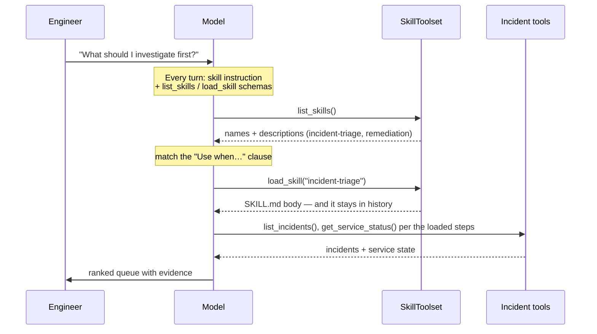
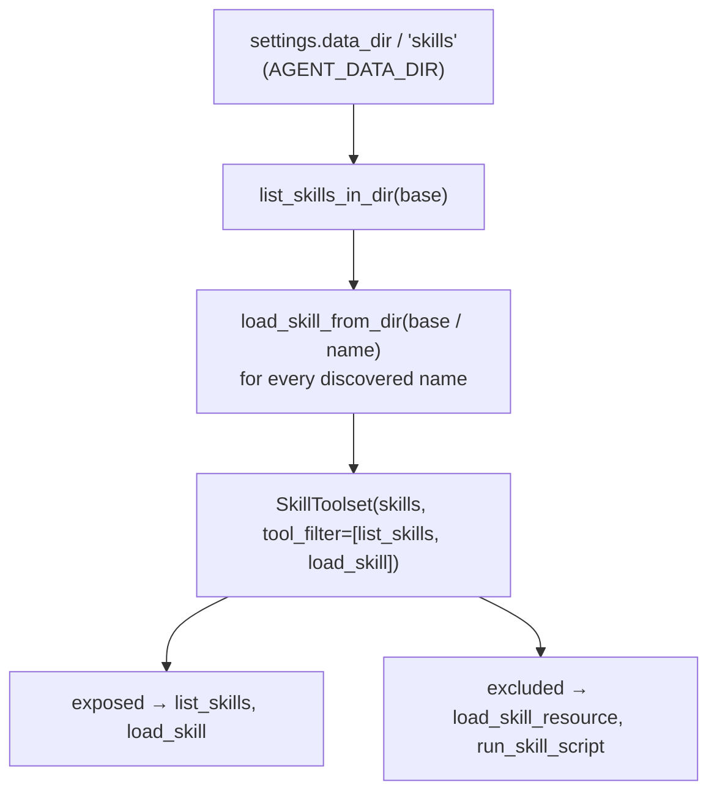

# 3.2. Skills

## What is an Agent Skill?

An Agent Skill is a directory rooted at `SKILL.md`: name/description front matter, then Markdown instructions for one class of task, plus optional `references/`, `assets/`, and `scripts/` folders. It exists to solve a scaling problem. You cannot paste every procedure the agent might ever need into the system instruction — it competes with tool schemas and history for one context window (see [3.4. Memory](./3.4.%20Memory.md#what-is-actually-inside-my-agents-context-window)), and most of it is irrelevant to any given turn. A skill defers that cost: the model sees a short advertisement of what a procedure is _for_, and pulls the full body into context only when it matches the task at hand. That two-phase move is called **progressive disclosure**, and it is the whole point.

This mirrors the open Agent Skills format used by AI coding assistants. In this repository skills live under `agents/data/skills`, alongside the shared dataset, and are wired through Google ADK's `SkillToolset`.

## What skills does the course ship?

Two, not one — and their different shapes teach different lessons. Both are read verbatim from `SKILL.md` files; the source is always the canonical instruction.

`agents/data/skills/incident-triage/SKILL.md` — a pure decision procedure over read tools:

```yaml
---
name: incident-triage
description: Prioritize open incidents deterministically. Use when the engineer asks what to investigate first, requests a queue ranking, or needs an evidence-backed triage summary.
---
```

Its body ranks the incident queue deterministically: list every incident and keep only `open`/`investigating` (drop `resolved`); **stop with a data-quality error** if an active incident lacks an id, service, supported severity, or `opened_at` rather than guess a ranking key; rank by severity (SEV1 before SEV2 before SEV3), then oldest `opened_at` first; and only for **tied top candidates** call `get_service_status`, where a `down` service outranks `degraded` outranks healthy. It reports the most urgent incident first with evidence, separates observed facts from recommendation, and never runs remediation from a triage request.

`agents/data/skills/remediation/SKILL.md` — a different shape, because acting is riskier than ranking:

```yaml
---
name: remediation
description: Propose and verify safe, runbook-backed incident remediation. Use when the engineer asks how to fix or resolve a known incident, or explicitly approves a guarded mock action.
---
```

Its body fetches the incident with `get_incident` (stop if already resolved), reads the runbook with `get_runbook` (or `search_runbooks` if the slug is unknown), follows that runbook's Remediation section to recommend the least disruptive step with its expected recovery evidence and stop condition, **never auto-runs** `restart_service` or `resolve_incident` but explains the target and impact and waits for explicit approval with an attributable approver, then **re-reads** the incident and service afterward and reports the audited state — never claiming success from the action response alone. Notice the skill defers the hard invariants to runtime: it _asks_ for approval, and the approval gate in [4.5. Guardrails](../4.%20Quality/4.5.%20Guardrails.md) is what actually enforces it.

## What does the model actually see before it loads a skill?

Less than you might assume. `SkillToolset` does not stuff either skill's body into the system prompt. Every turn the model sees only two things from the toolset: a short standing instruction that these skill tools exist and that it must call `load_skill` before following a procedure, plus the JSON declarations of the two allowlisted tools. The skill **names and descriptions themselves enter context only when the model calls `list_skills`**, and a **body enters only on `load_skill`**. The one line in the root agent's `INSTRUCTION` that closes the loop — teaching the model that skills exist at all — is this, from [`agent.py`](https://github.com/MLOps-Courses/agentops-open-course/blob/main/agents/python/src/agent/agent.py):

```text
- Use `list_skills` and `load_skill` when a triage or remediation procedure applies; follow the loaded instructions.
```

The flow is therefore genuinely staged, and the diagram below is the mental model to hold:



## How does a skill description decide whether it loads?

The description is the entire basis for the load decision — it is all the model has when choosing, since the body is still hidden. This is why the real `incident-triage` description ends with "Use when the engineer asks what to investigate first, requests a queue ranking, or needs an evidence-backed triage summary." That "Use when…" clause is not documentation for humans; it is the trigger the model pattern-matches a user request against. A description that only names the skill ("Prioritize open incidents") tells the model what the skill _is_ but not _when_ it applies, so the skill either never loads or loads for the wrong turn. Write the clause as concrete user intents, and keep the two skills' clauses disjoint — overlapping triggers make the choice between triage and remediation ambiguous.

## How are skills loaded safely?

Discovery and least privilege happen at build time, in [`skills.py`](https://github.com/MLOps-Courses/agentops-open-course/blob/main/agents/python/src/agent/skills.py):

```python
def skills_dir() -> Path:
    """Return the directory holding the AgentOps Agent skills."""
    return settings.data_dir / "skills"


def skill_toolset() -> SkillToolset:
    """Build a least-privilege instruction-only SkillToolset."""
    base = skills_dir()
    skills = [load_skill_from_dir(base / name) for name in list_skills_in_dir(base)]
    return SkillToolset(skills=skills, tool_filter=["list_skills", "load_skill"])
```

Two safety properties fall out of this shape:

1. **Exact-name lookup, not filesystem access.** `list_skills_in_dir` plus `load_skill_from_dir` load every skill into an in-memory dict keyed by name _once_, at construction. At runtime `load_skill("<name>")` is only a dict lookup — an unknown or traversal-style argument such as `../../secret` is simply a missing key that returns a `SKILL_NOT_FOUND` error. `load_skill` never turns a model-supplied string into a path.
1. **The allowlist is policy, not ceremony.** Left unfiltered, `SkillToolset` also exposes `load_skill_resource` (read any `references/`, `assets/`, or `scripts/` file inside a skill) and `run_skill_script` (execute a skill's bundled scripts through a code executor). `tool_filter=["list_skills", "load_skill"]` drops both. The agent may discover and read instructions; it cannot browse skill-bundled files or execute skill scripts. The course also configures no code executor, so `run_skill_script` could not run anyway — the filter removes even the temptation and the declaration.



Note the root of that flowchart: `skills_dir()` is `settings.data_dir / "skills"`, i.e. `AGENT_DATA_DIR`. Repointing the data directory repoints where the agent's executable-influence text comes from — the container image sets `AGENT_DATA_DIR` to its own bundled data directory, so the skills the model can load are exactly the ones baked into that image, not whatever happens to sit on a host.

## What does a loaded skill cost you?

Progressive disclosure is a saving, not a free lunch, and the accounting is worth stating precisely:

1. **The standing cost is small but constant.** The generic skill instruction and the two tool schemas ride every single turn, like any other tool (see the schema-weight discussion in [3.4. Memory](./3.4.%20Memory.md#what-do-i-drop-first-when-i-run-out)). Two tools, not a dozen procedures.
1. **`list_skills` costs the descriptions, once fetched.** When the model calls it, the names and descriptions of both skills enter context as a tool result — and, like every tool result, that result then persists in the session history for the rest of the session.
1. **`load_skill` costs the whole body, and it lingers.** The full `SKILL.md` text enters context on load and stays in history until the session ends. You pay the triage procedure's tokens on every turn _after_ you load it, not just the turn you needed it. This is the same "tool results persist into history" effect that [3.4. Memory](./3.4.%20Memory.md#what-is-actually-inside-my-agents-context-window) describes for runbooks.

That persistence is also an injection surface: a loaded body is trusted instruction text sitting in the transcript, so a compromised skill file influences every subsequent turn, not just the load. The defense is the same as the saving's premise — keep each skill small, load it only when its description matches, and end long sessions rather than accreting loaded bodies you no longer need.

## When should you use a skill instead of a tool?

- Use a **tool** for a typed observation or action — `list_incidents` returns data; `restart_service` changes state.
- Use a **skill** for a reusable decision procedure that composes those tools — ranking the queue, or the remediation propose-approve-verify loop.
- Use the **system instruction** for rules that apply to every task, on every turn.
- Use **code or runtime policy** for invariants the model must never bypass.

The triage ranking is a skill; fetching incidents is a tool; requiring an attributable approval before a write is runtime policy enforced in [`actions.py`](https://github.com/MLOps-Courses/agentops-open-course/blob/main/agents/python/src/agent/actions.py), not a hope encoded in a skill body. Put a rule in a skill only if it is safe for the model to sometimes not load it.

## How is a skill different from a runbook?

They look similar — both are committed Markdown the model reads — but they occupy opposite sides of the trust boundary, and conflating them is a real security mistake.

- A **runbook** ([3.4. Memory](./3.4.%20Memory.md#how-is-a-known-runbook-fetched)) is _data_. The model retrieves it with `get_runbook`/`search_runbooks`, must cite it, and the system instruction treats it — like all tool output — as untrusted content, never as instructions.
- A **skill** is _instruction_. Its body is loaded expressly so the model follows it, which is exactly why its provenance (the `AGENT_DATA_DIR` above) matters more than a runbook's.

The two compose rather than compete: the `remediation` skill is a procedure that _tells the model to go read a runbook_ and follow its Remediation section. The skill supplies the reusable how ("fetch incident, read runbook, propose the least disruptive step, require approval, re-verify"); the runbook supplies the incident-specific what ("for this symptom, restart this service"). Keep durable domain content in runbooks and reusable procedure in skills, and never let a retrieved runbook do a skill's job of steering the trajectory.

## What are the security risks?

A skill body is executable influence, so treat authoring one as adding trusted code, not adding a note:

- Review provenance: skills come from `AGENT_DATA_DIR`, so whoever controls that directory (or the image that bakes it) controls what the model will follow.
- Keep the allowlist tight (`list_skills`, `load_skill`) so the model cannot read arbitrary bundled files or execute scripts.
- Reference only tools the agent actually owns, and no secret material — the body is prompt text that persists in history.
- Push hard invariants down to runtime policy; a skill can _recommend_ approval, but only the guardrail can _require_ it.

Loading a repository skill is not equivalent to trusting arbitrary user-supplied Markdown — the difference is entirely in who controls the data directory.

## How do you add a skill?

1. Create one kebab-case directory under `agents/data/skills`.
1. Add valid `name`/`description` front matter, with a concrete "Use when…" clause, and focused instructions.
1. Refer only to tools the agent actually owns.
1. Add discovery and toolset-shape tests, and a check for an unknown/traversal name.
1. Add an evaluation case proving the skill changes the intended trajectory.

Keep a skill small enough that loading it on demand is cheaper and safer than pasting its content into every prompt.

## What is the skill checkpoint?

```bash
cd agents/python
uv run pytest tests/test_skills.py
```

Be honest about what this gate does and does not prove. Its two tests assert exactly two things: both skills — `incident-triage` and `remediation` — are discovered under the data directory, and the built toolset exposes only `{list_skills, load_skill}`. It does **not** exercise an unknown/traversal name, nor verify that the root-agent instruction wires the model to `load_skill`; those are behaviors you confirm yourself, and the exercise below is where you add the missing coverage.

## How would you author a new Agent Skill?

Exercise: add a second custom skill and wire its progressive disclosure end to end.

- **Goal**: create a new skill (e.g. `postmortem-writer`) that is discoverable via `list_skills`, loadable by exact name via `load_skill`, and only pulled in for its task — never injected into every prompt.
- **Files to touch**: a new `SKILL.md` (plus any `references/`) under `agents/data/skills/<your-skill>/`, the root-agent instruction so the model knows when to load it, and cases in `agents/python/tests/test_skills.py`.
- **Prove it deterministically**: extend the tests so the new skill lists, loads by exact name, and an unknown or traversal-style name (`../../secret`) returns a `SKILL_NOT_FOUND` error rather than reaching the filesystem — while the allowlist still exposes only `list_skills` and `load_skill`.
- **Gate that proves completion**: `cd agents/python && uv run pytest tests/test_skills.py` passes.
