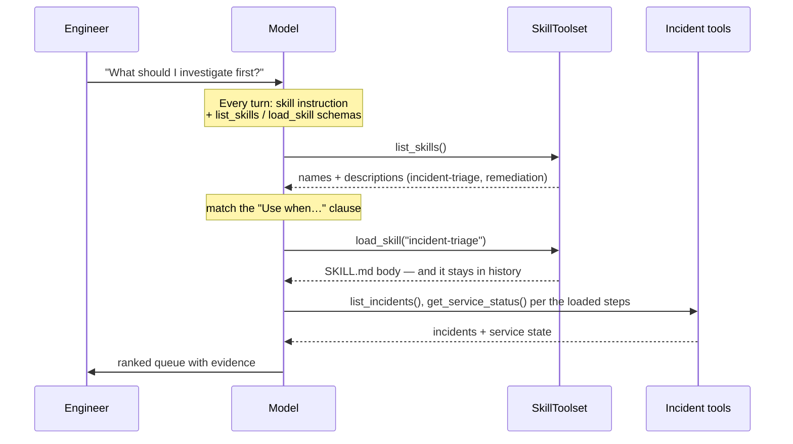
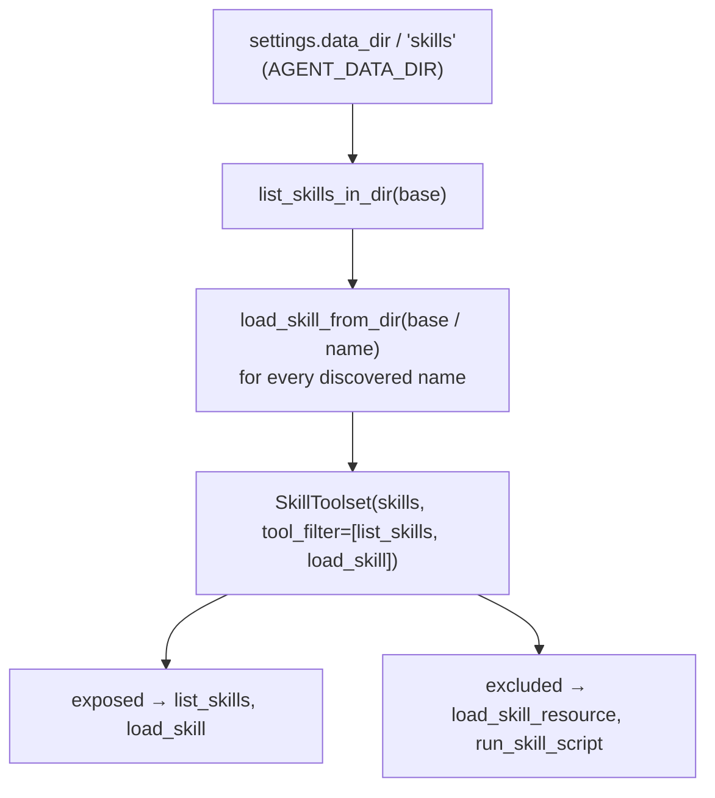

# 3.2. Skills

!!! abstract "In one glance"

    - **You will:** See how the agent loads a written procedure only when the task matches, and what that procedure costs once it is loaded.
    - **You need:** [3.1. Tools](./3.1.%20Tools.md) finished and `uv run pytest` working inside `agents/python`.
    - **Time:** about 20 minutes, reference.

## What is an Agent Skill?

You cannot paste every procedure the agent might ever need into the system instruction. Everything the model sees each turn — the instruction, tool schemas, history, and tool results — shares one fixed context window, and most of it is irrelevant to any given turn.

An **Agent Skill** is one such procedure, kept outside the instruction. It is a directory rooted at `SKILL.md`: name/description **front matter** (the `---` metadata block at the top of a Markdown file), then Markdown instructions for one class of task, plus optional `references/`, `assets/`, and `scripts/` folders.

A skill defers that cost. The model sees a short advertisement of what a procedure is _for_, and pulls the full body into context only when it matches the task at hand. That two-phase move is called **progressive disclosure**, and it is the whole point.

This mirrors the open Agent Skills format used by AI coding assistants. In this repository skills live under `agents/data/skills`, alongside the shared dataset, and are wired through Google ADK's `SkillToolset`, the object that exposes loaded skills to the model as tools. What else shares that one window is covered in depth by [3.4. Memory](./3.4.%20Memory.md#what-is-actually-inside-my-agents-context-window).

## What skills does the course ship?

Two, not one — and their different shapes teach different lessons. Both are read verbatim from `SKILL.md` files; the source is always the canonical instruction.

`agents/data/skills/incident-triage/SKILL.md` — a pure decision procedure over read tools. Its front matter is all the model sees before it decides to load the body:

```yaml
---
name: incident-triage
description: Prioritize open incidents deterministically. Use when the engineer asks what to investigate first, requests a queue ranking, or needs an evidence-backed triage summary.
---
```

Here is that same file in full, the shape your own skill should imitate:

```markdown
---
name: incident-triage
description: Prioritize open incidents deterministically. Use when the engineer asks what to investigate first, requests a queue ranking, or needs an evidence-backed triage summary.
---

# Incident Triage Skill

## Instructions

1. List every incident with `list_incidents` (no `status` filter), then keep only those whose status is `open` or `investigating` (drop any `resolved`).
1. Stop with a clear data-quality error if an active incident has no id, service, supported severity, or `opened_at`; do not guess a ranking key.
1. Rank by severity — **SEV1** before SEV2 before SEV3 — then by the oldest `opened_at` first.
1. For tied top candidates, call `get_service_status`; a `down` service outranks a `degraded` service, which outranks a healthy service.
1. Report the most urgent incident first with its id, service, severity, age evidence, current service state, and one-line summary. List the remaining active incidents in priority order.
1. Separate observed facts from your recommendation. Do not invent incidents, severities, timestamps, or service state, and do not run remediation from a triage request.
```

`agents/data/skills/remediation/SKILL.md` — a different shape, because acting is riskier than ranking:

```yaml
---
name: remediation
description: Propose and verify safe, runbook-backed incident remediation. Use when the engineer asks how to fix a known incident or initiate or approve a guarded mock action.
---
```

Its body is a propose-approve-verify loop:

1. Fetch the incident with `get_incident`, and stop if it is already resolved.
1. Read the runbook with `get_runbook`, or `search_runbooks` if the slug is unknown.
1. Follow that runbook's Remediation section: recommend the least disruptive step, with its expected recovery evidence and stop condition.
1. When the engineer asks to initiate `restart_service` or `resolve_incident`, explain the target and impact, then call the guarded tool. ADK pauses before execution; the initiating message is not approval.
1. **Re-read** the incident and service afterward and report the audited state, never claiming success from the action response alone.

Notice the skill defers the hard invariants to runtime: the tool call creates an approval request rather than executing the function, and the gate in [4.5. Guardrails](../4.%20Quality/4.5.%20Guardrails.md) enforces that pause.

## What does the model actually see before it loads a skill?

Less than you might assume. `SkillToolset` does not stuff either skill's body into the system prompt.

Every turn, the model sees exactly two things from the toolset:

- a short standing instruction saying that these skill tools exist, and that it must call `load_skill` before following a procedure;
- the JSON declarations of the two tools on the **allowlist** — the only tool names this toolset is permitted to expose.

The skill **names and descriptions themselves enter context only when the model calls `list_skills`**, and a **body enters only on `load_skill`**.

The root agent's [`INSTRUCTION`](https://github.com/MLOps-Courses/agentops-open-course/blob/main/agents/python/src/agent/composition.py) closes the loop: discovery returns only names and summaries, so an applicable procedure must be loaded before the model follows it.

The flow is therefore genuinely staged, and the diagram below is the mental model to hold:


```mermaid
sequenceDiagram
    participant U as Engineer
    participant M as Model
    participant K as SkillToolset
    participant T as Incident tools
    U->>M: "What should I investigate first?"
    Note over M: Every turn: skill instruction<br/>+ list_skills / load_skill schemas
    M->>K: list_skills()
    K-->>M: names + descriptions (incident-triage, remediation)
    Note over M: match the "Use when…" clause
    M->>K: load_skill("incident-triage")
    K-->>M: SKILL.md body — and it stays in history
    M->>T: list_incidents(), get_service_status() per the loaded steps
    T-->>M: incidents + service state
    M->>U: ranked queue with evidence
```

## How does a skill description decide whether it loads?

The description is the entire basis for the load decision. It is all the model has when choosing, because the body is still hidden.

This is why the real `incident-triage` description ends with "Use when the engineer asks what to investigate first, requests a queue ranking, or needs an evidence-backed triage summary." That "Use when…" clause is not documentation for humans; it is the trigger the model pattern-matches a user request against.

A description that only names the skill ("Prioritize open incidents") tells the model what the skill _is_ but not _when_ it applies, so the skill either never loads or loads for the wrong turn. Write the clause as concrete user intents, and keep the two skills' clauses disjoint: overlapping triggers make the choice between triage and remediation ambiguous.

## How are skills loaded safely?

Discovery and **least privilege** — giving a component only the access its job needs — happen at build time, in [`skills.py`](https://github.com/MLOps-Courses/agentops-open-course/blob/main/agents/python/src/agent/skills.py):

```python
# simplified
def skills_dir() -> Path:
    """Return the directory holding the AgentOps Agent skills."""
    return settings.data_dir / "skills"


def skill_toolset() -> SkillToolset:
    """Build a least-privilege instruction-only SkillToolset."""
    base = skills_dir()
    skills = [load_skill_from_dir(base / name) for name in list_skills_in_dir(base)]
    return SkillToolset(skills=skills, tool_filter=["list_skills", "load_skill"])
```

Three safety properties fall out of this shape:

1. **Exact-name lookup, not filesystem access.** `list_skills_in_dir` plus `load_skill_from_dir` load every skill into an in-memory dict keyed by name _once_, at construction. At runtime `load_skill("<name>")` is only a dict lookup. An unknown or traversal-style argument such as `../../secret` is simply a missing key that returns a `SKILL_NOT_FOUND` error, because `load_skill` never turns a model-supplied string into a path.
1. **The allowlist is policy, not ceremony.** Left unfiltered, `SkillToolset` also exposes `load_skill_resource` (read any `references/`, `assets/`, or `scripts/` file inside a skill) and `run_skill_script` (execute a skill's bundled scripts through a code executor, the component that would run them). `tool_filter=["list_skills", "load_skill"]` drops both. The agent may discover and read instructions; it cannot browse skill-bundled files or execute skill scripts. The course also configures no code executor, so `run_skill_script` could not run anyway — the filter removes even the temptation and the declaration.
1. **Trusted instruction stays instruction.** The exact `load_skill` result bypasses injection neutralization and data spotlighting, because its reviewed body is supposed to steer the model. PII and credential redaction still applies recursively. Every other tool result remains data-hardened by default.


```mermaid
flowchart TB
    D["settings.data_dir / 'skills'<br/>(AGENT_DATA_DIR)"] --> L["list_skills_in_dir(base)"]
    L --> F["load_skill_from_dir(base / name)<br/>for every discovered name"]
    F --> TS["SkillToolset(skills, tool_filter=[list_skills, load_skill])"]
    TS --> E1["exposed → list_skills, load_skill"]
    TS --> E2["excluded → load_skill_resource, run_skill_script"]
```

Note the root of that flowchart: `skills_dir()` is `settings.data_dir / "skills"`, i.e. `AGENT_DATA_DIR`. Repointing the data directory repoints where the agent's executable-influence text comes from.

The container image sets `AGENT_DATA_DIR` to its own bundled data directory, so the skills the model can load are exactly the ones baked into that image, not whatever happens to sit on a host.

## What does a loaded skill cost you?

Progressive disclosure is a saving, not a free lunch. Three things can sit in the window, and they cost very different amounts:

| What is in context  | What it holds                                          | What it costs                                                      |
| ------------------- | ------------------------------------------------------ | ------------------------------------------------------------------ |
| Always, every turn  | the generic skill instruction and the two tool schemas | small but constant: two tools, not a dozen procedures              |
| After `list_skills` | both skills' names and descriptions                    | one tool result, which then persists in the session history        |
| After `load_skill`  | the full `SKILL.md` body                               | the whole procedure's tokens, on every turn until the session ends |

The asymmetry is the point. Descriptions are cheap and fetched once; a loaded body lingers, so you pay the triage procedure's tokens on every turn _after_ you load it, not just the turn you needed it.

Neither cost is unique to skills. The standing schemas weigh what any other tool weighs ([3.4. Memory](./3.4.%20Memory.md#what-do-i-drop-first-when-i-run-out)), and the lingering body is the same "tool results persist into history" effect that page describes for runbooks ([3.4. Memory](./3.4.%20Memory.md#what-is-actually-inside-my-agents-context-window)).

That persistence is also an injection surface: a loaded body is trusted instruction text sitting in the transcript, so a compromised skill file influences every subsequent turn, not just the load. The defense is the same as the saving's premise. Keep each skill small, load it only when its description matches, and end long sessions rather than accreting loaded bodies you no longer need.

## When should you use a skill instead of a tool?

A rule can live in four places. Pick by how often it applies, and by how badly it must hold.

- Use a **tool** for a typed observation or action — `list_incidents` returns data; `restart_service` changes state.
- Use a **skill** for a reusable decision procedure that composes those tools — ranking the queue, or the remediation propose-approve-verify loop.
- Use the **system instruction** for rules that apply to every task, on every turn.
- Use **code or runtime policy** for invariants the model must never bypass.

The triage ranking is a skill; fetching incidents is a tool; requiring an attributable approval before a write is runtime policy enforced in [`actions.py`](https://github.com/MLOps-Courses/agentops-open-course/blob/main/agents/python/src/agent/actions.py), not a hope encoded in a skill body. Put a rule in a skill only if it is safe for the model to sometimes not load it.

## How is a skill different from a runbook?

Both are committed Markdown that the model reads, so they look similar. They occupy opposite sides of the trust boundary, and conflating them is a real security mistake.

- A **runbook** ([3.4. Memory](./3.4.%20Memory.md#how-is-a-known-runbook-fetched)) is _data_. The model retrieves it with `get_runbook`/`search_runbooks`, must cite it, and the system instruction treats it — like all tool output — as untrusted content, never as instructions.
- A **skill** is _instruction_. Its body is loaded expressly so the model follows it, which is exactly why its provenance (the `AGENT_DATA_DIR` above) matters more than a runbook's.

The two compose rather than compete: the `remediation` skill is a procedure that _tells the model to go read a runbook_ and follow its Remediation section. The skill supplies the reusable how ("fetch incident, read runbook, propose the least disruptive step, require approval, re-verify"); the runbook supplies the incident-specific what ("for this symptom, restart this service"). Keep durable domain content in runbooks and reusable procedure in skills, and never let a retrieved runbook do a skill's job of steering the trajectory.

## What are the security risks?

A skill body is executable influence, so treat authoring one as adding trusted code, not adding a note. Two facts carry most of the risk: whoever controls `AGENT_DATA_DIR` controls what the model will follow, and a skill can only recommend what runtime policy has to enforce.

??? note "Deeper: the four rules for authoring a skill safely"

    - Review provenance: skills come from `AGENT_DATA_DIR`, so whoever controls that directory (or the image that bakes it) controls what the model will follow.
    - Keep the allowlist tight (`list_skills`, `load_skill`) so the model cannot read arbitrary bundled files or execute scripts.
    - Reference only tools the agent actually owns, and no secret material — the body is prompt text that persists in history.
    - Push hard invariants down to runtime policy; a skill can _recommend_ approval, but only the guardrail can _require_ it.

    Loading a repository skill is not equivalent to trusting arbitrary user-supplied Markdown — the difference is entirely in who controls the data directory.

## How do you add a skill?

Five steps, and none of them touch `skills.py`: discovery is by directory, so a valid folder is all the code needs.

1. Create one kebab-case directory under `agents/data/skills`.
1. Add valid `name`/`description` front matter, with a concrete "Use when…" clause, and focused instructions.
1. Refer only to tools the agent actually owns.
1. Add discovery and toolset-shape tests, and a check for an unknown/traversal name.
1. Add an evaluation case proving the skill changes the intended trajectory.

Keep a skill small enough that loading it on demand is cheaper and safer than pasting its content into every prompt.

## How do you package these patterns as installable skills for your own agents?

Two locations, one format. The skills above are _runtime_ skills: `SKILL.md` files under `agents/data/skills` that this agent loads at execution time. The repository also ships a second, top-level [`skills/`](https://github.com/MLOps-Courses/agentops-open-course/tree/main/skills) directory in the same format, aimed the other direction — at the human or coding agent _building_ an agent.

Those portable skills distil the course's operational patterns: telemetry, guardrails, resilience, token budgets, least privilege, evaluation, and incident response. You apply them in your own projects rather than re-reading the course each time. In short, `agents/data/skills` is what _this_ agent loads; `skills/` is what _you_ install to build the next one.

??? note "Deeper: installing these patterns into your own editor"

    Because they follow the open `SKILL.md` convention, they install with the [`skills` CLI](https://github.com/vercel-labs/skills) into Antigravity, Codex, OpenCode, Claude, or Copilot:

    ```bash
    npx skills add MLOps-Courses/agentops-open-course --all           # every pattern
    npx skills add MLOps-Courses/agentops-open-course --skill agent-resilience
    ```

    Each one ends with a "Reference implementation" section naming the exact course files it distils, so the portable guidance always points back to a real, tested version. A `scripts/check_conventions.py` gate (wired into `mise run check`) keeps every skill's front matter valid and its guidance machine-path-free, the same discipline the course applies to its own pages.

## How would you author a new Agent Skill?

Optional exercise: add a second custom skill and wire its progressive disclosure end to end.

- **Mode**: `keep`.
- **Goal**: create a new skill (e.g. `postmortem-writer`) that is discoverable via `list_skills`, loadable by exact name via `load_skill`, and only pulled in for its task — never injected into every prompt.
- **Files to touch**: a new `SKILL.md` (plus any `references/`) under `agents/data/skills/<your-skill>/`, the root-agent instruction so the model knows when to load it, and cases in `agents/python/tests/test_skills.py`.
- **Preflight**: choose a new skill name, require `test ! -e agents/data/skills/<your-skill>`, and require `git diff --quiet -- agents/python/src/agent/composition.py agents/python/tests/test_skills.py`.
- **Prove it deterministically**: extend the tests so the new skill lists, loads by exact name, and an unknown or traversal-style name (`../../secret`) returns a `SKILL_NOT_FOUND` error rather than reaching the filesystem — while the allowlist still exposes only `list_skills` and `load_skill`.
- **Gate that proves completion**: `cd agents/python && uv run pytest tests/test_skills.py` passes.
- **Final state**: keep only the new skill, the intentional instruction change, and its tests; `git status --short` must show no unrelated or generated file.

## What proves this page worked?

```bash
cd agents/python
uv run pytest tests/test_skills.py
```

The focused command exits cleanly. Run `mise run test` before leaving the chapter to apply the 95% branch-coverage gate to the complete suite.

Be honest about what this gate does and does not prove. Its two tests assert exactly two things: both skills — `incident-triage` and `remediation` — are discovered under the data directory, and the built toolset exposes only `{list_skills, load_skill}`.

It does **not** exercise an unknown/traversal name, nor verify that the root-agent instruction wires the model to `load_skill`. Those are behaviors you confirm yourself, and the exercise above is where you add the missing coverage.

**You are done when:**

- `uv run pytest tests/test_skills.py` passes: both skills are discovered, and the toolset exposes only `list_skills` and `load_skill`.
- You can say what enters context on `list_skills`, what enters on `load_skill`, and which of the two you keep paying for.
- You can point at the one line of the root agent's `INSTRUCTION` that tells the model skills exist.
- You can name the runtime control that actually enforces the approval the `remediation` skill only asks for — [3.1. Tools](./3.1.%20Tools.md#how-does-human-confirmation-work) shows the pause, the rationale, and the audit row a skill body can never guarantee.

Continue to [3.3. MCP](./3.3.%20MCP.md) when you can predict, from a description alone, whether a skill will load for a given request.
