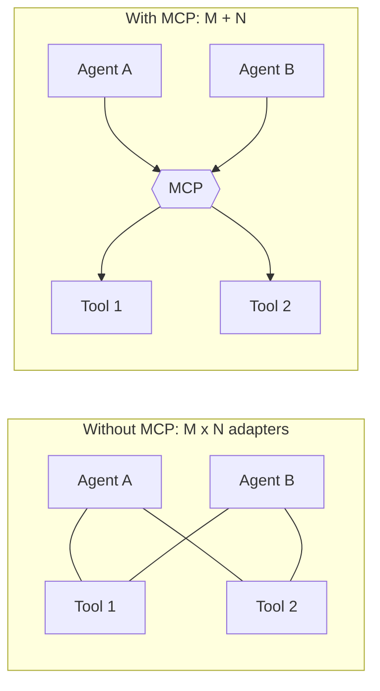
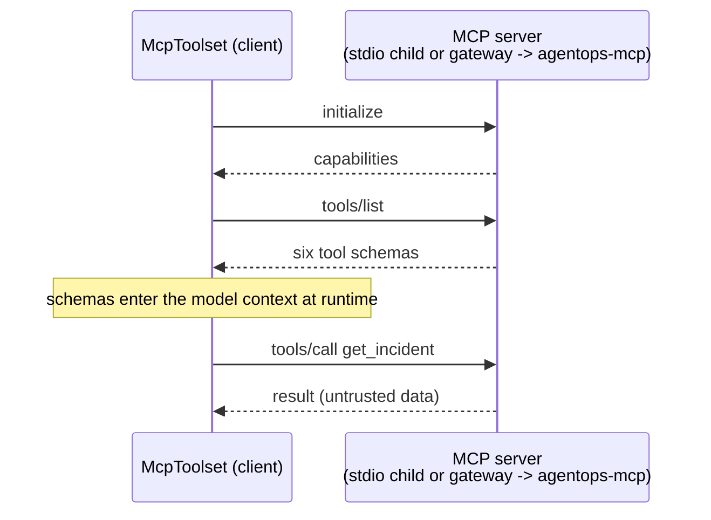
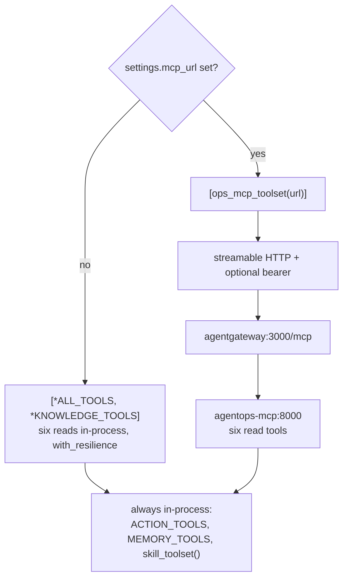

# 3.3. MCP

## What problem does MCP solve?

Until [3.2](./3.2.%20Skills.md), every tool the agent had was a Python function it imported. That works precisely as long as the tool, the agent, and the framework live in one process and one language. The moment any of those differ, you are writing glue.

The problem generalizes badly. With **M** agents and **N** tools, integrating each agent with each tool by hand is **M × N** bespoke adapters — and each one has to re-solve discovery ("what can you do?"), invocation ("call this with these arguments"), and schema description. Every framework grew its own incompatible answer, so a tool built for one agent was worthless to another.

The **Model Context Protocol** replaces that with one contract: **M + N**. A tool speaks MCP once and every MCP-capable client can use it; an agent speaks MCP once and every MCP server is available to it. It is a protocol, in the same sense that LSP is for editors and language servers — and it was donated to the [Agentic AI Foundation](../8.%20Community/8.6.%20AAIF.md), so it belongs to no single vendor.



## What are the parts of MCP?

Three roles, and keeping them straight makes the rest of the chapter read easily:

| Role       | What it is                                                  | Here                                        |
| ---------- | ----------------------------------------------------------- | ------------------------------------------- |
| **Host**   | The application the user interacts with                     | The AgentOps Agent process                  |
| **Client** | The connector inside the host that speaks MCP to one server | ADK's `McpToolset`                          |
| **Server** | The process exposing capabilities                           | `mcp_server.py`, and any third-party server |

A server can offer three kinds of capability. The distinction matters because they have different trust properties:

- **Tools** — functions the model may choose to invoke. _Model-controlled_, and therefore the surface that needs authorization. This course exposes six.
- **Resources** — read-only data the host may attach to context (files, records). _Application-controlled_: the app decides, not the model.
- **Prompts** — reusable templates the user may invoke deliberately. _User-controlled_.

Underneath, MCP is JSON-RPC 2.0. A client connects, calls `initialize`, then `tools/list` to discover what exists, then `tools/call` to invoke one. That is why discovery is dynamic: the agent asks the server what it can do at runtime, instead of having it hard-coded at import time.

## Why does MCP matter beyond this repository?

Because it decouples the tool from the agent's lifecycle, and that changes what you can build:

- **Reuse.** The same six read tools serve this ADK agent, someone else's LangGraph agent, and a desktop assistant, with no code change.
- **Isolation.** The tool runs in its own process — its own dependencies, its own permissions, its own crash blast radius, and its own language.
- **A governable boundary.** Once tool calls cross a process boundary as protocol messages, something can sit in the middle and enforce policy on them. That is exactly what Chapter 5 does with agentgateway, and it is impossible when tools are Python imports.
- **An ecosystem.** Public MCP servers exist for GitHub, Postgres, filesystems, and much else, so "give the agent a new capability" is often configuration rather than code.

!!! danger "A protocol is not a security model"

    MCP standardizes *how* a tool is described and called. It says nothing about whether calling it is a good idea. Authentication, authorization, transport security, timeouts, rate limits, and schema validation remain yours to enforce — and connecting to a third-party MCP server means letting an untrusted party put tool descriptions into your model's prompt, which is a prompt-injection surface ([4.6](../4.%20Quality/4.6.%20Security.md)). This course keeps writes out of MCP entirely for exactly that reason, and puts a policy gateway in front of the reads.

## Which tools does the course server expose?

Only six read capabilities cross the MCP boundary. `mcp_server.py` re-exposes the raw tool functions and lets FastMCP derive each JSON schema from the same type hints and docstrings the ADK function tools already carry:

```python
for _tool in (
    tools.list_incidents,
    tools.get_incident,
    tools.get_service_status,
    tools.search_service_logs,
    memory.get_runbook,
    memory.search_runbooks,
):
    mcp.add_tool(_tool)
```

This excerpt is copied verbatim from [`mcp_server.py`](https://github.com/MLOps-Courses/agentops-open-course/blob/main/agents/python/src/agent/mcp_server.py). `restart_service` and `resolve_incident` remain in-process because their ADK confirmation context and audit identity are part of the write boundary. Separating read and write surfaces makes authorization easier to reason about: the entire MCP surface is idempotent by construction, so a compromised or misbehaving client can read state but never change it.

Note what does _not_ cross the boundary: these are the bare functions, not the `with_resilience`-wrapped versions the in-process agent registers ([4.5](../4.%20Quality/4.5.%20Guardrails.md)). Retry and deadline bounds move to the client side when the tools become remote — see [What changes when you flip `AGENT_MCP_URL`?](#what-changes-when-you-flip-agent_mcp_url) below.

## Which transports are supported?

`mcp_server.py` defaults to stdio for an agent that launches its own child process. It also supports SSE and streamable HTTP over a single FastMCP instance:

```python
mcp = FastMCP(
    "agentops-agent",
    host=os.environ.get("MCP_HOST", "127.0.0.1"),
    port=int(os.environ.get("MCP_PORT", "8000")),
    stateless_http=True,
    transport_security=TransportSecuritySettings(
        enable_dns_rebinding_protection=True,
        allowed_hosts=_allowed_hosts(),
        allowed_origins=list(_ALLOWED_ORIGINS),
    ),
)
```

`stateless_http=True` is a deployment decision, not a default: the HTTP transport keeps no per-session server state, so any replica can answer any request. Behind agentgateway that removes the need for session affinity or sticky routing — a `tools/call` can land on a different pod than the `initialize` that preceded it.

HTTP transport keeps FastMCP's DNS-rebinding protection enabled even when it binds to all interfaces. The secure defaults accept loopback authorities, the container-bridge host `host.docker.internal`, and the course's `agentgateway`/`agentops-mcp` service names; browser origins remain limited to loopback HTTP. An untrusted `Host` header is rejected with `421 Misdirected Request` before any tool runs. `MCP_ALLOWED_HOSTS` is a comma-separated **full override**, not an addition, so each deployment can narrow the authorities it expects without ever falling back to `*` — and an empty override is a startup error, not a silent open door.

The HTTP transports share the same bounded graceful-shutdown policy as A2A:

```python
--8<-- "agents/python/src/agent/mcp_server.py:mcp-server-transport"
```

The Uvicorn `timeout_graceful_shutdown` is `AGENT_DRAIN_TIMEOUT_S` (default 10s), so a SIGTERM lets in-flight tool calls finish before the process exits rather than dropping them. Kubernetes' `terminationGracePeriodSeconds` must exceed it.

Use the repository tasks:

```bash
cd agents/python
mise run mcp       # stdio
mise run mcp:http  # streamable HTTP on 127.0.0.1:8000/mcp
```

The Kubernetes MCP deployment uses the same module with `MCP_HOST=0.0.0.0`, port `8000`, and streamable HTTP.

## How does the MCP server report readiness?

An HTTP MCP pod needs health probes, and `mcp_server.py` registers two Starlette routes on the same app. FastMCP serves custom routes without auth — suitable exactly for probes, which must answer before any token exchange:

```python
@mcp.custom_route("/healthz", methods=["GET"])
async def healthz(request: Request) -> JSONResponse:
    """Readiness: the agent-owned runtime database is readable and valid."""
    del request
    try:
        probe_runtime_database()
    except Exception as error:  # readiness reports every failure class as unready
        return JSONResponse(
            {"status": "unready", "problems": [f"dataset unavailable: {type(error).__name__}"]},
            status_code=503,
        )
    return JSONResponse({"status": "ready"})
```

The distinction between the two probes is deliberate:

- **`/healthz` (readiness)** calls `probe_runtime_database()`, which opens the runtime SQLite copy read-only, runs `PRAGMA quick_check`, and confirms the `incidents`, `services`, and `audit_log` tables exist. Any failure class returns `503 {"status": "unready", ...}`, so the pod is pulled from the gateway's endpoints instead of serving reads against a missing or corrupt dataset.
- **`/livez` (liveness)** returns `{"status": "alive"}` unconditionally — trivial by design, because a restart only helps a wedged process, not a missing dataset.

One subtlety worth internalizing: the read-only MCP pod does **not** initialize state. `probe_runtime_database()` reports "not initialized" rather than copying the seed, because the A2A owner publishes the runtime database first ([3.6](./3.6.%20A2A.md)). A fresh MCP pod therefore stays `unready` until the writer has published state — the correct ordering for a read replica, and `tests/test_mcp.py` asserts the probe never creates the file as a side effect.

## How do you inspect the MCP server without a model?

The server is a plain HTTP process, so you can exercise its readiness before wiring any model. Start the Streamable HTTP transport, then probe it from a second terminal:

```bash
cd agents/python
mise run mcp:http
# in another terminal:
curl -fsS http://127.0.0.1:8000/healthz
curl -fsS http://127.0.0.1:8000/livez
```

If the writer has published runtime state, `/healthz` returns `{"status":"ready"}`; on a fresh checkout it returns `503 {"status":"unready","problems":[...]}` — the correct read-replica ordering above, not a bug. `/livez` always returns `{"status":"alive"}`. The MCP tool surface itself — the JSON-RPC `initialize → tools/list → tools/call` handshake that returns the same six read tools — is driven end to end by `tests/test_mcp.py`, which is the offline evidence that the wire contract holds without a model in the loop.

## How does the ADK client choose a transport?

```python
--8<-- "agents/python/src/agent/mcp_client.py:ops-mcp-toolset"
```

The exact excerpt is build-checked against [`mcp_client.py`](https://github.com/MLOps-Courses/agentops-open-course/blob/main/agents/python/src/agent/mcp_client.py). A URL selects streamable HTTP (with the course deadline as `timeout`/`sse_read_timeout`, and an optional bearer token); no URL falls back to a local stdio child. Either way the protocol handshake is identical — only the pipe changes:



The `tools/list` step is where dynamic discovery earns its keep: schemas enter the model context at connection time, not at import time. That is the same reason a third-party server is a prompt-injection surface — its tool descriptions become part of your prompt.

## What does the stdio transport actually launch?

The default local transport is not a network call. `McpToolset` builds a `StdioServerParameters` and launches an actual child process for the toolset instance:

```python
server_params=StdioServerParameters(command=sys.executable, args=["-m", "agent.mcp_server"])
```

Two consequences a reader should hold:

- **One child per toolset.** Constructing the toolset spawns `python -m agent.mcp_server` and talks JSON-RPC to it over stdin/stdout; closing the toolset tears the child down. The child shares the agent's lifecycle and machine — there is no shared long-lived server, no port, and no auth, which is exactly why stdio is the account-free first run.
- **`sys.executable`, not `"python"`.** The source comment says "use the current interpreter so it works inside the project's virtualenv." Bare `python` could resolve to a different interpreter than the locked `uv` environment the agent runs in, importing a different `agent` package or missing dependencies entirely. `sys.executable` is the interpreter already running, so the child inherits the same pinned environment.

The pitfall to avoid is treating stdio as a production topology: it couples tool availability to spawning a subprocess on every agent host, with no place to enforce policy. That is precisely the coupling the HTTP-plus-gateway path removes.

## When does the root agent use MCP?

Local/offline development registers the six Python read tools directly. When `AGENT_MCP_URL` is present, the composition root replaces them with one remote `McpToolset`:

```python
def _read_tools() -> list[ToolUnion]:
    """Use local tools by default and the governed MCP route when configured."""
    if settings.mcp_url:
        return [ops_mcp_toolset(settings.mcp_url)]
    return [*ALL_TOOLS, *KNOWLEDGE_TOOLS]
```

Only the six reads move. The guarded writes (`ACTION_TOOLS`), long-term memory (`MEMORY_TOOLS`), and instruction-only skills (`skill_toolset()`) are appended to the agent's tool list regardless of branch, so they always stay in-process:



In Kubernetes:

```bash
AGENT_MCP_URL=http://agentgateway:3000/mcp
```

On the host with the loopback wrapper, use `http://127.0.0.1:3000/mcp`. The deployed call path is agent -> agentgateway -> `agentops-mcp:8000`.

## What changes when you flip `AGENT_MCP_URL`?

Flipping one variable moves the read tools across a process boundary, and several properties change with them — worth naming, because none are visible in the agent's behavior until something goes wrong:

- **Discovery becomes runtime, not import-time.** In-process, the six tool schemas are the Python signatures at import. Over MCP, the client performs `tools/list` on connect, so the schemas the model sees come from the live server — a version skew between agent and server surfaces here.
- **Resilience bounds move to the connection.** The in-process reads are wrapped in `with_resilience` (bounded retries plus a deadline). The remote toolset is not: its only bound is the connection deadline set from `settings.tool_timeout_s` (default 30s) as both `timeout` and `sse_read_timeout`. There is no local exponential-backoff retry across the network — that is now the gateway's job.
- **A dependency can now fail the turn.** The in-process path cannot be "down". Over MCP, an unreachable server or gateway fails the tool call — fast, at the deadline, rather than hanging the turn — but it is a failure the local path simply does not have.
- **Auth is a bearer header, when set.** `AGENT_MCP_TOKEN` is a `SecretStr`; it becomes an `Authorization: Bearer …` header only when set, and the default local route sends no header. That is what a secured gateway route ([5.5](../5.%20Gateway/5.5.%20Gateway%20Security.md)) authenticates.

The switch is validated fail-fast at startup, not lazily mid-turn. A non-`http(s)` value raises before the agent serves a single request, with a message that names the fix:

```python
if self.mcp_url and not self.mcp_url.startswith(("http://", "https://")):
    problems.append(
        f"AGENT_MCP_URL must be an http(s) URL such as http://127.0.0.1:3000/mcp, got {self.mcp_url!r}. "
        "Unset it to use the in-process stdio MCP server."
    )
```

This is the "parse, don't validate" discipline from [`config.py`](https://github.com/MLOps-Courses/agentops-open-course/blob/main/agents/python/src/agent/config.py): a bad switch is a configuration error you see at boot, not a stack trace deep inside a user's incident triage.

## Why put agentgateway between the client and server?

Chapter 5 adds a stable policy point for tool allowlists, fail-closed behavior, rate limits, bearer-token auth, logs, and traces. The Python tool implementation stays the same; only the configured MCP endpoint changes from a stdio child to `http://…/mcp`. That is the whole payoff of making tool calls protocol messages: the enforcement point is infrastructure you can operate, not code you have to fork.

## What is the MCP checkpoint?

```bash
cd agents/python
uv run pytest tests/test_mcp.py tests/test_tools.py
```

Verify exactly six tools, all supported transports, rejection of an unknown transport, DNS-rebinding rejection of an untrusted `Host` (`421`), rejection of an empty `MCP_ALLOWED_HOSTS` override, stdio and HTTP construction, the bearer header being present with a token and absent without one, the bounded SIGTERM drain, the `/healthz` (`200`/`503`) and `/livez` readiness contracts, and conditional root-agent composition. A test that merely opens TCP port 8000 is not an MCP protocol test.
