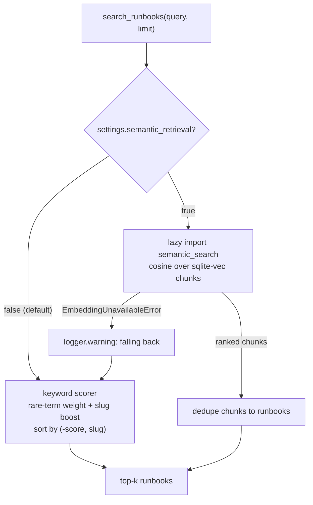
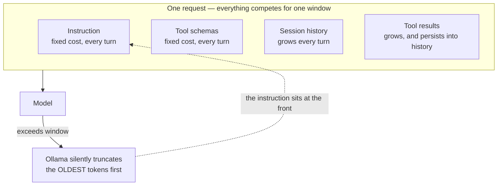

# 3.4. Memory

## What does "memory" mean in this course?

The word covers different stores that should not be conflated:

| Store             | Scope                               | Implementation               |
| ----------------- | ----------------------------------- | ---------------------------- |
| Conversation      | One user/session                    | ADK `DatabaseSessionService` |
| A2A task          | One network task                    | `DatabaseTaskStore`          |
| Operational state | Services, incidents, audit          | Writable SQLite copy         |
| Long-term notes   | One stable user id, across sessions | SQLite in `.state/memory.db` |
| Knowledge         | Remediation procedures              | Immutable Markdown runbooks  |

This page covers long-term memory and knowledge retrieval. A runbook is not automatically trusted simply because it is stored locally; its content is still data the model must cite and policy must constrain.

## What should an agent remember across sessions?

Facts the next conversation needs and cannot recompute: the incident under investigation, remediation already attempted, and outcome notes. In-session history dies with the session, and runbook retrieval only knows the knowledge base. [`longterm.py`](https://github.com/MLOps-Courses/agentops-open-course/blob/main/agents/python/src/agent/longterm.py) gives the AgentOps Agent two tools — `save_incident_note` and `recall_incident_context` — backed by a small SQLite table in the disposable state directory. Notes are isolated per user and pass PII redaction before persisting:

```python
# Memory is a persistence boundary: redact before the write, not after the read.
redacted = redact_persisted_text(cleaned)
```

Memory is a data store like any other: it never touches the seed dataset, and `mise run data:reset` clears it along with the rest of the runtime state.

The cross-session boundary depends on a stable `ToolContext.user_id`. The default unauthenticated A2A adapter derives `A2A_USER_<context-id>`, so a new A2A context (including a browser reload in the minimal client) is a new logical user and cannot recall the previous context's notes. A shared or production client must authenticate the caller and propagate a durable subject before treating this store as human-level long-term memory.

## Why make memory explicit tools instead of automatic?

Silent context stuffing hides reads and writes from everyone debugging the agent. As tools, every recall and save appears in the trace, can be audited, and can be tested deterministically offline. Explicit tools also keep the boundaries inspectable: input validation (`normalize_incident_id`, a referential check that refuses to attach a note to an unknown incident — "refusing to create orphaned memory" — a length cap, and no empty notes) runs at the tool edge, and the redaction step above is a visible policy, not a hope. The cost is that the model must decide to call `recall_incident_context` — the tool docstring tells it to do so at the start of an investigation, and trajectory evaluation is where you verify it does.

## How is a known runbook fetched?

An incident carries a validated runbook slug. The tool normalizes it before any path lookup:

```python
--8<-- "agents/python/src/agent/memory.py:get-runbook"
```

The exact excerpt is build-checked against [`memory.py`](https://github.com/MLOps-Courses/agentops-open-course/blob/main/agents/python/src/agent/memory.py). `normalize_slug` permits only lowercase alphanumeric kebab-case, and only the trusted `normalized` value reaches the data layer. `../../secret` never becomes a filesystem path.

`get_runbook` and `search_runbooks` ship together as `KNOWLEDGE_TOOLS`, each wrapped in `with_resilience` — the same bounded-deadline-and-retry policy the read tools get, safe here because a runbook read is idempotent. The same two functions are also two of the six read-only tools re-exposed over the governed MCP route ([3.3. MCP](3.3.%20MCP.md)), so one implementation serves the in-process agent and any external MCP client without a second copy to drift.

## How does free-text retrieval work?

`search_runbooks` uses deterministic term scoring — TF-IDF-style, in its own docstring's words:

- Drop tokens shorter than three characters.
- Count how many documents contain each term.
- Weight rare terms more highly than ubiquitous terms.
- Add a strong boost when a term matches the runbook slug.
- Sort by score descending, then slug ascending for stable ties.

```python
scored.sort(key=lambda row: (-row[0], row[1]))
```

The result is inspectable, fast, cheap, and reproducible. It is intentionally not described as semantic search — that is the opt-in branch below.

## When do embeddings beat keyword retrieval?

When queries paraphrase the documents instead of quoting them — an engineer types "checkout is slow" while the runbook says "high latency". Whether that matters for _this_ corpus is a measurement, not a fashion choice: enable semantic retrieval only if the evaluation below shows it beating the keyword baseline on this dataset.

The implementation in [`retrieval.py`](https://github.com/MLOps-Courses/agentops-open-course/blob/main/agents/python/src/agent/retrieval.py) stays minimal and account-free: `sqlite-vec` stores runbook-chunk vectors in the state directory, and `nomic-embed-text` runs through the local Ollama embeddings endpoint. Chunking is heading-bounded so each vector covers one procedure step or symptom block:

```python
def chunk_runbook(slug: str, content: str) -> list[str]:
    """Split one runbook into heading-bounded chunks, each prefixed with its slug."""
    pieces = [piece.strip() for piece in _HEADING.split(content) if piece.strip()]
    return [f"{slug}: {piece}" for piece in pieces] or [f"{slug}: {content.strip()}"]
```

The option is off by default (`AGENT_SEMANTIC_RETRIEVAL=false`), which keeps the offline test gate deterministic and model-free. `search_runbooks` reads that one flag and branches: the keyword scorer above, or a lazily-imported `semantic_search` so the default path never loads the vector stack. The fallback is explicit, not silent — an `EmbeddingUnavailableError` (endpoint down, model unpulled, mismatched batch) is caught, logged at warning, and answered by the same keyword scorer:



Own the failure modes before trusting the upgrade: an empty result set, a confidently-wrong nearest neighbor (cosine distance always returns _something_), and the endpoint outage above.

## How do I evaluate retrieval quality?

With ground truth the dataset already contains: every incident names its runbook, so hit-rate@k needs no hand labeling. [`evals/retrieval_eval.py`](https://github.com/MLOps-Courses/agentops-open-course/blob/main/agents/python/evals/retrieval_eval.py) builds a query from each incident's title and summary, scores both retrievers at k=1 and k=3, logs the comparison to MLflow, and prints a verdict:

```bash
cd agents/python
mise run eval:retrieval
```

Measured checkpoint (2026-07-12, dataset commit `ad4854b`, Ollama 0.31.2, `nomic-embed-text` blob `sha256:970aa74c0a90`):

| Retriever | hit-rate@1 | hit-rate@3 |
| --------- | ---------- | ---------- |
| Keyword   | 1.00       | 1.00       |
| Semantic  | 0.80       | 1.00       |

On these ten incident queries, semantic retrieval loses at k=1 and only matches at k=3. The evidence therefore supports the shipped default: keep semantic retrieval disabled for this small, vocabulary-aligned corpus. Re-run the checkpoint when the incidents, runbooks, chunking, or embedding model changes; this snapshot is a versioned observation, not a universal ranking claim.

```python
def hit_rate(retrieve, k: int) -> float:
    """Fraction of incidents whose runbook appears in the retriever's top-k."""
    pairs = cases()
    hits = sum(expected in retrieve(query, k) for query, expected in pairs)
    return hits / len(pairs)
```

The semantic side calls the local embeddings endpoint, so this evaluation stays outside the offline test gate. Set `AGENT_SEMANTIC_RETRIEVAL=true` only if the semantic hit rate beats the keyword baseline here — and remember what you now own: embedding model/version, chunking, index rebuilds, deletion, poisoning defenses, and re-running this evaluation when the corpus changes.

The first CPU request may need to load the embedding weights from disk. `AGENT_EMBEDDING_TIMEOUT_S` bounds that cold start separately (120 seconds by default), so ordinary MCP tools retain their tighter deadline.

## How do you defend against retrieval injection?

- Index only reviewed sources and preserve provenance.
- Treat retrieved instructions as lower priority than system/runtime policy.
- Never let a runbook expand the tool allowlist or self-approve an action.
- Return/cite the source slug so a human can inspect it.
- Bound result count and content size.
- Include malicious or contradictory documents in adversarial tests.

## What is the retrieval checkpoint?

```bash
cd agents/python
uv run pytest tests/test_memory.py tests/test_longterm.py tests/test_retrieval.py
```

Verify exact-slug lookup, deterministic tie ordering, no-match behavior, non-positive limit handling, path traversal rejection, per-user note isolation, redaction before persistence, and the keyword fallback when embeddings are unavailable. Then manually compare the top result for `database connection pool exhausted` with the runbook source.

## What is actually inside my agent's context window?

Everything the model sees each turn is assembled by the runtime, and all of it competes for the same window — on the local path, the modest usable context of Qwen3-4B through Ollama. For the AgentOps Agent, one request is composed of:

| Component       | Source                                                                     |
| --------------- | -------------------------------------------------------------------------- |
| Instruction     | The committed `INSTRUCTION` (or a pinned registry version)                 |
| Tool schemas    | ADK derives a declaration from every tool's signature and docstring        |
| Session history | Every prior turn, replayed by `DatabaseSessionService`                     |
| Tool results    | Runbook markdown, log lines, notes, and skill bodies returned this session |



The tool schemas are easy to underestimate: on the default local path the agent registers a dozen tools (four reads, two knowledge, two guarded actions, two memory, two skill tools), and each docstring you write for the model is prompt text on every single turn. Tool results are the other heavyweight — `search_runbooks` returns up to three whole runbooks as markdown, and once returned they live on in the session history.

The two fixed costs are paid on turn one and never go away; the two growing ones are what eventually push you over the edge. Note the direction of the failure: truncation drops the **oldest** tokens, and your instruction is the oldest thing there — which is why a long conversation degrades precisely into an agent that has forgotten its own rules.

## How do I measure tokens per component?

Per turn, you do not have to guess: the after-model callback in [`budget.py`](https://github.com/MLOps-Courses/agentops-open-course/blob/main/agents/python/src/agent/budget.py) reads `usage_metadata` from each response, accumulates it in session state, and emits the running totals as `agentops.tokens.session.*` span attributes plus an `agentops.tokens` counter that Prometheus scrapes — the same telemetry that backs cost attribution in [7.3. Costs](../7.%20Observability/7.3.%20Costs.md). Watching `prompt_token_count` grow turn over turn shows exactly how fast history accumulates.

Per component, there is no shipped breakdown — measure by ablation. Hold one question constant (`What is the status of the checkout service?`), change one component, and compare the input tokens of the first turn:

1. Switch the six read/knowledge tools between local and the MCP route (`AGENT_MCP_URL`) to see the schema cost of each toolset.
1. Shorten one tool docstring and diff the input count.
1. Ask a question that triggers `search_runbooks` versus one answered by a single status read to see retrieval weight.

Reset state between measurements (`mise run data:reset`), and remember the gateway streaming path reports no usage — measure on the default non-streaming path.

## What do I drop first when I run out?

In order of least behavioral risk first, all demonstrable on the local stack:

1. **Retrieval width.** `search_runbooks(query, limit=3)` returns whole documents; the model rarely needs three runbooks to cite one. Lowering `limit` is the direct lever. Note the semantic option does _not_ help here: it ranks heading-bounded chunks internally but still returns each match's full runbook via `read_runbook(slug)`, so switching retrievers does not shrink what enters the window — only `limit` does.
1. **Tool schema weight.** Terser docstrings and fewer registered tools shrink every turn. Note that routing reads through MCP does not make their schemas free — discovered declarations still enter the context; the saving comes only from what you stop exposing.
1. **Session history.** The course ships no automatic summarizer, so the honest lever is deliberate: end the session, after saving durable findings with `save_incident_note`, and let `recall_incident_context` carry them into the fresh session — long-term memory used as explicit history compression. Skills already apply the same idea: `list_skills` shows only names and descriptions until `load_skill` pulls one body in.

Every cut trades against quality: a terser docstring can cost a correct tool choice, a smaller `limit` can drop the right runbook. The eval set in [4.4. Evaluations](../4.%20Quality/4.4.%20Evaluations.md) is the check — re-run the trajectory scores after each reduction and treat a drop as the real price of the tokens you saved.

## Why does my agent silently forget the start of a long conversation?

Because the model's advertised maximum and the serving window are two different numbers. `ollama show qwen3:4b-instruct` prints the architecture's context length, but the Ollama server applies its own configured window — a few thousand tokens by default unless `OLLAMA_CONTEXT_LENGTH` raises it. When the composed prompt (instruction, tool schemas, full history, tool results) exceeds that window, Ollama truncates the oldest tokens and answers anyway: the agent process receives no error, only a model that has lost the earliest content. Since the instruction sits at the front, a long session can shed the operating rules themselves — grounding and approval discipline degrade exactly when the conversation is longest.

Detect it locally: the per-session input-token attributes from the telemetry above keep climbing while the Ollama server log reports the truncation, and behavior drifts (uncited claims, forgotten constraints from early turns). Fix it explicitly: raise `OLLAMA_CONTEXT_LENGTH` to what your hardware's memory allows, shrink the context with the levers above, and set `AGENT_MAX_TOKENS_PER_SESSION` so a session ends with an actionable message before it degrades silently.
