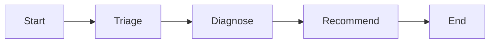

# 3.5. Workflows

## Why use a workflow instead of one autonomous loop?

The order `triage -> diagnose -> recommend` is part of the operational procedure. Encoding it as a graph makes the order visible, gives each step only the tools it needs, and creates separate events/traces for evaluation.



## How is the graph declared?

The installed ADK version exposes a `Workflow` graph. The course defines three focused agents and one linear edge:

```python
triage_workflow = Workflow(
    name="triage_workflow",
    description="Runs triage, diagnose, and recommend over the current incidents.",
    edges=[("START", triage, diagnose, recommend)],
)
```

The source remains the version authority; ADK workflow APIs are evolving and should be rechecked when upgrading.

## How does each node get least privilege?

- `triage` receives read-only incident/service/log tools.
- `diagnose` receives those read tools plus runbook knowledge.
- `recommend` receives only runbook knowledge.

No workflow node receives state-changing action tools. It can recommend a restart or resolution, but the root interactive agent owns the separately approved write.

```python
recommend = Agent(
    model=build_model(),
    name="recommend",
    instruction="Recommend runbook-backed steps and flag actions that need approval.",
    tools=KNOWLEDGE_TOOLS,
)
```

The complete source attaches the same redaction and error callbacks to each model/tool boundary.

## Is a workflow deterministic?

Its topology is deterministic; its model outputs are not. The same three nodes run in order, but each may phrase answers or select allowed tools differently. Tests can assert graph construction, while model-backed evaluations assert expected trajectories and useful outcomes.

## When should you use ordinary Python instead?

Use code when the step is a pure calculation, validation, transaction, or fixed API call. A model-backed node is justified when it must interpret ambiguous natural language or synthesize evidence. Do not spend model calls to reimplement a sort or `if` statement.

## How do failures propagate?

Every node has safe model/tool error callbacks. A failure should emit an actionable stable response and trace the real exception server-side. Decide whether retries are idempotent before adding them; retrying a write-like tool without a transaction/idempotency key is unsafe.

## What is the workflow checkpoint?

```bash
cd agents/python
uv run pytest tests/test_workflow.py
```

Inspect the graph and confirm its node order, tool sets, callbacks, and lack of action tools. Then add one eval case for a triage prompt; exact graph order is necessary but not sufficient evidence of correct diagnosis.
