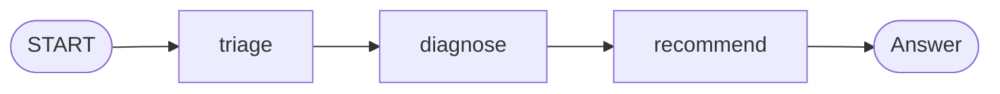

# 3.5. Workflows

## What is a workflow, and why use one?

A **workflow** runs a fixed, predefined sequence of steps — _you_ decide the control flow, not the model. Where the root agent decides its own next move each turn, a workflow guarantees the same steps run in the same order every time. That is exactly what you want for a repeatable operational procedure.

The Ops Copilot's workflow is a three-step pipeline, each step a focused agent that passes its findings to the next through shared session state:



1. **triage** — list the unresolved incidents and pick the single most urgent one.
1. **diagnose** — explain the likely cause of that incident, citing its runbook.
1. **recommend** — propose concrete, runbook-backed next steps, flagging any that need human approval.

Each step gets only the tools it needs: triage and diagnose use the incident tools, diagnose and recommend add the knowledge tools from [3.4. Memory](./3.4. Memory.md).

## How is the pipeline built?

Build each step as a focused agent, then chain them into a graph `Workflow` — read the warning below before you copy it.

```python
# agents/python/src/agent/workflow.py
from google.adk import Agent, Workflow

# 1) Triage: find the incident that matters most right now.
triage = Agent(
    model=settings.model,
    name="triage",
    description="Finds the most urgent unresolved incident.",
    instruction=(
        "You triage incidents. List the unresolved incidents and pick the single most urgent one "
        "(lowest SEV number wins). State its id, service, severity, and one-line summary."
    ),
    tools=ALL_TOOLS,
)

# 2) Diagnose: explain the likely cause of the triaged incident.
diagnose = Agent(
    model=settings.model,
    name="diagnose",
    description="Explains the likely cause of the triaged incident.",
    instruction=(
        "You diagnose the incident chosen by triage. Use get_incident for its details and its "
        "runbook (get_runbook), and get_service_status for the service. Explain the likely cause "
        "in two or three sentences, citing the runbook."
    ),
    tools=_DIAGNOSE_TOOLS,
)

# 3) Recommend: propose concrete, runbook-backed next steps.
recommend = Agent(
    model=settings.model,
    name="recommend",
    description="Recommends concrete, runbook-backed remediation.",
    instruction=(
        "You recommend remediation for the diagnosed incident. Using the runbook, give a short, "
        "ordered list of next steps. Flag any step that needs a guarded action (restart_service, "
        "resolve_incident) and requires human approval. Cite the runbook you used."
    ),
    tools=KNOWLEDGE_TOOLS,
)

# The graph: START → triage → diagnose → recommend, sharing session state along the way.
triage_workflow = Workflow(
    name="triage_workflow",
    description="Runs triage → diagnose → recommend over the current incidents.",
    edges=[("START", triage, diagnose, recommend)],
)
```

Three agents, one order, one set of instructions. The order is expressed as a **graph edge** — `edges=[("START", triage, diagnose, recommend)]` on a `Workflow`. The steps share session state so each one reads what the previous one wrote.

!!! warning "The classic workflow agents are deprecated"

    ADK 2.0's headline change is a **graph-based Workflow runtime**: agents are nodes and edges chain them, expressing sequential, parallel, looping, and dynamic DAGs in one model. This `Workflow` **supersedes** the classic `SequentialAgent` / `ParallelAgent` / `LoopAgent`, which are now **deprecated** — build the pipeline as a graph and do not reach for `SequentialAgent` in new code. `Workflow` with `edges` also covers the parallel and looping flows the deprecated agents handled separately.

## When should I choose a workflow over a single agent?

Reach for a workflow when the _procedure_ is known and you want it repeatable, auditable, and cheap to reason about:

- **Determinism**: the steps run the same way every time, which makes the agent easy to test and evaluate ([4.4. Evaluations](../4. Quality/4.4. Evaluations.md)).
- **Separation of concerns**: each step has one job, one instruction, and only the tools it needs — smaller prompts, fewer ways to go wrong.
- **Composability**: steps are themselves agents, so you can nest a model-driven agent inside a deterministic pipeline where flexibility actually pays.

Prefer a single autonomous agent only where the path genuinely varies turn to turn. When the work needs a _specialist_ rather than a fixed next step, hand it off — that is delegation, in [3.6. A2A](./3.6. A2A.md).
