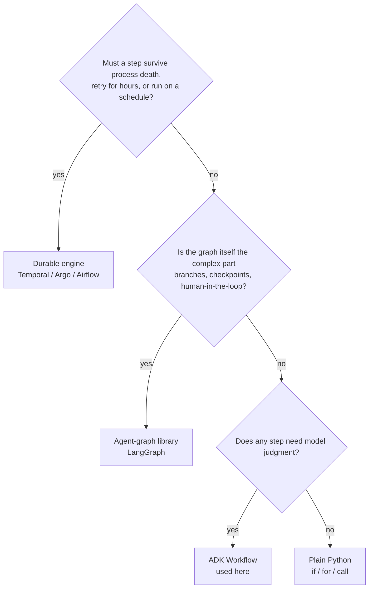
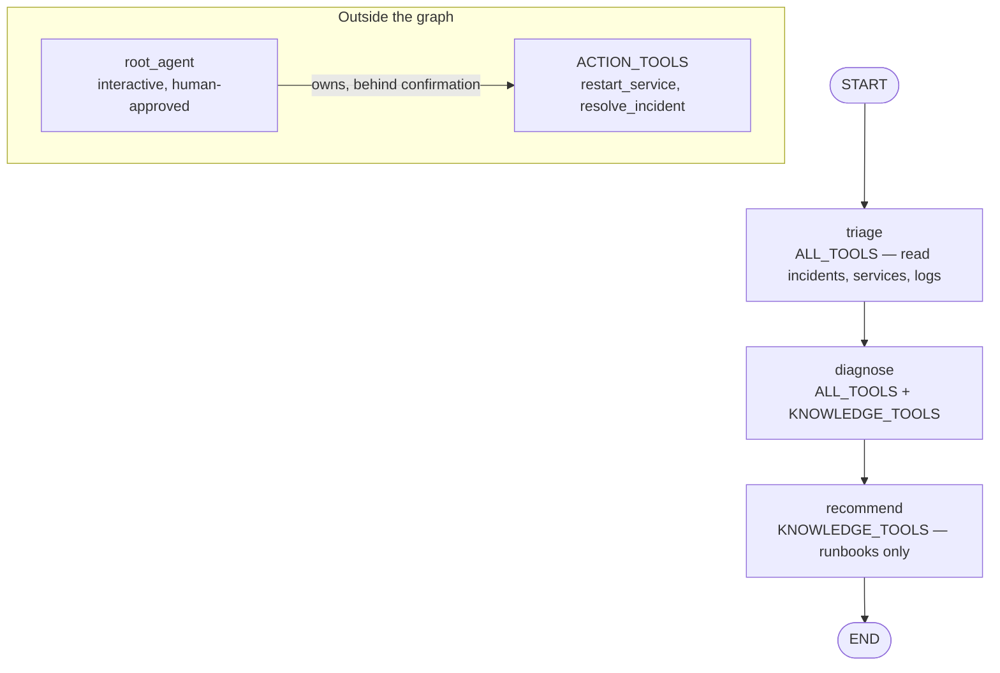
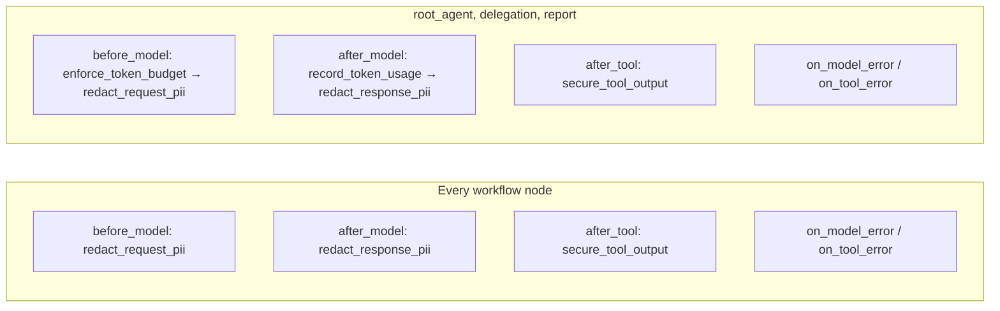

# 3.5. Workflows

## What is a workflow, and why does an agent need one?

A **workflow** is control flow you write down instead of control flow you hope the model invents. In the agent you have built so far, one model decides everything each turn: which tool to call, whether to call another, and when it is finished. That autonomy is the point of an agent — and it is also the part you cannot predict, test cheaply, or explain to an auditor.

A workflow moves _some_ of those decisions out of the model and into a graph. The model still does the parts that need judgment; the graph owns the order.

The distinction that matters is **who decides what happens next**:

|                     | Decided by            | Predictable?             | Use when                                                           |
| ------------------- | --------------------- | ------------------------ | ------------------------------------------------------------------ |
| **Autonomous loop** | The model, every turn | No — path varies per run | The task is open-ended and the right sequence is genuinely unknown |
| **Workflow graph**  | You, at design time   | Yes — topology is fixed  | The sequence is known procedure, and deviation is a defect         |
| **Plain code**      | You, at design time   | Fully                    | No judgment is required at all                                     |

Here, `triage → diagnose → recommend` is not something the model should get to reconsider each run. It is how incident response works. Encoding it as a graph makes the order visible in code, gives each step only the tools it needs, and produces separate events and traces per step so an evaluation can say _which_ stage failed instead of "the agent was wrong".

The reflex worth building: **an agent is not a workflow with a model in it; a workflow is an agent with its autonomy deliberately removed where autonomy has no value.** Every node you make deterministic is one less thing that can surprise you in production, and one less model call to pay for.

## Which workflow patterns exist, and which should you reach for?

The course uses the simplest one, but you should recognize the family — most agent systems are a composition of these:

1. **Sequential (chain).** Fixed order, each step feeding the next. What this course uses. Choose it when the procedure is known and linear.
1. **Parallel (fan-out / fan-in).** Independent steps at once, results merged. Choose it when steps do not depend on each other and latency matters — checking five services simultaneously rather than serially.
1. **Loop.** Repeat until a condition holds or a budget is exhausted. Choose it for refine-until-good-enough, and _always_ bound the iterations — an unbounded loop with a model in it is an unbounded bill.
1. **Router (dispatch).** One model classifies, then hands off to a specialized branch. Choose it when the work splits cleanly by type and each type deserves different tools.
1. **Autonomous loop.** No fixed topology; the model plans. Choose it only when the sequence truly cannot be known in advance — and pay for it with evaluation, budget caps, and guardrails.

These compose: a router whose branches are sequential chains, one of which contains a bounded loop, is an ordinary and healthy design. [3.7](./3.7.%20Multi-Agent.md) covers delegation, which is the router pattern with agents as the branches.

One version fact that saves hours: on this stack (`google-adk[a2a]>=2.4.0`) all four shapes are one construct. The `workflow.py` docstring states that `Workflow` is ADK 2.0's graph runtime and "supersedes the classic `SequentialAgent` / `ParallelAgent` / `LoopAgent` (now deprecated) and also expresses parallel, looping, and dynamic DAGs." Nearly every ADK tutorial you find online predates 2.0 and wires those three deprecated agents; ignore them. You express sequential, parallel, and loop by the _edges_ of a single graph, not by picking a different agent class.

## What are the alternatives to an ADK workflow graph?

Nothing here obliges you to use ADK's `Workflow`. The honest ranking, cheapest first — and you should always take the cheapest option that fits:

1. **Plain Python.** An `if`, a `for`, a function call. Free, instant, perfectly testable. The overwhelming majority of "orchestration" is this, and reaching for a framework first is the most common mistake in agent engineering.
1. **ADK `Workflow` (used here).** Fixed topology inside the agent framework, with ADK's events, callbacks, and traces attached for free. Good when steps are model-backed and you want the graph visible to the same tooling as the agent.
1. **A dedicated agent-graph library** such as LangGraph. More expressive graphs, checkpointing, and human-in-the-loop primitives, at the cost of a second framework and its own concepts. Justified when the graph itself becomes the complex part.
1. **A durable workflow engine** such as Temporal, Airflow, or Argo Workflows. These solve a genuinely different problem: steps that must survive process death, retry for hours, or run on a schedule. If a step takes a week and must not be lost, an in-process graph is the wrong tool and no amount of ADK will save you.

The trap is starting at the expensive end because the problem _feels_ big. Walk the decision the other way:



The course lands on ADK `Workflow` because every step here interprets natural language — triage reasons over incident summaries, diagnosis synthesizes logs and runbooks — yet the order between them is fixed. If any of those steps were a pure calculation, that step would be plain Python inside the node, not a model call.

## How is the graph declared?

`triage_workflow` is three focused agents and one linear edge. The edge tuple lists nodes in run order after the `"START"` sentinel:

```python
triage_workflow = Workflow(
    name="triage_workflow",
    description="Runs triage → diagnose → recommend over the current incidents.",
    edges=[("START", triage, diagnose, recommend)],
)
```

Each of `triage`, `diagnose`, and `recommend` is an ordinary `Agent` (an `LlmAgent`) with its own `instruction` and `tools`; the `Workflow` is the only thing that fixes their order. The source remains the version authority — ADK 2.0's `Workflow` API is still evolving, so recheck the edge form when you upgrade `google-adk`.

## How does each node get least privilege?

The three nodes hold progressively fewer tools, because each needs less than the one before:

1. `triage` gets `ALL_TOOLS` — read-only incident, service, and log tools.
1. `diagnose` gets `_DIAGNOSE_TOOLS`, which is `[*ALL_TOOLS, *KNOWLEDGE_TOOLS]`: the same reads plus runbook retrieval.
1. `recommend` gets `KNOWLEDGE_TOOLS` only — runbooks, nothing else.

The decisive fact is what is _absent_: `workflow.py` imports `ALL_TOOLS` from `tools.py` and `KNOWLEDGE_TOOLS` from `memory.py`, and never imports `ACTION_TOOLS` from `actions.py` at all. No node in the graph can restart a service or resolve an incident. The `recommend` node names those actions only to _flag_ them for a human:

```python
recommend = Agent(
    model=build_model(),
    name="recommend",
    description="Recommends concrete, runbook-backed remediation.",
    instruction=(
        "You recommend remediation for the diagnosed incident. Using the runbook, give a short, "
        "ordered list of next steps. Flag any step that needs a guarded action (restart_service, "
        "resolve_incident) and requires human approval. Cite the runbook you used."
    ),
    tools=KNOWLEDGE_TOOLS,
    before_model_callback=redact_request_pii,
    after_model_callback=redact_response_pii,
    after_tool_callback=secure_tool_output,
    on_model_error_callback=handle_model_error,
    on_tool_error_callback=handle_tool_error,
)
```

The state-changing write stays with the interactive `root_agent`, behind the human-approval guardrail from [4.5. Guardrails](../4.%20Quality/4.5.%20Guardrails.md). Drawn out, the boundary is the point:



No arrow crosses from a workflow node into `ACTION_TOOLS`. The graph can _recommend_ a restart; only a human, through `root_agent`, can perform one.

## What does each node see from the previous one?

The `Workflow` chains its agents "passing findings forward via session state" (its docstring). Concretely, all three nodes share one session, so each later node reads the conversation the earlier nodes wrote into it. The handoff is **contextual, not typed** — there is no schema passed from `triage` to `diagnose`. The design leans on the instructions instead:

```python
instruction=(
    "You diagnose the incident chosen by triage. Use get_incident for its details and its "
    "runbook (get_runbook), and get_service_status for the service. Explain the likely cause "
    "in two or three sentences, citing the runbook."
),
```

"the incident chosen by triage" and, in `recommend`, "the diagnosed incident" are the entire contract. This is cheap and flexible, and it is also the pattern's soft spot: if `triage` phrases its pick ambiguously, `diagnose` can pick a different incident and nothing type-checks the mismatch. When a step's output genuinely must be structured — an id, a severity, a decision — reach for an `output_schema` node (as `triage_report_agent` in `report.py` does, see [4.4. Evaluations](../4.%20Quality/4.4.%20Evaluations.md)) so the handoff is validated, not merely hoped for.

## How do you actually run the workflow?

Honestly: there is no shipped entrypoint. `triage_workflow` is imported by nothing except its own module and `tests/test_workflow.py`, and it is not registered on `root_agent`. `mise run web`, `mise run run`, and `mise run a2a` all launch `root_agent` (and ADK also discovers the `structured_report` agent); none of them launch the graph. If you type "run the workflow" expecting one of those commands to drive it, you will be running the interactive agent instead.

You can exercise the graph in two ways:

1. **Assert its shape**, which is what the checkpoint below does — construction is fully testable offline with no model call.
1. **Execute it end to end** by constructing an ADK `Runner` around `triage_workflow` yourself and feeding it a prompt, exactly as the standalone server does for `root_agent` in `server.py`.

This is deliberate. The workflow is a teaching artifact that shows the sequential-graph pattern cleanly; it is not wired into the product surface, so nothing about the interactive agent depends on it.

## Why do workflow nodes have no token budget?

Look closely at the callbacks. Every workflow node carries the same five: `redact_request_pii` (before model), `redact_response_pii` (after model), `secure_tool_output` (after tool), and the two error handlers. What it does **not** carry is the budget pair — `enforce_token_budget` and `record_token_usage` — that `root_agent`, all three delegation agents, and `triage_report_agent` do:



Two consequences follow, and the reference code does not defend against either:

1. **No per-session ceiling.** `enforce_token_budget` is what refuses further model calls once `AGENT_MAX_TOKENS_PER_SESSION` is spent (see [7.3. Costs](../7.%20Observability/7.3.%20Costs.md)). A three-node chain fires at least three model calls per run with no cap — a looping variant could fire many more, unbounded.
1. **No token accounting.** `record_token_usage` is what attributes tokens to the session state and emits the OTel counters and cost span attributes. Without it, the graph's spend is invisible to the same dashboards that watch the interactive agent.

`validate_actions` is also absent, but that one is moot: the nodes hold no action tools to validate. The budget gap is the real one. If you promote this graph toward anything production-facing, copy the `root_agent` callback lists onto each node so the chain inherits the same budget enforcement and cost telemetry as the rest of the agent.

## How do failures propagate?

Every node wires `on_model_error_callback=handle_model_error` and `on_tool_error_callback=handle_tool_error`. A provider outage or tool exception does not crash the run mid-graph: `handle_model_error` returns a stable "provider is unavailable, retry" `LlmResponse` and logs the real exception server-side; `handle_tool_error` returns `{"error": "... failed safely; inspect the service logs ..."}`. The caller gets an actionable, non-sensitive message while the stack trace stays in the logs where it belongs ([7.1. Tracing](../7.%20Observability/7.1.%20Tracing.md)).

Decide whether a retry is idempotent before you add one. The read tools these nodes use are wrapped with `with_resilience` (bounded retries plus a deadline) precisely because reads are safe to repeat. The action tools are not wrapped and are not in the graph, for the same reason: retrying a write without a transaction or idempotency key can apply it twice.

## Is a workflow deterministic?

Its topology is deterministic; its model outputs are not. The same three nodes run in order on every invocation, but each may phrase its answer or select among its allowed tools differently. So tests assert graph _construction_ (below), while model-backed evaluations assert expected _trajectories_ and useful outcomes ([4.4. Evaluations](../4.%20Quality/4.4.%20Evaluations.md)). Exact graph order is necessary but not sufficient evidence of correct diagnosis.

## When should a node be plain Python instead of a model?

Per node, ask the same question the alternatives ranking asks per system: does this step need judgment? A model-backed node earns its cost only when it must interpret ambiguous natural language or synthesize evidence — which is why all three nodes here are model-backed. A step that is a pure calculation, a validation, a transaction, or a fixed API call should be an ordinary function inside a node, not its own model call. Do not spend a model round trip to reimplement a sort or an `if`.

## What is the workflow checkpoint?

```bash
cd agents/python
uv run pytest tests/test_workflow.py
```

Be precise about what this proves. The suite has exactly two tests, and they assert only two things:

```python
def test_workflow_chains_three_steps_in_order() -> None:
    assert triage_workflow.name == "triage_workflow"
    assert [triage.name, diagnose.name, recommend.name] == ["triage", "diagnose", "recommend"]
    source, *steps = triage_workflow.edges[0]
    assert source == "START"
    assert steps == [triage, diagnose, recommend]


def test_each_step_has_a_model_and_tools() -> None:
    for step in (triage, diagnose, recommend):
        assert step.model
        assert step.tools  # every step is grounded in tools
```

That is: the edge runs `triage → diagnose → recommend` from `START`, and each node has a truthy `.model` and `.tools`. Nothing here asserts the callbacks, the per-node tool _sets_, or the absence of action tools — those are claims this page makes from reading the source, not facts the checkpoint enforces. Closing that gap is a good first extension: add a test that `recommend.tools == KNOWLEDGE_TOOLS` and that no node's tool names include `restart_service` or `resolve_incident`, then run an eval case over a real triage prompt.

## How would you add a parallel fan-out node?

Exercise: go beyond the sequential chain and use the graph's parallel shape.

1. **Goal**: before `recommend`, fan out to two independent nodes that gather evidence concurrently — say `check_logs` and `check_service_health` — then fan back in so `recommend` sees both. The two gatherers do not depend on each other, so running them in parallel cuts latency without changing the result.
1. **Files to touch**: `agents/python/src/agent/workflow.py` (add the two nodes with the same callback set as the existing nodes, and express the fan-out/fan-in edge), and `agents/python/tests/test_workflow.py` (assert the new topology and that each new node still has a `.model` and `.tools`).
1. **Verify the API first**: ADK 2.0's `Workflow` edge form for fan-out is not the linear tuple used here, and the API is still evolving — read the installed version with `uv run python -c "import google.adk; help(google.adk.Workflow)"` rather than guessing the parallel-edge syntax.
1. **Gate that proves completion**: `cd agents/python && uv run pytest tests/test_workflow.py` passes with the new parallel topology asserted, and — because you are adding two model-backed nodes with no budget callbacks — decide explicitly whether to copy the `root_agent` budget pair onto them, per the token-budget pitfall above.
