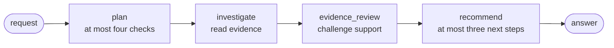
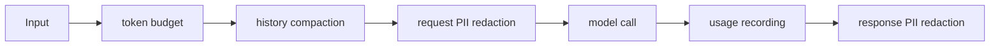

# 3.5. Workflows

!!! abstract "In one glance"

    - **You will:** Run a plan → investigate → evidence review → recommend workflow and inspect the controls that keep it bounded and read-only.
    - **You need:** [3.1. Tools](./3.1.%20Tools.md), [3.4. Memory](./3.4.%20Memory.md), and the local model from [1.4. Providers](../1.%20Setup/1.4.%20Providers.md).
    - **Time:** about 25 minutes, hands-on.

## How do you run the planning workflow?

The repository exposes the workflow as a real ADK composition selected through the same package as the interactive agent.

First confirm that the local model is ready:

```bash
mise run doctor:model
cd agents/python
mise run workflow
```

Ask:

```text
Investigate INC-001 and recommend the safest next step.
```

This command makes local model calls through Ollama. It starts no hosted service and needs no account or API key.

The run always crosses four stages:


```mermaid
flowchart LR
    Start([request]) --> Plan["plan<br/>at most four checks"]
    Plan --> Investigate["investigate<br/>read evidence"]
    Investigate --> Review["evidence_review<br/>challenge support"]
    Review --> Recommend["recommend<br/>at most three next steps"]
    Recommend --> End([answer])
```

Look for a target and stopping condition in the plan, sourced observations in the investigation, a review verdict, and a runbook-backed recommendation. No stage can change incident state.

## Why is this separate from the default agent?

Most short questions do not justify four model calls, so `mise run run` still launches the faster interactive `root_agent`.

The root agent chooses its own tools and order. Its instruction asks for a concise observable plan on multi-step investigations and a post-action check before claiming recovery; both remain advisory model behavior. The workflow is the deliberate deeper path: its graph always plans and always reviews the evidence.

| Surface                 | Who chooses the next step? | Best fit                                         |
| ----------------------- | -------------------------- | ------------------------------------------------ |
| `mise run run`          | The model                  | Short questions and interactive approved actions |
| `mise run workflow`     | The declared graph         | Repeatable, read-only deep investigations        |
| `mise run coordinator`  | A coordinator model        | Delegation between bounded specialists           |
| A plain Python function | The code                   | Work needing no model judgment                   |

Planning every turn would add latency and tokens without improving a simple status lookup. Making the deeper path explicit teaches the pattern without making the learner's first agent slow or fragile.

## What is a workflow?

A **workflow** is control flow declared as a graph instead of chosen anew by the model.

The model still interprets natural language and evidence inside a node. The graph owns which nodes exist and what follows each one. That distinction makes the topology testable even though node outputs remain nondeterministic.

Use the simplest control mechanism that fits:

1. Use plain Python when the rules are complete and no judgment is needed.
1. Use an ADK workflow when model-backed steps need a visible, bounded order.
1. Use an autonomous agent when the useful sequence genuinely depends on what it discovers.
1. Use a durable engine when work must survive process death, wait for hours, or run on a schedule.

ADK `Workflow` is in-process orchestration, not a durable job system. A restart can interrupt it.

## How do the four stages divide responsibility?

Each stage has one job and a bounded output contract:

| Stage             | Responsibility                                                          | Bound                                                                                          |
| ----------------- | ----------------------------------------------------------------------- | ---------------------------------------------------------------------------------------------- |
| `plan`            | Preserve the target and prescribe the four evidence sources             | At most four bullets; no tools or invented facts                                               |
| `investigate`     | Derive service and runbook from one incident, then read exact evidence  | Exact reads plus incident-list fallback; observations separated from inference                 |
| `evidence_review` | Re-read only named sources and challenge missing or conflicting support | Exact incident, service, runbook, key observations, gaps, and one verdict in a compact handoff |
| `recommend`       | Reload only the handed-off runbook and offer what the verdict supports  | At most three steps; no discovery or action call                                               |

The linear edge is `START → plan → investigate → evidence_review → recommend`. In the installed ADK runtime, each node receives only its immediate predecessor's output, not an accumulated transcript of every earlier node. A fan-in node instead receives a mapping of predecessor names to outputs.

`investigate` must hand off the exact incident id, service, runbook slug, observed status, unfiltered log evidence, and relevant runbook guidance. `evidence_review` then preserves those identifiers, up to four key observations, remaining gaps, and its supported, insufficient, or conflicting verdict.

`recommend` can only preserve facts that survive both handoffs.

The plan is control, not evidence. It may prescribe an incident read, service status, logs, and the linked runbook, but it cannot invent a symptom, cause, system, time window, or recovery fact.

The handoff remains contextual text, not a typed domain object. If a production boundary requires an exact incident id or verdict enum, add an output schema rather than relying on phrasing.

## Is evidence review the same as reflection?

It is a bounded form of reflection: one separate stage critiques the evidence before advice is emitted.

An open-ended “reflect until satisfied” loop has an unclear stopping condition and can multiply cost without producing new evidence. This course uses one review pass with three explicit outcomes. If support is insufficient or conflicting, `recommend` asks for the missing check instead of smoothing uncertainty into a confident answer.

The interactive agent's instruction asks for a second bounded reflection point after an approved write: re-read the incident and service, compare the observed result with expected recovery evidence, and save a factual outcome note. That rule is advisory in the autonomous loop; a prompt-presence test stops it disappearing silently, but only a controlled integration run can show that a chosen model follows it.

## How does the workflow keep least privilege?

Every workflow tool is read-only, and each stage receives only the reads needed for its job.

`investigate` receives exact incident, service, log, and runbook readers, plus `list_incidents` only as the no-id fallback. That fallback filters by a named service before selecting urgency. Both investigation and review read unfiltered logs for the exact service instead of inventing a search hypothesis.

`evidence_review` gets the four exact readers but no list or fuzzy search. `recommend` gets only `get_runbook`; `plan` gets no tool.

This is a foreign-key-like rule: when `get_incident` supplies a runbook slug, use `get_runbook` with that slug. `search_runbooks` belongs to open-ended discovery, so this bounded workflow never exposes it.

The graph never receives:

- `restart_service`
- `resolve_incident`
- `save_incident_note`

The first two remain on the interactive root agent behind ADK confirmation and validation. The third writes memory, so it also stays outside this read-only graph. A recommendation may name an action, but only a human-approved interactive turn can perform it.

## Which runtime protections apply to every stage?

The workflow reuses the same safety callbacks as the main agent instead of becoming a less-governed side path.

Before each model call, it enforces the session token budget, compacts long history, and redacts request PII. After the call, it records token usage and redacts response PII. Tool output is treated as untrusted data, and model/tool failures become stable safe responses while details stay in logs.


```mermaid
flowchart LR
    Input --> Budget["token budget"]
    Budget --> Compact["history compaction"]
    Compact --> RedactIn["request PII redaction"]
    RedactIn --> Model["model call"]
    Model --> Usage["usage recording"]
    Usage --> RedactOut["response PII redaction"]
```

The fixed four-node topology also bounds the minimum number of model calls. It is not permission to remove the session budget: repeated workflow runs still accumulate usage.

## Which other workflow shapes matter?

Sequential, parallel, loop, and router shapes cover most useful orchestration.

1. A sequential chain fits dependent stages, as here.
1. A parallel fan-out fits independent reads whose latency you want to overlap.
1. A loop fits refinement only when iterations and a failure exit are explicit.
1. A router fits distinct task types that deserve different tools or policies.

On the pinned ADK 2.x stack, `Workflow` expresses these graph shapes. Older tutorials that compose the deprecated `SequentialAgent`, `ParallelAgent`, or `LoopAgent` classes do not match this repository's API.

Do not add a graph library because a diagram looks impressive. Add another orchestration layer only when ADK's graph is the limiting boundary, and add a durable engine only when in-process execution cannot satisfy recovery requirements.

## What does the offline test prove?

The focused test proves topology, discovery, least privilege, callback parity, and instruction bounds without calling a model.

```bash
cd agents/python
uv run pytest tests/test_workflow.py
```

It asserts:

1. With `AGENT_ENTRYPOINT=workflow`, ADK discovers `src/agent` and resolves the shipped graph.
1. The edge order is exactly `plan → investigate → evidence_review → recommend`.
1. No stage owns `restart_service`, `resolve_incident`, or `save_incident_note`.
1. Every stage keeps budget, compaction, PII, usage, output, and error callbacks.
1. The plan, review, and recommendation instructions contain their explicit bounds.

The test does not prove that a model diagnoses INC-001 correctly. `mise run eval:workflow` selects the workflow and runs the fixed INC-001 evidence path with a configured model; it is scheduled evidence, not a pull-request gate.

## How would you extend the workflow safely?

Exercise: add parallel evidence reads only after proving that they are independent.

- **Mode**: `keep`.
- **Goal**: add one service-health node and one log node, fan out after `plan`, then fan in before `evidence_review`.
- **Files to touch**: `agents/python/src/agent/workflow.py` and `agents/python/tests/test_workflow.py` only.
- **Preflight**: require `git diff --quiet -- agents/python/src/agent/workflow.py agents/python/tests/test_workflow.py`.
- **Gate that proves completion**: inspect the installed API with `cd agents/python && uv run python -c "from google.adk import Workflow; help(Workflow)"`, then make `uv run pytest tests/test_workflow.py -q` assert the new topology, both read-only boundaries, the complete callback set, and the unchanged stopping condition.
- **Final state**: keep the two named files and no generated output; the full offline `mise run test` remains green.

Parallelism changes latency and event order. It must not change which evidence the review receives or weaken the stopping condition.

## What proves this page worked?

Run the structural gate, then compare its proof with one local-model execution.

```bash
cd agents/python
uv run pytest tests/test_workflow.py
mise run eval:workflow
```

**You are done when:**

- The focused test exits zero with no network or model call.
- The local-model evaluation exercises plan, investigation, evidence review, and recommendation in that order.
- You can explain why the default agent plans only multi-step work while the deep workflow always plans.
- You can explain why one evidence-review pass is safer than an unbounded self-reflection loop.
- You can name the three write-capable tools the workflow never receives.

Continue to [3.6. A2A](./3.6.%20A2A.md) when you can choose between plain code, the interactive agent, and the bounded workflow for a new task.
