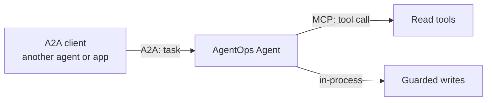
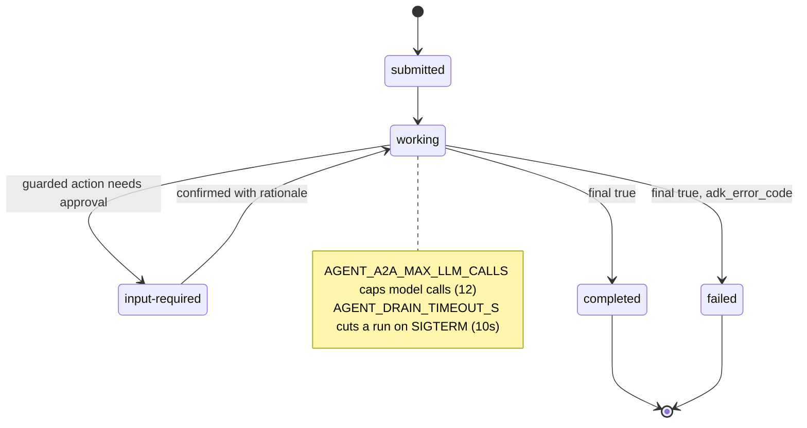
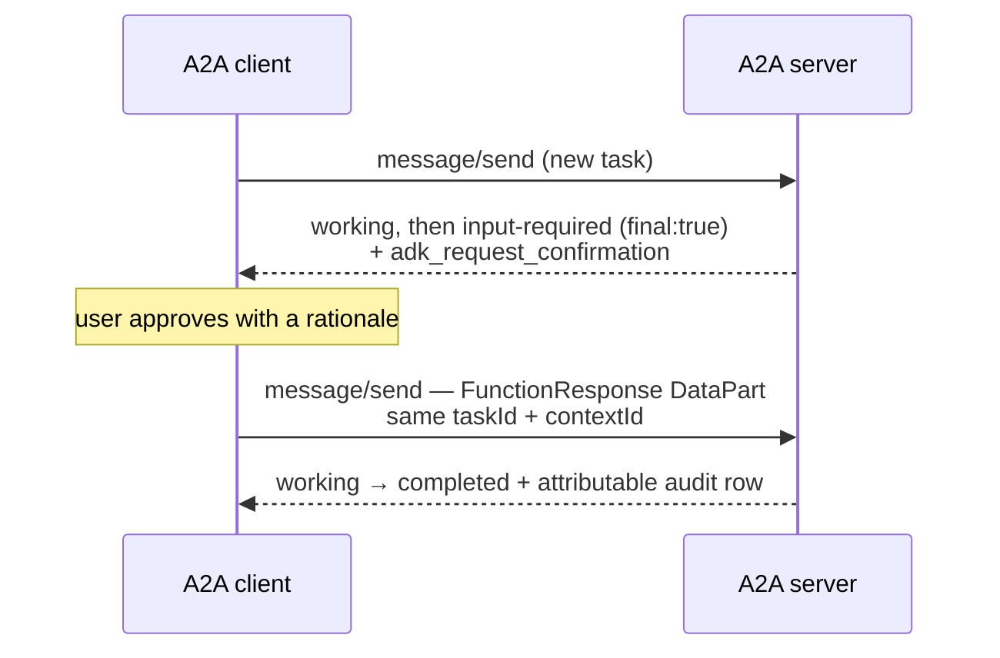

# 3.6. A2A

## What is in-process delegation?

An ADK coordinator can transfer control to a named sub-agent in the same process and session. The course's diagnosis specialist owns only read and runbook tools, the remediation specialist owns only the guarded actions, and the coordinator owns triage tools and decides when to delegate:

```python
coordinator_agent = Agent(
    model=build_model(),
    name="coordinator_agent",
    description="On-call coordinator that triages incidents and delegates diagnosis and remediation.",
    tools=ALL_TOOLS,
    sub_agents=[diagnosis_agent, remediation_agent],
)
```

The complete definitions in [`delegation.py`](https://github.com/MLOps-Courses/agentops-open-course/blob/main/agents/python/src/agent/delegation.py) attach the instructions, redaction, and stable error callbacks; [3.7. Multi-Agent](./3.7.%20Multi-Agent.md) covers the delegation pattern and its least-privilege boundaries in depth. In-process delegation is simple and low latency, but both agents share deployment, failure, trust, and scaling boundaries.

## What is A2A, and why is it not just MCP again?

**Agent2Agent (A2A)** is an open protocol for one agent to talk to _another agent_ across a network boundary. It was created at Google, donated to the [Agentic AI Foundation](../8.%20Community/8.6.%20AAIF.md), and — like MCP — belongs to no single vendor.

The obvious question, having just built MCP tools in [3.3](./3.3.%20MCP.md), is why a second protocol exists. The answer is that they connect different things, and the distinction is not academic:

|                   | MCP                      | A2A                                                           |
| ----------------- | ------------------------ | ------------------------------------------------------------- |
| Connects          | An agent to a **tool**   | An agent to **another agent**                                 |
| The other side is | A function with a schema | An autonomous peer with its own model and judgment            |
| Interaction       | One call, one result     | A **task**: may be long-running, streamed, or need more input |
| Returns           | A deterministic value    | An outcome it decided how to reach                            |
| You provide       | Arguments                | A goal, in natural language                                   |

Put plainly: **MCP is how an agent uses something; A2A is how an agent delegates to someone.** A tool does what it is told. A peer agent is told _what you want_ and figures out how — it may take thirty seconds, ask a clarifying question, or come back partly done. A request/response function call cannot express that, which is why A2A is task-shaped rather than call-shaped.

They are complementary, not competing. This course's agent is an A2A **server** to its clients and an MCP **client** to its tools, simultaneously.



## How does an A2A interaction work?

Three ideas carry the protocol:

1. **The agent card.** A JSON document at a well-known URL (`/.well-known/agent-card.json`) that advertises identity, skills, capabilities, and auth requirements. It is how a client discovers what an agent can do _before_ trusting it with anything — the agent equivalent of an OpenAPI document.
1. **The task.** The unit of work, with a lifecycle: submitted → working → (`input-required`) → completed or failed. Tasks have IDs, so a long job can be polled, resumed, or streamed rather than held open on one blocking call.
1. **Messages and artifacts.** Conversation turns, and the outputs a task produces.

Transport is JSON-RPC over HTTP, with Server-Sent Events for streaming — deliberately boring, so an A2A endpoint is governable by ordinary infrastructure. That is what lets Chapter 5 put agentgateway in front of it, and it is why the `input-required` state matters here: an approval pause ([4.5](../4.%20Quality/4.5.%20Guardrails.md)) is a first-class protocol state, not a hack.

## When is A2A worth its cost?

It buys a real boundary: independent deployment, ownership, language, scaling, and failure domain. Two teams can ship agents on separate schedules and only agree on a card.

That boundary is not free. You inherit identity and authorization between agents, network policy, versioning and compatibility, retries and idempotency, task persistence across restarts, and distributed tracing to explain what happened. The in-process alternative in the section above has none of those problems, because it has no network.

So: **use in-process delegation until an organizational or operational boundary forces your hand.** A different team, a different release cadence, a different scaling profile, a different trust level, or a different language are good reasons. "It feels more like microservices" is not — you would be buying a distributed system to solve a function-call problem.

In this repository, the in-process coordinator demonstrates delegation semantics and `agent.server` exposes the root AgentOps Agent over A2A. It does not pretend that the in-process specialist is already a separately deployed remote agent.

## What does the agent card declare?

```python
agent_card = AgentCard(
    name="AgentOps Agent",
    description="Runbook-grounded incident triage and guarded remediation for the AgentOps Open Course.",
    url=f"{settings.a2a_protocol}://{settings.a2a_host}:{settings.a2a_port}/",
    version=version("agentops-agent"),
    capabilities=AgentCapabilities(streaming=True, state_transition_history=True),
    default_input_modes=["text/plain"],
    default_output_modes=["text/plain"],
    skills=[
        AgentSkill(
            id="incident-triage",
            name="Incident triage",
            description="Prioritize incidents using service state, logs, and deterministic severity rules.",
            tags=["incident", "triage", "operations"],
            examples=["Triage the open incidents."],
        ),
    ],
)
```

The source constructs both `AgentSkill` records inline; the excerpt shows the first. The card's `url` is built from three separate settings in [`config.py`](https://github.com/MLOps-Courses/agentops-open-course/blob/main/agents/python/src/agent/config.py) that also matter operationally:

```python
a2a_bind_host: str = Field(default="127.0.0.1", min_length=1)
a2a_host: str = Field(default="localhost", min_length=1)
a2a_port: int = Field(default=8080, ge=1, le=65535)
a2a_protocol: str = Field(default="http", pattern=r"^https?$")
```

`a2a_host` (what a client dials) and `a2a_bind_host` (what the process listens on) are deliberately distinct. `main()` binds Uvicorn to `a2a_bind_host`, which defaults to loopback `127.0.0.1`; only the container image opts into `AGENT_A2A_BIND_HOST=0.0.0.0` to accept traffic from other pods, and `tests/test_server.py` asserts the Dockerfile sets exactly that. The card, however, is always built from `a2a_host`/`a2a_protocol`/`a2a_port`, so it advertises a client-reachable service address, never the listener address `0.0.0.0` — which means "every interface," not somewhere a client can call back.

## How does the server preserve tasks?

`create_app()` builds an explicit runner with a `DatabaseSessionService` and an A2A `DatabaseTaskStore`, both backed by `.state/runtime.db`. The durability argument is three values in [`server.py`](https://github.com/MLOps-Courses/agentops-open-course/blob/main/agents/python/src/agent/server.py):

```python
session_service = DatabaseSessionService(
    db_url=database_url,
    pool_size=1,
    max_overflow=0,
    connect_args={"timeout": 30},
)
runner = Runner(agent=agent, app_name=_APP_NAME, session_service=session_service)
task_engine = session_service.db_engine
runtime = Runtime(
    runner=runner,
    session_service=session_service,
    task_engine=task_engine,
    task_store=DatabaseTaskStore(engine=task_engine),
)
```

`pool_size=1` with `max_overflow=0` means the pool hands out exactly one connection, ever. SQLite allows a single writer, so queueing session writes and task writes behind that one connection serializes their short transactions instead of letting two independent engines race into intermittent "database is locked"; `connect_args={"timeout": 30}` lets a queued writer wait rather than fail immediately. The task store does not open its own database — `task_engine = session_service.db_engine` reuses the session service's engine, so both stores literally share one connection. The lifespan then closes the runner and the session service that owns that engine. This is a single-process course durability model, not a horizontally scalable database design.

## What bounds one A2A task?

A networked task can run away in ways an in-process call cannot: the caller is another agent that may itself be looping, and the work is open-ended by design. Two bounds cap a single A2A task in this repository, both configurable and both with safe defaults.

1. A per-task model-call ceiling. `_bounded_request` overrides whatever `max_llm_calls` ADK's converter produced with a fixed budget:

   ```python
   a2a_max_llm_calls: int = Field(default=12, ge=1, le=100)
   ```

   Every A2A task therefore gets at most 12 model round-trips (clamped to 1–100) before ADK aborts the run, so a delegated goal cannot silently loop forever on your token budget. Change it with `AGENT_A2A_MAX_LLM_CALLS`; `tests/test_server.py` asserts the override survives even the streaming path.
1. A wall-clock drain bound. `drain_timeout_s` (default 10s, `AGENT_DRAIN_TIMEOUT_S`) is how long an in-flight task may keep running after SIGTERM before Uvicorn forces shutdown. A turn that overruns it is cut, which is why every guarded write is transactional and never relies on drain time for correctness; a container's `terminationGracePeriodSeconds` must exceed this value.

The lifecycle those bounds act on is small and testable:



`test_a2a_confirmation_response_resumes_the_guarded_action_with_audit_identity` drives the left path end to end: a task pauses at `input-required` (`final: true`) carrying an `adk_request_confirmation` call, the client resumes the same `taskId`/`contextId` with a `confirmed` DataPart and a rationale, and the task reaches `completed` with an attributable audit row. The `failed` edge is exercised by the stream-interruption test discussed below.

On the wire, that resume is a single `FunctionResponse` `DataPart` posted on the **same** task — it echoes the paused call's `id` and carries the rationale the agent requires:

```json
{
  "kind": "data",
  "data": {
    "id": "<the paused call id>",
    "name": "adk_request_confirmation",
    "response": { "confirmed": true, "payload": { "rationale": "runbook-backed; INC-002 verified" } }
  }
}
```

That is exactly what [`clients/web/index.html`](https://github.com/MLOps-Courses/agentops-open-course/blob/main/clients/web/index.html) sends when you approve, keeping `contextId` for the session and `taskId` for the paused task. The agent refuses an approval carrying no rationale ([4.5](../4.%20Quality/4.5.%20Guardrails.md)), which is why the browser form makes the field required.

The state machine above is what the server tracks; the two-request handshake below is what a client actually implements — the pause is a terminal `input-required` response, and approval is a _second_ `message/send` that reuses the same identifiers:



A missing rationale, or a resume on a fresh `taskId`, does not continue the paused action — the guarded write only fires when the confirmation is tied back to the exact task that requested it.

## How do you inspect the A2A contract?

```bash
cd agents/python
mise run a2a
```

In another terminal:

```bash
curl -fsS http://localhost:8080/.well-known/agent-card.json | jq '{name,url,skills}'
```

Expected name: `AgentOps Agent`; the card should list incident triage and guarded remediation.

## How do I stream a response through the gateway?

Call `message/stream` instead of `message/send`. The response is an SSE channel: every `data:` line is one JSON-RPC response carrying a whole task event (`submitted`, `working`, `completed`, `failed`). With the A2A server (`mise run a2a`), the gateway ([5.3. A2A Gateway](../5.%20Gateway/5.3.%20A2A%20Gateway.md)), and a model backend running:

```bash
curl -N -fsS http://127.0.0.1:3001/ \
  -H 'Content-Type: application/json' \
  -d '{
    "jsonrpc": "2.0", "id": "1", "method": "message/stream",
    "params": {"message": {"kind": "message", "messageId": "demo-1",
      "role": "user", "parts": [{"kind": "text", "text": "Triage the open incidents."}]}}
  }'
```

You always get this event stream — it reports task progress, not model tokens. Whether the _model_ also streams is a separate, opt-in decision made server-side in [`server.py`](https://github.com/MLOps-Courses/agentops-open-course/blob/main/agents/python/src/agent/server.py):

```python
updates: dict[str, object] = {"max_llm_calls": settings.a2a_max_llm_calls}
if settings.a2a_streaming:
    updates["streaming_mode"] = StreamingMode.SSE
converted.run_config = run_config.model_copy(update=updates)
```

By default the model runs non-streaming and the stream carries whole events. `AGENT_A2A_STREAMING=true` adds partial per-token events for lower perceived latency, at the redaction cost described below — which is why it defaults to `false`.

## What happens when a stream fails mid-answer?

The stream terminates explicitly, not silently — but that took deliberate wiring against ADK's defaults. When the run raises mid-stream, the executor emits a terminal `failed` status-update event (`final: true`) on the same channel, so a client sees the task fail rather than a hung connection. That is what `_agent_executor` buys with `force_new_version=True`:

```python
def _agent_executor(runner: Runner) -> A2aAgentExecutor:
    """Create the maintained A2A executor with the bounded request policy."""
    return A2aAgentExecutor(
        runner=runner,
        config=A2aAgentExecutorConfig(
            request_converter=_bounded_request,
            execute_interceptors=[_error_code_interceptor()],
        ),
        # ADK's legacy result aggregator mutates terminal failures back to
        # ``working`` before enqueueing them. The maintained executor preserves
        # the A2A terminal state and emits partial model output as artifacts.
        force_new_version=True,
    )
```

Without the flag, as the source comment records, ADK's legacy aggregator "mutates terminal failures back to `working` before enqueueing them" — the task would look stuck, not failed. The paired `_error_code_interceptor()` then carries ADK's structured `adk_error_code` onto that final event, keyed by task id so concurrent streams stay isolated. `test_a2a_sse_interruption_emits_terminal_failure` pins the whole contract: the last event has `state == "failed"`, `final is True`, and `metadata["adk_error_code"] == "MODEL_UNAVAILABLE"`, while the raw exception text never leaks into any event. The course's web client ([5.3. A2A Gateway](../5.%20Gateway/5.3.%20A2A%20Gateway.md)) keys off exactly these terminal states.

Redaction has a precise contract under streaming. `redact_response_pii` is an `after_model_callback`, and ADK runs it on every partial chunk _and_ on the final aggregated response — enabling streaming does not bypass the PII guardrail ([4.5. Guardrails](../4.%20Quality/4.5.%20Guardrails.md)). But per-chunk redaction is best-effort: an entity split across two chunk boundaries may not match either fragment, and fragments already sent cannot be retracted. The final aggregate is redacted as a whole, so the durable answer is clean; only the transient partial view carries that residual risk. This asymmetry is the reason `AGENT_A2A_STREAMING` defaults to `false` and is an explicit trade-off, not a free feature.

## When should an agent become a separate service?

Split it when ownership, data classification, scaling, release cadence, or blast radius differs enough to justify the network boundary. Do not split merely to draw a multi-agent diagram: a function or in-process agent is cheaper when lifecycle and trust are identical.

## What is the A2A checkpoint?

```bash
cd agents/python
uv run pytest tests/test_server.py tests/test_delegation.py
```

Verify card fields, advertised address, persistent service/task construction, shutdown cleanup, the coordinator's sub-agent wiring, and the real `input-required` confirmation response resuming the same task with attributable audit evidence. A deterministic fake model drives that approval round trip, so no live model call is needed.
