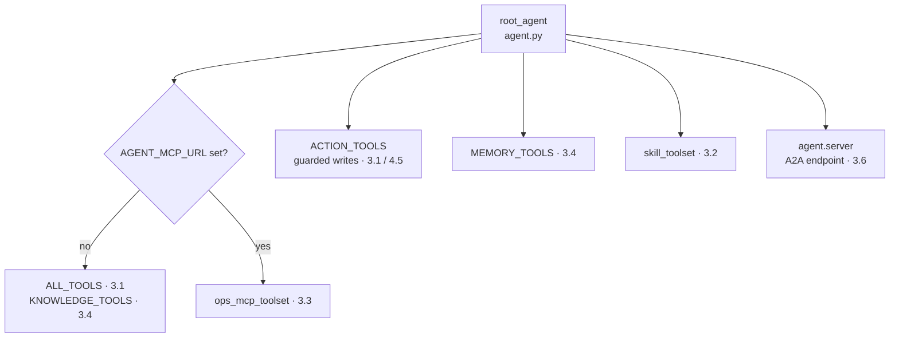

# 3. Capabilities

## Which capabilities will you add?

Your agent can now hold a conversation ([Chapter 2](../2. Agents/)); this chapter gives it bounded capabilities: typed read tools, progressively disclosed procedures, those reads optionally routed over MCP, reviewed-runbook retrieval, a fixed control-flow graph, and an A2A endpoint. Each is a small, single-purpose unit that composes cleanly.

Everything assembles in one composition root. `agent.py` builds `root_agent` and hands it a single flat tool list; each entry is owned by a different module this chapter teaches, and one branch (`_read_tools()`) decides whether reads run locally or over the governed MCP toolset:

```python
--8<-- "agents/python/src/agent/agent.py:root-agent"
```

That one assignment is the map for the whole chapter. The read branch swaps in-process tools for MCP when configured; the guarded writes, long-term memory, and skills always stay in-process; and [3.6. A2A](./3.6. A2A.md) wraps the finished agent for the network:



Two of the chapter's artifacts sit deliberately outside this composition root: the `triage_workflow` graph ([3.5. Workflows](./3.5. Workflows.md)) and the `coordinator_agent` with its specialists ([3.7. Multi-Agent](./3.7. Multi-Agent.md)). They are demonstrations with no CLI or serving entrypoint — `mise run run`, `mise run web`, and `mise run a2a` all serve `root_agent` — so they are exercised only by their tests. That is honest by design: you learn the pattern without wiring a second deployment you do not yet need.

## Which capability lives in which module?

Each capability has exactly one owner, so a failure has one place to look. This chapter's pages map onto the reference package like this:

| Sub-page                                  | What it adds                                               | Owning module(s)                           |
| ----------------------------------------- | ---------------------------------------------------------- | ------------------------------------------ |
| [3.0. Packaging](./3.0. Packaging.md)     | The uv package and lazy `root_agent` discovery             | `pyproject.toml`, `__init__.py`            |
| [3.1. Tools](./3.1. Tools.md)             | Typed read tools over validated, resettable incident state | `tools.py`, `data.py`                      |
| [3.2. Skills](./3.2. Skills.md)           | Progressive-disclosure procedures via `skill_toolset()`    | `skills.py`                                |
| [3.3. MCP](./3.3. MCP.md)                 | The governed MCP server and client for the read tools      | `mcp_server.py`, `mcp_client.py`           |
| [3.4. Memory](./3.4. Memory.md)           | Conversation, notes, and deterministic runbook retrieval   | `memory.py`, `longterm.py`, `retrieval.py` |
| [3.5. Workflows](./3.5. Workflows.md)     | The fixed `triage → diagnose → recommend` graph            | `workflow.py`                              |
| [3.6. A2A](./3.6. A2A.md)                 | The persistent A2A server, card, and task store            | `server.py`, `delegation.py`               |
| [3.7. Multi-Agent](./3.7. Multi-Agent.md) | A coordinator with least-privilege specialists             | `delegation.py`                            |

## Which switches change this chapter's behavior?

The reference agent has one behavior by default and three opt-in variants, each a single environment variable parsed once in `config.py`. Knowing them up front tells you what is conditional as you read each page:

| Switch                     | Default | Effect when set                                                                   | Page |
| -------------------------- | ------- | --------------------------------------------------------------------------------- | ---- |
| `AGENT_MCP_URL`            | unset   | `_read_tools()` swaps the local read tools for the governed MCP toolset           | 3.3  |
| `AGENT_SEMANTIC_RETRIEVAL` | `false` | Runbook search uses local-embedding vector retrieval, falling back to keywords    | 3.4  |
| `AGENT_A2A_STREAMING`      | `false` | The A2A server emits partial per-token events, at the redaction cost 3.6 explains | 3.6  |

Each defaults to the offline, deterministic path so the test gate needs no model, no network, and no embedding server. You turn a switch on only after a page has shown you the trade-off it buys.

## How do you verify the whole chapter offline?

The chapter checkpoint is the offline test suite for tools, skills, MCP, retrieval, workflows, delegation, and A2A server construction. It runs without a model or network:

```bash
cd agents/python
mise run test
```

That is the umbrella gate (`uv run pytest` over the full suite). Each sub-page also has a scoped checkpoint you can run in isolation — for example `uv run pytest tests/test_tools.py tests/test_data.py` for [3.1](./3.1. Tools.md) or `uv run pytest tests/test_server.py tests/test_delegation.py` for [3.6](./3.6. A2A.md) — so you can verify one capability at a time as you build it. Model-backed behavior remains a separate evaluation gate (`mise run eval`), because a green offline suite proves the wiring, not the reasoning.
