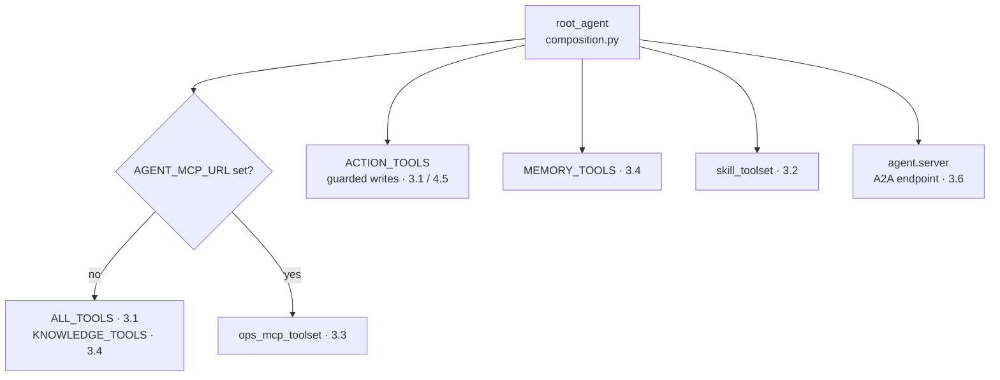
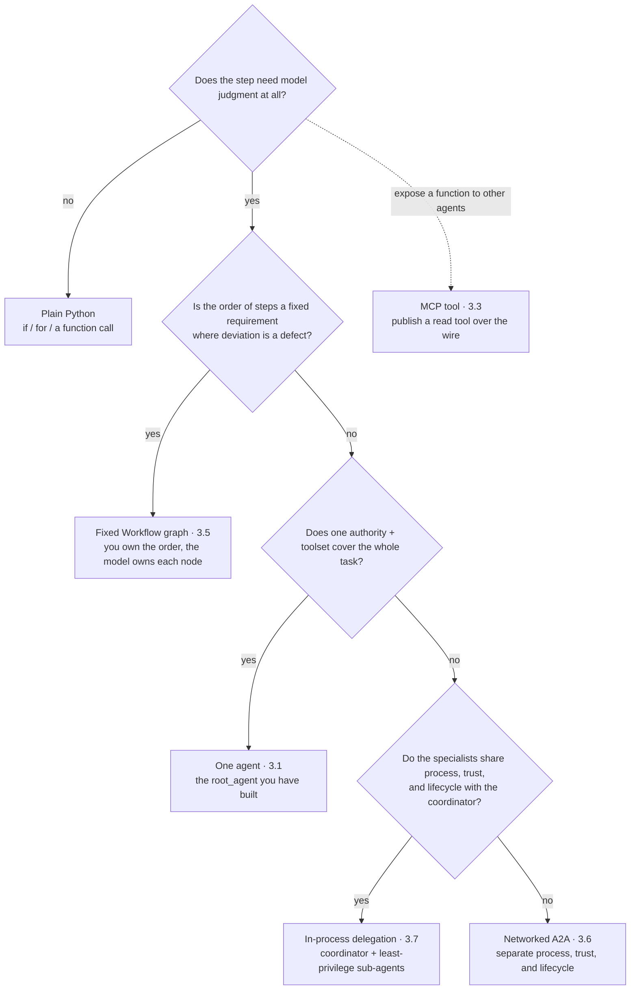

# 3. Capabilities

!!! abstract "In one glance"

    - **You will:** Map the eight capabilities this chapter bolts onto the agent you already ran, and learn which one to reach for when.
    - **You need:** Chapter 2 finished, with `mise run test` green in `agents/python`.
    - **Time:** about 8 minutes, orientation.

## Which capabilities will you add?

Your agent can now hold a conversation ([Chapter 2](../2. Agents/)). This chapter gives it things it can do — one capability per page, in reading order:

- **[3.0. Packaging](./3.0. Packaging.md)** _(reference)_: The uv package, the lazy ADK import, and the entrypoints every later page depends on.
- **[3.1. Tools](./3.1. Tools.md)** _(hands-on)_: Typed reads, guarded writes, and a bounded local capability prototype.
- **[3.2. Skills](./3.2. Skills.md)** _(reference)_: Written procedures the agent loads only when the task needs them.
- **[3.3. MCP](./3.3. MCP.md)** _(hands-on)_: Those same read tools served over a protocol, and the server you can call yourself.
- **[3.4. Memory](./3.4. Memory.md)** _(reference)_: What the agent keeps between turns and sessions, and how it looks a runbook up.
- **[3.5. Workflows](./3.5. Workflows.md)** _(hands-on)_: A bounded `plan → investigate → evidence_review → recommend` graph.
- **[3.6. A2A](./3.6. A2A.md)** _(hands-on)_: The network endpoint that lets a separate agent send this one a task.
- **[3.7. Multi-Agent](./3.7. Multi-Agent.md)** _(concept)_: A coordinator that hands work to specialists holding fewer tools than it does.

Each is a small, single-purpose unit that composes cleanly.

**Key term:** A [_composition root_](../0.%20Overview/0.7.%20Glossary.md#composition-root) is the single place that constructs an application and wires its dependencies.

Everything assembles in that composition root. `composition.py` builds `root_agent` and hands it a single flat tool list, and each entry in that list is owned by a different module this chapter teaches:

```python
--8<-- "agents/python/src/agent/composition.py:root-agent"
```

Read only the `tools=` line for now. The six callback slots under it are policy, owned by [4.5. Guardrails](../4.%20Quality/4.5.%20Guardrails.md).

That one assignment is the map for the whole chapter. One branch, `_read_tools()`, decides whether reads run locally or over the governed MCP toolset. **MCP** is the Model Context Protocol: one contract for serving a tool to any agent that speaks it ([0.7. Glossary](../0.%20Overview/0.7.%20Glossary.md#mcp)).

The guarded writes, long-term memory, and skills always stay in-process, and [3.6. A2A](./3.6. A2A.md) wraps the finished agent for the network:


```mermaid
flowchart TD
    root["root_agent<br/>composition.py"]
    root --> branch{"AGENT_MCP_URL set?"}
    branch -->|no| local["ALL_TOOLS · 3.1<br/>KNOWLEDGE_TOOLS · 3.4"]
    branch -->|yes| mcp["ops_mcp_toolset · 3.3"]
    root --> actions["ACTION_TOOLS<br/>guarded writes · 3.1 / 4.5"]
    root --> memory["MEMORY_TOOLS · 3.4"]
    root --> skills["skill_toolset · 3.2"]
    root --> server["agent.server<br/>A2A endpoint · 3.6"]
```

## Which composition should you reach for?

Six ways to compose work appear in this chapter. The rule for choosing between them: **take the cheapest option that fits.**

Five of them form one ladder — plain Python, one agent, a fixed Workflow graph, in-process delegation, and networked A2A — while MCP is the orthogonal move that publishes a capability outward. That rule is the same as everywhere else in the course. Walk the questions top to bottom and stop at the first "yes".


```mermaid
flowchart TD
    Q1{"Does the step need model judgment at all?"} -->|no| Plain["Plain Python<br/>if / for / a function call"]
    Q1 -->|yes| Q2{"Is the order of steps a fixed requirement<br/>where deviation is a defect?"}
    Q2 -->|yes| WF["Fixed Workflow graph · 3.5<br/>you own the order, the model owns each node"]
    Q2 -->|no| Q3{"Does one authority + toolset cover the whole task?"}
    Q3 -->|yes| One["One agent · 3.1<br/>the root_agent you have built"]
    Q3 -->|no| Q4{"Do the specialists share process, trust,<br/>and lifecycle with the coordinator?"}
    Q4 -->|yes| Deleg["In-process delegation · 3.7<br/>coordinator + least-privilege sub-agents"]
    Q4 -->|no| A2A["Networked A2A · 3.6<br/>separate process, trust, and lifecycle"]
    Q1 -.->|"expose a function to other agents"| MCP["MCP tool · 3.3<br/>publish a read tool over the wire"]
```

- **Plain Python** — no judgment is required, so no model call belongs here.
- **One agent** — judgment is needed but one authority and toolset cover the task; this is the `root_agent` that the whole chapter assembles.
- **Fixed Workflow graph** — the order `plan → investigate → evidence_review → recommend` is a requirement, not a choice, so you write it down as a graph.
- **In-process delegation** — different authority per specialist, but same process, trust, and lifecycle: a coordinator transfers to least-privilege sub-agents, each holding only the tools its own job needs.
- **Networked A2A** — a separate process, trust, and lifecycle forces a network boundary; delegate to a peer agent over the protocol.
- **MCP tool** — the orthogonal move: expose one of your functions so _other_ agents can call it.

The dashed edge marks MCP as orthogonal to the ladder: it is about publishing a capability outward, not about which composition runs your own work.

Each box names the page that owns its option. The ranking of the orchestration technology itself — plain Python, ADK `Workflow`, a graph library, a durable engine — is owned by [3.5. Workflows](./3.5. Workflows.md#what-is-a-workflow).

## Which capability lives in which module?

Each capability has exactly one owner, so a failure has one place to look. This chapter's pages map onto the reference package like this:

| Sub-page                                  | What it adds                                                                 | Owning module(s)                                              |
| ----------------------------------------- | ---------------------------------------------------------------------------- | ------------------------------------------------------------- |
| [3.0. Packaging](./3.0. Packaging.md)     | The uv package and lazy `root_agent` discovery                               | `pyproject.toml`, `__init__.py`                               |
| [3.1. Tools](./3.1. Tools.md)             | Typed read tools over validated, resettable incident state                   | `tools.py`, `data.py`                                         |
| [3.2. Skills](./3.2. Skills.md)           | Progressive-disclosure procedures via `skill_toolset()`                      | `skills.py`                                                   |
| [3.3. MCP](./3.3. MCP.md)                 | The governed MCP server and client for the read tools                        | `mcp_server.py`, `mcp_client.py`                              |
| [3.4. Memory](./3.4. Memory.md)           | Conversation, notes, history compaction, and deterministic runbook retrieval | `memory.py`, `longterm.py`, `compaction.py`, `retrieval.py`   |
| [3.5. Workflows](./3.5. Workflows.md)     | The bounded planning and evidence-review graph                               | `workflow.py`, selected with `AGENT_ENTRYPOINT=workflow`      |
| [3.6. A2A](./3.6. A2A.md)                 | The persistent A2A server, card, and task store                              | `server.py`                                                   |
| [3.7. Multi-Agent](./3.7. Multi-Agent.md) | A coordinator with least-privilege specialists                               | `delegation.py`, selected with `AGENT_ENTRYPOINT=coordinator` |

??? note "Deeper: how 3.5 and 3.7 share one package boundary"

    The `triage_workflow` graph and `coordinator_agent` are runnable selections, while `agent` remains the default.

    ```bash
    cd agents/python
    mise run workflow
    mise run coordinator
    ```

    All three tasks resolve the lazy `root_agent` from `src/agent`. The task aliases set the validated `AGENT_ENTRYPOINT`; implementations remain in `agent/workflow.py` and `agent/delegation.py`, with no sibling discovery packages to maintain.

## Which switches change this chapter's behavior?

One composition selector and three opt-in switches change what runs.

The task aliases set the composition selector. Every capability switch defaults to the offline, deterministic path, so the test gate needs no model, network, or embedding server.

??? note "Deeper: the selector and three capability switches"

    `config.py` parses every choice once. Knowing them up front tells you what is conditional as you read each page:

    | Setting                    | Default | Effect when changed                                                               | Page      |
    | -------------------------- | ------- | --------------------------------------------------------------------------------- | --------- |
    | `AGENT_ENTRYPOINT`         | `agent` | Selects the workflow or coordinator behind the shared package boundary            | 3.5 / 3.7 |
    | `AGENT_MCP_URL`            | unset   | `_read_tools()` swaps the local read tools for the governed MCP toolset           | 3.3       |
    | `AGENT_SEMANTIC_RETRIEVAL` | `false` | Runbook search uses local-embedding vector retrieval, falling back to keywords    | 3.4       |
    | `AGENT_A2A_STREAMING`      | `false` | The A2A server emits partial per-token events, at the redaction cost 3.6 explains | 3.6       |

## What proves this chapter worked?

The chapter checkpoint is the offline test suite for tools, skills, MCP, retrieval, workflows, delegation, and A2A server construction. It runs without a model or network:

```bash
cd agents/python
mise run test
```

That is the umbrella gate (`uv run pytest` over the full suite). Each sub-page also has a scoped checkpoint you can run in isolation, so you can verify one capability at a time as you build it. Two examples: `uv run pytest tests/test_tools.py tests/test_data.py` for [3.1. Tools](./3.1. Tools.md), and `uv run pytest tests/test_server.py tests/test_delegation.py` for [3.6. A2A](./3.6. A2A.md).

Model-backed behavior remains separate because a green offline suite proves wiring, not reasoning. `mise run eval` exercises the default agent; `mise run eval:workflow` exercises the bounded workflow's read-only evidence path.

**You are done when:**

- `mise run test` passes in `agents/python`, with no model server and no network running.
- The chapter's required drill is done: [3.1. Tools](./3.1.%20Tools.md#your-turn-how-do-you-prototype-a-get_oncall_schedule-read-tool) proves a local `get_oncall_schedule` slice with valid and rejected inputs, proves the public MCP surface stayed fixed, then removes only the experiment files.
- You can name the sub-page that owns each capability, and the module behind it.
- You can point at the one branch in `composition.py` that decides whether reads run locally or over MCP.
- Without reopening Chapter 2: you can say why the model can only ever _ask_ for a state change, and name the two tools it has to ask for.

Continue to [3.0. Packaging](./3.0.%20Packaging.md) when the `tools=` line of `root_agent` reads as a map of this chapter rather than a list of unfamiliar names.
