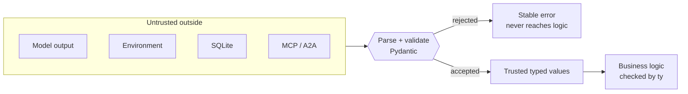
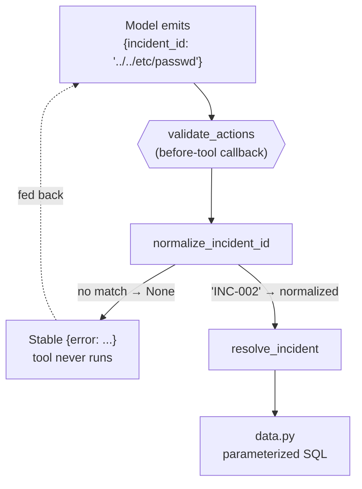

# 4.0. Typing

## What is typing, and what are the two kinds?

A type is a promise about what a value is. Python lets you write that promise down (`def get_incident(incident_id: str) -> Incident:`) but does not enforce it — annotations are ignored at runtime. That surprises people, so it is worth being exact, because this chapter uses **two different mechanisms** that beginners routinely conflate:

|          | Static typing (**ty**)                                 | Runtime validation (**Pydantic**)             |
| -------- | ------------------------------------------------------ | --------------------------------------------- |
| Runs     | Before the code runs, reading source                   | While the code runs, on real data             |
| Catches  | Code that cannot be right — wrong types wired together | Data that is not right — a bad value arriving |
| Costs    | Nothing at runtime                                     | A few microseconds per validation             |
| Blind to | What the outside world actually sends                  | Mistakes on paths it never executes           |

They are complementary, and neither substitutes for the other. Static checking proves you wired your own code together correctly. It cannot know that the JSON a model just produced has `severity: "extremely bad"`. Validation catches that — but only if you put a validator on the boundary where it arrives.

The rule the whole chapter follows: **parse at the boundary, then trust.** Convert untrusted external data into a validated type once, at the edge, and let everything inside operate on values that are already known-good. The alternative — checking `if x is None` defensively in twenty places, and missing the twenty-first — is how most production bugs are born.



There is a third, quieter mechanism this chapter also relies on and 4.2 tests: a **total narrowing function**. Some untrusted values do not arrive as a model you construct — a model-supplied tool argument reaches your callback as an already-`str` value inside a `dict[str, Any]`, with no Pydantic construction step to hang a validator on. For those, the repo uses `normalize_incident_id` / `normalize_slug`: pure functions typed `str -> str | None` that return the strict value or `None`, with no third outcome. They are runtime validation expressed as a function instead of a model.

## Why does type safety matter more for an agent?

Because an agent's inputs are generated by something that is _fluent but not accountable_, and its outputs can restart a service.

In ordinary software, a function's caller is other code you wrote — a compiler or a test can pin down what it sends. In an agent, the caller of `restart_service` is a language model that produced the argument by predicting plausible text ([2.2](../2.%20Agents/2.2.%20Models.md)). It has no obligation to be right. It can hallucinate an incident ID that has never existed, invent a service name that reads convincingly, or pass `"../../etc/passwd"` because a poisoned log line suggested it. None of that is a bug in the model; it is the model doing what it does.

So the agent's most dangerous data path — untrusted text → tool arguments → real side effects — is exactly the one a traditional type checker cannot see through. Types are how you close it:

- **Strings arrive from everywhere**: prompts, environment, MCP, A2A, SQLite, providers. Every one is a potential injection or a typo.
- **`extra="forbid"` makes unexpected fields loud.** A model that invents a plausible extra key gets a rejection, not silent acceptance.
- **A constrained type is a security control.** `Field(pattern=_INCIDENT_ID.pattern)` means a path-traversal string cannot become an incident ID — not because you remembered to check, but because the type will not hold it.
- **Enums make illegal states unrepresentable.** If `Severity` is an enum, `"extremely bad"` cannot reach your logic and cause a wrong branch three functions later.

That "security control" claim is concrete, not a slogan. Follow one malformed tool argument the model emits. The before-tool callback `validate_actions` ([`guardrails.py`](https://github.com/MLOps-Courses/agentops-open-course/blob/main/agents/python/src/agent/guardrails.py)) runs `normalize_incident_id` on it; a value that does not match `^INC-\d+$` becomes `None`, and the callback returns a stable `{"error": ...}` dict — which ADK feeds back to the model **as the tool result, without ever running the tool**. Only a value that survives narrowing reaches `resolve_incident` and the parameterized SQL in `data.py`:



Types do not prove that a model answer is correct. They prevent malformed data from becoming an unexamined incident, service, action target, or audit record — and they turn a class of failures from "mysterious behavior in production" into "a rejection at the edge, with a stable error and a trace".

## Where are the trusted boundaries?

Every place external data enters gets parsed into a typed value before any logic runs. The domain models in [`models.py`](https://github.com/MLOps-Courses/agentops-open-course/blob/main/agents/python/src/agent/models.py) parse SQLite rows; the constraints are module-level regexes so the same pattern guards a model field and a normalizer:

```python
_INCIDENT_ID = re.compile(r"^INC-\d+$")
_SLUG = re.compile(r"^[a-z0-9]+(?:-[a-z0-9]+)*$")

# ... StrEnums (IncidentStatus, Severity, ServiceStatus), Service model ...

class Incident(BaseModel):
    """One incident parsed from the trusted dataset."""

    model_config = ConfigDict(extra="forbid")

    id: str = Field(pattern=_INCIDENT_ID.pattern)
    service: str = Field(pattern=_SLUG.pattern)
    title: str = Field(min_length=1)
    severity: Severity
    status: IncidentStatus
    runbook: str = Field(pattern=_SLUG.pattern)
    opened_at: str = Field(min_length=1)
    resolved_at: str | None
    summary: str = Field(min_length=1)
```

Each boundary has a real owner in the code:

- **Environment → `Settings`.** [`config.py`](https://github.com/MLOps-Courses/agentops-open-course/blob/main/agents/python/src/agent/config.py) parses `AGENT_*` and provider SDK variables into paths, booleans, bounded ports (`a2a_port: int = Field(ge=1, le=65535)`), a protocol (`a2a_protocol: str = Field(pattern=r"^https?$")`), and call budgets. See the next section — it is the richest boundary in the repo.
- **SQLite rows → domain models.** `list_incidents` / `get_incident` in `data.py` wrap every row in `Incident.model_validate(dict(row))`; `list_services` does the same with `Service`. `extra="forbid"` means an unexpected column is a loud `ValidationError`, not a silently-ignored field.
- **Lifecycle strings → enums.** `IncidentStatus`, `Severity`, and `ServiceStatus` are `StrEnum`s, so a row whose `status` is not one of the three legal values is rejected at parse time rather than mis-branched later.
- **Model-controlled ids/slugs → normalizers.** `normalize_incident_id` and `normalize_slug` narrow a tool argument before it touches SQL or the filesystem. `read_runbook` and `read_service_logs` in `data.py` call `normalize_slug` first, so a traversal slug is treated as "not found" rather than read.
- **Tool results → plain JSON.** After validation, tool outputs are ordinary JSON-compatible dicts; the typed models stay at the edge and the interior passes plain structures.

The narrowing functions are short and total — that totality is the point:

```python
def normalize_incident_id(value: str) -> str | None:
    """Normalize a model-supplied incident id, returning ``None`` when invalid."""
    normalized = value.strip().upper()
    return normalized if _INCIDENT_ID.fullmatch(normalized) else None
```

There is no third outcome: the return either matches `^INC-\d+$` or is `None`. [4.2. Testing](./4.2.%20Testing.md) proves exactly that with a Hypothesis property (`test_incident_id_normalization_has_no_third_state`) that fuzzes the whole unicode/control-character input space, plus a companion property that no traversal or SQL metacharacter survives into an accepted id.

## How does configuration become a trusted boundary?

Configuration is untrusted input like any other — it just arrives from the environment instead of the model. The failure mode is worse, though: a bad combination of environment variables that surfaces as a stack trace deep inside the first turn is far harder to debug than a value that is wrong on its face. So `Settings` follows the same rule — parse once, fail fast — and pushes it further: **make an illegal configuration unrepresentable.**

Individual fields carry their own constraints, and the provider fields carry the aliases and defaults that keep the account-free local run working:

```python
--8<-- "agents/python/src/agent/config.py:settings-provider-fields"
```

A per-field constraint cannot express "OpenAI-compatible needs a base URL" or "enterprise Gemini needs a project and a location" — those are relationships _between_ fields. A `@model_validator(mode="after")` runs once, after every field is parsed, and rejects the bad combinations with a message that names the fix instead of a stack trace:

```python
--8<-- "agents/python/src/agent/config.py:settings-provider-validation"
```

This is "make illegal states unrepresentable" applied to configuration: the type system rules out a malformed port; the cross-field validator rules out a coherent-looking but contradictory provider setup. `tests/test_config.py` is the copy target when you add a setting — `test_openai_compatible_provider_requires_base_url` and `test_gemini_provider_rejects_ambiguous_api_key_and_enterprise_auth` each set one bad environment value and assert the boundary rejects it with the right message. Run the resolved configuration through the CLI to see it validated with secrets masked:

```bash
cd agents/python
mise run config:check
```

## How is the code checked statically?

The repository uses [ty](https://docs.astral.sh/ty/), Astral's static type checker, against Python 3.13:

```toml
[tool.ty.environment]
python-version = "3.13"
```

ty is still pre-1.0, which is why `pyproject.toml` pins it to a compatible range — `ty>=0.0.58,<0.1` — rather than an open `>=`; an unpinned pre-release checker would drift its diagnostics under you. It reads source and never runs your code, so it catches wiring mistakes at zero runtime cost. `mise run check` fans its four gates out in parallel through `depends = ["check:format", "check:lint", "check:types", "check:vuln"]`, so `check:types` (which runs `uv run ty check`) executes alongside the linter and the vulnerability audit on every commit. Run it alone while iterating:

```bash
cd agents/python
mise run check:types
```

A real failure looks like a call site, not a runtime crash. Write `list_incidents(status="open")` when `list_incidents` in `data.py` declares `status: IncidentStatus | None`: a plain `str` is not an `IncidentStatus` (the enum is a subtype of `str`, not the reverse), so ty rejects that line before a single test runs. The fix is to pass `IncidentStatus.OPEN`, not to silence the diagnostic.

Do not silence an error with `Any` or an ignore unless the external library boundary genuinely cannot be expressed. Keep any necessary ignore narrow and explain why runtime compatibility is still safe — the model-selection tests do this deliberately, using `# noqa: SLF001` on the few asserts that reach into a locked SDK's private attribute to verify the resilience seam.

## Which invariants deserve enums or validated types?

Use a type when an invalid value should be unrepresentable after parsing: incident status, severity, service status, incident ids, slugs, A2A protocol, ports, and max model calls. Each of those has a small, closed set of legal values or a strict shape, so a wrapper earns its keep:

```python
class Severity(StrEnum):
    """Incident severity, ordered by its numeric suffix."""

    SEV1 = "SEV1"
    SEV2 = "SEV2"
    SEV3 = "SEV3"
```

Do not introduce wrapper types for strings that have no meaningful invariant. The repo draws that line inside a single model: `Incident.severity` is a `Severity` enum, but `Incident.summary` is only `Field(min_length=1)`. A summary is free prose — its sole invariant is "not empty", and a `Summary` wrapper would add ceremony without ruling out any real mistake. `severity` has exactly three legal values, so an enum turns a whole class of bugs (a typo'd or invented severity flowing into a routing decision) into a parse-time rejection. Reach for a type where the value space is closed and a wrong value is dangerous; stop where it is open and a wrong value is merely wrong text.

## What happens when the model violates the schema?

Something explicit. `triage_report_agent` ([2.3. Instructions](../2.%20Agents/2.3.%20Instructions.md)) promises a validated `TriageReport`; the programmatic path in [`report.py`](https://github.com/MLOps-Courses/agentops-open-course/blob/main/agents/python/src/agent/report.py) decides what a violation means. `parse_triage_report` lets every real violation raise `ValidationError`, and `request_triage_report` retries once with the validation errors fed back, then degrades to prose:

```python
second = await generate(retry_prompt)
try:
    return parse_triage_report(second)
except ValidationError:
    _SCHEMA_FAILURES.add(1)
    logger.warning("Triage report for %s failed schema validation twice; degrading to prose", incident_id)
    return second
```

The return type is `TriageReport | str`, so the caller must handle both outcomes — never a silent crash and never a silently-wrong object (`extra="forbid"` rejects a plausible-looking report with an invented field). Each degradation increments the `agentops.triage_report.schema_failures` counter, so a rising violation rate is a dashboard signal of model quality, not a hidden branch. The policy is deterministic to test offline with a fake model:

```bash
cd agents/python
uv run pytest tests/test_report.py
```

The separate model-backed checkpoint exercises the actual ADK `output_schema` entry point without changing the conversational agent:

```bash
cd agents/python
mise run eval:report
```

[`triage-report.evalset.json`](https://github.com/MLOps-Courses/agentops-open-course/blob/main/agents/python/evals/triage-report.evalset.json) requires the incident, log, and runbook reads in order. A completed run has therefore crossed both boundaries: ADK accepted the final response as a `TriageReport`, and the trajectory stayed grounded in the fixed seed.

## Where does typing stop helping?

Types are a boundary control, not a force field. Four failure modes survive them, and knowing each keeps you from trusting a green type check too far:

- **`extra="forbid"` is loud on purpose — and brittle by the same token.** It is right for the committed dataset, where a surprise column is a genuine defect, so the domain models forbid extras. It would be wrong for a schema you do not control: `Settings` deliberately uses `extra="ignore"` instead, so an unrelated ambient variable or a future provider field does not crash startup. Choose per boundary, not by habit.
- **Pydantic validates at construction, not on mutation.** The models set no `validate_assignment=True`, so `incident.status = "bogus"` after parsing would _not_ re-validate and would silently hold a bad value. The models are safe because they are built once from a row via `model_validate` and never mutated — treat a parsed model as immutable in practice.
- **A `StrEnum` compares equal to its own string, so a typo'd comparison still type-checks and silently fails.** `IncidentStatus.RESOLVED == "resolved"` is `True`, which is convenient, but `status == "resloved"` also type-checks fine and just evaluates `False` forever. The enum protects the values you _store_; it does not protect a bare string literal you compare against. `data.py` defends by comparing to the enum member's value (`incident["status"] == IncidentStatus.RESOLVED.value`) rather than sprinkling raw literals.
- **Annotations are erased at runtime.** ADK hands your callbacks `args: dict[str, Any]` and `tool_response: dict[str, Any]`; the annotation constrains nothing about what is actually inside at runtime. A signature that _says_ `dict[str, Any]` is not a promise about the contents — only real validation (`model_validate`, a normalizer) makes that data trustworthy, which is exactly why the model-controlled ids go through `normalize_incident_id` before use.

## What is the typing checkpoint?

```bash
cd agents/python
mise run check:types
uv run pytest tests/test_model.py tests/test_config.py tests/test_report.py tests/test_tools.py
```

Introduce one malformed database row or environment value in a test and confirm it fails at the boundary with context rather than propagating as a later tool error. Copy an existing pattern: `test_schema_rejects_extra_fields_and_bad_ids` in `tests/test_report.py` feeds a bad id and an invented field to a model and asserts the `ValidationError`; `test_openai_compatible_provider_requires_base_url` in `tests/test_config.py` sets one bad environment value and asserts the fail-fast message. A good check fails where the value arrives, naming the field — not three functions later inside a tool.
