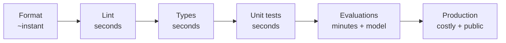
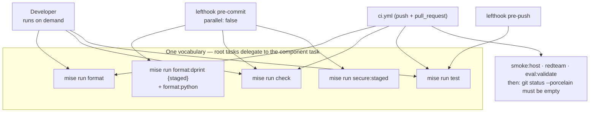

# 4.1. Linting

## What are formatting and linting, and how do they differ?

They get said in one breath and do opposite jobs:

- **Formatting** changes how code _looks_ — indentation, quotes, line breaks. It never changes behavior. There is no right answer, only a consistent one, which is why the formatter is not configurable by argument: the point is to end the argument, so behavioral changes stand out in a diff instead of drowning in whitespace churn.
- **Linting** inspects what code _means_ and flags what is likely wrong: an unused import, a bare `except`, a mutable default argument, a hardcoded credential pattern, a forgotten `print`. A linter has opinions about correctness.

Both are **static**: they read source without running it. That makes them the cheapest feedback you have — milliseconds, no model call, no fixture, no network. Neither replaces tests or design review; they remove the classes of failure those more expensive stages should never have to think about.

## Why bother, when tests already pass?

The most common objection, and it misunderstands what each layer is for. Quality tooling is a **funnel**, and each stage exists to make the next one cheaper by removing the failures it can catch alone:



The economics drive everything: a defect caught by the formatter costs nothing; the same defect found in production costs an incident, a rollback, and your credibility. **Every stage you skip pushes work rightward, where it is orders of magnitude more expensive.** Evaluations in [4.4](./4.4.%20Evaluations.md) burn minutes and real model calls — wasting one on a typo a linter would have caught in 20 ms is simply bad engineering.

Three things linting buys that tests structurally cannot:

- **Review attention is finite.** If a diff is 90% reformatting, reviewers skim, and the one real change hides in the noise. A formatter makes every remaining line in a diff _intentional_ — that is its actual value, not prettiness.
- **Tests only cover paths you thought of.** A linter reads _every_ line, including the error branch you never exercised. It finds the bare `except` that will swallow a real failure at 3am on a path no test visits.
- **Some rules are security rules.** Ruff flags hardcoded secrets, unsafe subprocess use, and `assert` in production paths. These are static, shift-left counterparts to the runtime guardrails and scanners in [4.6](./4.6.%20Security.md), not a substitute for them.

!!! warning "Never silence a warning to get a green result"

    The temptation, under deadline, is `# noqa`, a loosened type, or a weakened assertion. That does not fix anything — it deletes the evidence and leaves the defect, and it teaches the next reader that the gates are decorative. Fix the cause, or leave it failing and say so. A suppression is a claim that you know better than the rule; write down why, in the code, or do not make the claim. [_What a legitimate exception looks like_](#what-does-a-legitimate-documented-exception-look-like) shows the standard this repo holds itself to.

## Which tools own which files?

| Files                              | Formatter/checker                                   |
| ---------------------------------- | --------------------------------------------------- |
| Python                             | Ruff format and import sorting; Ruff lint; ty types |
| Markdown/JSON/TOML/YAML/Dockerfile | dprint                                              |
| Shell                              | shfmt and ShellCheck                                |
| GitHub Actions                     | actionlint                                          |
| Python metadata/lock               | validate-pyproject and `uv lock --check`            |

The root tasks delegate to the component task instead of duplicating flags. Inside `agents/python`, `mise run check` is not a single command: it `depends` on four sub-tasks — `check:format`, `check:lint`, `check:types`, `check:vuln` — that mise runs **in parallel**. That is why the whole static gate returns in seconds and stays cheap enough to run on every commit:

- `check:lint` runs `uv run ruff check`, `check:types` runs `uv run ty check` (ty is pre-1.0, so it is range-pinned until it stabilizes), and `check:vuln` runs `pip-audit`.
- `check:format` is more than style. It runs `validate-pyproject`, `ruff format --check`, **and** `uv lock --check` — the last fails if `uv.lock` has drifted from `pyproject.toml`. Reproducibility is linted here, not just indentation: a dependency edit that was never re-locked is a warning, exactly like a stray `print`.

The root `mise run check` wraps this Python gate together with the docs, links, licenses, shell, and workflow checks so one command covers the whole repository.

## How strict is Ruff?

Very — the project selects a broad set of rule families, and the ones that matter most for an _agent_ are worth naming rather than hiding behind "read the config":

- **`S` (flake8-bandit)** is the security family: hardcoded secrets, `subprocess` with `shell=True`, unsafe deserialization, `assert` in production paths. It is the static half of the story [4.6](./4.6.%20Security.md) tells at runtime.
- **`ASYNC` (flake8-async)** flags a blocking call inside `async def`. An ADK agent's callbacks and tools run on an event loop; one accidental synchronous read there stalls the whole turn.
- **`LOG` (flake8-logging)** catches misused logging. The safe-error guardrail in [4.5](./4.5.%20Guardrails.md) depends on logging the real exception for operators while returning a stable message to the client — this family keeps that discipline honest.
- **`T20` (flake8-print)** rejects stray `print()`, which would otherwise leak into the agent's stdout and telemetry.
- **`ARG` (flake8-unused-arguments)** flags a parameter a function ignores — often a callback that forgot to use the `tool_context` or args ADK hands it.
- **`SLF` (flake8-self)** rejects reaching into another object's `_private` members, keeping module boundaries real.
- **`ERA` (eradicate)** deletes commented-out code before it rots into confusion.
- **`PGH` (pygrep-hooks)**, among other checks, rejects a blanket `# noqa` or `# type: ignore` with no rule code — it enforces the exact discipline the next section preaches.

The format side is small and non-negotiable; the complete `select` list lives in [`pyproject.toml`](https://github.com/MLOps-Courses/agentops-open-course/blob/main/agents/python/pyproject.toml) and prose should not re-paste all thirty-one families:

```toml
[tool.ruff]
line-length = 120

[tool.ruff.format]
docstring-code-format = true
line-ending = "lf"
quote-style = "double"
```

## What does a legitimate, documented exception look like?

Zero suppressions is unrealistic; **undocumented, blanket** suppressions are the problem. A defensible exception is scoped to a file or a single finding, names the specific rule or vulnerability id, and states why in a comment right there. The repo's own `per-file-ignores` are the model — each ignore is one code with a written reason, not a file-wide `# noqa`:

```toml
[tool.ruff.lint.per-file-ignores]
"src/agent/config_check.py" = [
  "T201", # the config:check CLI prints its report to stdout by design
]
"tests/**" = [
  "S101", # assert
  "T201", # print statement allowed in tests
]
```

`config_check.py` is a CLI whose whole job is to print the resolved configuration, so `T201` (no `print`) is genuinely wrong _for that file only_; tests legitimately use bare `assert` (`S101`) and diagnostic `print` (`T201`). Nothing else in `src/` gets those passes.

The same standard applies to the dependency audit. `check:vuln` carries one `--ignore-vuln`, and the justification sits directly above it, naming the id, the reason it is not exploitable here, and the exit condition:

```toml
[tasks."check:vuln"]
alias = "ca"
description = "Audit dependencies for known vulnerabilities"
# PYSEC-2026-597: path traversal in nltk.data.load(). nltk is a dev-only transitive of
# rouge-score (a minimal dependency for `adk eval`); it is never imported by the agent
# runtime and receives no attacker-controlled resource names. No fixed release exists yet —
# revisit when one ships. Documented, specific ignore (not a blanket suppression).
run = "uv run pip-audit --ignore-vuln PYSEC-2026-597"
```

A reviewer can audit either exception in one line: which rule, which file or id, why, and when it should be revisited. That is the bar — if you cannot write that sentence, you have not earned the suppression.

## How do you format and check everything?

From the repository root:

```bash
mise run format
mise run check
```

`format` may modify files; review the diff afterward. `check` runs the docs rules and build, dprint, Python lint/types/audit, shell checks, and workflow lint without intentionally rewriting sources. Run `format` first so `check`'s formatting gate sees already-clean files.

## How do the same checks run locally and in CI?

There is no separate CI configuration duplicating flags. Three callers — you, the git hooks, and GitHub Actions — all invoke the **same** `mise run` tasks, so a green pre-commit means a green CI for the same reasons, not by coincidence:



- **`lefthook` pre-commit** runs `format:dprint` on staged files, then `format:python`, then `check`, then `secure:staged`. It is deliberately `parallel: false`: the formatters must restage their fixes _before_ `check` reads the files, or you would fail on files you already fixed. **pre-push** runs `test`.
- **`ci.yml`** (on push to `main` and every pull request) runs `install`, then `format`, then `check`, then `test`, then `smoke:host`, `redteam`, and `eval:validate`.
- The last CI step is what makes formatting non-optional: `test -z "$(git status --porcelain)"` **fails the build if anything is uncommitted** — including a file the `format` step would have rewritten. You cannot skip the formatter and still merge; CI runs it and rejects the diff if you left work for it. The same step guards regenerated artifacts (lockfiles, generated docs), so "generated files are committed" is a merge gate, not a convention.

## Why do docs have structural checks?

A site that renders can still have a broken teaching contract, so `scripts/check-docs.sh` runs before Zensical builds and enforces structure a Markdown parser would not. Concretely, every course page must:

- Start with YAML front matter carrying a `description` field — parsed as real YAML, so an unquoted `colon-space` inside it fails the check rather than silently corrupting the render.
- Contain at least one `##` heading, and **every** `##` heading must end with a literal `?` (the FAQ contract these pages follow).
- Avoid machine-specific absolute paths (a home directory, a local `file://` URL) and the obsolete local registry hostname, so the rendered text stays portable across every reader's machine — the check greps for exactly those patterns.

Break one and the failure names the page and the rule, so you can self-diagnose without reading the script. These checks are why this very page is structured as questions.

## What are the common failure modes?

- **A formatter run smuggled into a behavior PR.** The exact review-noise problem this page opens with: a one-line fix arrives with 200 reformatted lines. Let pre-commit format continuously so whitespace never accumulates, and keep any deliberate reformat in its own commit.
- **`# noqa` with no code.** It silences _every_ rule on that line, including a future real bug that lands there. Ruff's `PGH` family rejects it; always write `# noqa: <CODE>` with a reason, per the exception standard above.
- **Formatter and linter disagreeing.** A lint rule occasionally wants a shape the formatter then rewrites, and you end up fighting your own tools. Resolve it in configuration once — do not litter the source with per-line ignores to referee the two.
- **dprint reformatting a fenced snippet.** dprint formats embedded TOML/JSON/YAML/Dockerfile blocks _inside_ Markdown, so a hand-pasted config excerpt can drift from the source's exact bytes on the next `format`. Prefer a `--8<--` snippet include that pulls verbatim from the real file at build time, and only paste an excerpt when it is already in the formatter's canonical form.

## What is the lint checkpoint?

```bash
mise run format
git diff --check
mise run check
```

Continue only after reviewing formatter changes and resolving every warning at its cause. A warning-free gate is part of correctness, not optional polish.
