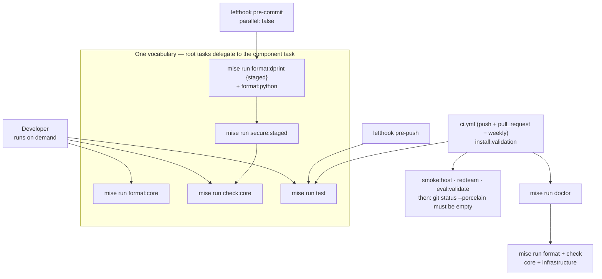

# 4.1. Linting

!!! abstract "In one glance"

    - **You will:** Run the core formatter and static checks, then see how maintainers extend the same vocabulary to infrastructure.
    - **You need:** `mise run install` done and `mise run doctor` passing.
    - **Time:** about 10 minutes, hands-on.

## What does this page own?

Formatting changes how code looks and never what it means; linting reads what it means and flags what is likely wrong. Both are static, both cost milliseconds, and neither replaces tests. That much is ordinary Python hygiene and this page assumes it.

What is worth your time here is the part specific to this repository: which tool owns which file, the fact that you, your git hooks, and CI all invoke the **same** `mise run` task, the two Ruff rule families that matter for an _agent_, and the structural checks that keep every course page readable as part of one course.

## How do you format and check everything?

Run them now; the rest of the page explains what just happened. From the repository root:

```bash
mise run format:core
mise run check:core
```

`format:core` may modify files; review the diff afterward. `check:core` runs the docs rules and build, dprint, Python lint/types, core license profiles, shell checks, and workflow lint without intentionally rewriting sources.

`check:core` is the deterministic, account-free, model-, container-, cluster-, cloud-, and advisory-network-free half of the gate. The full root `mise run check` adds infrastructure validation, all five license profiles, and the network-backed `check:vuln` advisory audit.

If either comes back red, the diagnostic names the rule, the file, and the line — a Ruff finding and a docs-structure finding read the same way:

```text
T201 `print` found
 --> src/agent/tools.py:42:5

docs/4. Quality/4.1. Linting.md: FAQ heading must end with ?: ## How strict is Ruff
```

`mise run format` fixes neither: the first is a code change you make, the second a heading you edit.

!!! warning "Never silence a warning to get a green result"

    The temptation, under deadline, is `# noqa`, a loosened type, or a weakened assertion. That does not fix anything — it deletes the evidence and leaves the defect, and it teaches the next reader that the gates are decorative. Fix the cause, or leave it failing and say so. A suppression is a claim that you know better than the rule; write down why, in the code, or do not make the claim. [_What a legitimate exception looks like_](#what-does-a-legitimate-documented-exception-look-like) shows the standard this repo holds itself to.

## Which tools own which files?

Every file in the repository has exactly one owner. This table is the map:

| Files                              | Formatter/checker                                   |
| ---------------------------------- | --------------------------------------------------- |
| Python                             | Ruff format and import sorting; Ruff lint; ty types |
| Markdown/JSON/TOML/YAML/Dockerfile | dprint                                              |
| Shell                              | shfmt and ShellCheck                                |
| GitHub Actions                     | actionlint                                          |
| Python metadata/lock               | validate-pyproject and `uv lock --check`            |

The root tasks delegate to the component task instead of duplicating flags. Inside `agents/python`, `mise run check` is not a single command: it `depends` on three sub-tasks—`check:format`, `check:lint`, and `check:types`—that mise runs **in parallel**. That is why the whole static gate returns in seconds and stays cheap enough to run on every commit:

- `check:lint` runs `uv run ruff check`, while `check:types` runs `uv run ty check`; ty is pre-1.0, so it is range-pinned until it stabilizes.
- `check:format` is more than style. It runs `validate-pyproject`, `ruff format --check`, **and** `uv lock --check` — the last fails if `uv.lock` has drifted from `pyproject.toml`. Reproducibility is linted here, not just indentation: a dependency edit that was never re-locked is a warning, exactly like a stray `print`.

The root `mise run check` wraps this Python gate together with docs, links, shell, workflow, infrastructure, full license, and vulnerability checks so one maintainer command covers the whole repository.

## How strict is Ruff?

Very. The project selects a broad set of rule families, and two of them matter most for an _agent_:

- **`S` (flake8-bandit)** is the security family: hardcoded secrets, `subprocess` with `shell=True`, unsafe deserialization, `assert` in production paths. It is the static half of the story [4.6. Security](./4.6.%20Security.md) tells at runtime.
- **`ASYNC` (flake8-async)** flags a blocking call inside `async def`. An ADK agent's callbacks and tools run on an event loop; one accidental synchronous read there stalls the whole turn.

Six more are worth knowing once you have hit them, and none of them changes what you run today.

??? note "Deeper: the other rule families and why they are selected"

    - **`LOG` (flake8-logging)** catches misused logging. The safe-error guardrail in [4.5. Guardrails](./4.5.%20Guardrails.md) depends on logging the real exception for operators while returning a stable message to the client — this family keeps that discipline honest.
    - **`T20` (flake8-print)** rejects stray `print()`, which would otherwise leak into the agent's stdout and telemetry.
    - **`ARG` (flake8-unused-arguments)** flags a parameter a function ignores — often a callback that forgot to use the `tool_context` or args ADK hands it.
    - **`SLF` (flake8-self)** rejects reaching into another object's `_private` members, keeping module boundaries real.
    - **`ERA` (eradicate)** deletes commented-out code before it rots into confusion.
    - **`PGH` (pygrep-hooks)**, among other checks, rejects a blanket `# noqa` or `# type: ignore` with no rule code — it enforces the exact discipline the next section preaches.

The format side is small and non-negotiable; the complete `select` list lives in [`pyproject.toml`](https://github.com/MLOps-Courses/agentops-open-course/blob/main/agents/python/pyproject.toml) and prose should not re-paste all thirty-one families:

```toml
[tool.ruff]
line-length = 120

[tool.ruff.format]
docstring-code-format = true
line-ending = "lf"
quote-style = "double"
```

## What does a legitimate, documented exception look like?

Zero suppressions is unrealistic; **undocumented, blanket** suppressions are the problem. A defensible exception is scoped to a file or a single finding, names the specific rule or vulnerability id, and states why in a comment right there.

The repo's own **`per-file-ignores`** — a rule switched off for one path only — are the model. Each ignore is one code with a written reason, not a file-wide `# noqa`:

```toml
[tool.ruff.lint.per-file-ignores]
"src/agent/config_check.py" = [
  "T201", # the config:check CLI prints its report to stdout by design
]
"tests/**" = [
  "S101", # assert
  "T201", # print statement allowed in tests
]
```

`config_check.py` is a CLI whose whole job is to print the resolved configuration, so `T201` (no `print`) is genuinely wrong _for that file only_; tests legitimately use bare `assert` (`S101`) and diagnostic `print` (`T201`). Nothing else in `src/` gets those passes.

The same standard applies to the dependency audit. Root `mise run check:vuln` calls [`check-vulnerabilities.sh`](https://github.com/MLOps-Courses/agentops-open-course/blob/main/scripts/check-vulnerabilities.sh), which exports five hash-pinned profiles from the locks and runs `pip-audit --strict` over each one. Every profile is exported again with a deliberately pre-populated ambient Python environment, and the clean and pre-populated lock-export verdicts must be byte-identical before the advisory call. It has no finding-specific advisory ignore; its single non-PyPI model-wheel carve-out verifies the exact source and hash before excluding that unauditable requirement. If a future exception is unavoidable, its justification belongs beside the script and must name the id, reachability, residual risk, and removal condition. [4.6. Security](./4.6.%20Security.md#what-do-the-scanners-deliberately-not-fail-on) owns that policy.

A reviewer can audit an exception like these in one line: which rule, which file or id, why, and when it should be revisited. That is the bar — if you cannot write that sentence, you have not earned the suppression.

## How do the same checks run locally and in CI?

There is no separate CI configuration duplicating flags. Three callers invoke the **same** `mise run` tasks: you, the git hooks, and GitHub Actions. A green pre-commit therefore means a green CI for the same reasons, not by coincidence:


```mermaid
flowchart TD
    subgraph vocab["One vocabulary — root tasks delegate to the component task"]
        FMT["mise run format:core"]
        FMTC["mise run format:dprint {staged}<br/>+ format:python"]
        CHK["mise run check:core"]
        TST["mise run test"]
        SEC["mise run secure:staged"]
    end

    DEV["Developer<br/>runs on demand"] --> FMT
    DEV --> CHK
    DEV --> TST

    PC["lefthook pre-commit<br/>parallel: false"] --> FMTC
    FMTC --> SEC --> CHK

    PP["lefthook pre-push"] --> TST

    CI["ci.yml (push + pull_request + weekly)<br/>install:validation"] --> DOC["mise run doctor"] --> FULL["mise run format + check<br/>core + infrastructure"]
    CI --> TST
    CI --> EXTRA["smoke:host · redteam · eval:validate<br/>then: git status --porcelain must be empty"]
```

**Diagram in words:** Developers run format, check, and test directly. Pre-commit orders formatting, the staged security scan, and core checks; pre-push runs tests. CI installs the validation profile, runs the base doctor, then the full format, check, test, host smoke, red-team, evaluation-validation, and clean-tree gates.

- **`lefthook` pre-commit** runs `format:dprint`, `format:python`, `secure:staged`, then `check:core`; **pre-push** runs `test`. Priorities keep formatting ahead of the staged scan and checks.
- **`ci.yml`** runs the narrow `install:validation` profile, then `doctor`, the full `format`, `check`, and `test`, followed by `smoke:host`, `redteam`, and `eval:validate`.
- The last CI step is what makes formatting non-optional: `test -z "$(git status --porcelain)"` **fails the build if anything is uncommitted** — including a file the `format` step would have rewritten. You cannot skip the formatter and still merge; CI runs it and rejects the diff if you left work for it. The same step guards regenerated artifacts (lockfiles, generated docs), so "generated files are committed" is a merge gate, not a convention.

## Why do docs have structural checks?

A site that renders can still have a broken teaching contract. `scripts/check_conventions.py` runs before Zensical builds and enforces structure a Markdown parser would not. Concretely, every course page must:

- Start with YAML front matter carrying a `description` field — parsed as real YAML, so an unquoted `colon-space` inside it fails the check rather than silently corrupting the render.
- Contain at least one `##` heading, and **every** `##` heading must end with a literal `?` (the FAQ contract these pages follow).
- Avoid machine-specific absolute paths (a home directory, a local `file://` URL) and the obsolete local registry hostname, so the rendered text stays portable across every reader's machine.
- Carry the page frame: an "In one glance" block after the H1, one of three closing headings, and the collapsible, link-label, and snippet rules that keep every page reading as one course ([8.4. Documentation](../8.%20Community/8.4.%20Documentation.md#what-does-the-structural-checker-enforce) lists them all).

Break one and the failure names the page and the rule, so you can self-diagnose without reading the script. These checks are why this very page is structured as questions.

??? note "Deeper: why a config block pasted into a page drifts from its source"

    dprint formats embedded TOML/JSON/YAML/Dockerfile blocks _inside_ Markdown, so a hand-pasted config excerpt can drift from the source's exact bytes on the next `format` — and a drifted excerpt on a page teaching that source is worse than no excerpt. Prefer a `--8<--` snippet include that pulls verbatim from the real file at build time, and only paste an excerpt when it is already in the formatter's canonical form.

## What proves this page worked?

```bash
mise run format:core
git diff --check
mise run check:core
```

Continue only after reviewing formatter changes and resolving every warning at its cause. A warning-free gate is part of correctness, not optional polish.

**You are done when:**

- `mise run check:core` exits green, with every warning fixed at its cause rather than suppressed.
- Re-running `mise run format:core` changes nothing, and `git diff --check` reports no whitespace errors.
- You can name the tool that owns a `.py`, a `.md`, a `.sh`, and a workflow file without re-reading the table.
- Any suppression you wrote names one rule or one id and carries a written reason beside it.

Continue to [4.2. Testing](./4.2.%20Testing.md) when `mise run check:core` is green and you can justify every suppression in the repository in one sentence each.
