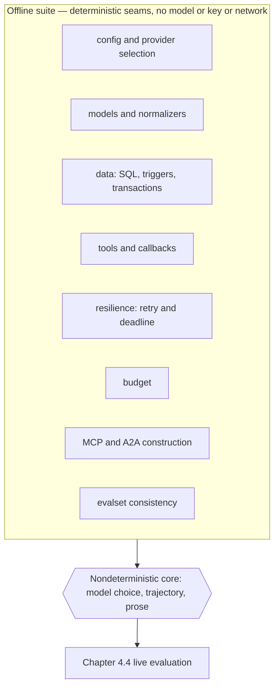
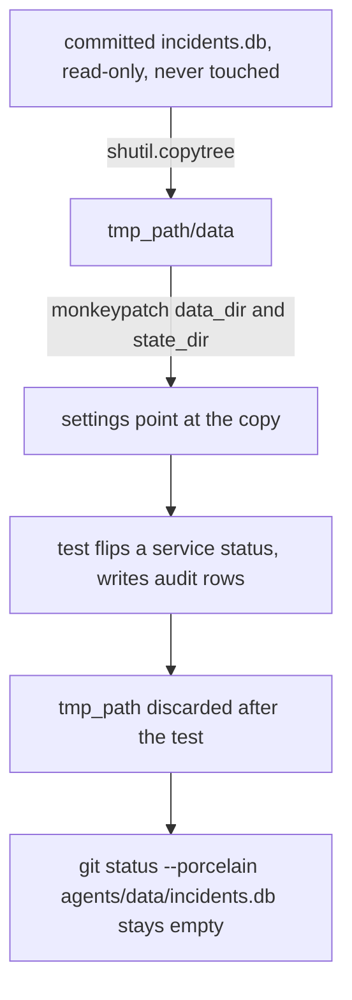
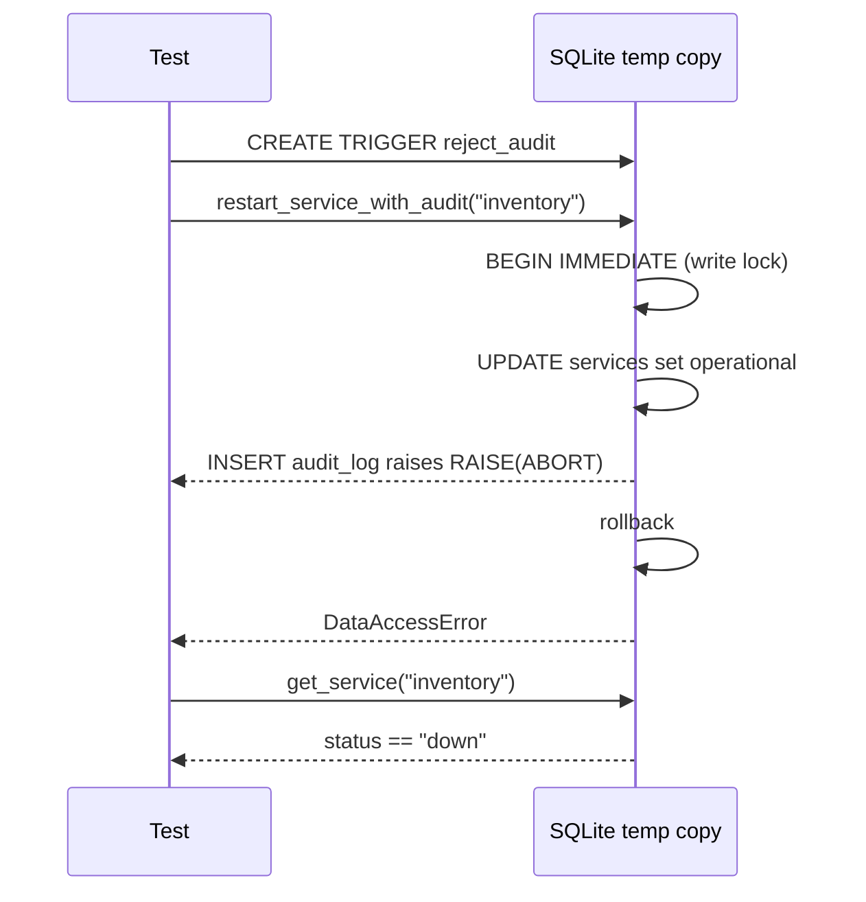

# 4.2. Testing

## What should an agent test offline?

An agent is a nondeterministic core wrapped in deterministic seams. The core — which tool the model picks, the order it calls them, the prose it writes — can only be judged by running a live model, and that is Chapter 4.4's job. Everything around the core is ordinary software with a statable contract: config resolution, id and slug normalizers, SQL and its triggers, tool schemas, guardrail callbacks, retry and deadline logic, transport construction, budget accounting. The offline suite's job is to test every seam so thoroughly that live evaluation only has to test the core. That split is why this suite needs no model, no API key, and no network, yet still guards most of the risk.

Test every deterministic boundary without paying for or depending on a model:

- Configuration, provider selection, and direct-Ollama/gateway endpoint construction.
- Domain parsing, ids, slugs, limits, and error contracts.
- Seed copying, queries, transactional writes, and append-only audit triggers.
- Tool schemas/results and conditional direct/MCP composition.
- Skill allowlists, retrieval ranking, and workflow/delegation topology.
- PII callbacks and safe model/tool error callbacks.
- MCP transports and A2A card/session/task/lifespan construction.
- Telemetry privacy defaults and call-budget policy.



The result is 29 test files and roughly 284 test functions (more cases after parametrization); the gate fails under 95% branch coverage and, because the deterministic seams are all it touches, runs with no model, no key, and no network.

## How does every test get isolated state?

The write side of the agent mutates state — it flips a service's status and appends audit rows. A test that ran those against the committed `agents/data/incidents.db` would corrupt the fixture the next test reads and would surface as a dirty file in `git`. An autouse fixture gives every test a private, disposable copy of the real dataset and redirects both settings at it:

```python
@pytest.fixture(autouse=True)
def isolated_data_dir(tmp_path, monkeypatch):
    destination = tmp_path / "data"
    shutil.copytree(config._DEFAULT_DATA_DIR, destination)
    monkeypatch.setattr(config.settings, "data_dir", destination)
    monkeypatch.setattr(config.settings, "state_dir", tmp_path / "state")
    return destination
```

Copy the real seed rather than mock `data.py`, because the seams under test _are_ the SQL: real triggers, real `BEGIN IMMEDIATE` transactions, real foreign keys. A fake data layer would pass while hiding exactly the failure the transaction test below celebrates — an audit-insert failure that must roll the service update back with it. You test against the real engine on a throwaway copy, not against a mock of it.

Make it `autouse` because isolation must be opt-out-proof. A test that forgot to request the fixture would silently mutate the committed database, and that mutation would leak into whatever test ran next. Autouse means every test — including ones added months later — starts from the same seed by default, and the checkpoint greps `git status --porcelain agents/data/incidents.db` as a second line of defense.



## Why does the suite scrub the environment before importing the agent?

Pytest collection imports the configured agent, and the agent reads its provider and runtime settings from the environment at import time. On a maintainer's laptop with a full `.env`, those variables are set; on a bare CI runner they are not. If collection saw them, the same test could resolve a different provider, endpoint, or telemetry exporter on two machines — a determinism leak before a single assertion runs. `conftest.py` closes that at module scope, before importing any agent module:

```python
# Collection imports the configured agent, so remove ambient provider/runtime
# settings before importing any agent module. Tests opt into individual values
# with ``monkeypatch`` and telemetry remains disabled for the whole pytest process.
_RUNTIME_ENV_PREFIXES = ("AGENT_", "GOOGLE_", "MLFLOW_", "OPENAI_", "OTEL_")
for _name in tuple(os.environ):
    if _name.startswith(_RUNTIME_ENV_PREFIXES):
        os.environ.pop(_name)
os.environ["OTEL_SDK_DISABLED"] = "true"

from agent import config  # noqa: E402 - provider env must be cleared before importing agent settings
```

It pops every `AGENT_`, `GOOGLE_`, `MLFLOW_`, `OPENAI_`, and `OTEL_` variable, then forces `OTEL_SDK_DISABLED=true` so no test emits a real span, then imports `config`. Tests opt back into individual values with `monkeypatch`, one setting at a time. That is the mechanism behind "no key, no network": the suite gives the same result on a laptop stuffed with secrets and on a runner that has none.

## Why are warnings treated as errors?

A warning is your dependencies telling you about a deprecation or a misuse before it becomes a break. Most suites let them scroll past; this one promotes them to failures so the signal cannot rot:

```toml
xfail_strict = true
filterwarnings = [
  "error",
  'ignore:^BaseAgentConfig is deprecated and will be removed in future versions\. Config is now loaded via reflection so the separate config class is no longer needed\.$:DeprecationWarning',
```

The list continues with six more `ignore:` entries. Each pins one exact ADK, OTel, or starlette message — note the anchored `^...$` and the escaped dots — rather than muting a whole category. When an upstream release starts emitting a new `DeprecationWarning`, `filterwarnings = ["error"]` turns it into a red build the day it appears, and you either fix the cause or add one more narrowly-anchored `ignore`, never a blanket `ignore::DeprecationWarning`. `xfail_strict = true` means an `xfail` that starts passing also fails, so a fixed bug is forced to drop its marker instead of hiding a silent regression. `--strict-markers` and `--strict-config` (in `addopts`) fail on a typo'd marker or config key instead of doing nothing. This is the page's clearest example of "fix the cause or name the exception narrowly."

## What does branch coverage enforce?

```toml
[tool.pytest.ini_options]
addopts = [
  "--cov=agent",
  "--cov-branch",
  "--cov-fail-under=95",
]
```

The scope is deliberate. `--cov=agent` pairs with:

```toml
[tool.coverage.run]
branch = true
source = ["src"]
omit = ["tests/*"]
```

The `evals/` package is exercised by tests but is not counted: the 95% floor applies to the runtime agent, not the offline tooling around it. `--cov-branch` is what makes the floor meaningful — without it a line counts as covered the moment it runs once; with it, both arms of every branch must run. That is what forces a test through the rejection arm of `if normalized is None: return None` in `data.read_runbook`/`read_service_logs`, the arm a happy-path test never takes.

Coverage is a missing-test detector, not evidence of good assertions; reviews still judge whether the assertions express meaningful contracts. Two tasks drop coverage on purpose — `redteam` (`tests/test_security.py`) and `eval:validate` (`tests/test_evalset.py`) each run a single file. They are exempt not only because the full suite already covers those cases, but because measuring one file against `--cov=agent` would report a fraction of the package and fail the 95% floor by construction. They run with `--no-cov` as named merge-gate signals; everywhere else, keep coverage on.

## Which fakes does the suite use, and where does it refuse to fake?

A test double is only worth its risk when the real collaborator is slow, nondeterministic, or external. Fake too little and the suite becomes an integration test that flakes; fake too much and you end up asserting that your mock returns what you told it to. This suite's doubles are a catalogue of that judgement:

- **Duck-typed context.** `tests/test_budget.py` defines `_FakeContext` exposing only `state`, because the budget callbacks read nothing else — a full ADK `CallbackContext` would be noise — and `_FakeSpan`, which records `set_attribute` calls so the test can assert the token and cost attributes.
- **Fake clock.** `tests/test_resilience.py` replaces `asyncio.sleep` with a coroutine that records the requested delay instead of waiting:

```python
    async def fake_sleep(delay: float) -> None:
        delays.append(delay)

    monkeypatch.setattr(resilience.asyncio, "sleep", fake_sleep)
```

The test then asserts the exponential schedule `delays == [0.5, 1.0]` without spending 1.5 real seconds.

- **Module injection.** `tests/test_smoke.py` injects a fake `mlflow.genai` into `sys.modules` to prove `_instruction()` loads a pinned prompt version without an MLflow server running.
- **Where it refuses to fake.** `tests/test_mlflow_eval.py` drives a _real_ ADK `InMemoryRunner` and the _real_ guarded `restart_service` tool, faking only the model (a deterministic `_ConfirmationOnlyLlm`), to prove ADK actually pauses for confirmation and leaves `inventory` `down`. A fake runner would prove nothing about the confirmation machinery. Its sibling test replaces the whole runner with a `FakeRunner` — but only because there the subject is session reuse and runner cleanup, not the ADK path itself.

## What does a transaction test prove?

A write and the evidence that justifies it must be atomic. If the audit insert can fail after the service update commits, you get an unaudited change — a governance hole — or a change with no record at all. So both live in one transaction that commits or rolls back together. `restart_service_with_audit` opens one connection, runs `BEGIN IMMEDIATE`, updates `services`, then appends the audit row in the same transaction. The test proves the rollback by installing a trigger on the temp copy that aborts every audit insert:

```python
def test_action_and_audit_roll_back_together() -> None:
    with closing(sqlite3.connect(data.db_path())) as connection:
        connection.execute(
            "CREATE TRIGGER reject_audit BEFORE INSERT ON audit_log BEGIN SELECT RAISE(ABORT, 'audit unavailable'); END"
        )
        connection.commit()
    with pytest.raises(data.DataAccessError, match="SQLite operation failed"):
        data.restart_service_with_audit(
            "inventory",
            actor="agentops-agent",
            approved_by="engineer",
            rationale="inventory is hard down",
            session_id="session-7",
            invocation_id="invocation-9",
        )
    service = data.get_service("inventory")
    assert service is not None
    assert service.status == "down"
```

The trigger's `ABORT` rolls the `UPDATE services` back with it, so the service stays `down` — the failure path a happy-path action assertion would miss.



`tests/test_data.py` proves the harder property: that the decision context stamped into the audit is read _after_ the write lock is acquired, so it can never be stale. `test_restart_context_is_read_after_acquiring_the_write_lock` monkeypatches `_restart_context` to attempt a competing write from a second connection with `busy_timeout = 0` and asserts it is rejected with `locked` — evidence that the read happens inside the held transaction, not before it.

## How do you test your test data?

An eval set is data, and data drifts. If a case references `INC-002` and someone renames it in the seed, a live model-backed eval fails confusingly — or worse, passes for the wrong reason — and burns tokens to tell you your fixture is stale. So test the test data offline, before any model runs. `tests/test_evalset.py` does exactly that: every incident, service, and runbook id a case references must exist in the seed (`test_referenced_entities_exist_in_the_seed_data`), the two deliberate negatives `INC-999` and `warehouse` must stay missing (`test_negative_cases_reference_entities_that_stay_missing`), and the trajectory criterion stays `{"threshold": 1.0, "match_type": "IN_ORDER"}`. It runs in CI as its own gate (`mise run eval:validate`), so a dangling reference is a red build, not a wasted eval run. Chapter 4.4 spends a live model on this set; 4.2 guards its shape.

## When are property-based tests worth it for agents?

At the boundaries where model-generated strings enter deterministic code. A tool argument produced by a model is fuzzed input by nature — no hand-picked example list covers the unicode, control-character, and pathological-length space it can emit. [`tests/test_properties.py`](https://github.com/MLOps-Courses/agentops-open-course/blob/main/agents/python/tests/test_properties.py) uses [Hypothesis](https://hypothesis.readthedocs.io/) to state contracts over that whole space instead:

- Normalizers have no third state: the output matches the strict pattern or the input is rejected.
- Normalizers are idempotent: normalizing an accepted value again changes nothing.
- No traversal or SQL metacharacters survive into an accepted identifier.
- PII redaction removes deterministically-recognized entities and is stable across calls.
- Injection neutralization never raises and marks every hit.

Randomized tests would violate this course's determinism rule, so the suite pins a fixed profile — the gate explores the space but never flakes:

```python
hypothesis_settings.register_profile("course", derandomize=True, database=None, max_examples=200, deadline=None)
hypothesis_settings.load_profile("course")
```

Reserve properties for security-critical pure functions with a statable invariant. Do not use them on generative model output (no invariant to state) or where an example-based test already expresses the whole contract.

## How do you test what a module must not import?

Some contracts are about absence: importing the MCP server must not drag in the whole ADK agent, and the ADK CLI must still discover the lazily-constructed root agent. You cannot assert absence in the interpreter that already imported everything else for the suite — the module is already in `sys.modules`. So `tests/test_import_boundaries.py` spawns a fresh interpreter with `subprocess` for each check:

```python
def test_mcp_import_does_not_initialize_adk_or_emit_warnings() -> None:
    result = _run_python(
        "import sys; import agent; assert 'agent.agent' not in sys.modules; "
        "import agent.mcp_server; assert 'agent.agent' not in sys.modules",
        warnings_as_errors=True,
    )
    assert result.returncode == 0, result.stderr
    assert result.stderr == ""
```

The script runs under `-W error`, so a stray import-time warning fails it too. A parametrized sibling drives both ADK discovery entry points (`AgentLoader('src').load_agent('agent')` and `get_root_agent('src/agent')`) and asserts each resolves an agent named `agentops_agent`. Testing import-time behavior in a subprocess is agent-specific: a lazy root agent and a side-effect-free MCP entry point are precisely the kind of thing that regresses invisibly in-process.

## What are the common agent-testing pitfalls?

1. **Asserting on generative prose.** A test like `assert "restarted" in answer` couples the gate to wording the model can change without being wrong, so it flakes on the next model version. Assert on structure and side effects offline — tool trajectory, database state, typed fields — and leave the prose to the live judges in Chapter 4.4.
1. **Real sleeps.** `time.sleep` in a retry or deadline test makes the suite slow and timing-dependent; the fake-clock pattern asserts the same schedule in microseconds.
1. **Over-mocking.** Fake the SQL layer and the transaction test can no longer catch the rollback bug — you are asserting that your mock returns what you configured. Fake the model and the clock; keep the engine real on a throwaway copy.
1. **Treating 95% as the goal.** The floor exists to keep error branches visible. A green 95% whose assertions only check "did not raise" is worse than 80% with real contracts; coverage finds untested code, not weak assertions.
1. **Order-dependent tests.** A test that passes only because a previous one left the service `operational` is a latent flake. The autouse isolation fixture starts every test from the same committed seed, so that class of bug cannot hide.

## What can an offline test never prove?

Everything above tests the seams; none of it tests whether the model picks the right tool, follows a sensible trajectory, or writes a faithful answer. Those are properties of the nondeterministic core, and only a live, model-backed evaluation can measure them — Chapter 4.4's `adk eval` and MLflow judges, gated by the offline consistency checks here. A flawless offline suite with no live eval ships an agent whose plumbing is proven and whose behavior is untested; the two layers are complementary, not substitutes. Read a green offline run not as "the agent is good" but as "the deterministic parts cannot be why it is bad."

## How do you run focused and complete tests?

```bash
cd agents/python
uv run pytest tests/test_actions.py -q
mise run test
```

Run the smallest relevant file while developing, then the complete suite before leaving the chapter. Do not add `--no-cov` outside the two dedicated tasks (`redteam` and `eval:validate`), which each select a subset already covered by the full run and would otherwise fail the 95% floor by construction.

## What is the testing checkpoint?

```bash
mise run test
test -z "$(git status --porcelain agents/data/incidents.db)"
```

Expected result: all tests pass, branch coverage is at least 95%, and the committed seed has no change.
