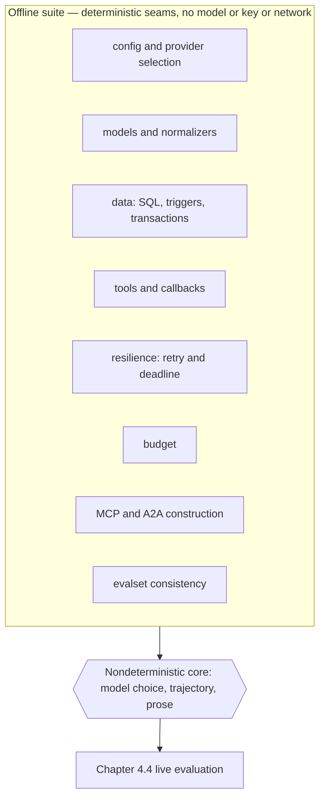
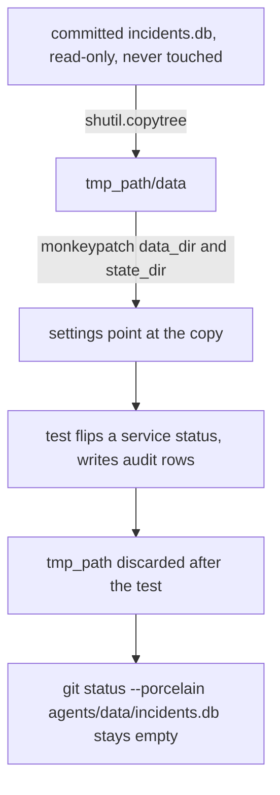
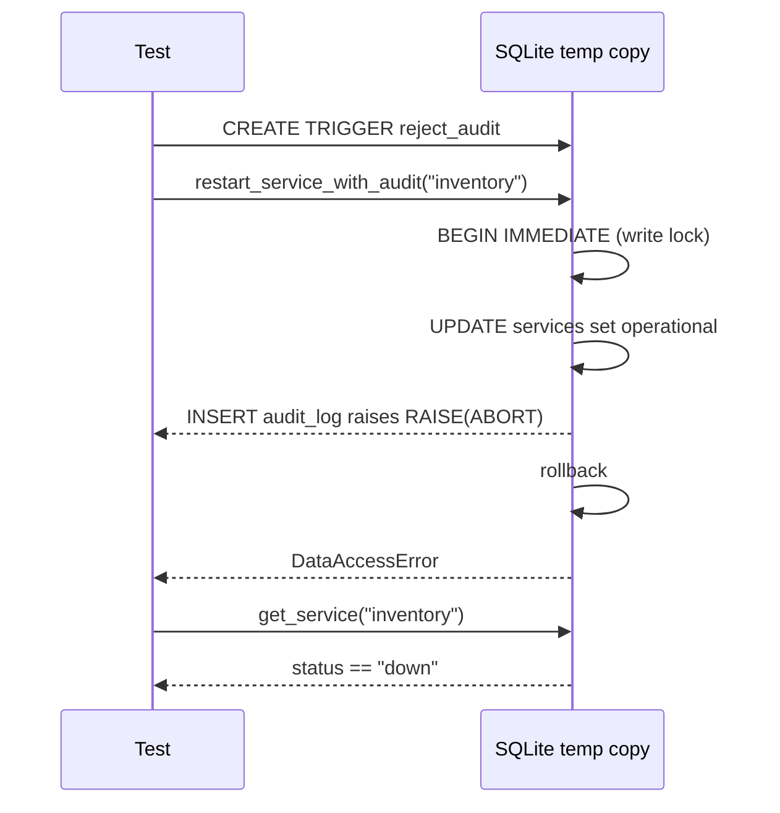

# 4.2. Testing

!!! abstract "In one glance"

    - **You will:** Run the offline test suite and see how it isolates its data, scripts the model to drive the real ADK runner, and proves a write and its audit row roll back together.
    - **You need:** `mise run install` done; no model, key, or network required.
    - **Time:** about 26 minutes, hands-on.

## What should an agent test offline?

An agent is a nondeterministic core wrapped in deterministic **seams** — the places where you can swap in a fake and still exercise real logic.

The core is which tool the model picks, the order it calls them, and the prose it writes. Whether the model picks _well_ is a live-model question, and that is the job of [4.4. Evaluations](./4.4.%20Evaluations.md). But "what happens once it picks" is ordinary software, and you can script the pick — [the scripted model double](#how-do-you-test-the-real-runner-without-a-real-model) below is the technique that makes that half testable offline.

Everything around the core is ordinary software with a statable contract: config resolution, id and slug normalizers, SQL and its triggers, tool schemas, guardrail callbacks, retry and deadline logic, transport construction, budget accounting.

The offline suite's job is to test every seam so thoroughly that live evaluation only has to test the core. That split is why this suite needs no model, no API key, and no network, yet still guards most of the risk.

Test every deterministic boundary without paying for or depending on a model:

- Configuration, provider selection, and direct-Ollama/gateway endpoint construction.
- Domain parsing, ids, slugs, limits, and error contracts.
- Seed copying, queries, transactional writes, and append-only audit triggers.
- Tool schemas/results and conditional direct/MCP composition.
- Skill allowlists, retrieval ranking, and workflow/delegation topology.
- PII callbacks and safe model/tool error callbacks.
- MCP transports and A2A card/session/task/lifespan construction.
- Telemetry privacy defaults and call-budget policy.


```mermaid
flowchart TB
    subgraph Offline["Offline suite — deterministic seams, no model or key or network"]
      C[config and provider selection]
      M[models and normalizers]
      D[data: SQL, triggers, transactions]
      T[tools and callbacks]
      R[resilience: retry and deadline]
      B[budget]
      X[MCP and A2A construction]
      E[evalset consistency]
    end
    Offline --> Core{{Nondeterministic core: model choice, trajectory, prose}}
    Core --> Live[Chapter 4.4 live evaluation]
```

The suite covers the deterministic seams, including parametrized boundary cases. The gate fails under 95% combined line-and-branch coverage and runs with no model, no key, and no network.

## How do you run focused and complete tests?

Run the suite now; the rest of the page explains what you just watched go green.

```bash
cd agents/python
uv run pytest tests/test_actions.py -q
mise run test
```

Expected result, focused run: every test in the file passes and pytest exits zero. Plain `uv run pytest` intentionally omits whole-package coverage so the smallest relevant test stays useful during development.

Expected result, full run: every test passes, and pytest prints `Required test coverage of 95% reached` near the end. Allow several minutes depending on the machine and cache state; the suite starts no model and opens no network connection.

Run the smallest relevant file while developing, then the complete suite before leaving the chapter. `mise run test` is the single owner of the coverage policy, so individual pytest commands need no special escape flag.

## How does every test get isolated state?

Now look at how that run avoided touching your repository.

The write side of the agent mutates state: it flips a service's status and appends audit rows. A test that ran those against the committed `agents/data/incidents.db` would corrupt the fixture the next test reads and would surface as a dirty file in `git`.

An **autouse fixture** — pytest setup that runs for every test, whether or not the test asks for it — hands each test a private, disposable copy of the real dataset. `monkeypatch`, pytest's undo-on-exit patcher, then points both settings at the copy:

```python
@pytest.fixture(autouse=True)
def isolated_data_dir(tmp_path, monkeypatch):
    destination = tmp_path / "data"
    shutil.copytree(config._DEFAULT_DATA_DIR, destination)
    monkeypatch.setattr(config.settings, "data_dir", destination)
    monkeypatch.setattr(config.settings, "state_dir", tmp_path / "state")
    return destination
```

Copy the real seed rather than mock `data.py`, because the seams under test _are_ the SQL: real triggers, real foreign keys, and real `BEGIN IMMEDIATE` transactions, which take the write lock up front.

A fake data layer would pass while hiding exactly the failure the transaction test below celebrates — an audit-insert failure that must roll the service update back with it. You test against the real engine on a throwaway copy, not against a mock of it.

Make it `autouse` because isolation must be opt-out-proof. A test that forgot to request the fixture would silently mutate the committed database, and that mutation would leak into whatever test ran next. Autouse means every test — including ones added months later — starts from the same seed by default, and the checkpoint greps `git status --porcelain agents/data/incidents.db` as a second line of defense.


```mermaid
flowchart TD
    Seed[committed incidents.db, read-only, never touched] -->|shutil.copytree| Copy[tmp_path/data]
    Copy -->|monkeypatch data_dir and state_dir| Redirect[settings point at the copy]
    Redirect --> Write[test flips a service status, writes audit rows]
    Write --> Discard[tmp_path discarded after the test]
    Discard --> Check[git status --porcelain agents/data/incidents.db stays empty]
```

## What does branch coverage enforce?

The complete suite enforces 95% combined statement-and-branch coverage across `agent` and `evals`.

```toml
[tasks.test]
run = "uv run pytest --cov=agent --cov=evals --cov-branch --cov-report=term-missing:skip-covered --cov-fail-under=95"
```

`--cov-branch` records branch outcomes; `--cov-fail-under=95` applies to coverage.py's combined percentage. It does not independently enforce 95% branch-only coverage. The report identifies missing statements and branches, including evaluation tooling because `--cov=evals` is explicitly included.

Use the report to find untested rejection, retry, and recovery behavior. Coverage is a missing-test detector, not proof of strong assertions or live model quality. Focused tests are useful during development; the complete suite owns the enforced threshold.

## Why is the suite strict about environment and warnings?

Two settings keep a green run meaningful: one removes machine-to-machine variation, the other refuses to let warnings rot.

- The suite's `conftest.py` clears every ambient `AGENT_`, `GOOGLE_`, `MLFLOW_`, `OPENAI_`, and `OTEL_` variable before importing any agent module, then forces `OTEL_SDK_DISABLED=true`. A laptop stuffed with secrets and a bare CI runner therefore resolve the same provider and emit no spans.
- `pyproject.toml` sets `filterwarnings = ["error"]`, so a new upstream deprecation becomes a red build the day it appears instead of a line that scrolls past. Each exception pins one exact message.

??? note "Deeper: the environment scrub and the warning filters"

    Pytest collection imports the configured agent, and the agent reads its provider and runtime settings from the environment at import time. On a maintainer's laptop with a full `.env`, those variables are set; on a bare CI runner they are not. If collection saw them, the same test could resolve a different provider, endpoint, or telemetry exporter on two machines — a determinism leak before a single assertion runs. `conftest.py` closes that at module scope, before importing any agent module:

    ```python
    # Collection imports the configured agent, so remove ambient provider/runtime
    # settings before importing any agent module. Tests opt into individual values
    # with ``monkeypatch`` and telemetry remains disabled for the whole pytest process.
    _RUNTIME_ENV_PREFIXES = ("AGENT_", "GOOGLE_", "MLFLOW_", "OPENAI_", "OTEL_")
    for _name in tuple(os.environ):
        if _name.startswith(_RUNTIME_ENV_PREFIXES):
            os.environ.pop(_name)
    os.environ["OTEL_SDK_DISABLED"] = "true"

    from agent import config  # noqa: E402 - provider env must be cleared before importing agent settings
    ```

    It pops every `AGENT_`, `GOOGLE_`, `MLFLOW_`, `OPENAI_`, and `OTEL_` variable, then forces `OTEL_SDK_DISABLED=true` so no test emits a real span, then imports `config`. Tests opt back into individual values with `monkeypatch`, one setting at a time. That is the mechanism behind "no key, no network": the suite gives the same result on a laptop stuffed with secrets and on a runner that has none.

    A warning is your dependencies telling you about a deprecation or a misuse before it becomes a break. Most suites let them scroll past; this one promotes them to failures so the signal cannot rot:

    ```toml
    xfail_strict = true
    filterwarnings = [
      "error",
      'ignore:^BaseAgentConfig is deprecated and will be removed in future versions\. Config is now loaded via reflection so the separate config class is no longer needed\.$:DeprecationWarning',
    ```

    The list continues with narrowly anchored `ignore:` entries. Each pins one exact ADK, OTel, or starlette message — note the anchored `^...$` and the escaped dots — rather than muting a whole category. When an upstream release starts emitting a new `DeprecationWarning`, `filterwarnings = ["error"]` turns it into a red build the day it appears, and you either fix the cause or add one more narrowly-anchored `ignore`, never a blanket `ignore::DeprecationWarning`. `xfail_strict = true` means an `xfail` that starts passing also fails, so a fixed bug is forced to drop its marker instead of hiding a silent regression. `--strict-markers` and `--strict-config` (in `addopts`) fail on a typo'd marker or config key instead of doing nothing. This is the page's clearest example of "fix the cause or name the exception narrowly."

## Which fakes does the suite use, and where does it refuse to fake?

A test double is only worth its risk when the real collaborator is slow, nondeterministic, or external. Fake too little and the suite becomes an integration test that flakes; fake too much and you end up asserting that your mock returns what you told it to.

Two of this suite's doubles carry the whole judgement. The first fakes something genuinely slow:

- **Fake clock.** `tests/test_resilience.py` replaces `asyncio.sleep` with a coroutine that records the requested delay instead of waiting:

```python
    async def fake_sleep(delay: float) -> None:
        delays.append(delay)

    monkeypatch.setattr(resilience.asyncio, "sleep", fake_sleep)
```

The test then asserts the exponential schedule `delays == [0.5, 1.0]` without spending 1.5 real seconds. The second double is the one the suite declines to build:

- **Where it refuses to fake.** `tests/test_mlflow_eval.py` drives a _real_ ADK `InMemoryRunner` and the _real_ guarded `restart_service` tool, faking only the model (a deterministic `_ConfirmationOnlyLlm`), to prove ADK actually pauses for confirmation and leaves `inventory` `down`. A fake runner would prove nothing about the confirmation machinery.

That second one deserves more than a bullet, because it is the most transferable technique in the suite.

## How do you test the real runner without a real model?

Subclass `BaseLlm`, yield a scripted response per call, and let everything else be real.

That one move converts "the agent is nondeterministic, so I cannot test it" into "the _model_ is nondeterministic, so I will script it and test everything around it". The runner, the plugin, the callbacks, the tool registry, the confirmation pause, the session store, and the SQL all stay real; only the least testable component in the system is replaced, and it is replaced with something you fully control.

A double is about twenty lines. `_ScriptedLlm` in [`tests/test_governance.py`](https://github.com/MLOps-Courses/agentops-open-course/blob/main/agents/python/tests/test_governance.py) is the smallest complete example — call a tool on the first turn, answer on the second, and record every request seen:

```python
class _ScriptedLlm(BaseLlm):
    """Call the tool on the first turn, then answer; record every request seen."""

    seen: list[LlmRequest] = []
    calls: int = 0

    async def generate_content_async(self, llm_request: LlmRequest, stream: bool = False):
        del stream
        self.seen.append(llm_request)
        self.calls += 1
        if self.calls == 1:
            yield LlmResponse(
                content=types.Content(
                    role="model",
                    parts=[types.Part(function_call=types.FunctionCall(id="notes-call", name="get_incident_notes", args={}))],
                )
            )
            return
        yield LlmResponse(content=types.Content(role="model", parts=[types.Part(text="Triaged.")]))
```

Three properties make it useful, and each one is a deliberate choice:

1. **It yields, so it is a stream of one.** `generate_content_async` is an async generator; yielding a single non-partial `LlmResponse` is a complete turn. Partial yields with `partial=True` are how `tests/test_server.py` exercises streaming.
1. **The call counter is the script.** Branching on `self.calls` lets one double express a whole conversation — tool call, then summary — which is what makes multi-turn behavior (a confirmation pause and its resume) reachable offline.
1. **The captured `LlmRequest` is the assertion target.** This is the half people forget. What the runner _sent_ is as much a contract as what it returned: `test_governance.py` reads `seen[-1]` to prove the request PII was redacted and the tool result arrived spotlighted, which is how the app-wide policy plugin is proven to have actually run rather than merely to have been registered.

Two sibling doubles show the range. `_ConfirmationLlm` in [`tests/test_server.py`](https://github.com/MLOps-Courses/agentops-open-course/blob/main/agents/python/tests/test_server.py) requests one guarded `restart_service`, then asserts on the `function_response` parts in the request it receives on the second call — the full pause-and-resume round trip through the real A2A server, with no model anywhere. `_ConfirmationOnlyLlm` in `tests/test_mlflow_eval.py` is the deliberately blunt one: it only ever proposes the write, so the test can prove the evaluator never approves it.

The technique's limit is the same as its premise. A scripted double proves what your system does **given** a model choice; it can never tell you the model would make that choice. Pair every scripted case with a live eval case when the choice itself is the risk.

??? note "Deeper: the full catalogue of doubles"

    Three more doubles are smaller judgement calls. A _duck-typed_ fake implements only the attributes the code under test actually reads, and nothing else.

    - **Duck-typed context.** `tests/test_budget.py` defines `_FakeContext` exposing only `state`, because the budget callbacks read nothing else — a full ADK `CallbackContext` would be noise — and `_FakeSpan`, which records `set_attribute` calls so the test can assert the token and cost attributes.
    - **Module injection.** `tests/test_smoke.py` injects a fake `mlflow.genai` into `sys.modules` to prove `_instruction()` loads a pinned prompt version without an MLflow server running.
    - **The one runner the suite does replace.** Its sibling test replaces the whole runner with a `FakeRunner` — but only because there the subject is session reuse and runner cleanup, not the ADK path itself.

## What does a transaction test prove?

A service restart and its audit row must land together or not at all. If the audit insert can fail after the service update commits, you get an unaudited change — a governance hole — or a change with no record at all. So both live in one transaction that commits or rolls back together.

`restart_service_with_audit` opens one connection, runs `BEGIN IMMEDIATE`, updates `services`, then appends the audit row in the same transaction. The test proves the rollback by installing a trigger on the temp copy that aborts every audit insert:

```python
def test_action_and_audit_roll_back_together() -> None:
    with closing(sqlite3.connect(data.db_path())) as connection:
        connection.execute(
            "CREATE TRIGGER reject_audit BEFORE INSERT ON audit_log BEGIN SELECT RAISE(ABORT, 'audit unavailable'); END"
        )
        connection.commit()
    with pytest.raises(data.DataAccessError, match="SQLite operation failed"):
        data.restart_service_with_audit(
            "inventory",
            actor="agentops-agent",
            approved_by="engineer",
            rationale="inventory is hard down",
            session_id="session-7",
            invocation_id="invocation-9",
        )
    service = data.get_service("inventory")
    assert service is not None
    assert service.status == "down"
```

The trigger's `ABORT` rolls the `UPDATE services` back with it, so the service stays `down` — the failure path a happy-path action assertion would miss.


```mermaid
sequenceDiagram
    participant Test
    participant DB as SQLite temp copy
    Test->>DB: CREATE TRIGGER reject_audit
    Test->>DB: restart_service_with_audit("inventory")
    DB->>DB: BEGIN IMMEDIATE (write lock)
    DB->>DB: UPDATE services set operational
    DB-->>Test: INSERT audit_log raises RAISE(ABORT)
    DB->>DB: rollback
    DB-->>Test: DataAccessError
    Test->>DB: get_service("inventory")
    DB-->>Test: status == "down"
```

`tests/test_data.py` proves the harder property: that the decision context stamped into the audit is read _after_ the write lock is acquired, so it can never be stale. `test_restart_context_is_read_after_acquiring_the_write_lock` monkeypatches `_restart_context` to attempt a competing write from a second connection with `busy_timeout = 0` and asserts it is rejected with `locked`. That rejection is the evidence: the read happens inside the held transaction, not before it.

## How do you test your test data?

An eval set is data, and data drifts. If a case references `INC-002` and someone renames it in the seed, a live model-backed eval fails confusingly — or worse, passes for the wrong reason — and burns tokens to tell you your fixture is stale.

So test the test data offline, before any model runs. `tests/test_evalset.py` pins the whole evaluation contract. Its highest-value checks are:

- Every referenced incident, service, runbook, and runtime skill must exist (`test_referenced_entities_exist_in_the_seed_data`).
- The two deliberate negatives `INC-999` and `warehouse` must stay missing (`test_negative_cases_reference_entities_that_stay_missing`).
- The trajectory criterion stays `{"threshold": 1.0, "match_type": "IN_ORDER"}`, backed by the committed required-argument custom metric.
- Named behavior cases retain the evidence, memory, skill, and approval trajectories they claim.
- The structured-report and bounded-workflow datasets keep their typed, read-only contracts.

Those checks include case size, unique ids, and complete turn content as well. They run in CI as `mise run eval:validate`, so a dangling reference is a red build, not a wasted model run. Chapter 4.4 spends a live model on this set; 4.2 guards its shape.

## When are property-based tests worth it for agents?

At the boundaries where model-generated strings enter deterministic code. A **property-based test** states a rule that must hold for every input, then generates inputs to attack it.

A tool argument produced by a model is fuzzed input by nature — no hand-picked example list covers the unicode, control-character, and pathological-length space it can emit. [`tests/test_properties.py`](https://github.com/MLOps-Courses/agentops-open-course/blob/main/agents/python/tests/test_properties.py) uses [Hypothesis](https://hypothesis.readthedocs.io/) to state contracts over that whole space instead:

- Normalizers have no third state: the output matches the strict pattern or the input is rejected.
- Normalizers are idempotent: normalizing an accepted value again changes nothing.
- No traversal or SQL metacharacters survive into an accepted identifier.
- PII redaction removes deterministically-recognized entities and is stable across calls.
- Injection neutralization never raises and marks every hit.

Randomized tests would violate this course's determinism rule, so the suite pins a fixed profile — the gate explores the space but never flakes:

```python
hypothesis_settings.register_profile("course", derandomize=True, database=None, max_examples=200, deadline=None)
hypothesis_settings.load_profile("course")
```

`derandomize=True` makes Hypothesis pick the same examples on every run, so a green build stays green. Reserve properties for security-critical pure functions with a statable invariant. Do not use them on generative model output (no invariant to state) or where an example-based test already expresses the whole contract.

## How do you test what a module must not import?

Some contracts are about absence: importing the MCP server must not drag in the whole ADK agent, and the ADK CLI must still discover the lazily-constructed root agent.

You cannot prove absence inside the interpreter the suite already loaded everything into. So `tests/test_import_boundaries.py` starts a fresh Python process for each check, and the suite fails if either contract breaks.

??? note "Deeper: how the subprocess import checks are written"

    You cannot assert absence in the interpreter that already imported everything else for the suite — the module is already in `sys.modules`. So `tests/test_import_boundaries.py` spawns a fresh interpreter with `subprocess` for each check:

    ```python
    def test_mcp_import_does_not_initialize_adk_or_emit_warnings() -> None:
        result = _run_python(
            "import sys; import agent; assert 'agent.composition' not in sys.modules; "
            "import agent.mcp_server; assert 'agent.composition' not in sys.modules",
            warnings_as_errors=True,
        )
        assert result.returncode == 0, result.stderr
        assert result.stderr == ""
    ```

    The script runs under `-W error`, so a stray import-time warning fails it too. Parametrized tests drive both ADK discovery APIs, select all three validated `AGENT_ENTRYPOINT` values, and launch the real terminal CLI with immediate exit. Testing import-time behavior in a subprocess is agent-specific: a lazy root agent and a side-effect-free MCP entry point are precisely the kind of thing that regresses invisibly in-process.

## What are the common agent-testing pitfalls?

Five mistakes account for most flaky or useless agent tests.

1. **Asserting on generative prose.** A test like `assert "restarted" in answer` couples the gate to wording the model can change without being wrong, so it flakes on the next model version. Assert on structure and side effects offline — tool trajectory, database state, typed fields — and leave model behavior to the live evaluation layer in Chapter 4.4.
1. **Real sleeps.** `time.sleep` in a retry or deadline test makes the suite slow and timing-dependent; the fake-clock pattern asserts the same schedule in microseconds.
1. **Over-mocking.** Fake the SQL layer and the transaction test can no longer catch the rollback bug — you are asserting that your mock returns what you configured. Fake the model and the clock; keep the engine real on a throwaway copy.
1. **Treating 95% as the goal.** The floor exists to keep error branches visible. A green 95% whose assertions only check "did not raise" is worse than 80% with real contracts; coverage finds untested code, not weak assertions.
1. **Order-dependent tests.** A test that passes only because a previous one left the service `operational` is a latent flake. The autouse isolation fixture starts every test from the same committed seed, so that class of bug cannot hide.

## What can an offline test never prove?

Everything above tests the seams; none of it tests whether the model picks the right tool, follows a sensible trajectory, or writes a faithful answer. Those are properties of the nondeterministic core, and only a live, model-backed evaluation can measure them — Chapter 4.4's ADK trajectory plus deterministic MLflow scorers and optional judge, gated by the offline consistency checks here.

A flawless offline suite with no live eval ships an agent whose plumbing is proven and whose behavior is untested; the two layers are complementary, not substitutes. Read a green offline run not as "the agent is good" but as "the deterministic parts cannot be why it is bad."

## What proves this page worked?

```bash
mise run test
test -z "$(git status --porcelain agents/data/incidents.db)"
```

Expected result: all tests pass, combined line-and-branch coverage is at least 95%, and the committed seed has no change.

Three different red results mean three different things:

```text
# a test failed
FAILED tests/test_actions.py::test_action_and_audit_roll_back_together - AssertionError

# every test passed but the coverage gate did not (the percentage varies)
FAIL Required test coverage of 95% not reached. Total coverage: 93.87%

# a test wrote to the committed seed instead of its own temp copy
 M agents/data/incidents.db
```

The third is the one to take seriously: it means a test escaped the autouse isolation fixture and mutated the real dataset. Restore that file from git before you change anything else.

**You are done when:**

- `mise run test` reports no failed test and prints `Required test coverage of 95% reached`.
- `test -z "$(git status --porcelain agents/data/incidents.db)"` succeeds silently, so the committed seed is untouched.
- You can say why the transaction test uses a real SQLite copy instead of a mocked data layer.
- You can name what this suite can never judge, and which chapter judges it instead.
- You can say which single component a scripted `BaseLlm` double replaces, and name three things it lets stay real.

Continue to [4.3. Metrics](./4.3.%20Metrics.md) when a green run reads to you as "the deterministic parts cannot be why it is bad", not "the agent is good".
