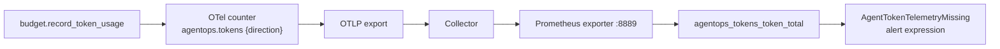

# 4.3. Metrics

## Why are ordinary software metrics insufficient?

Availability, latency, and error rate still matter, but they measure the wrong layer for an agent. A turn can return HTTP 200 in 800 ms while selecting the wrong tool, inventing an incident that does not exist, resolving the wrong service, leaking PII into the transcript, or taking a state-changing action nobody approved. None of those failures move a status code or a latency histogram. Agent failures are _semantic_, so agent metrics have to reach past the transport into behavior: which tools fired, in what order, whether the answer was grounded, whether a guardrail neutralized something, and how many tokens the session burned. Everything below exists because "200 OK, fast" says nothing about whether `restart_service` fired on the right service.

## What separates a gate from evidence?

This is the real subject of the page. A **gate** is a signal a machine evaluates deterministically, where a failure always means a defect a developer can reproduce and fix locally — so it can block a merge with no human in the loop. **Evidence** is a measurement (often model-backed, often a proxy) that informs a person but does not, on its own, prove a defect — a shift can be a legitimate change, not a bug — so it gets a named owner who inspects it instead of an automatic block. The repository draws that line in three concrete places:

1. `tool_trajectory_avg_score` must equal `1.0` with `match_type: IN_ORDER` in [`evals/test_config.json`](https://github.com/MLOps-Courses/agentops-open-course/blob/main/agents/python/evals/test_config.json) — a hard threshold. The optional gateway judge in [`mlflow_eval.py`](https://github.com/MLOps-Courses/agentops-open-course/blob/main/agents/python/evals/mlflow_eval.py) instead returns a `Feedback` value that is evidence only: it is deliberately absent from `_REQUIRED_METRIC_THRESHOLDS`, so it never fails the run unless a release policy you add defines a threshold.
1. `mise run redteam` and `mise run eval:validate` block a merge in [`ci.yml`](https://github.com/MLOps-Courses/agentops-open-course/blob/main/.github/workflows/ci.yml); the model-backed `eval.yml` runs weekly and its own comment says a trajectory miss "is a signal to inspect the uploaded results, not a merge blocker."
1. `agentops.cost.session.estimate` is an _estimate_ from configurable per-1k prices that default to `0` on the local Ollama path — a number to watch on a dashboard, never a gate.

The split has a hard operational reason: gates must stay fast, deterministic, and secret-free so every fork and pull request can run them without credentials, while evidence is allowed to be slow, model-dependent, and scheduled.

```mermaid
flowchart LR
    subgraph gates["Blocking gates - offline, no model, no key"]
        direction TB
        A["pre-push: mise run test<br/>branch coverage >= 95%"]
        B["CI: mise run check<br/>format / lint / types / vuln"]
        C["CI: mise run redteam<br/>tests/test_security.py"]
        D["CI: mise run eval:validate<br/>evalset vs seed data"]
    end
    subgraph evidence["Evidence - model-backed, weekly, no secret"]
        direction TB
        E["eval.yml: mise run eval<br/>tool trajectory 1.0"]
        F["eval.yml: mise run eval:mlflow<br/>4 scorer means = 1.0"]
        G["eval.yml: mise run eval:report<br/>schema fallback"]
    end
    subgraph runtime["Runtime signals - Chapter 7"]
        direction TB
        H["Prometheus / Alertmanager<br/>page vs ticket"]
    end
    gates -->|merge allowed| evidence
    evidence -->|inspect results| runtime
```



## Which metrics are real release gates here?

These commands exit non-zero on failure, so each one is a merge-blocking gate wherever it runs:

| Signal                       | Command                  | Blocking threshold and source                                                                            |
| ---------------------------- | ------------------------ | -------------------------------------------------------------------------------------------------------- |
| Static checks                | `mise run check`         | Zero warnings across four parallel sub-tasks (`check:format`, `check:lint`, `check:types`, `check:vuln`) |
| Branch coverage              | `mise run test`          | `--cov-branch` with `--cov-fail-under=95` in `pyproject.toml`                                            |
| Tool trajectory              | `mise run eval`          | `tool_trajectory_avg_score` >= `1.0`, `match_type: IN_ORDER` (`evals/test_config.json`)                  |
| Adversarial regression       | `mise run redteam`       | Every deterministic case in `tests/test_security.py` passes                                              |
| Evalset structure            | `mise run eval:validate` | Every evalset reference resolves against the seed data, no model                                         |
| MLflow deterministic scorers | `mise run eval:mlflow`   | `tool_trajectory`, `complete_conversation`, `response_facts`, `tool_policy` means all `1.0`              |

The MLflow gate is enforced in code: `_required_metric_failures` compares each of the four means in `_REQUIRED_METRIC_THRESHOLDS` against `1.0`, and if any is missing, non-finite, or below threshold the script raises, finalizes the logged model as `FAILED`, and exits non-zero; only a clean run finalizes it `READY`. That is why each mean is a real gate and not a dashboard number.

The offline four — `check`, `test`, `redteam`, `eval:validate` — need no model and no key, so `ci.yml` runs them on every push and pull request. The two model-backed commands — `eval` and `eval:mlflow` — also exit non-zero on a regression, but producing the conversation they score requires a live agent and model, so they live in the weekly `eval.yml`, where the workflow treats a red result as evidence to inspect rather than a blocker. See [4.4. Evaluations](./4.4.%20Evaluations.md) for which evaluation runs where and why.

## Which metrics does the agent actually emit today?

Claim only what a collector query or scorer produces. The agent process defines exactly three custom OpenTelemetry instruments:

1. `agentops.tokens` — a counter, unit `token`, with attribute `direction=input|output`, in [`budget.py`](https://github.com/MLOps-Courses/agentops-open-course/blob/main/agents/python/src/agent/budget.py).
1. `agentops.guardrails.injections_neutralized` — a counter incremented when tool/retrieval output trips an injection marker, in [`guardrails.py`](https://github.com/MLOps-Courses/agentops-open-course/blob/main/agents/python/src/agent/guardrails.py).
1. `agentops.triage_report.schema_failures` — a counter incremented when a structured report fails validation after one retry, in [`report.py`](https://github.com/MLOps-Courses/agentops-open-course/blob/main/agents/python/src/agent/report.py).

On top of those, the collector's `span_metrics` connector derives `agentops_calls_total` and `agentops_duration_seconds_bucket` from spans, and agentgateway exposes its own `agentgateway_requests_total` family. That is the whole set. Per-tool error rates, retrieval no-match counts, and approval/denial tallies are _not_ emitted as metrics today — they live in traces and logs — so do not cite them as dashboard series.

Token accounting is also written onto the current span, not just the counter. `record_token_usage` accumulates the running totals into session-state keys `budget:input_tokens` and `budget:output_tokens` (persisted across turns because they carry no `temp:` prefix) and sets `agentops.tokens.session.{input,output,total}` plus `agentops.cost.session.estimate` as span attributes visible in MLflow traces. `enforce_token_budget` short-circuits the model call with `error_code="TOKEN_BUDGET_EXHAUSTED"` once `AGENT_MAX_TOKENS_PER_SESSION` is spent — disabled by default, because `max_tokens_per_session` defaults to `None`.

The counter's definition is the source of a pitfall that traps everyone:

```python
_TOKEN_COUNTER = metrics.get_meter("agentops.agent").create_counter(
    "agentops.tokens",
    unit="token",
    description="Model tokens consumed by the AgentOps Agent, by direction",
)
```

The collector's Prometheus exporter mangles that name: dots become underscores, the `token` unit is appended, and `_total` marks the counter, so PromQL sees `agentops_tokens_token_total`, not `agentops.tokens`. Paste the dotted name into a query and you get an empty result. The shipped `AgentTokenTelemetryMissing` alert (see [7.2. Monitoring](../7.%20Observability/7.2.%20Monitoring.md)) exists precisely because this pipeline can break silently while spans keep flowing.



## How should metrics be segmented?

Aggregate averages hide failures: a 2% error ratio can be one broken model route drowned in healthy traffic. Segment by dimensions that are bounded in cardinality, and keep the unbounded identifiers out of the metric store. The repository already encodes this rather than leaving it as advice. The `span_metrics` connector keeps exactly three dimensions — `gen_ai.operation.name`, `gen_ai.request.model`, and `error.type` — all drawn from small, known value sets. The high-cardinality identifiers live where cardinality is free: `trace_id` is stored by Loki as structured metadata on every log line, so the workflow is to spot a spike on a bounded metric dimension, then pivot to the exact traces and logs by id. Never use raw user text, session ids, or prompts as Prometheus labels; each distinct value is a new time series that inflates the store and can leak sensitive content. [7.2. Monitoring](../7.%20Observability/7.2.%20Monitoring.md) shows the full pipeline and the collector config behind these dimensions.

## How do you define a useful SLO?

Tie it to an observable outcome and derive an error budget from it, instead of a vibe like "the agent is helpful." The repository ships a real one: a **99% span-success SLO**. The 1% of spans allowed to fail is the error budget. Over a 30-day window, a sustained burn rate of 14.4x consumes the entire monthly budget in roughly two days (`30 / 14.4 ≈ 2.08`), which is why the shipped page-severity alert requires _both_ the fast and slow windows — `agentops:calls:error_ratio_rate5m` and `agentops:calls:error_ratio_rate1h` — to exceed `14.4 * 0.010` for `2m` before it fires. Two windows are deliberate: the slow window keeps a single flaky request from paging, while the fast window still catches a genuine outage within minutes.

Two lab caveats are written into the rules file's own comments and matter here. On sparse traffic a handful of consecutive failures crosses the threshold immediately — intended, so that stopping the local model provider pages you within minutes. And the recording rule computes a ratio, so `0/0` yields `NaN` on an idle lab and no alert fires without traffic, rather than a false 0% or 100%. The alert _response_ — how you diagnose and clear a burn — belongs to [7.2. Monitoring](../7.%20Observability/7.2.%20Monitoring.md), not here.

## How do you stop a metric from being gamed?

Goodhart's law: when a measure becomes a target, it stops being a good measure. Every gate on this page is trivially satisfiable if you optimize the number instead of the behavior, so each one is paired with an orthogonal check:

1. Branch coverage `>= 95%` is met by assertion-free tests that execute lines without checking outcomes. The suite defends against this with behavior tests — a transaction that must roll back, a failure path that must stay `down` (see [4.2. Testing](./4.2.%20Testing.md)) — so a green bar means asserted behavior, not just visited lines.
1. A `tool_trajectory` score of `1.0` proves the right tools fired in the right order and proves nothing about whether the final answer was correct. That is exactly why `complete_conversation`, `response_facts`, and the optional gateway judge run beside it.
1. `response_facts` checks that stable domain and policy terms are _present_ (polarity-aware, so a negated fact does not count), not that the answer is _true_. Presence is a proxy and therefore a floor, never a proof of grounding.
1. A thirteen-case eval set tuned against itself measures memorization, not generalization. Treat the set as a regression tripwire and follow the leakage discipline in [4.4. Evaluations](./4.4.%20Evaluations.md).

The design principle the chapter owns: never trust a single number as a target. Pair each proxy with an independent check, and keep a human in the loop for the judgment — is this answer actually right and safe? — that no deterministic scorer can encode.

## What is the metrics checkpoint?

Create a one-page scorecard for one change, and fill every cell from a command that actually prints it rather than from prose:

1. `mise run test` prints the branch-coverage total and fails under 95%.
1. `mise run eval` prints the per-case tool-trajectory scores against the fixed evalset.
1. `mise run eval:mlflow` prints the tracking URI and the four deterministic scorer means.
1. `mise run eval:retrieval` prints keyword vs semantic hit-rate@k (needs local Ollama embeddings).

Record the exact eval set, model, and prompt version alongside the numbers, plus the observed latency distribution and token/call count. If a cell has no data, mark it unknown rather than estimating it from prose — an invented number on a scorecard is worse than an honest gap.
