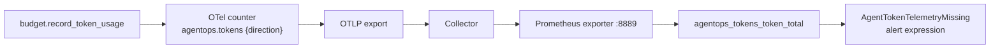

# 4.3. Metrics

!!! abstract "In one glance"

    - **You will:** Fill in a one-page scorecard where every number and threshold comes from a command you ran.
    - **You need:** [4.2. Testing](./4.2.%20Testing.md) finished and `mise run doctor:model` passing with the committed local defaults — no `.env` is required. The `eval:retrieval` step additionally needs `ollama pull nomic-embed-text`.
    - **Time:** about 35 minutes, reference.

## Why are ordinary software metrics insufficient?

Availability, latency, and error rate still matter, but they measure the wrong layer for an agent.

**Key term:** [burn rate](../0.%20Overview/0.7.%20Glossary.md#burn-rate) measures how quickly failures consume an SLO error budget.

A turn can return HTTP 200 in 800 ms while it:

- selects the wrong tool;
- invents an incident that does not exist;
- resolves the wrong service;
- leaks PII into the transcript;
- takes a state-changing action nobody approved.

None of those failures move a status code or a latency histogram. Agent failures are _semantic_, so agent metrics have to reach past the transport into behavior. They record which tools fired, in what order, whether the answer was grounded, whether a guardrail neutralized something, and how many tokens the session burned.

Everything below exists because "200 OK, fast" says nothing about whether `restart_service` fired on the right service.

<a id="what-separates-a-gate-from-evidence"></a>

## Where is gate versus evidence defined?

[4.4. Evaluations](./4.4.%20Evaluations.md#which-evaluation-task-should-you-run-and-when) owns that policy and maps local hooks, CI, and scheduled runs. Use its classification when filling the scorecard below; this page owns the measurements themselves.

<a id="which-metrics-are-real-release-gates-here"></a>

## Which thresholds belong in the scorecard?

Record each command's exact acceptance rule before interpreting the result:

Run the repository-wide `check` task from the repository root. Run `test`, `redteam`, and every `eval:*` task below from `agents/python`; the checkpoint changes into that directory before asking you to execute them.

| Signal                       | Command                  | Acceptance rule and source                                                                                                                                                                  |
| ---------------------------- | ------------------------ | ------------------------------------------------------------------------------------------------------------------------------------------------------------------------------------------- |
| Static checks                | `mise run check`         | Every core and infrastructure check finishes warning-free                                                                                                                                   |
| Branch coverage              | `mise run test`          | `--cov-branch` with `--cov-fail-under=95` in `agents/python/mise.toml`                                                                                                                      |
| Tool trajectory              | `mise run eval`          | Each ADK case requires `1.0` `IN_ORDER`; the wrapper requires at least `33%` overall plus individual memory-recall, skill-loading, restart-confirmation, and resolution-confirmation passes |
| Adversarial regression       | `mise run redteam`       | Every deterministic case in `tests/test_security.py` passes                                                                                                                                 |
| Evalset structure            | `mise run eval:validate` | Every evalset reference resolves against the seed data; no model                                                                                                                            |
| MLflow deterministic scorers | `mise run eval:mlflow`   | Provider / trajectory / completion / facts / policy means clear `1.0` / `0.25` / `1.0` / `0.15` / `0.60`; `AGENT_EVAL_MIN_SCORE` raises lower floors, never lowers one                      |

A **scorer** is a function that grades one recorded conversation. [4.4. Evaluations](./4.4.%20Evaluations.md#what-does-the-mlflow-evaluation-add) owns how the five scorer means are enforced and where that command runs.

## Which metrics does the agent actually emit today?

Claim only what a collector query or scorer produces. The agent process defines exactly three custom OpenTelemetry instruments:

1. `agentops.tokens` — a counter, unit `token`, with attribute `direction=input|output`, in [`budget.py`](https://github.com/MLOps-Courses/agentops-open-course/blob/main/agents/python/src/agent/budget.py).
1. `agentops.guardrails.injections_neutralized` — a counter incremented when tool/retrieval output trips an injection marker, in [`guardrails.py`](https://github.com/MLOps-Courses/agentops-open-course/blob/main/agents/python/src/agent/guardrails.py).
1. `agentops.triage_report.schema_failures` — a counter incremented when a structured report fails validation after one retry, in [`report.py`](https://github.com/MLOps-Courses/agentops-open-course/blob/main/agents/python/src/agent/report.py).

!!! warning "The name in the code is not the name you query"

    The collector's Prometheus exporter mangles the instrument name: dots become underscores, the `token` unit is appended, and `_total` marks the counter. The same token counter therefore has two names:

    - In the agent's Python code: `agentops.tokens`
    - In PromQL, Prometheus's query language: `agentops_tokens_token_total`

    Paste the dotted name into a query and you get an empty result.

On top of those, the collector's `span_metrics` connector (which turns spans into count and duration metrics) derives `agentops_calls_total` and `agentops_duration_seconds_bucket` from spans, and agentgateway exposes its own `agentgateway_requests_total` family. That is the whole set. Per-tool error rates, retrieval no-match counts, and approval/denial tallies are _not_ emitted as metrics today — they live in traces and logs — so do not cite them as dashboard series.

Token accounting is also written onto the current span, not just the counter. `record_token_usage` accumulates the running totals into session-state keys `budget:input_tokens` and `budget:output_tokens` (persisted across turns because they carry no `temp:` prefix). It also sets `agentops.tokens.session.{input,output,total}` plus `agentops.cost.session.estimate` as span attributes visible in MLflow traces.

That cost attribute is an estimate from configurable per-1k prices, not a provider bill or merge decision. Its configured prices default to `0` on the local Ollama path, so record it as unknown or zero-priced rather than inventing a currency cost.

`enforce_token_budget` short-circuits the model call with `error_code="TOKEN_BUDGET_EXHAUSTED"` once `AGENT_MAX_TOKENS_PER_SESSION` is spent — disabled by default, because `max_tokens_per_session` defaults to `None`. You trip it on purpose in [7.3. Costs](../7.%20Observability/7.3.%20Costs.md#how-do-you-verify-the-token-accounting-locally), by setting the budget to `1` and sending two turns in one session.

Here is the counter definition the exporter renames:

```python
_TOKEN_COUNTER = metrics.get_meter("agentops.agent").create_counter(
    "agentops.tokens",
    unit="token",
    description="Model tokens consumed by the AgentOps Agent, by direction",
)
```

The shipped `AgentTokenTelemetryMissing` alert (see [7.2. Monitoring](../7.%20Observability/7.2.%20Monitoring.md)) exists precisely because this pipeline can break silently while spans keep flowing.


```mermaid
flowchart LR
    A["budget.record_token_usage"] --> B["OTel counter<br/>agentops.tokens {direction}"]
    B --> C["OTLP export"] --> D["Collector"]
    D --> E["Prometheus exporter :8889"]
    E --> F["agentops_tokens_token_total"]
    F --> G["AgentTokenTelemetryMissing<br/>alert expression"]
```

## How should metrics be segmented?

Aggregate averages hide failures: a 2% error ratio can be one broken model route drowned in healthy traffic. Segment by dimensions that are bounded in **cardinality** — the number of distinct values a label can take — and keep the unbounded identifiers out of the metric store. The repository already encodes this rather than leaving it as advice.

- **What the connector segments by.** The `span_metrics` connector adds only three custom dimensions: `gen_ai.operation.name`, `gen_ai.request.model`, and `error.type`. All three are drawn from small, known value sets. They sit on top of the connector's own bounded default labels such as `status_code`, which the shipped SLO **recording rule** (a Prometheus query precomputed under a short name) filters on.
- **Where the high-cardinality ids live instead.** `trace_id` is stored by Loki as structured metadata on every log line, so the workflow is to spot a spike on a bounded metric dimension, then pivot to the exact traces and logs by id.
- **What never becomes a label.** Never use raw user text, session ids, or prompts as Prometheus labels; each distinct value is a new time series that inflates the store and can leak sensitive content.

[7.2. Monitoring](../7.%20Observability/7.2.%20Monitoring.md) shows the full pipeline and the collector config behind these dimensions.

## How do you define a useful SLO?

Tie it to an observable outcome and derive an error budget from it, instead of a vibe like "the agent is helpful." The repository ships a real one: a **99% span-success SLO**. The 1% of spans allowed to fail is the **error budget**: the failures you may spend before the objective is missed.

A **burn rate** is how many times faster than budgeted you are spending that allowance. At 14.4x, a 30-day budget is gone in about two days (`30 / 14.4 ≈ 2.08`).

That number is why the shipped page-severity alert requires _both_ the fast and slow windows — `agentops:calls:error_ratio_rate5m` and `agentops:calls:error_ratio_rate1h` — to exceed `14.4 * 0.010` for `2m` before it fires. Two windows are deliberate: the slow window keeps a single flaky request from paging, while the fast window still catches a genuine outage within minutes.

??? note "Deeper: two lab caveats about the shipped SLO rules"

    Two lab caveats are written into the rules file's own comments and matter here. On sparse traffic a handful of consecutive failures crosses the threshold immediately — intended, so that stopping the local model provider pages you within minutes. And the recording rule computes a ratio, so `0/0` yields `NaN` on an idle lab and no alert fires without traffic, rather than a false 0% or 100%.

The alert _response_ — how you diagnose and clear a burn — belongs to [7.2. Monitoring](../7.%20Observability/7.2.%20Monitoring.md), not here.

## How do you stop a metric from being gamed?

Goodhart's law: when a measure becomes a target, it stops being a good measure. Every threshold on this page is trivially satisfiable if you optimize the number instead of the behavior, so each one is paired with an orthogonal check:

1. Branch coverage `>= 95%` is met by assertion-free tests that execute lines without checking outcomes. The suite defends against this with behavior tests — a transaction that must roll back, a failure path that must stay `down` (see [4.2. Testing](./4.2.%20Testing.md)) — so a green bar means asserted behavior, not just visited lines.
1. A case-level `tool_trajectory` score of `1.0` proves the expected tools fired in the right order for that case. It proves nothing about whether the final answer was correct, or economical: a perfect trajectory can still burn far more tokens than needed. That is exactly why `complete_conversation`, `response_facts`, and the optional gateway judge run beside it, and why the token/model-call tripwire [`mise run eval:cost`](./4.4.%20Evaluations.md#how-do-you-catch-a-correct-but-expensive-regression) watches cost independently.
1. `response_facts` checks that stable domain and policy terms are _present_ (polarity-aware, so a negated fact does not count), not that the answer is _true_. Presence is a proxy and therefore a floor, never a proof of grounding.
1. A fifteen-case eval set tuned against itself measures memorization, not generalization. Treat the set as a regression tripwire and follow the leakage discipline in [4.4. Evaluations](./4.4.%20Evaluations.md).

The design principle the chapter owns: never trust a single number as a target. Pair each proxy with an independent check, and keep a human in the loop for the judgment — is this answer actually right and safe? — that no deterministic scorer can encode.

## What does a filled scorecard look like?

The checkpoint below asks for a one-page scorecard; this is the shape of a completed one. Every cell comes from a command that prints it, and one row is deliberately left `unknown` to model the rule "mark unknown rather than estimate":

| Signal           | Command                | Observed value                   | Gate or evidence  | Disposition               |
| ---------------- | ---------------------- | -------------------------------- | ----------------- | ------------------------- |
| Branch coverage  | `mise run test`        | 96%                              | gate (`>= 95%`)   | pass                      |
| Tool trajectory  | `mise run eval`        | 5/15 (33%); four critical passes | evidence + floors | pass                      |
| Scorer means     | `mise run eval:mlflow` | 1.00 / 0.27 / 1.00 / 0.20 / 0.80 | evidence + floors | pass                      |
| Cost per case    | `mise run eval:cost`   | within baseline tolerance        | evidence          | pass                      |
| Grounding        | `mise run eval:ground` | recognized claims grounded       | evidence          | pass                      |
| Live user rating | —                      | unknown                          | not implemented   | unknown — do not estimate |

Values are illustrative of the format, not a promised result — regenerate each from your own run. The point is that every non-`unknown` cell is traceable to one command, so another engineer can reproduce the row.

## What proves this page worked?

!!! info "Separate offline, chat-model, and embedding-model evidence"

    `mise run test` is offline. The trajectory, MLflow, cost, and grounding tasks need a configured chat model. In the scheduled workflow, cost and grounding reuse the exact transcript MLflow just captured instead of calling it again. `mise run eval:retrieval` instead needs the local Ollama embeddings endpoint and `ollama pull nomic-embed-text`. `doctor:model` checks only the chat model, so that pull is a separate prerequisite — without it the retrieval eval stops with `Embeddings unavailable at http://127.0.0.1:11434 with model 'nomic-embed-text'`, because it calls `semantic_search` directly and has no keyword fallback of its own ([3.4. Memory](../3.%20Capabilities/3.4.%20Memory.md#how-do-i-evaluate-retrieval-quality)). Confirm the default account-free chat path with `mise run doctor:model` first; no `.env` is required unless you override it.

Change into `agents/python`, then create a one-page scorecard for one change. Fill every cell from a command that actually prints it rather than from prose:

```bash
cd agents/python
```

1. `mise run test` prints the branch-coverage total and fails under 95%.
1. `mise run eval` prints the aggregate strict-case tally and named critical-case verdicts; its saved eval-history JSON contains the per-case results.
1. `mise run eval:mlflow` prints the tracking URI and the five deterministic scorer means.
1. `mise run eval:cost` prints each case's tokens/model calls and compares them with the reviewed baseline.
1. `mise run eval:ground` reports unsupported recognized claims and saves the questions, responses, and evidence.
1. `mise run eval:retrieval` prints keyword vs semantic hit-rate@k for the memory retriever — the fraction of incidents whose runbook appears in the retriever's top k results ([3.4. Memory](../3.%20Capabilities/3.4.%20Memory.md); needs local Ollama with `nomic-embed-text` pulled).

Record the exact eval set, model, and prompt version alongside the numbers, plus the observed latency distribution and token/call count. If a cell has no data, mark it unknown rather than estimating it from prose — an invented number on a scorecard is worse than an honest gap.

**You are done when:**

- Your scorecard has one row per signal, and every cell that is not `unknown` names the command that printed it.
- `mise run test` reports branch coverage at or above 95%.
- `mise run eval` clears the wrapper's `33%` aggregate floor and its individual memory-recall, skill-loading, restart-confirmation, and resolution-confirmation gates.
- `mise run eval:mlflow` reports the five deterministic scorer means and exits zero, so the logged model finalizes `READY`.
- For every row, you can say whether it blocks a merge or only informs a person.

Continue to [4.4. Evaluations](./4.4.%20Evaluations.md) when you can point at any number on your scorecard and say whether it is a gate or evidence.
