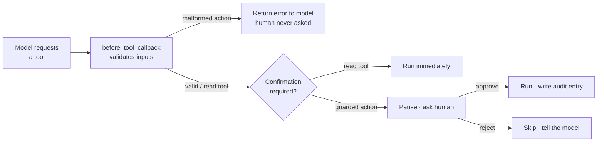

# 4.5. Guardrails

## What is a guardrail, and why does an agent need one?

A **guardrail** is a check that runs around a tool call to keep the agent safe — validating inputs before they run, screening outputs after, or pausing for a human on a risky action. An agent needs guardrails because the _model_ decides what to call and with what arguments, and the model is fallible: it can pass a malformed id, misread a request, or be steered by a prompt-injection payload ([4.6. Security](./4.6. Security.md)). Guardrails are the deterministic backstop between the model's intent and your state.

ADK exposes them as **callbacks** on the agent. The Ops Copilot uses three complementary layers:

- **Input validation** — a `before_tool_callback` that fails fast on bad arguments to the write actions.
- **PII redaction** — a `before_model_callback` that masks personal data before it reaches the model.
- **Human-in-the-loop (HITL)** — the write actions require explicit human approval before they run.

## How does the input-validation callback work?

A `before_tool_callback` runs **before** a tool executes. It can inspect the arguments and either short-circuit the call by returning a result (which the model sees instead of the tool running) or return "nothing" to let the call proceed. The Ops Copilot's guardrail rejects malformed inputs to the mutating actions — a boundary check kept separate from the actions' own business logic:

```python
# agents/python/src/agent/guardrails.py
_INCIDENT_ID = re.compile(r"^INC-\d+$")

# Tools that change state — the ones worth validating strictly before they run.
_ACTION_TOOLS = frozenset({"restart_service", "resolve_incident"})


def validate_actions(tool: BaseTool, args: dict[str, Any], tool_context: ToolContext) -> dict[str, Any] | None:
    """Reject malformed inputs to mutating actions before they touch state."""
    del tool_context  # part of the ADK callback signature; unused here
    if tool.name not in _ACTION_TOOLS:
        return None
    if tool.name == "resolve_incident":
        incident_id = str(args.get("incident_id", ""))
        if not _INCIDENT_ID.match(incident_id):
            return {"error": f"Refusing to resolve {incident_id!r}: expected an id like INC-002."}
    if tool.name == "restart_service" and not str(args.get("name", "")).strip():
        return {"error": "Refusing to restart: no service name was provided."}
    return None
```

Read-only tools are ignored (return `None`, so the call proceeds). For a write action, the argument is parsed to a `string` and checked: an incident id must match `^INC-\d+$`, a service name must be non-empty. A failed check returns an **error map** — the tool never runs, and the model receives the error and can correct itself. Because the callback only reads the tool name and args, it is trivially unit-testable ([4.2. Testing](./4.2. Testing.md)) with a cast-`None` context.

## How do you stop the agent leaking PII?

Incident notes, logs, and user messages can carry **personally identifiable information** — an email, a phone number, a customer IP. You do not want that reaching the model provider (or a trace, or a log line). The Ops Copilot masks it with **[Microsoft Presidio](https://microsoft.github.io/presidio/)** — a fully local, MIT-licensed PII engine, no account and no API — wired as a `before_model_callback` that runs on the request **before** it leaves the process:

```python
# agents/python/src/agent/pii.py
from functools import cache

from google.adk.agents.callback_context import CallbackContext
from google.adk.models.llm_request import LlmRequest
from presidio_analyzer import AnalyzerEngine
from presidio_analyzer.nlp_engine import NlpEngineProvider
from presidio_anonymizer import AnonymizerEngine

# Use the small spaCy model (pinned in pyproject) — the default engine would pull the 400 MB large one.
_NLP_CONFIG = {"nlp_engine_name": "spacy", "models": [{"lang_code": "en", "model_name": "en_core_web_sm"}]}


@cache
def _analyzer() -> AnalyzerEngine:  # built once, lazily — importing the agent stays fast
    nlp_engine = NlpEngineProvider(nlp_configuration=_NLP_CONFIG).create_engine()
    return AnalyzerEngine(nlp_engine=nlp_engine, supported_languages=["en"])


@cache
def _anonymizer() -> AnonymizerEngine:  # cached too, so redaction never rebuilds it
    return AnonymizerEngine()


def redact_pii(text: str) -> str:
    """Replace any detected PII with <ENTITY_TYPE> placeholders; PII-free text is returned unchanged."""
    if not text.strip():
        return text
    results = _analyzer().analyze(text=text, language="en")
    return _anonymizer().anonymize(text=text, analyzer_results=results).text if results else text


def redact_request_pii(callback_context: CallbackContext, llm_request: LlmRequest) -> None:
    """before_model_callback: mask PII in every text part before the request leaves the process."""
    del callback_context  # unused; part of the ADK callback signature
    for content in llm_request.contents:
        for part in content.parts or []:
            if part.text:
                part.text = redact_pii(part.text)
    # Returning None (implicitly) lets the now-redacted request proceed to the model.
```

The callback walks every text part of the outgoing request and rewrites it, so `jane.doe@acme.com` becomes `<EMAIL_ADDRESS>` before the model — or any OTLP trace of the call ([7.1. Tracing](../7. Observability/7.1. Tracing.md)) — ever sees it. Like the input-validation guardrail, `redact_pii` is a pure function, so it is unit-tested offline (no model, no key). Two deliberate choices keep it lightweight and local: the engine is built **lazily** and cached, and it is pinned to the **small** `en_core_web_sm` model so the analyzer runs offline without downloading the 400 MB large one.

!!! warning "Redaction trades recall for safety"

    PII detection is heuristic: Presidio can occasionally over-redact (mask a token that only *looks*
    like a name) or miss an unusual format. That is the right default for a guardrail — err toward masking —
    but it means redaction is a safety net, not a guarantee. Keep the model grounded and the actions gated
    regardless, and redact at the boundary rather than trusting any single layer.

## How do I register the guardrails on the agent?

You attach them when constructing the agent — one `before_model_callback` masks PII on every model call, one `before_tool_callback` validates every tool call:

```python
# agents/python/src/agent/agent.py
root_agent = Agent(
    model=settings.model,
    name="agentops_agent",
    instruction=INSTRUCTION,
    tools=[*ALL_TOOLS, *KNOWLEDGE_TOOLS, *ACTION_TOOLS],
    before_model_callback=redact_request_pii,  # mask PII before it reaches the model
    before_tool_callback=validate_actions,  # reject malformed write-action inputs
)
```

## What makes an action require human approval?

The write actions are built as **confirmation-gated tools**: ADK pauses and asks a human before the function runs. That flag is set where the tool is defined, alongside the mock logic:

```python
# agents/python/src/agent/actions.py
def restart_service(name: str) -> dict[str, Any]:
    """Restart a service (mock) — flips it back to operational and writes an audit entry."""
    if data.get_service(name) is None:
        return {"error": f"No service named {name!r}; nothing to restart."}
    data.set_service_status(name, "operational")
    entry = data.append_audit(_ACTOR, "restart_service", name, "service restarted (mock)")
    return {"result": f"Service {name!r} restarted and marked operational.", "audit": entry}


# Guarded actions: ADK requests human approval before the function runs (HITL).
ACTION_TOOLS = [
    FunctionTool(func=restart_service, require_confirmation=True),
    FunctionTool(func=resolve_incident, require_confirmation=True),
]
```

`require_confirmation=True` is the whole HITL switch. Every read tool runs freely; every state-changing action is gated. The unit test asserts this flag is on for both actions, so a refactor that drops an action is caught.

## How does the human-in-the-loop approval flow actually run?

Every tool call first passes the `before_tool_callback`. Only when a well-formed, confirmation-gated tool survives that check does ADK decline to run the function immediately — instead it emits a **confirmation request** and suspends the invocation, waiting for a decision:



- In the **`adk web`** developer UI (`mise run web`), the pending action surfaces as a confirmation prompt — an operator approves or rejects it in the browser before anything mutates.
- Programmatically, the confirmation is an event your host application answers — the seam that later becomes a real approval workflow in [7.6. Governance](../7. Observability/7.6. Governance.md).

Note the ordering in the diagram: **validation comes first**. ADK runs the `before_tool_callback` on every tool call _before_ it requests confirmation (verified in the flow runner), so a malformed action — say `resolve INC-oops` — is rejected outright and the human is never even asked to approve it. Only a well-formed guarded action reaches the confirmation step, where a person decides whether to proceed. The two guardrails compound rather than overlap: the deterministic input check gates whether a human is prompted at all. And because everything here is mock and local, "restart" only flips a database status and appends to the audit log — no real infrastructure is touched.

!!! warning "Never let the model self-approve"

    HITL only protects you if the human is a *real* second party. Don't wire the confirmation to
    auto-approve, and don't let the agent's own output stand in for the approval. The point of the
    gate is that a mutating action needs a decision made outside the model's control — that is
    exactly what stops a hijacked prompt from restarting services on its own.

The guardrails defend the agent's actions. [4.6. Security](./4.6. Security.md) widens the lens to secrets, prompt injection, and supply-chain scanning.
